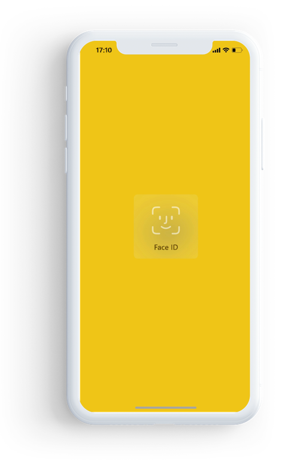

# Power BI -sovelluksen suojaaminen Face ID:n, Touch ID:n tai tunnuskoodin avulla 

Monissa tapauksissa Power BI:ssä hallitut tiedot ovat luottamuksellisia. Ne on suojattava ja niiden käyttö sallittava vain valtuutetuille käyttäjille. 

Power BI:n iOS-sovelluksen avulla voit suojata tiedot määrittämällä lisätunnistautumisen. Sinun on suoritettava Face ID-, Touch ID- tai pääsykooditunnistus aina käynnistäessäsi sovelluksen tai tuodessasi sovelluksen taustalta etualalle.

|  |  |
|:--- |:--- |
| iPhonet |iPadit |

## Face ID:n, Touch ID:n tai tunnuskoodin käyttöönotto sovelluksen asetuksista

Jotta voit käyttää lisätunnistautumista Power BI:ssä, siirry sovelluksen asetusten kohtaan **Yksityisyys ja tietosuoja**. Sen kautta voit ottaa käyttöön Face ID:n, Touch ID:n tai pääsykoodin laitteen ominaisuuksien mukaan.

Kun tämä asetus on käytössä, Power BI pyytää sinua tunnistautumaan kun käynnistät sovelluksen tai tuot sen taustalta etualalle. Tunnistautumista pyydetään aina ennen kuin voit käyttää sovellusta. 

iOS määrittää laitteen ominaisuuksien mukaan, pyydetäänkö Face ID:tä, Touch ID:tä tai tunnuskoodia. Jos laite tukee Face ID:tä, sinun on käytettävä sitä. Jos laite tukee Touch ID:tä, sinun on käytettävä sitä. Jos kumpaakaan ei tueta, sinun on annettava tunnuskoodi.

## MDM:n käyttö Face ID:n, Touch ID:n tai tunnuskoodin käytön pakottamiseksi

Joissain organisaatioissa käytetään suojauskäytäntöjä ja -vaatimuksia, jotka edellyttävät lisätunnistautumista, ennen kuin voit käyttää luottamuksellisia tietoja. 

Power BI:n iOS-mobiilisovellus sallii järjestelmänvalvojien hallita tätä asetusta lähettämällä sovelluksen määritykset Microsoft Intunen ja muiden mobiililaitteiden hallintaratkaisujen (MDM) kautta. Järjestelmänvalvojat voivat käyttää sovelluksen suojauskäytäntöä ottaakseen asetuksen käyttöön kaikille tai joillekin käyttäjille.

|Avain  |Tyyppi  |Kuvaus  |
|---------|---------|---------|
| com.microsoft.powerbi.mobile.ForceDeviceAuthentication | Totuusarvo | Oletusarvo on False.  Kun asetus on True, sovellus edellyttää käyttäjiltä tunnistautumista Face ID:n, Touch ID:n tai tunnuskoodin avulla, ennen kuin he voivat tarkastella Power BI -tietoja sovelluksessa. Käyttäjän, jonka laitteelle ei ole määritetty Face ID:tä, Touch ID:tä tai tunnuskoodia, on määritettävä jokin näitä ennen kuin hän voi käyttää Power BI:tä.  |

## Seuraavat vaiheet

[MDM:n käyttö Power BI:n iOS-sovelluksen etämäärittämiseen](mobile-app-configuration.md)
