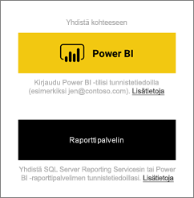
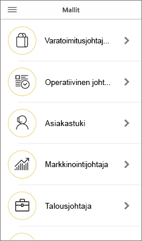

# iOS-laitteiden Power BI -mobiilisovelluksen käytön aloittaminen
Microsoft Power BI for iOS -sovellus iPhonessa tai iPadissa tarjoaa BI-mobiilikäyttökokemuksen Power BI:lle, Power BI -raporttipalvelimelle ja Reporting Services -palveluille. Voit tarkastella ja käsitellä yrityksen koontinäyttöjä paikallisesti ja pilvipalvelussa missä tahansa, live-tilassa kosketusnäytöllisessä mobiilikäytössä. Tarkastele tietoja koontinäytöissä ja jaa sähköpostitse tai tekstiviestillä työtovereiden kanssa. Pysy ajan tasalla kaikkein ajantasaisimmilla tiedoilla [Apple Watchin](mobile-apple-watch.md) avulla.  

Luo Power BI -raportteja Power BI Desktopissa ja julkaise ne:

* [Julkaise Power BI -palvelussa](../../fundamentals/service-get-started.md) ja luo koontinäyttöjä.
* [Julkaise paikallisesti Power BI -raporttipalvelimeen](../../report-server/quickstart-create-powerbi-report.md).

Voit iOS:n Power BI -mobiilisovelluksessa käsitellä koontinäyttöjä ja raportteja joko paikallisesti tai pilvipalvelussa.

Katso [Power BI -mobiilisovellusten uudet ominaisuudet](mobile-whats-new-in-the-mobile-apps.md).

## Lataa sovellus
[Lataa iOS-sovellus](https://go.microsoft.com/fwlink/?LinkId=522062 "Lataa iOS-sovellus") Apple App Storesta iPhoneen tai iPadiin.

Voit käyttää Power BI -mobiilisovellusta iOS 11:llä ja tätä uudemmilla käyttöjärjestelmillä. 

## Rekisteröidy Power BI -palveluun
Jos et ole jo rekisteröitynyt, siirry osoitteeseen [powerbi.com](https://powerbi.microsoft.com/get-started/) ja valitse kohdasta **Power BI - Pilviyhteistyö ja -jakaminen** **Kokeile ilmaiseksi**.

## Power BI -sovelluksen käytön aloittaminen
1. Avaa Power BI -sovellus iOS-laitteessasi.
2. Kirjaudu Power BI -sovellukseen napauttamalla **Power BI** -välilehteä ja täytä kirjautumistietosi.  
   Kirjaudu Reporting Services -mobiiliraportteihin ja -suorituskykyilmaisimiin napauttamalla **Raporttipalvelin**-välilehteä ja täytä kirjautumistietosi.
   
   
   
   Kun olet sovelluksessa, voit vaihtaa Power BI:n ja raporttipalvelimen välillä napauttamalla tilin profiilikuvaa näytön vasemmassa yläkulmassa. 

## Kokeile Power BI- ja Reporting Services -malleja
Voit tarkastella ja kokeilla Power BI- ja Reporting Services -malleja jopa ilman rekisteröitymistä.

Voit käyttää malleja valitsemalla siirtymispalkissa **Lisää asetuksia** (...) ja valitsemalla **Mallit**.

Power BI -mallien jälkeen tulee useita raporttipalvelimen malleja.

   
   
   > [!NOTE]
   > Kaikki ominaisuudet eivät ole käytettävissä malleissa. Et voi esimerkiksi tarkastella koontinäyttöjen taustalla olevia malliraportteja, et voi jakaa malleja muiden kanssa etkä voi tehdä niistä suosikkeja. 
   > 
   >

## Sisällön etsiminen Power BI -mobiilisovelluksissa

Napauta otsikon suurennuslasia ja aloita Power BI -sisällön hakeminen.

## Suosikkikoontinäyttöjen ja -raporttien tarkastelu
Tarkastele Suosikit-sivuasi valitsemalla siirtymispalkissa **Suosikit** (). 

Lue lisää [suosikeista Power BI -mobiilisovelluksissa](mobile-apps-favorites.md).

## Power BI -mobiilisovelluksien Enterprise-tuki
Microsoft Intunen avulla organisaatiot voivat hallita laitteita ja sovelluksia, kuten Power BI -mobiilisovellukset Androidille ja iOS:lle.

Microsoft Intunen avulla organisaatiot voivat ohjata tietoyksiköitä kuten pikakäytön kiinnittämisen edellyttämistä, sovelluksen tietojenkäytön valvontaa ja sovellustietojen salaamista myös silloin, kun sovellus ei ole käytössä.

> [!NOTE]
> Jos käytät Power BI -mobiilisovellusta iOS-laitteessasi ja organisaatiosi on määrittänyt Microsoft Intunen mobiilisovellusten hallinnan, tietojen päivittäminen taustalla on poistettu käytöstä. Kun avaat sovelluksen seuraavan kerran, Power BI päivittää tiedot verkossa olevasta Power BI -palvelusta.
> 

Lue lisää [Power BI -mobiilisovellusten päivittämisestä Microsoft Intunella](../../admin/service-admin-mobile-intune.md). 

## Seuraavat vaiheet

* [Mikä on Power BI?](../../fundamentals/power-bi-overview.md)
* Onko sinulla kysyttävää? [Voit esittää kysymyksiä Power BI -yhteisössä](https://community.powerbi.com/)
