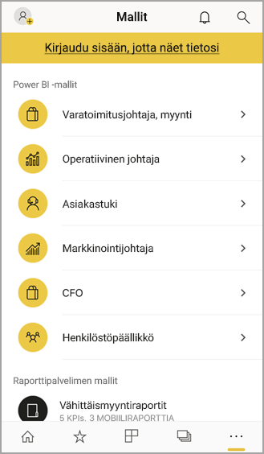
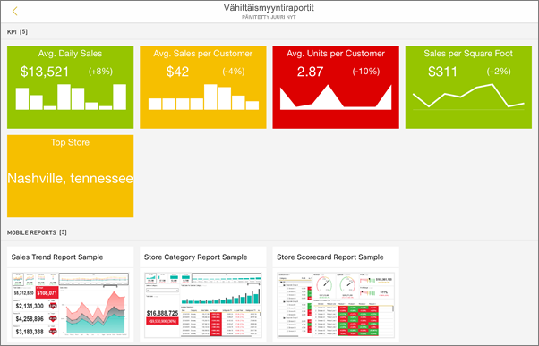
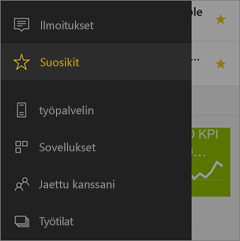
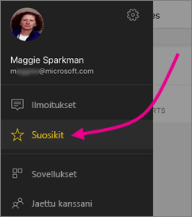
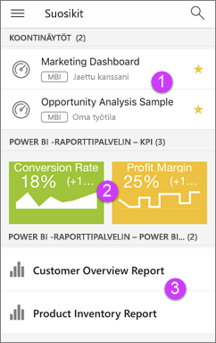

# iOS-laitteiden Power BI -mobiilisovelluksen käytön aloittaminen
Microsoft Power BI for iOS -sovellus iPhonella, iPadilla tai iPod Touchilla tarjoaa BI-mobiilikäyttökokemuksen Power BI:lle, Power BI -raporttipalvelimelle ja Reporting Services -palveluille. Voit tarkastella ja käsitellä yrityksen koontinäyttöjä paikallisesti ja pilvipalvelussa missä tahansa, live-tilassa kosketusnäytöllisessä mobiilikäytössä. Tarkastele tietoja koontinäytöissä ja jaa sähköpostitse tai tekstiviestillä työtovereiden kanssa. Pysy ajan tasalla kaikkein ajantasaisimmilla tiedoilla [Apple Watchin](mobile-apple-watch.md) avulla.  

Luo Power BI -raportteja Power BI Desktopissa ja julkaise ne:

* [Julkaise Power BI -palvelussa](../../service-get-started.md) ja luo koontinäyttöjä.
* [Julkaise paikallisesti Power BI -raporttipalvelimeen](../../report-server/quickstart-create-powerbi-report.md).

Voit iOS:n Power BI -mobiilisovelluksessa käsitellä koontinäyttöjä ja raportteja joko paikallisesti tai pilvipalvelussa.

Katso [Power BI -mobiilisovellusten uudet ominaisuudet](mobile-whats-new-in-the-mobile-apps.md).

## Lataa sovellus
[Lataa iOS-sovellus](https://go.microsoft.com/fwlink/?LinkId=522062 "Lataa iOS-sovellus") Apple-sovelluskaupasta iPhonelle, iPadille tai iPod Touchille.

Voit käyttää Power BI for iOS -sovellusta iOS 11:llä ja tätä uudemmilla käyttöjärjestelmillä. 

## Rekisteröidy Power BI -palveluun
Jos et ole jo rekisteröitynyt, siirry osoitteeseen [powerbi.com](https://powerbi.microsoft.com/get-started/) ja valitse kohdasta **Power BI - Pilviyhteistyö ja -jakaminen** **Kokeile ilmaiseksi**.

## Power BI -sovelluksen käytön aloittaminen
1. Avaa Power BI -sovellus iOS-laitteessasi.
2. Jos haluat tarkastella Power BI -koontinäyttöjä, napauta **Power BI**.  
   Voit tarkastella Reporting Services -mobiiliraportteja ja suorituskykyilmaisimia napauttamalla **SQL Server Reporting Services**.
   
   
   
   Kun olet sovelluksessa, napauta yleistä siirtymispainiketta  voit siirtyä näiden kahden välillä vasemmassa yläkulmassa. 

## Kokeile Power BI- ja Reporting Services -malleja
Voit kokeilla Power BI- ja Reporting Services -malleja jopa ilman rekisteröitymistä. Kun olet ladannut sovelluksen, voit tarkastella malleja tai aloittaa sovelluksen käytön. Voit siirtyä takaisin malleihin milloin tahansa yleiseltä siirtymissivulta.

### Power BI -mallit
Voit tarkastella ja käsitellä Power BI -koontinäytön malleja, mutta on muutamia asioita, joita et voi niille tehdä. Et voi avata koontinäyttöjen taustalla olevia raportteja, jakaa malleja muiden kanssa tai tehdä niistä suosikkejasi.

1. Napauta yleistä siirtymispainiketta  vasemmassa yläkulmassa.
2. Napauta oikeassa yläkulmassa näkyvää  ja napauta **Power BI -mallit**.
3. Valitse rooli ja tutustu tämän roolin mallikoontinäyttöön.  
   
   
   
   > [!NOTE]
   > Kaikki ominaisuudet eivät ole käytettävissä malleissa. Et esimerkiksi voi tarkastella malliraportteja koontinäytön taustalla. 
   > 
   > 

### Reporting Services -mobiiliraportin mallit
1. Napauta yleistä siirtymispainiketta  vasemmassa yläkulmassa.
2. Napauta oikeassa yläkulmassa näkyvää  ja napauta **Reporting Services -mallit**.
3. Avaa joko vähittäismyyntiraporttien tai myyntiraporttien kansio niiden suorituskykymittareiden ja mobiiliraporttien katselemiseksi.
   
   

## Sisällön etsiminen Power BI -mobiilisovelluksissa
Koontinäytöt ja raportit tallennetaan eri paikkoihin Power BI -mobiilisovelluksissa riippuen siitä, mistä ne ovat peräisin. Lue [sisällön etsimisestä mobiilisovelluksissa](mobile-apps-quickstart-view-dashboard-report.md). Lisäksi voit aina hakea kaikkea, mitä sinulla on Power BI -mobiilisovelluksissa. 

Lue lisää [sisällön etsimisestä mobiilisovelluksissa](mobile-apps-quickstart-view-dashboard-report.md).

## Suosikkikoontinäyttöjen, suorituskykyilmaisimien ja raporttien tarkastelu
Näet mobiilisovellusten Suosikit-sivulta kaikki Power BI -suosikkikoontinäyttösi yhdessä Power BI -raporttipalvelimen ja Reporting Services -suorituskykyilmaisinten ja raporttien kanssa. Kun teet koontinäytöstä *suosikin* Power BI -mobiilisovelluksessa, voit käyttää sitä kaikista laitteistasi käsin, kuten selaimesi Power BI -palvelusta. 

* Napauta **Suosikit**.
  
   
  
   Näet kaikki suosikkisi yhdessä tällä sivulla:
  
   
  
  1. Koontinäytöt Power BI -palvelussa
  2. Suorituskykyilmaisimet Power BI -raporttipalvelimella
  3. Power BI -raportit Power BI-raporttipalvelimella

Lue lisää [suosikeista Power BI -mobiilisovelluksissa](mobile-apps-favorites.md).

## Power BI -mobiilisovelluksien Enterprise-tuki
Microsoft Intunen avulla organisaatiot voivat hallita laitteita ja sovelluksia, kuten Power BI -mobiilisovellukset Androidille ja iOS:lle.

Microsoft Intunen avulla organisaatiot voivat ohjata tietoyksiköitä kuten pikakäytön kiinnittämisen edellyttämistä, sovelluksen tietojenkäytön valvontaa ja sovellustietojen salaamista myös silloin, kun sovellus ei ole käytössä.

> [!NOTE]
> Jos käytät Power BI -mobiilisovellusta iOS-laitteessasi ja organisaatiosi on määrittänyt Microsoft Intunen mobiilisovellusten hallinnan, tietojen päivittäminen taustalla on poistettu käytöstä. Kun avaat sovelluksen seuraavan kerran, Power BI päivittää tiedot verkossa olevasta Power BI -palvelusta.
> 

Lue lisää [Power BI -mobiilisovellusten päivittämisestä Microsoft Intunella](../../service-admin-mobile-intune.md). 

## Seuraavat vaiheet

* [Mikä on Power BI?](../../fundamentals/power-bi-overview.md)
* Onko sinulla kysyttävää? [Voit esittää kysymyksiä Power BI -yhteisössä](https://community.powerbi.com/)

