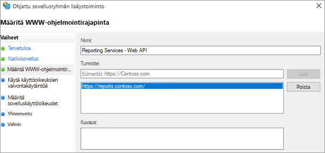

# <a name="using-oauth-to-connect-to-power-bi-report-server-and-ssrs"></a>Yhdistäminen Power BI -raporttipalvelimeen ja SSRS-palvelimeen OAuthia käyttämällä

Opi määrittämään ympäristö tukemaan OAuth-todennusta Power BI -mobiilisovelluksella ja muodostamaan yhteys Power BI -raporttipalvelimeen sekä SQL Server Reporting Services 2016:een tai uudempaan versioon.


Voit käyttää OAuthia muodostaessasi yhteyden Power BI-raporttipalvelimeen ja Reporting Servicesiin, tarkastellaksesi mobiiliraporttejasi tai suorituskykyilmaisimia. Windows Server 2016 sisältää joitain Web Application Proxy (WAP) -roolin parannuksia, jotka sallivat tällaisen todennuksen.

   > [!NOTE]
   > Power BI -raporttipalvelimella isännöityjen Power BI -raporttien tarkastelemista WAP-todentamisen kautta tuetaan nyt iOS- ja Android-sovelluksissa.

## <a name="requirements"></a>Vaatimukset

Web Application Proxy (WAP) -palvelimia ja Active Directory -liittoutumispalvelujen (ADFS) palvelimia varten vaaditaan Windows Server 2016. Windows 2016:n toiminnallisen tason toimialuetta ei tarvita.

## <a name="domain-name-services-dns-configuration"></a>Nimipalvelujärjestelmien (DNS) määritys

Sinun täytyy määrittää, mihin julkiseen URL-osoitteeseen Power BI -mobiilisovellus muodostaa yhteyden. Se saattaa näyttää esimerkiksi seuraavan kaltaiselta.

```https
https://reports.contoso.com
```

Sinun täytyy ohjata **raporttien** DNS-tietueesi Web Application Proxy (WAP) -palvelimen julkiseen IP-osoitteeseen. Sinun täytyy myös määrittää julkinen DNS-tietue ADFS-palvelimelle. Olet esimerkiksi ehkä määrittänyt ADFS-palvelimen käyttäen seuraavaa URL-osoitetta.

```https
https://fs.contoso.com
```

Sinun täytyy ohjata **fs**:n DNS-tietue Web Application Proxy (WAP) -palvelimen julkiseen IP-osoitteeseen, koska se julkaistaan osana WAP-sovellusta.

## <a name="certificates"></a>Varmenteet

Sinun on määritettävä varmenteet sekä WAP-sovellukselle että ADFS-palvelimelle. Molempien näiden varmenteiden on oltava peräisin hyväksytyltä varmenteiden myöntäjältä, jonka mobiililaitteesi tunnistavat.

## <a name="reporting-services-configuration"></a>Reporting Services -määritys

Reporting Servicesin puolella ei ole paljon määritettävää. On ainoastaan tarpeen varmistaa, että palvelun päänimi (SPN) kelpaa asianmukaisen Kerberos-todennuksen käyttöönottoon ja että todennuksen neuvottelu on otettu käyttöön Reporting Services -palvelimelle.

### <a name="service-principal-name-spn"></a>Palvelun päänimi (SPN)

SPN eli palvelun päänimi on Kerberos-todennusta käyttävän palvelun yksilöivä tunniste. Sinun täytyy varmistaa, että raporttipalvelimellasi on asianmukainen HTTP-palvelun SPN.

Lisätietoja asianmukaisen palvelun päänimen (SPN) määrittämisestä raporttipalvelimelle on ohjeaiheessa [Palvelun päänimen (SPN) rekisteröiminen raporttipalvelimelle](https://msdn.microsoft.com/library/cc281382.aspx).

### <a name="enabling-negotiate-authentication"></a>Todennuksen neuvottelun ottaminen käyttöön

Sinun on määritettävä raporttipalvelimen todennustyypiksi RSWindowsNegotiate, jos haluat määrittää raporttipalvelimen käyttämään Kerberos-todennusta. Teet tämän rsreportserver.config-tiedostossa.

```xml
<AuthenticationTypes>  
    <RSWindowsNegotiate />  
    <RSWindowsKerberos />  
    <RSWindowsNTLM />  
</AuthenticationTypes>
```

Lisätietoja on artikkeleissa [Reporting Services -määritystiedoston muokkaaminen](https://msdn.microsoft.com/library/bb630448.aspx) ja [Windows-todennuksen määrittäminen raporttipalvelimessa](https://msdn.microsoft.com/library/cc281253.aspx).

## <a name="active-directory-federation-services-adfs-configuration"></a>Active Directory -liittoutumispalvelujen (ADFS) määritys

Sinun on määritettävä ADFS-palvelut Windows 2016 -palvelimeen käyttöympäristössäsi. Voit tehdä sen Palvelinten hallinnassa valitsemalla Hallinta-kohdassa Lisää rooleja ja ominaisuuksia -vaihtoehdon. Lisätietoja on artikkelissa [Active Directory -liittoutumispalvelut](https://technet.microsoft.com/windows-server-docs/identity/active-directory-federation-services).

### <a name="create-an-application-group"></a>Sovellusryhmän luominen

Sinun kannattaa luoda AD FS -hallintanäytössä Reporting Servicesille sovellusryhmä, joka sisältää tietoja Power BI -mobiilisovelluksille.

Voit luoda sovellusryhmän noudattamalla seuraavia ohjeita.

1. Napsauta AD FS -hallintasovelluksessa hiiren kakkospainikkeella **Sovellusryhmät**-kohtaa ja valitse **Lisää sovellusryhmä...**

   

2. Anna sovellusryhmälle **nimi** sovellusryhmän lisäämisen ohjatussa toiminnossa ja valitse **Native application accessing a web API** (Verkon ohjelmointirajapintaa käyttävä natiivisovellus).

   

3. Valitse **Seuraava**.

4. Anna lisättävälle sovellukselle **nimi**. 

5. Sinulle luodaan **Asiakastunnus** automaattisesti. Lisää *484d54fc-b481-4eee-9505-0258a1913020* sekä iOS:lle että Androidille.

6. Sinun kannattaa lisätä seuraavat **uudelleenohjauksen URL-osoitteet**:

   **Power BI Mobile -syötteet – iOS:**  
   msauth://code/mspbi-adal://com.microsoft.powerbimobile  
   msauth://code/mspbi-adalms://com.microsoft.powerbimobilems  
   mspbi-adal://com.microsoft.powerbimobile  
   mspbi-adalms://com.microsoft.powerbimobilems

   **Android-sovelluksille on tarpeen lisätä vain seuraava:**  
   urn:ietf:wg:oauth:2.0:oob

   
7. Valitse **Seuraava**.

8. Anna raporttipalvelimen URL-osoite. Osoite on ulkoinen URL-osoite, joka ohjaa Web Application Proxy -palvelimeesi. Sen pitäisi olla seuraavassa muodossa.

   > [!NOTE]
   > Huomaa, että tämän URL-osoitteen kirjainkoko on merkitsevä.

   *https://< report server url >/*

   
9. Valitse **Seuraava**.

10. Valitse **käyttöoikeuskäytäntö**, joka soveltuu organisaatiosi tarpeisiin.

    

11. Valitse **Seuraava**.

12. Valitse **Seuraava**.

13. Valitse **Seuraava**.

14. Valitse **Sulje**.

Kun olet valmis, sinun pitäisi nähdä sovellusryhmäsi ominaisuudet seuraavan kaltaisina.


## <a name="web-application-proxy-wap-configuration"></a>Web Application Proxy (WAP) -määritys

Sinun kannattaa ottaa Web Application Proxy -Windows-rooli käyttöön ympäristösi palvelimessa. Tämä täytyy tehdä Windows 2016 -palvelimessa. Lisätietoja on artikkeleissa [Web Application Proxy Windows Server 2016:ssa](https://technet.microsoft.com/windows-server-docs/identity/web-application-proxy/web-application-proxy-windows-server) ja [Sovellusten julkaiseminen käyttäen AD FS -esitodennusta](https://technet.microsoft.com/windows-server-docs/identity/web-application-proxy/publishing-applications-using-ad-fs-preauthentication#a-namebkmk14apublish-an-application-that-uses-oauth2-such-as-a-windows-store-app).

### <a name="constrained-delegation-configuration"></a>Rajoitetun delegoinnin määritys

OAuth-todennuksesta Windows-todennukseen siirtyminen edellyttää rajoitetun delegoinnin ja protokollan siirron käyttämistä. Tämä on osa Kerberos-määritystä. Reporting Servicesin SPN määritettiin jo Reporting Services -määrityksen yhteydessä.

Tässä vaiheessa on määritettävä rajoitettu delegointi WAP-palvelimen konetilillä Active Directoryssa. Sinun on ehkä pyydettävä apua toimialueen järjestelmänvalvojalta, jos sinulla ei ole Active Directoryn käyttöoikeuksia.

Rajoitettu delegointi kannattaa määrittää seuraavasti.

1. Käynnistä **Active Directory Users and Computers** (Active Directory -käyttäjät ja -tietokoneet) -työkalu tietokoneessa, johon on asennettu Active Directory -työkalut.

2. Etsi WAP-palvelimesi konetili. Tili sijaitsee oletuksena tietokoneiden säilössä.

3. Napsauta WAP-palvelinta hiiren kakkospainikkeella ja valitse **Ominaisuudet**.

4. Valitse **Delegointi**-välilehti.

5. Valitse **Trust this computer for delegation to specified services only** (Luota tähän tietokoneeseen vain määritettyihin palveluihin delegointia varten) ja valitse sitten **Use any authentication protocol** (Käytä mitä tahansa todennusprotokollaa).

   

   Tämä määrittää rajoitetun delegoinnin tälle WAP-palvelinkoneen tilille. Tämän jälkeen täytyy määrittää palvelut, joihin tämän koneen sallitaan delegoida.

6. Valitse **Lisää...** palveluruudun alapuolella.

   

7. Valitse **Käyttäjät tai tietokoneet...**

8. Anna palvelutili, jota käytät Reporting Servicesin kanssa. Kyseessä on se tili, johon lisäsit SPN:n Reporting Services -määrityksen aikana.

9. Valitse SPN-nimi Reporting Servicesille ja valitse sitten **OK**.

   > [!NOTE]
   > Saatat nähdä vain NetBIOSin SPN:n. Todellisuudessa sekä NetBIOSin SPN että täydellisen toimialuenimen SPN valitaan.

   

10. Tuloksen pitäisi näyttää seuraavan kaltaiselta, kun **Laajennettu**-valintaruutu on valittuna.

    

11. Valitse **OK**.

### <a name="add-wap-application"></a>WAP-sovelluksen lisääminen

Voit julkaista sovelluksia myös raporttien käytön hallintakonsolin kautta, mutta tässä esimerkissä sovellus luodaan PowerShellin kautta. Tällä komennolla voit lisätä sovelluksen.

```powershell
Add-WebApplicationProxyApplication -Name "Contoso Reports" -ExternalPreauthentication ADFS -ExternalUrl https://reports.contoso.com/ -ExternalCertificateThumbprint "0ff79c75a725e6f67e3e2db55bdb103efc9acb12" -BackendServerUrl http://ContosoSSRS/ -ADFSRelyingPartyName "Reporting Services - Web API" -BackendServerAuthenticationSPN "http/ContosoSSRS.contoso.com" -UseOAuthAuthentication
```

| Parametri | Kommentit |
| --- | --- |
| **ADFSRelyingPartyName** |Tämä on sen verkon ohjelmointirajapinnan nimi, jonka loit sovellusryhmän osana ADFS-määrityksissä. |
| **ExternalCertificateThumbprint** |Tämä on varmenne ulkoisia käyttäjiä varten. On tärkeää, että tämä varmenne on voimassa mobiililaitteissa ja on peräisin luotetulta varmenteiden myöntäjältä. |
| **BackendServerUrl** |Tämä on raporttipalvelimen URL-osoite WAP-palvelimesta. Jos WAP-palvelin on DMZ-alueella, sinun on ehkä käytettävä täydellistä toimialuenimeä. Varmista, että pääset tähän URL-osoitteeseen verkkoselaimesta WAP-palvelimessa. |
| **BackendServerAuthenticationSPN** |Tämä on SPN, jonka loit osana Reporting Services -määritystä. |

### <a name="setting-integrated-authentication-for-the-wap-application"></a>Integroidun todennuksen asettaminen WAP-sovellukselle

Kun olet lisännyt WAP-sovelluksen, sinun on määritettävä BackendServerAuthenticationMode käyttämään IntegratedWindowsAuthentication -todennusta. Tämän määrittämistä varten tarvitset tunnuksen WAP-sovelluksesta.

```powershell
Get-WebApplicationProxyApplication “Contoso Reports” | fl
```


Määritä BackendServerAuthenticationMode WAP-sovelluksen tunnuksen avulla suorittamalla seuraava komento.

```powershell
Set-WebApplicationProxyApplication -id 30198C7F-DDE4-0D82-E654-D369A47B1EE5 -BackendServerAuthenticationMode IntegratedWindowsAuthentication
```


## <a name="connecting-with-the-power-bi-mobile-app"></a>Yhteyden muodostaminen Power BI -mobiilisovelluksen avulla

Power BI -mobiilisovelluksen sisältä kannattaa muodostaa yhteys Reporting Services -esiintymään. Tätä varten sinun on annettava **ulkoisen URL-osoite** WAP-sovellustasi varten.


Kun valitset **Yhdistä**, sinut ohjataan ADFS-kirjautumissivulle. Anna toimialueesi kirjautumistiedot.


Kun olet valinnut **Kirjaudu sisään**, näkyviin tulee elementtejä Reporting Services -palvelimestasi.

## <a name="multi-factor-authentication"></a>Monimenetelmäisen todentaminen

Voit ottaa käyttöön monimenetelmäisen todentamisen lisäsuojauksen ottamiseksi käyttöön ympäristössäsi. Lisätietoja on artikkelissa [AD FS 2016:n ja Azure MFA:n määrittäminen](https://technet.microsoft.com/windows-server-docs/identity/ad-fs/operations/configure-ad-fs-2016-and-azure-mfa).

## <a name="troubleshooting"></a>Vianmääritys

### <a name="you-receive-the-error-failed-to-login-to-ssrs-server"></a>Näyttöön tulee seuraava virheviesti: ”Kirjautuminen SSRS-palvelimeen epäonnistui”


Voit määrittää [Fiddlerin](http://www.telerik.com/fiddler) toimimaan mobiililaitteiden välityspalvelimena nähdäksesi, kuinka pitkälle pyyntö etenee. Jotta voisit ottaa käyttöön Fiddler-välityspalvelimen puhelimelle, sinun on otettava käyttöön [CertMaker for iOS and Android](http://www.telerik.com/fiddler/add-ons) -lisäosa tietokoneessa, jossa Fiddler toimii. Tämä on Fiddler-lisäosa Telerikiltä.

Jos sisäänkirjautuminen toimii Fiddleria käytettäessä, kyseessä voi olla WAP-sovellukseen tai ADFS-palvelimeen liittyvä varmenneongelma. Voit käyttää [Microsoft Message Analyzer](https://www.microsoft.com/download/details.aspx?id=44226) -työkalua tai vastaavaa työkalua sen varmistamiseen, että varmenteet ovat kelvollisia.

## <a name="next-steps"></a>Seuraavat vaiheet

[Palvelun päänimen (SPN) rekisteröiminen raporttipalvelimelle](https://msdn.microsoft.com/library/cc281382.aspx)  
[Reporting Services -määritystiedoston muokkaaminen](https://msdn.microsoft.com/library/bb630448.aspx)  
[Windows-todennuksen määrittäminen raporttipalvelimessa](https://msdn.microsoft.com/library/cc281253.aspx)  
[Active Directory -liittoutumispalvelut](https://technet.microsoft.com/windows-server-docs/identity/active-directory-federation-services)  
[Web Application Proxy Windows Server 2016:ssa](https://technet.microsoft.com/windows-server-docs/identity/web-application-proxy/web-application-proxy-windows-server)  
[Sovellusten julkaiseminen käyttäen AD FS -esitodennusta](https://technet.microsoft.com/windows-server-docs/identity/web-application-proxy/publishing-applications-using-ad-fs-preauthentication#a-namebkmk14apublish-an-application-that-uses-oauth2-such-as-a-windows-store-app)  
[AD FS 2016:n ja Azure MFA:n määrittäminen](https://technet.microsoft.com/windows-server-docs/identity/ad-fs/operations/configure-ad-fs-2016-and-azure-mfa)  
Onko sinulla muuta kysyttävää? [Kokeile Power BI -yhteisöä](http://community.powerbi.com/)
