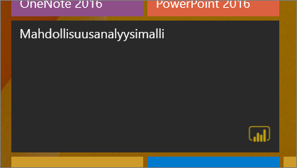
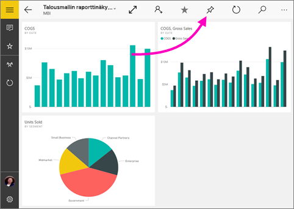
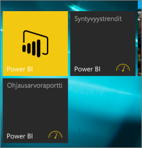

# Koontinäytön kiinnittäminen Windows 10 -aloitusnäyttöön Power BI -mobiilisovelluksesta
Voit kiinnittää Power BI -koontinäyttöjä Windowsin aloitusnäyttöön Power BI -mobiilisovelluksesta Windows 10:lle. Niistä tulee *tapahtumaruutuja*. Kun napautat ruutua aloitusnäytössä, koontinäyttö avautuu Power BI -mobiilisovelluksessa Windows 10:lle.

## Koontinäytön kiinnittäminen aloitusnäyttöön tapahtumaruutuna
1. Avaa koontinäyttö.
2. Napauta **Kiinnitä aloitusnäyttöön** .
   
   
   
   Siirry laitteesi aloitusnäyttöön, niin näet tapahtumaruudun.
   
   

## Seuraavat vaiheet
* [Lataa Power BI -mobiilisovellus Windows 10:lle](http://go.microsoft.com/fwlink/?LinkID=526478) Windows-kaupasta  
* [Windows 10:n Power BI -mobiilisovelluksen käytön aloittaminen](mobile-windows-10-phone-app-get-started.md)  
* [Mikä on Power BI?](../../power-bi-overview.md)
* Onko sinulla kysyttävää? [Voit esittää kysymyksiä Power BI -yhteisössä](http://community.powerbi.com/)

