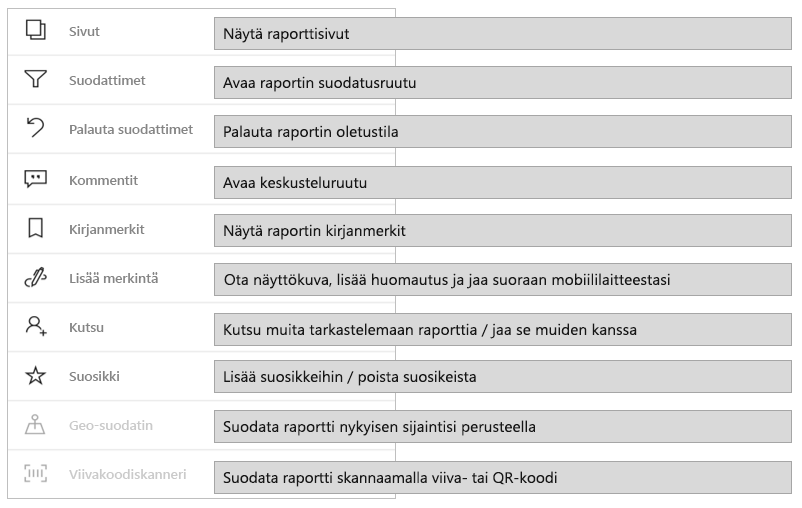
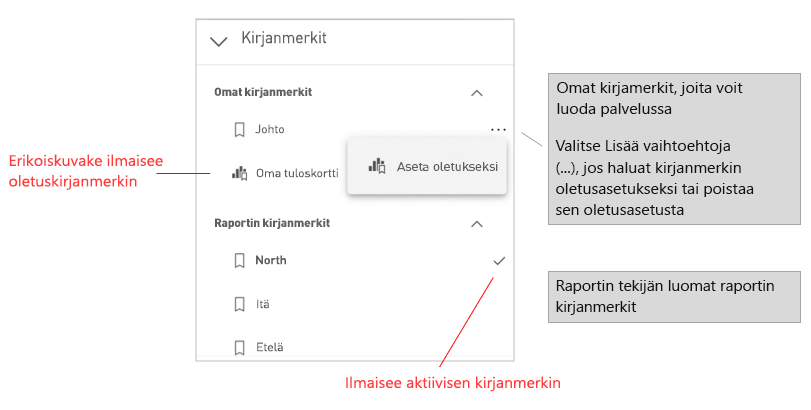
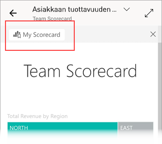

# Raporttien tutkiminen Power BI -mobiilisovelluksissa
Koskee seuraavia:

|  |  |  |  |  |
|:---: |:---: |:---: |:---: |:---: |
| iPhonet |iPadit |Android-puhelimet |Android-tabletit |Windows 10 -laitteet |

>[!NOTE]
>Power BI -mobiilisovellustuki **Windows 10 Mobilea käyttäville puhelimille** päättyy 16. maaliskuuta 2021. [Lisätietoja](https://go.microsoft.com/fwlink/?linkid=2121400)

Power BI -raportti on vuorovaikutteinen näkymä tiedoistasi, joka sisältää eri havaintoja ja merkityksellisiä tietoja esittäviä visualisointeja. Raporttien tarkasteleminen Power BI -mobiilisovelluksissa on kolmivaiheisen prosessin kolmas vaihe:

1. [Luo raportteja Power BI Desktopissa](../../desktop-report-view.md). Voit jopa [optimoida raportin puhelimille](mobile-apps-view-phone-report.md) Power BI Desktopissa.
2. Julkaise raportit Power BI -palvelussa [(https://powerbi.com)](https://powerbi.com) tai [Power BI -raporttipalvelimessa](../../report-server/get-started.md).  
3. Käsittele raportteja Power BI -mobiilisovelluksissa.

## Power BI -raportin avaaminen mobiilisovelluksessa
Power BI -raportit tallennetaan eri paikkoihin mobiilisovelluksessa sen mukaan, mistä ne ovat peräisin. Sijaintipaikka voi olla Sovellukset, Jaettu kanssani, Työtilat (myös Oma työtila) tai raporttipalvelin. Joskus sinun on käytävä läpi aiheeseen liittyvä raporttinäkymä, jotta saat raportin, ja joskus raportit on luetteloitu.

Luetteloissa ja valikoissa on raportin nimen vieressä kuvake, joka auttaa ymmärtämään, että kohde on raportti:

Power BI -mobiilisovelluksissa on kaksi kuvaketta raportteja varten:

*  ilmaisee raportin, joka näkyy vaakasuunnassa sovelluksessa. Raportti näyttää samalta kuin selaimessa.

*  tarkoittaa raporttia, jossa on vähintään yksi puhelimelle optimoitu sivu, joka näkyy pystysuunnassa.

> [!NOTE]
> Kun pidät puhelinta vaaka-asennossa, saat aina vaakasuuntaisen asettelun, vaikka raporttisivulla olisi mobiiliasettelu.

Jos haluat päästä raporttiin raporttinäkymästä, napauta **Enemmän vaihtoehtoja** (...) raporttinäkymän ruudun oikeassa yläkulmassa ja valitse **Avaa raportti**:
  
  
  
  Kaikkia ruutuja ei voi avata raportteina. Esimerkiksi Q&A-ruudussa kysymyksiä esittämällä luodut ruudut eivät avaa raportteja, kun niitä napautetaan.
  
## Raporttien käsitteleminen
Kun raportti on avattuna sovelluksessa, voit aloittaa sen käsittelemisen. Raportilla ja sen tiedoilla voi tehdä monia asioita. Raportin alatunnisteessa on toimintoja, joita voit suorittaa raportissa. Napauttamalla ja napauttamalla pitkään raportissa näkyviä tietoja voit myös osittaa ja käsitellä tietoja.

### Käsittely yhdellä napsautuksella tai kaksoisnapsautuksella
Kun lataat Power BI -mobiilisovelluksen, se on määritetty käsittelyyn yhdellä napsautuksella. Tämä tarkoittaa sitä, että kun napautat visualisointia osittajatoiminnon, ristiinkorostamisen, linkin tai painikkeen napsauttamisen tai muun toiminnon suorittamista varten, napautus sekä valitsee visualisoinnin että suorittaa haluamasi toiminnon.

Halutessasi voit vaihtaa käsittelyyn kaksoisnapautuksella. Kun käsittely kaksoisnapsautuksella on käytössä, valitset visualisoinnin ensin napauttamalla sitä ja suoritat sitten haluamasi toiminnon napauttamalla visualisointia uudelleen.

Jos haluat vaihtaa käsittelyyn kaksoisnapsautuksella tai vaihtaa takaisin käsittelyyn yhdellä napsautuksella, siirry [sovelluksen vuorovaikutusasetuksiin](./mobile-app-interaction-settings.md).

### Yksittäisvalintatila monivalintatilaan verrattuna arvopisteen valinnassa

Valitset arvopisteen raportissa napauttamalla sitä. Voit valita, käytätkö yksittäisvalintatilaa vai monivalintatilaa. Kun valitset arvopisteen napauttamalla sitä yksittäisvalintatilassa, kyseinen valinta korvaa tekemäsi aiemmat valinnat. Kun valitset arvopisteen napauttamalla sitä monivalintatilassa, valintasi *lisätään* kaikkiin tekemiisi valintoihin, ja kaikkien valintojesi yhteenlaskettu tulos on korostettu kaikissa raportin visualisoinneissa.

Jos haluat poistaa valitun arvopisteen valinnan, napauta sitä uudelleen.

Jos haluat vaihtaa yksittäisvalinta- ja monivalintatilan välillä, siirry [sovelluksen vuorovaikutusasetuksiin](./mobile-app-interaction-settings.md).

### Napauttamisen ja pitkän napauttamisen käyttäminen
Napautus on sama kuin napsautus hiirellä. Jos siis haluat ristiinkorostaa raportin arvopisteen perusteella, napauta kyseistä arvopistettä.
Kun napautat osittajan arvoa, arvo valitaan ja raportin muut osat ositetaan kyseisen arvon mukaan.
Kun napautat linkkiä, painiketta tai kirjanmerkkiä, raportin tekijän määrittämä toiminto suoritetaan.

Olet luultavasti huomannut, että kun napautat visualisointia, näkyviin tulee reuna. Reunan oikeassa yläkulmassa on **Enemmän vaihtoehtoja** (...). Jos napautat kolmea pistettä, näkyviin tulee valikko täynnä toimintoja, joita voit käyttää visualisoinnissa:

### Työkaluvihje ja porautumistoiminnot
Kun napautat pitkään arvopistettä, näkyviin tulevassa työkaluvihjeessä näkyvät kyseisen arvopisteen edustamat arvot:

Jos raportin tekijä on määrittänyt raporttisivun työkaluvihjeen, se korvaa raporttisivun oletustyökaluvihjeen:

> [!NOTE]
> Raportin työkaluvihjeitä tuetaan laitteissa, joiden näyttökoko on vähintään 640 kuvapistettä kertaa 320 kuvapistettä. Jos laite on tätä pienempi, sovellus näyttää oletustyökaluvihjeet.

Raportin tekijät voivat määrittää hierarkioita raporttisivujen välisissä tiedoissa ja yhteyksissä. Hierarkiat sallivat porautumisen alaspäin, porautumisen ylöspäin ja porautumisen toisen raporttisivun läpi visualisoinnista ja arvosta. Kun napautat arvoa pitkään, työkaluvihjeen lisäksi alatunnisteessa näkyvät tarvittavat porautumisvaihtoehdot:

Kun napautat tiettyä kohtaa visualisoinnissa ja sitten *porautumisvaihtoehtoa*, voit siirtyä Power BI:ssä raportin eri sivulle, joka suodatetaan napauttamasi arvon mukaisesti. Raportin tekijä voi määrittää yhden tai useampia porautumisvaihtoehtoja, joista jokainen siirtää sinut eri sivulle. Voit siinä tapauksessa valita, mihin vaihtoehtoon haluat porautua. Takaisin-painike vie sinut takaisin edelliselle sivulle.

Lue lisätietoja [porautumisen lisäämisestä Power BI Desktopiin](../../desktop-drillthrough.md).
   
   > [!IMPORTANT]
   > Power BI -mobiilisovelluksissa porautumistoiminnot ovat käytössä matriisi- ja taulukkovisualisoinneissa vain solujen arvojen kautta. Ne eivät ole käytössä sarake- tai riviotsikoiden kautta.
   
   
   
### Raportin alatunnisteessa olevien toimintojen käyttäminen
Raportin alatunnisteessa on toimintoja, joita voi käyttää nykyisellä raporttisivulla tai koko raportissa. Alatunnisteen kautta pääsee nopeasti yleisimmin käytettyihin toimintoihin. Voit käyttää muita toimintoja napauttamalla **Enemmän vaihtoehtoja** (...):

Seuraavia toimintoja voi suorittaa alatunnisteen kautta:
* Palauta raporttisuodatin ja ristiinkorostusvalinnat takaisin alkuperäiseen tilaan.
* Avaa keskusteluruutu, jos haluat tarkastella kommentteja tai lisätä raporttiin kommentteja.
* Voit tarkastella tai muokata raportissa käytettävää suodatinta avaamalla suodatusruudun.
* Voit luetella raportin sivut. Sivun nimen napauttaminen lataa ja näyttää kyseisen sivun.
Voit liikkua raporttisivujen välillä liikkuminen pyyhkäisemällä näytön reunasta keskelle.
* Näytä kaikki raportin toiminnot.

#### Kaikki raportin toiminnot
Kun napautat **Enemmän vaihtoehtoja** (...) raportin alatunnisteessa, näet kaikki toiminnot, jotka voit suorittaa raportissa:

Osa toiminnoista voi olla poissa käytöstä, koska ne ovat riippuvaisia tietyistä raportin ominaisuuksista.
Esimerkki:

**Kirjanmerkit**-toiminto on käytettävissä vain, jos raportissa on määritetty [kirjanmerkkejä](mobile-reports-in-the-mobile-apps.md#bookmarks). Sekä henkilökohtaiset kirjanmerkit, joita voit määrittää Power BI -palvelussa, että raportin luojan määrittämät kirjanmerkit, näytetään. Jos jokin kirjanmerkeistä on määritetty oletuskirjanmerkiksi, raportti avautuu kyseiseen näkymään, kun se latautuu.

**Lisää merkintöjä ja jaa** saattaa olla pois käytöstä, jos organisaatiossasi on [Intune-suojauskäytäntö](https://docs.microsoft.com/intune/app-protection-policies), joka estää jakamisen Power BI -mobiilisovelluksesta.

**Kutsu** on käytössä vain, jos sinulla on oikeus jakaa raportti muiden kanssa. Sinulla on oikeus vain, jos olet raportin omistaja tai jos omistaja on antanut sinulle uudelleenjakamisoikeuden.

**Suodatus nykyisen sijainnin mukaan** on käytössä, jos raportin tekijä on luokitellut raportin maantieteellisten tietojen mukaan. Lue lisätietoja [maantieteellisten tietojen tunnistamisesta raportissa](https://docs.microsoft.com/power-bi/desktop-mobile-geofiltering).

**Raportin suodatus lukemalla viivakoodi** on käytössä vain, jos raportin tietojoukko on merkitty **viivakoodiksi**. Lue lisätietoja [viivakoodien merkitsemisestä Power BI Desktopissa](https://docs.microsoft.com/power-bi/desktop-mobile-barcodes).

### Kirjanmerkit

Power BI -mobiilisovellus tukee sekä raportin luojan määrittämiä raporttikirjanmerkkejä että henkilökohtaisia kirjanmerkkejä, joita voit määrittää Power BI -palvelussa. Löydät Kirjanmerkit-valikon kohdasta **Lisää vaihtoehtoja** (...) [raportin Toiminnot työkaluriviltä](mobile-reports-in-the-mobile-apps.md#all-report-actions).

Oletuskirjanmerkit merkitään erikoiskuvakkeella. Voit määrittää, poistaa tai muuttaa oletusasetuksia henkilökohtaisissa kirjanmerkeissä napauttamalla **Lisää vaihtoehtoja (...)** muutettavan kirjanmerkin vieressä ja valitsemalla **Aseta oletukseksi** tai **Tyhjennä oletus**.

Kun raportin kirjanmerkkinäkymä on avoinna, kirjanmerkin nimi näkyy raportin yläreunassa.

[Lue lisää kirjanmerkeistä Power BI -palvelussa](https://docs.microsoft.com/power-bi/consumer/end-user-bookmarks).

## Raporttien käyttökokemuksen määrittäminen
Power BI -mobiilisovelluksessa on useita asetuksia, joiden avulla voit hallita raporttien käyttökokemusta. Tällä hetkellä voit määrittää seuraavat:
* **Käsittelemisen tuki raporttien visualisoinneissa**: Voit valita käyttöön käsittelyn yhdellä napautuksella tai kaksoisnapautuksella.
* **Tietojen päivityksen raportti**: Voit valita raportin tietojen päivittämistä varten käyttöön joko päivityspainikkeen tai vetämistoiminnon.
* **Raportin alatunnisteen näkyvyys**: Voit valita joko kiinnitetyn alatunnisteen, joka on aina näkyvissä, tai dynaamisen alatunnisteen, joka piilotetaan ja tuodaan uudelleen näkyviin sen mukaan, mitä toimintoja (esimerkiksi vieritystä) käytät.

Katso [sovelluksen vuorovaikutusasetuksista](./mobile-app-interaction-settings.md) lisätietoja näiden asetusten muuttamisesta.

## Seuraavat vaiheet
* [Puhelimelle optimoitujen Power BI -raporttien tarkasteleminen ja käyttäminen](mobile-apps-view-phone-report.md)
* [Puhelimille optimoidun raporttiversion luominen](../../desktop-create-phone-report.md)
* Onko sinulla kysyttävää? [Voit esittää kysymyksiä Power BI -yhteisössä](https://community.powerbi.com/)

