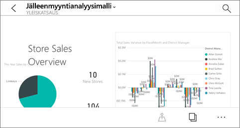
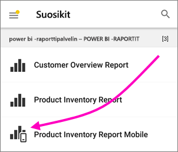
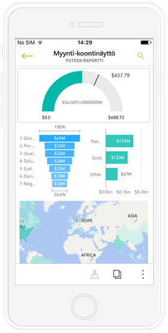
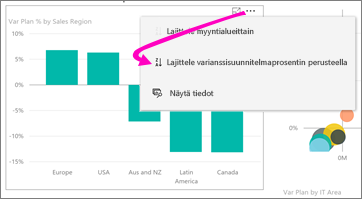
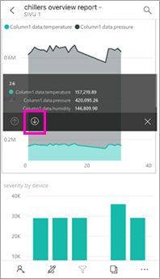
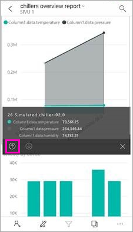
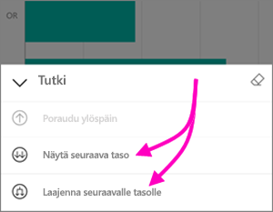
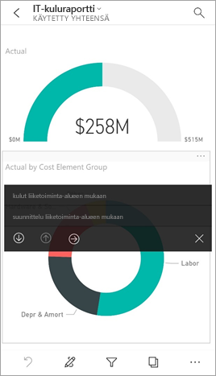
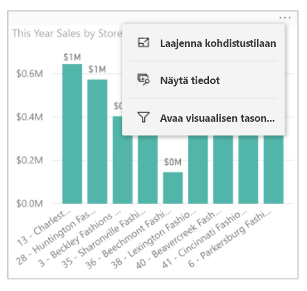
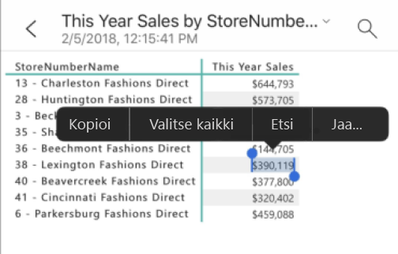

# Raporttien tutkiminen Power BI -mobiilisovelluksissa
Koskee seuraavia:

|  |  |  |  |  |
|:--- |:--- |:--- |:--- |:--- |
| iPhonet |iPadit |Android-puhelimet |Android-tabletit |Windows 10 -laitteet |

Power BI -raportti on vuorovaikutteinen näkymä tiedoistasi, joka sisältää eri havaintoja ja merkityksellisiä tietoja esittäviä visualisointeja. Raporttien tarkasteleminen Power BI -mobiilisovelluksissa on kolmivaiheisen prosessin kolmas vaihe.

1. [Luo raportteja Power BI Desktopissa](../../desktop-report-view.md). Voit jopa [optimoida raportin puhelimille](mobile-apps-view-phone-report.md) Power BI Desktopissa. 
2. Julkaise raportit Power BI -palvelussa [(https://powerbi.com)](https://powerbi.com) tai [Power BI -raporttipalvelimessa](../../report-server/get-started.md).  
3. Käsittele niitä sitten Power BI -mobiilisovelluksissa.

## Power BI -raportin avaaminen mobiilisovelluksessa
Power BI -raportit tallennetaan eri paikkoihin mobiilisovelluksessa sen mukaan, mistä ne ovat peräisin. Sijaintipaikka voi olla Sovellukset, Jaettu kanssani, Työtilat (myös Oma työtila) tai raporttipalvelin. Joskus sinun on käytävä läpi aiheeseen liittyvä raporttinäkymä, jotta saat raportin, ja joskus raportit on luetteloitu.

* Napauta kolmea pistettä (...) raporttinäkymän ruudun oikeassa yläkulmassa > **Avaa raportti**.
  
  
  
  Kaikissa ruuduissa ei ole raportin avaamisvaihtoehtoa. Esimerkiksi Q&A-ruudussa kysymyksiä esittämällä luodut ruudut eivät avaa raportteja, kun niitä napautetaan. 
  
  Puhelimessa raportti avautuu vaakatilassa, ellei sitä ole [optimoitu puhelimella tarkasteltavaksi](mobile-reports-in-the-mobile-apps.md#view-reports-optimized-for-phones).
  
  

## Puhelimille optimoitujen raporttien tarkasteleminen
Power BI -raportin tekijät voivat luoda erityisesti puhelimille optimoidun raportin asettelun. Puhelimille optimoiduille raporttisivuille on lisätty toimintoja: voit esimerkiksi porautua visualisointeihin ja lajitella niitä, voit käyttää [suodattimia, jotka raportin tekijä on lisännyt raporttisivulle](mobile-apps-view-phone-report.md#filter-the-report-page-on-a-phone). Raportti avautuu puhelimessa suodatettuna verkossa olevassa raportissa suodatettuihin arvoihin ja saat ilmoituksen, että sivulla on aktiivisia suodattimia. Voit muuttaa suodattimia puhelimessasi.

Optimoidulla raportilla on erityinen kuvake raporttiluettelossa :

Kun tarkastelet raporttia puhelimessa, se avautuu pystynäkymässä.

 Raportissa saattaa olla sekä sivuja, jotka on optimoitu puhelimille, että sivuja, joita ei ole optimoitu. Jos näin on, raporttia selatessasi näkymä vaihtuu pystysuuntaisesta vaakasuuntaiseksi kullakin sivulla.

Lue lisätietoja [puhelinnäkymään optimoiduista raporteista](mobile-apps-view-phone-report.md).

## Raportin suodattaminen osittajien avulla
Kun suunnittelet raporttia Power BI Desktopissa tai Power BI -palvelussa, harkitse [osittajien lisäämistä raporttisivulle](../../visuals/power-bi-visualization-slicers.md). Sinä ja työtoverisi voitte käyttää osittajia sivun suodattamiseen selaimessa ja mobiilisovelluksissa. Kun tarkastelet raporttia puhelimessa, näet osittajat ja voit käyttää niitä vaakatilassa ja puhelimen pystytilaan optimoidulla sivulla. Jos valitset osittajan tai suodattimen arvon selaimessa, arvo valitaan myös, kun tarkastelet sivua mobiilisovelluksessa. Saat ilmoituksen siitä, että sivulla on aktiivisia suodattimia.  

* Kun valitset osittajan arvon raporttisivulla, se suodattaa sivun muut visualisoinnit.
  
  
  
  Tässä kuvassa osittaja suodattaa pylväskaavion näyttämään vain heinäkuun arvot.

## Raportin ristisuodatus ja korostaminen
Kun valitset arvon visualisoinnissa, se ei suodata muita visualisointeja. Se korostaa liittyvät arvot muissa visualisoinneissa.

* Napauta arvoa visualisoinnissa.
  
  
  
  Suuri-sarakkeen napauttaminen visualisoinnissa korostaa liittyvät arvot muissa visualisoinneissa. 

## Visualisoinnin lajitteleminen iPadilla tai tabletilla
* Napauta kaaviota, valitse kolme pistettä (**...**) ja napauta kentän nimeä.
  
   
* Voit muuttaa lajittelujärjestyksen käänteiseksi napauttamalla kolmea pistettä (**...**) uudelleen ja valitsemalla saman kentän nimen.

## Porautuminen alas- ja ylöspäin visualisoinnissa
Jos raportin tekijä on lisännyt porautumisominaisuuden visualisointiin, voit porautua visualisointiin nähdäksesi arvot, jotka muodostavat osan siitä. Voit [lisätä alaspäin porautumisen visualisointiin](../end-user-drill.md) Power BI Desktopissa tai Power BI -palvelussa. 

* Kosketa haluamaasi visualisoinnin palkkia tai pistettä pitkään nähdäksesi sen työkaluvihjeen. Jos siihen voi porautua, alemmassa työkaluvihjeessä on napautettavissa olevia nuolia. 
  
  

* Porautuaksesi takaisin ylös, napauta ylöspäin osoittavaa nuolta työkaluvihjeessä.
  
  

* Voit porautua alaspäin kaikissa visualisoinnin arvopisteissä. Avaa kohdistustila, napauta tutkimiskuvaketta ja valitse sitten näytä kaikki seuraavalla tasolla, tai laajenna nähdäksesi nykyisen ja seuraavan tason.

   

## Poraudu yhden sivun läpi seuraavaan

Kun napautat tiettyä kohtaa visualisoinnissa, voit *porautumalla* siirtyä Power BI:ssä raportin eri sivulle, joka suodatetaan napauttamasi arvon mukaisesti. Raportin tekijä voi määrittää yhden tai useampia porautumisvaihtoehtoja, joista jokainen siirtää sinut eri sivulle. Voit siinä tapauksessa valita mihin sivuun haluat porautua. Seuraavassa esimerkissä, napauttaessasi mittarin arvoa, voit valita poraudutko joko **käyttö liiketoiminta-alueen mukaan**-sivulle vai **suunnittelu liiketoiminta-alueen mukaan**-sivulle.

Takaisin-painike vie sinut takaisin raportin edelliselle sivulle.

Lue lisää [porautumisen lisäämisestä Power BI Desktopiin](../../desktop-drillthrough.md).

## Tietojen näyttäminen ja arvojen kopioiminen

Voit tarkastella visualisoinnin taustalla olevia tietoja valitsemalla valikkoasetusten kolme pistettä (**...**) visualisoinnin oikeasta yläkulmasta puhelinraportissa. Valitse sen jälkeen **Näytä tiedot**.

Esitetyn taulukon solun pitkä napautus tuo näkyviin alkuperäisen valinta- ja kopiointivalikon, joten voit valita kopioitavat tiedot taulukosta (tai taulukon kokonaan).

## Seuraavat vaiheet
* [Puhelimelle optimoitujen Power BI -raporttien tarkasteleminen ja käyttäminen](mobile-apps-view-phone-report.md)
* [Puhelimille optimoidun raporttiversion luominen](../../desktop-create-phone-report.md)
* Onko sinulla kysyttävää? [Voit esittää kysymyksiä Power BI -yhteisössä](http://community.powerbi.com/)

