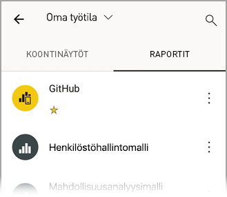
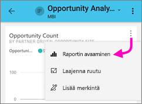
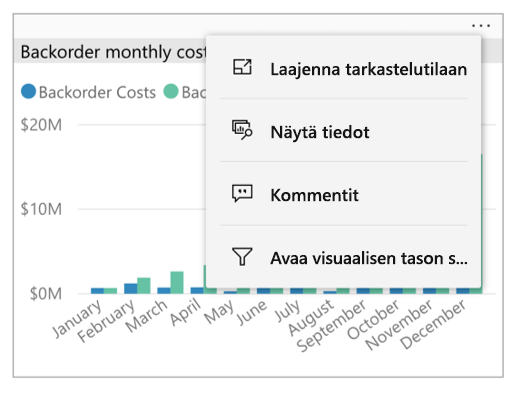
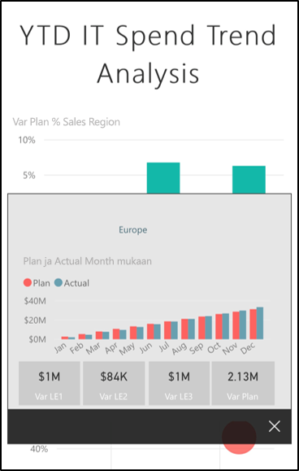
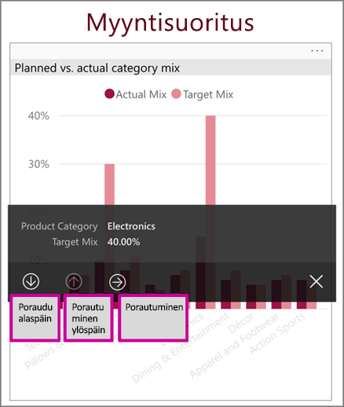
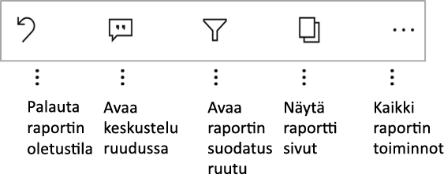

# Raporttien tutkiminen Power BI -mobiilisovelluksissa
Koskee seuraavia:

|  |  |  |  |  |
|:---: |:---: |:---: |:---: |:---: |
| iPhonet |iPadit |Android-puhelimet |Android-tabletit |Windows 10 -laitteet |

Power BI -raportti on vuorovaikutteinen näkymä tiedoistasi, joka sisältää eri havaintoja ja merkityksellisiä tietoja esittäviä visualisointeja. Raporttien tarkasteleminen Power BI -mobiilisovelluksissa on kolmivaiheisen prosessin kolmas vaihe:

1. [Luo raportteja Power BI Desktopissa](../../desktop-report-view.md). Voit jopa [optimoida raportin puhelimille](mobile-apps-view-phone-report.md) Power BI Desktopissa.
2. Julkaise raportit Power BI -palvelussa [(https://powerbi.com)](https://powerbi.com) tai [Power BI -raporttipalvelimessa](../../report-server/get-started.md).  
3. Käsittele raportteja Power BI -mobiilisovelluksissa.

## Power BI -raportin avaaminen mobiilisovelluksessa
Power BI -raportit tallennetaan eri paikkoihin mobiilisovelluksessa sen mukaan, mistä ne ovat peräisin. Sijaintipaikka voi olla Sovellukset, Jaettu kanssani, Työtilat (myös Oma työtila) tai raporttipalvelin. Joskus sinun on käytävä läpi aiheeseen liittyvä raporttinäkymä, jotta saat raportin, ja joskus raportit on luetteloitu.

Luetteloissa ja valikoissa on raportin nimen vieressä kuvake, joka auttaa ymmärtämään, että kohde on raportti:

Power BI -mobiilisovelluksissa on kaksi kuvaketta raportteja varten:

*  ilmaisee raportin, joka näkyy vaakasuunnassa sovelluksessa. Raportti näyttää samalta kuin selaimessa.

*  tarkoittaa raporttia, jossa on vähintään yksi puhelimelle optimoitu sivu, joka näkyy pystysuunnassa.

> [!NOTE]
> Kun pidät puhelinta vaaka-asennossa, saat aina vaakasuuntaisen asettelun, vaikka raporttisivulla olisi puhelinasettelu.

Jos haluat päästä raporttiin raporttinäkymästä, napauta kolmea pistettä (...) raporttinäkymän ruudun oikeassa yläkulmassa ja valitse **Avaa raportti**:
  
  
  
  Kaikkia ruutuja ei voi avata raportteina. Esimerkiksi Q&A-ruudussa kysymyksiä esittämällä luodut ruudut eivät avaa raportteja, kun niitä napautetaan.
  
## Raporttien käsitteleminen
Kun raportti on avattuna sovelluksessa, voit aloittaa sen käsittelemisen. Raportilla ja sen tiedoilla voi tehdä monia asioita. Raportin alatunnisteessa on toimintoja, joita voit suorittaa raportissa. Napauttamalla ja napauttamalla pitkään raportissa näkyviä tietoja voit myös osittaa ja käsitellä tietoja.

### Napauttamisen ja pitkän napauttamisen käyttäminen
Napautus on sama kuin napsautus hiirellä. Jos siis haluat ristiinkorostaa raportin arvopisteen perusteella, napauta kyseistä arvopistettä.
Kun napautat osittajan arvoa, arvo valitaan ja raportin muut osat ositetaan kyseisen arvon mukaan.
Kun napautat linkkiä, painiketta tai kirjanmerkkiä, raportin tekijän määrittämä toiminto suoritetaan.

Olet luultavasti huomannut, että kun napautat visualisointia, näkyviin tulee reuna. Reunan oikeassa yläkulmassa on kolme pistettä (...). Jos napautat kolmea pistettä, näkyviin tulee valikko täynnä toimintoja, joita voit käyttää visualisoinnissa:

### Työkaluvihje ja porautumistoiminnot

Kun napautat pitkään arvopistettä, näkyviin tulevassa työkaluvihjeessä näkyvät kyseisen arvopisteen edustamat arvot:

Jos raportin tekijä on määrittänyt raporttisivun työkaluvihjeen, se korvaa raporttisivun oletustyökaluvihjeen:

> [!NOTE]
> Raportin työkaluvihjeitä tuetaan laitteissa, joiden näyttökoko on vähintään 640 kuvapistettä kertaa 320 kuvapistettä. Jos laite on tätä pienempi, sovellus näyttää oletustyökaluvihjeet.

Raportin tekijät voivat määrittää hierarkioita raporttisivujen välisissä tiedoissa ja yhteyksissä. Hierarkiat sallivat porautumisen alaspäin, porautumisen ylöspäin ja porautumisen toisen raporttisivun läpi visualisoinnista ja arvosta. Kun napautat arvoa pitkään, työkaluvihjeen lisäksi alatunnisteessa näkyvät tarvittavat porautumisvaihtoehdot:

Kun napautat tiettyä kohtaa visualisoinnissa ja sitten *porautumisvaihtoehtoa*, voit siirtyä Power BI:ssä raportin eri sivulle, joka suodatetaan napauttamasi arvon mukaisesti. Raportin tekijä voi määrittää yhden tai useampia porautumisvaihtoehtoja, joista jokainen siirtää sinut eri sivulle. Voit siinä tapauksessa valita, mihin vaihtoehtoon haluat porautua. Takaisin-painike vie sinut takaisin edelliselle sivulle.

Lue lisätietoja [porautumisen lisäämisestä Power BI Desktopiin](../../desktop-drillthrough.md).
   
   > [!IMPORTANT]
   > Power BI -mobiilisovelluksissa porautumistoiminnot ovat käytössä matriisi- ja taulukkovisualisoinneissa vain solujen arvojen kautta. Ne eivät ole käytössä sarake- tai riviotsikoiden kautta.
   
   
   
### Raportin alatunnisteessa olevien toimintojen käyttäminen
Raportin alatunnisteessa on toimintoja, joita voi käyttää nykyisellä raporttisivulla tai koko raportissa. Alatunnisteen kautta pääsee nopeasti yleisimmin käytettyihin toimintoihin. Voit käyttää muita toimintoja napauttamalla kolmea pistettä (...):

Seuraavia toimintoja voi suorittaa alatunnisteen kautta:
- Palauta raporttisuodatin ja ristiinkorostusvalinnat takaisin alkuperäiseen tilaan.
- Avaa keskusteluruutu, jos haluat tarkastella kommentteja tai lisätä raporttiin kommentteja.
- Voit tarkastella tai muokata raportissa käytettävää suodatinta avaamalla suodatusruudun.
- Voit luetella raportin sivut. Sivun nimen napauttaminen lataa ja näyttää kyseisen sivun.
Voit liikkua raporttisivujen välillä liikkuminen pyyhkäisemällä näytön reunasta keskelle.
- Näytä kaikki raportin toiminnot.

#### Kaikki raportin toiminnot
Kun napautat kolmea pistettä (...) raportin alatunnisteessa, näet kaikki toiminnot, jotka voit suorittaa raportissa:

Osa toiminnoista voi olla poissa käytöstä, koska ne ovat riippuvaisia tietyistä raportin ominaisuuksista.
Esimerkki:

**Suodatus nykyisen sijainnin mukaan** on käytössä, jos raportin tekijä on luokitellut raportin maantieteellisten tietojen mukaan. Lue lisätietoja [maantieteellisten tietojen tunnistamisesta raportissa](https://docs.microsoft.com/power-bi/desktop-mobile-geofiltering).

**Raportin suodatus lukemalla viivakoodi** on käytössä vain, jos raportin tietojoukko on merkitty **viivakoodiksi**. Lue lisätietoja [viivakoodien merkitsemisestä Power BI Desktopissa](https://docs.microsoft.com/power-bi/desktop-mobile-barcodes).

**Kutsu** on käytössä vain, jos sinulla on oikeus jakaa raportti muiden kanssa. Sinulla on oikeus vain, jos olet raportin omistaja tai jos omistaja on antanut sinulle uudelleenjakamisoikeuden.

**Lisää merkintöjä ja jaa** saattaa olla pois käytöstä, jos organisaatiossasi on [Intune-suojauskäytäntö](https://docs.microsoft.com/intune/app-protection-policies), joka estää jakamisen Power BI -mobiilisovelluksesta.

## Seuraavat vaiheet
* [Puhelimelle optimoitujen Power BI -raporttien tarkasteleminen ja käyttäminen](mobile-apps-view-phone-report.md)
* [Puhelimille optimoidun raporttiversion luominen](../../desktop-create-phone-report.md)
* Onko sinulla kysyttävää? [Voit esittää kysymyksiä Power BI -yhteisössä](http://community.powerbi.com/)

