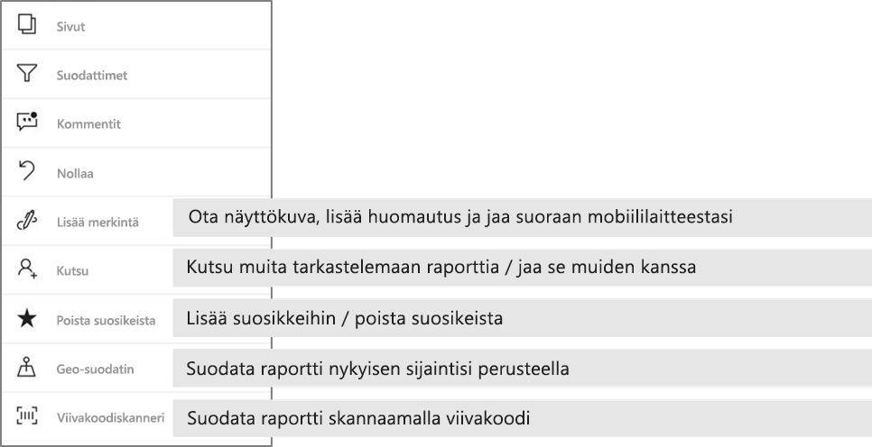

# Raporttien tutkiminen Power BI -mobiilisovelluksissa
Koskee seuraavia:

|  |  |  |  |  |
|:--- |:--- |:--- |:--- |:--- |
| iPhonet |iPadit |Android-puhelimet |Android-tabletit |Windows 10 -laitteet |

Power BI -raportti on vuorovaikutteinen näkymä tiedoistasi, joka sisältää eri havaintoja ja merkityksellisiä tietoja esittäviä visualisointeja. Raporttien tarkasteleminen Power BI -mobiilisovelluksissa on kolmivaiheisen prosessin kolmas vaihe.

1. [Luo raportteja Power BI Desktopissa](../../desktop-report-view.md). Voit jopa [optimoida raportin puhelimille](mobile-apps-view-phone-report.md) Power BI Desktopissa. 
2. Julkaise raportit Power BI -palvelussa [(https://powerbi.com)](https://powerbi.com) tai [Power BI -raporttipalvelimessa](../../report-server/get-started.md).  
3. Käsittele niitä sitten Power BI -mobiilisovelluksissa.

## Power BI -raportin avaaminen mobiilisovelluksessa
Power BI -raportit tallennetaan eri paikkoihin mobiilisovelluksessa sen mukaan, mistä ne ovat peräisin. Sijaintipaikka voi olla Sovellukset, Jaettu kanssani, Työtilat (myös Oma työtila) tai raporttipalvelin. Joskus sinun on käytävä läpi aiheeseen liittyvä raporttinäkymä, jotta saat raportin, ja joskus raportit on luetteloitu.

Luetteloiden ja valikot löydät raportin nimen vieressä kuvake auttaa sinua ymmärtämään, että tämä kohde on raportti. 

 

On kaksi kuvakkeet raportteja Power BI-mobiilisovelluksissa:

*  Ilmaisee, raportti, joka voidaan esittää vaakasuunnassa sovelluksessa ja näytä samalta sellaisena kuin se näkyy selaimessa.

*  Ilmaisee, raportti, jossa on vähintään yksi puhelin optimoidun raporttisivu, joka esitetään pystysuunnassa. 

Huomautus: Pidät puhelimen vaaka, aina saat vaaka-asettelun vaikka raportin sivulla on puhelinasettelu. 

Voit siirtyä raportin koontinäytöstä, napauta ruudun oikeassa yläkulmassa kolme pistettä (...) > **Avaa raportti**.
  
  
  
  Kaikissa ruuduissa ei ole raportin avaamisvaihtoehtoa. Esimerkiksi Q&A-ruudussa kysymyksiä esittämällä luodut ruudut eivät avaa raportteja, kun niitä napautetaan. 
  
## Raporttien käsitteleminen
Kun sinulla on raportin avata sovelluksen, voit aloittaa käyttämiseen. On monia asioita, voit tehdä raportin ja sen tietoja. Raportin alatunnisteeseen löydät toimintoja voit tehdä raporttiin ja napauttamalla ja pitkä napauttamalla, raportin, voit myös jakaa sektoreihin ja dice tiedot näkyvät tiedot.

### Napauta ja napauta pitkään
Napauta yhtä suuri kuin hiiren napsauttamalla. Joten jos haluat korostaa välisiä arvopisteen perustuvan raportin, napauta arvopisteen.
Napauttamalla osittaja-arvon, tekee valitun arvon ja raportin muut jaottelu kyseisen arvon mukaan. Napauttamalla linkkiä, painikkeen tai kirjanmerkin Aktivoi se määritetty tekijä toiminnon perusteella.

Huomasit luultavasti, että kun napautat visualisoinnin, reuna tulee näkyviin. Valitse oikeasta yläkulmasta reunan on kolme pistettä (...). Napauttamalla sitä tuo valikko, jossa voit tehdä tämän visualisoinnin toimintoja.

### Työkaluvihje-ja porautuminen

Pitkä napauttaessasi (Napauta ja pidä) arvopisteen työkaluvihje tulee näkyviin pitämisestä arvopisteelle edustaa arvot. 

Raporttien tekijät voivat määrittää hierarkiat tiedot ja suhteita raporttisivujen välillä. Hierarkian mahdollistaa Poraudu alaspäin porautuminen ylöspäin ja porautuminen toiseen raporttisivuun visualisoinnin ja arvo. Näin on, kun napautat pitkän arvon, lisäksi työkaluvihjeessä asianmukaiset porautumisesta näkyvät alatunniste. 

Kun napautat tiettyä kohtaa visualisoinnissa, voit *porautumalla* siirtyä Power BI:ssä raportin eri sivulle, joka suodatetaan napauttamasi arvon mukaisesti.  Raportin tekijä voi määrittää yhden tai useampia porautumisvaihtoehtoja, joista jokainen siirtää sinut eri sivulle. Voit siinä tapauksessa valita mihin sivuun haluat porautua. Takaisin-painike Vie sinut takaisin raportin edelliselle sivulle.

Lue lisää [porautumisen lisäämisestä Power BI Desktopiin](../../desktop-drillthrough.md).
   
   > [!IMPORTANT]
   > Power BI-mobiilisovellus matriisien ja taulukoiden visualisoinnit porautuminen on käytössä vain solun arvon ja sarakkeiden ja rivien otsikot mukaan.
   
   
   
### Toimintojen käyttäminen raportin alatunniste
Raportin alatunniste on voit tehdä toimintoja, raportin tai koko raportin. Alatunnisteen on eniten hyötyä toiminnot nopea käyttö ja kaikki toiminnot voivat olla kolme pistettä (...) käyttö.

Alatunnisteen suoritettavat toiminnot ovat:
1) Palauttaa raporttisuodattimen ja rajat korostaa valinnat takaisin alkuperäiseen tilaan.
2) Avaa keskustelu-ruudussa voit tarkastella tai lisätä kommentteja Tässä raportissa.
3) Avaa tarkastella ja muokata suodatin, joka on tällä hetkellä käytössä raportin suodattimet-ruutu.
4) Tämän raportin kaikkien sivujen luettelo. Napauttamalla sivun nimen avulla ladata ja esittää sivun.
Raporttisivujen välillä siirtämisen voidaan tehdä lukemalla pääsäilön näytön keskellä.
5) Näytä kaikki Raporttitoiminnot.

#### Kaikki Raporttitoiminnot
Valitse napauttamalla... Raportin alatunniste vaihtoehto, se tuo kaikki raportin suoritettavat toiminnot. 

Jotkin toiminnot voi olla poistettu käytöstä, koska ne ovat riippuvaisia tietyn raporttiominaisuuksia.
Esimerkki:
1) **Suodata nykyisen sijaintisi mukaan** on käytössä, jos raportin tiedot on luokitellut maantieteellisiä tietoja sisältävät tekijän mukaan. [Lue, miten voit Määritä raporttisi maantieteelliset tiedot](https://docs.microsoft.com/power-bi/desktop-mobile-geofiltering).
2) **Tarkistuksen suodattaa raportin viivakoodin** on käytössä vain, jos raportin tietojoukko on merkitty viivakoodin. [Miten voit merkitä viivakoodeja Power BI Desktop-](https://docs.microsoft.com/power-bi/desktop-mobile-barcodes). 
3) **Kutsu** on käytössä vain, jos sinulla on oikeus jakaa tämän raportin muiden kanssa. Voit käyttöoikeudet myönnetään vain, jos raportin omistaja tai annettiin Jaa uudelleen käyttöoikeutta omistaja.
4) **Lisää merkintöjä ja Jaa** saattaa olla käytöstä, jos [Intune suojauskäytäntö](https://docs.microsoft.com/intune/app-protection-policies) organisaatiossasi, joka saa jakaminen Power BI-mobiilisovellus. 

## Seuraavat vaiheet
* [Puhelimelle optimoitujen Power BI -raporttien tarkasteleminen ja käyttäminen](mobile-apps-view-phone-report.md)
* [Puhelimille optimoidun raporttiversion luominen](../../desktop-create-phone-report.md)
* Onko sinulla kysyttävää? [Voit esittää kysymyksiä Power BI -yhteisössä](http://community.powerbi.com/)

