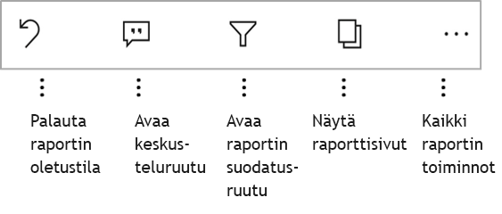

# Raporttien tutkiminen Power BI -mobiilisovelluksissa
Koskee seuraavia:

|  |  |  |  |  |
|:--- |:--- |:--- |:--- |:--- |
| iPhonet |iPadit |Android-puhelimet |Android-tabletit |Windows 10 -laitteet |

Power BI -raportti on vuorovaikutteinen näkymä tiedoistasi, joka sisältää eri havaintoja ja merkityksellisiä tietoja esittäviä visualisointeja. Raporttien tarkasteleminen Power BI -mobiilisovelluksissa on kolmivaiheisen prosessin kolmas vaihe.

1. [Luo raportteja Power BI Desktopissa](../../desktop-report-view.md). Voit jopa [optimoida raportin puhelimille](mobile-apps-view-phone-report.md) Power BI Desktopissa. 
2. Julkaise raportit Power BI -palvelussa [(https://powerbi.com)](https://powerbi.com) tai [Power BI -raporttipalvelimessa](../../report-server/get-started.md).  
3. Käsittele niitä sitten Power BI -mobiilisovelluksissa.

## Power BI -raportin avaaminen mobiilisovelluksessa
Power BI -raportit tallennetaan eri paikkoihin mobiilisovelluksessa sen mukaan, mistä ne ovat peräisin. Sijaintipaikka voi olla Sovellukset, Jaettu kanssani, Työtilat (myös Oma työtila) tai raporttipalvelin. Joskus sinun on käytävä läpi aiheeseen liittyvä raporttinäkymä, jotta saat raportin, ja joskus raportit on luetteloitu.

Luetteloissa ja valikoissa on raportin nimen vieressä kuvake, joka auttaa ymmärtämään, että tämä kohde on raportti. 

 

Power BI -mobiilisovelluksissa on kaksi kuvaketta raportteja varten:

*  tarkoittaa raporttia, joka esitetään sovelluksessa vaakasuunnassa ja näyttää samalta kuin selaimessa.

*  tarkoittaa raporttia, jossa on vähintään yksi puhelimelle optimoitu raporttisivu, joka esitetään pystysuunnassa. 

Huomautus: Kun pidät puhelinta vaaka-asennossa, saat aina vaakasuuntaisen asettelun, vaikka raporttisivulla olisi puhelinasettelu. 

Jos haluat päästä raporttiin raporttinäkymästä, napauta kolmea pistettä (...) raporttinäkymän ruudun oikeassa yläkulmassa > **Avaa raportti**.
  
  
  
  Kaikissa ruuduissa ei ole raportin avaamisvaihtoehtoa. Esimerkiksi Q&A-ruudussa kysymyksiä esittämällä luodut ruudut eivät avaa raportteja, kun niitä napautetaan. 
  
## Raporttien käsitteleminen
Kun raportti on avattuna sovelluksessa, voit aloittaa sen käsittelemisen. Raportilla ja sen tiedoilla voi tehdä monia asioita. Raportin alatunnisteessa on toimintoja, joita voit suorittaa raportissa. Napauttamalla ja napauttamalla pitkään raportissa näkyviä tietoja voit myös osittaa ja käsitellä tietoja.

### Napauttamisen ja pitkän napauttamisen käyttäminen
Napauttaminen vastaa napsauttamista hiirellä. Jos siis haluat ristiinkorostaa raportin arvopisteen perusteella, napauta kyseistä arvopistettä.
Kun napautat osittajan arvoa, se valitaan ja raportin muut arvot ositetaan tämän arvon mukaan. Linkin, painikkeen tai kirjanmerkin napauttaminen aktivoi sen tekijän määrittämän toiminnon perusteella.

Olet luultavasti huomannut, että kun napautat visualisointia, näkyviin tulee reuna. Reunan oikeassa yläkulmassa on kolme pistettä (...). Sen napauttaminen tuo näkyviin valikon, jossa on visualisoinnissa käytettäviä toimintoja.

### Työkaluvihje- ja porautumistoiminnot

Kun napautat pitkään arvopistettä, näkyviin tulevassa työkaluvihjeessä näkyvät kyseisen arvopisteen edustamat arvot. 

Jos raportin tekijä on määrittänyt raporttisivun työkaluvihjeen, se korvaa raporttisivun oletustyökaluvihjeen.

> [!NOTE]
> Raportin työkaluvihjeitä tuetaan laitteissa, joiden kuvapistekoko on vähintään 640 ja näyttöikkuna 320. Jos laitteesi on tätä pienempi, sovellus käyttää oletustyökaluvihjeitä.

Raportin tekijät voivat määrittää hierarkioita raporttisivujen välisissä tiedoissa ja yhteyksissä. Hierarkia sallii porautumisen alaspäin, porautumisen ylöspäin ja porautumisen toisen raporttisivun läpi visualisoinnista ja arvosta. Kun napautat arvoa pitkään, työkaluvihjeen lisäksi alatunnisteessa näkyvät tarvittavat porautumisvaihtoehdot. 

Kun napautat tiettyä kohtaa visualisoinnissa, voit *porautumalla* siirtyä Power BI:ssä raportin eri sivulle, joka suodatetaan napauttamasi arvon mukaisesti.  Raportin tekijä voi määrittää yhden tai useampia porautumisvaihtoehtoja, joista jokainen siirtää sinut eri sivulle. Voit siinä tapauksessa valita mihin sivuun haluat porautua. Takaisin-painike vie sinut takaisin edelliselle raporttisivulle.

Lue lisää [porautumisen lisäämisestä Power BI Desktopiin](../../desktop-drillthrough.md).
   
   > [!IMPORTANT]
   > Power BI -mobiilisovelluksessa porautuminen matriisissa ja taulukon visualisoinneissa on käytössä ainoastaan solun arvon kautta. Se ei toimi sarake- ja riviotsikoiden kautta.
   
   
   
### Raportin alatunnisteessa olevien toimintojen käyttäminen
Raportin alatunnisteessa on toimintoja, joita voi käyttää nykyisellä raporttisivulla tai koko raportissa. Alatunnisteessa hyödyllisimmät toiminnot ovat nopeasti käytettävissä, ja kaikki toiminnot ovat käytettävissä kolmen pisteen (...) kautta.

Alatunnisteen kautta suoritettavat toiminnot:
1) Palauta raporttisuodatin ja ristiinkorostusvalinnat takaisin alkuperäiseen tilaan.
2) Avaa keskusteluruutu, jos haluat tarkastella raportin kommentteja tai lisätä kommentteja.
3) Voit tarkastella ja muokata raportissa käytettävää suodatinta avaamalla suodatusruudun.
4) Luettele tämän raportin kaikki sivut. Sivun nimen napauttaminen lataa ja näyttää kyseisen sivun.
Raporttisivujen välillä liikkuminen onnistuu pyyhkäisemällä näytön reunasta keskelle.
5) Näytä kaikki raportin toiminnot.

#### Kaikki raportin toiminnot
Kun napautat ...-vaihtoehtoa raportin alatunnisteessa, saat näkyviin kaikki toiminnot, joita raportissa voi käyttää. 

Osa toiminnoista voi olla poissa käytöstä, koska ne ovat riippuvaisia tietyistä raportin ominaisuuksista.
Esimerkki:
1) **Suodatus nykyisen sijainnin mukaan** on käytössä, jos raportin tiedot on luokiteltu tekijän ja maantieteellisten tietojen mukaan. [Opettele määrittämään raporttisi maantieteelliset tiedot](https://docs.microsoft.com/power-bi/desktop-mobile-geofiltering).
2) **Raportin suodatus lukemalla viivakoodi** on käytössä vain, jos raportin tietojoukko on merkitty viivakoodiksi. [Lue lisätietoja viivakoodien merkitsemisestä Power BI Desktopissa](https://docs.microsoft.com/power-bi/desktop-mobile-barcodes). 
3) **Kutsu** on käytössä vain, jos sinulla on oikeus jakaa tämä raportti muiden kanssa. Sinulla on oikeus vain, jos olet raportin omistaja tai jos olet saanut uudelleenjakamisoikeuden omistajalta.
4) **Lisää merkintöjä ja jaa** saattaa olla pois käytöstä, jos organisaatiossasi on [Intune-suojauskäytäntö](https://docs.microsoft.com/intune/app-protection-policies), joka estää jakamisen Power BI -mobiilisovelluksesta. 

## Seuraavat vaiheet
* [Puhelimelle optimoitujen Power BI -raporttien tarkasteleminen ja käyttäminen](mobile-apps-view-phone-report.md)
* [Puhelimille optimoidun raporttiversion luominen](../../desktop-create-phone-report.md)
* Onko sinulla kysyttävää? [Voit esittää kysymyksiä Power BI -yhteisössä](http://community.powerbi.com/)

