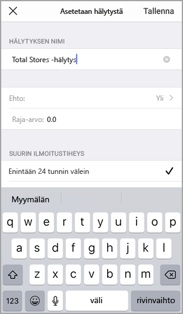
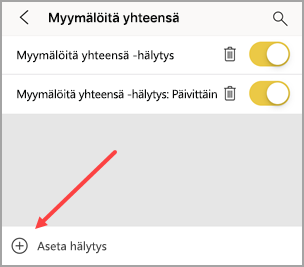
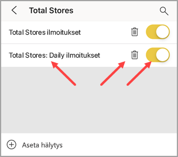
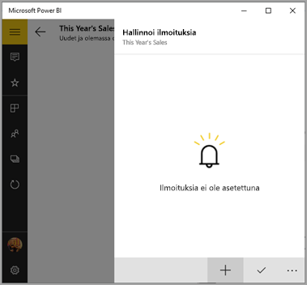
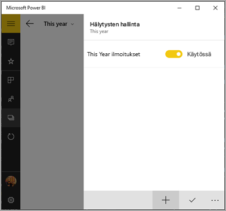
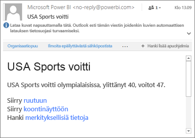

# Tietoilmoitusten määrittäminen Power BI -mobiilisovelluksissa
Koskee seuraavia:

|  |  |  |  |  |
|:--- |:--- |:--- |:--- |:--- |
| iPhonet |iPadit |Android-puhelimet |Android-tabletit |Windows 10 -laitteet |

Voit asettaa koontinäyttöilmoituksia Power BI -mobiilisovelluksissa ja Power BI -palvelussa. Ilmoitukset ilmoittavat, kun ruudun tiedot muuttuvat asettamiesi rajojen ulkopuolelle. Ilmoitukset toimivat ruuduilla, joissa on yksittäinen numero, kuten kortti- ja mittariruuduissa, mutta ei virtautettavien tietojen kohdalla. Voit asettaa tietoilmoituksia mobiililaitteessasi ja nähdä ne Power BI -palvelussa tai päinvastoin. Vain sinä näet määrittämäsi tietoilmoitukset, vaikka jakaisitkin koontinäytön tai ruudun tilannevedoksen.

Voit määrittää ilmoituksia ruuduille, jos sinulla on Power BI Pro -käyttöoikeus tai jos jaetulla koontinäytöllä on Premium-kapasiteetti. 

> [!WARNING]
> Aineistoperäiset ilmoitukset antavat tietoja lähdetiedoistasi. Jos laitteesi varastetaan, suosittelemme Power BI -palvelun avaamista ja kaikkien aineistoperäisten ilmoitussääntöjen poistamista käytöstä. 
> 
> Lue lisää [tietoilmoitusten hallinnasta Power BI -palvelussa](../../service-set-data-alerts.md).
> 
> 

## Tietoilmoitukset iPhonella tai iPadilla
### Ilmoituksen asettaminen iPhonella tai iPadilla
1. Napauttamalla numero- tai mittariruutua koontinäytöllä voit avata sen tarkastelutilassa.  
   
   
2. Napauttamalla kellokuvaketta  voit lisätä ilmoituksen.  
3. Valitse **Lisää ilmoitussääntö**.
   
   
4. Valitse ilmoitusten vastaanotto, kun tietty arvo ylitetään tai alitetaan, ja määritä sen jälkeen arvo.
   
   
5. Päätä, haluatko vastaanottaa tunti- vai päiväilmoituksia sekä haluatko saada myös sähköpostiviestin, kun saat ilmoituksen.
   
   > [!NOTE]
   > Et saa ilmoituksia joka tunti tai joka päivä, mikäli tiedot eivät ole päivittyneet kyseisenä aikana.
   > 
   > 
6. Voit muuttaa myös ilmoituksen otsikkoa.
7. Valitse **Tallenna**.
8. Yhdellä ruudulla voi olla ilmoituksia sekä raja-arvot ylittäville että alittaville arvoille. Kohdassa **Ilmoitusten hallinta** valitse **Lisää ilmoitussääntö**.
   
   

### Ilmoitusten hallinta iPhonella tai iPadilla
Voit hallita yksittäisiä ilmoituksia mobiililaitteessasi tai [hallita kaikkia ilmoituksiasi Power BI -palvelussa](../../service-set-data-alerts.md).

1. Koontinäytössä napauta numero- tai mittariruutua, jossa on ilmoitus.  
   
   
2. Napauta kellokuvaketta .  
3. Muokkaa ilmoitusta napauttamalla sen nimeä, poista sähköposti-ilmoitukset käytöstä napauttamalla liukusäädintä tai poista ilmoitus napauttamalla roskakoria.
   
    

## Tietoilmoitukset Android-laitteessa
### Ilmoituksen asettaminen Android-laitteessa
1. Power BI -koontinäytössä avaa numero- tai mittariruutu napauttamalla sitä.  
2. Napauttamalla kellokuvaketta  voit lisätä ilmoituksen.  
   
   
3. Napauta plusmerkkiä (+).
   
   
4. Valitse ilmoitusten vastaanotto, kun tietty arvo ylitetään tai alitetaan, ja syötä arvo.
   
   
5. Valitse **Valmis**.
6. Päätä, haluatko vastaanottaa tunti- vai päiväilmoituksia sekä haluatko saada myös sähköpostiviestin, kun saat ilmoituksen.
   
   > [!NOTE]
   > Et saa ilmoituksia joka tunti tai joka päivä, mikäli tiedot eivät ole päivittyneet kyseisenä aikana.
   > 
   > 
7. Voit muuttaa myös ilmoituksen otsikkoa.
8. Valitse **Tallenna**.

### Ilmoitusten hallinta Android-laitteessa
Voit hallita yksittäisiä ilmoituksia Power BI -mobiilisovelluksessa tai [hallita kaikkia ilmoituksiasi Power BI -palvelussa](../../service-set-data-alerts.md).

1. Koontinäytössä napauta kortti- tai mittariruutua, jossa on ilmoitus.  
2. Napauta kellokuvaketta .  
3. Napauta ilmoitusta, jos haluat muuttaa sen arvoa tai poistaa sen käytöstä.
   
    
4. Jos haluat lisätä toisen ilmoituksen samaan ruutuun, napauta plusmerkkiä (+).
5. Jos haluat poistaa ilmoituksen kokonaan, napauta roskakorikuvaketta .

## Tietoilmoitukset Windows-laitteessa
### Tietoilmoitusten asettaminen Windows-laitteessa
1. Napauttamalla numero- tai mittariruutua koontinäytöllä voit avata sen.  
2. Napauttamalla kellokuvaketta  voit lisätä ilmoituksen.  
   
   
3. Napauta plusmerkkiä (+).
   
   
4. Valitse ilmoitusten vastaanotto, kun tietty arvo ylitetään tai alitetaan, ja syötä arvo.
   
   
5. Päätä, haluatko vastaanottaa tunti- vai päiväilmoituksia sekä haluatko saada myös sähköpostiviestin, kun saat ilmoituksen.
   
   > [!NOTE]
   > Et saa ilmoituksia joka tunti tai joka päivä, mikäli tiedot eivät ole päivittyneet kyseisenä aikana.
   > 
   > 
6. Voit muuttaa myös ilmoituksen otsikkoa.
7. Napauta valintamerkkiä.
8. Yhdellä ruudulla voi olla ilmoituksia sekä raja-arvot ylittäville että alittaville arvoille. Kohdassa **Ilmoitusten hallinta** napauta plusmerkkiä (+).
   
   

### Ilmoitusten hallinta Windows-laitteessa
Voit hallita yksittäisiä ilmoituksia Power BI -mobiilisovelluksessa tai [hallita kaikkia ilmoituksiasi Power BI -palvelussa](../../service-set-data-alerts.md).

1. Koontinäytössä napauta kortti- tai mittariruutua, jossa on ilmoitus.  
2. Napauta kellokuvaketta .  
   
   
3. Napauta ilmoitusta, jos haluat muuttaa sen arvoa tai poistaa sen käytöstä.
   
    
4. Jos haluat poistaa ilmoituksen kokonaan, napsauta hiiren kakkospainikkeella tai napauta pitkään > **Poista**.

## Ilmoitusten vastaanottaminen
Ilmoituksen saapuvat mobiililaitteen tai Power BI-palvelun Power BI [-ilmoituskeskukseen](mobile-apps-notification-center.md). Saat myös ilmoituksia uusista koontinäytöistä, jotka joku on jakanut kanssasi.

Tietolähteet määritetään usein päivittymään päivittäin, vaikka jotkin päivittyvätkin useammin. Kun koontinäytön tiedot päivitetään ja jos seuratut tiedot saavuttavat jonkin määrittämistäsi raja-arvoista, tapahtuu useita asioita.

1. Power BI tarkistaa, onko edellisen ilmoituksen lähettämisestä yli tunti tai yli 24 tuntia (valitsemasi vaihtoehdon mukaan).
   
   Kunhan tiedot ylittävät raja-arvon, saat ilmoituksen joka tunti tai joka 24. tunti.
2. Jos olet määrittänyt ilmoitukset lähettämään sinulle sähköpostia, Saapuneet-kansiossasi näkyy jotain seuraavanlaista.
   
   
3. Power BI lisää viestin **ilmoituskeskukseesi** ja lisää uuden ilmoituksen kuvakkeen kyseiseen ruutuun .
4. Napauttamalla yleistä siirtymispainiketta  voit [avata oman **ilmoituskeskuksesi** ](mobile-apps-notification-center.md) ja nähdä ilmoituksen tiedot.
   
      

> [!NOTE]
> Ilmoitukset toimivat vain tiedoissa, joita päivitetään. Kun tiedot päivitetään, Power BI tarkistaa, onko tiedoille määritetty ilmoitus. Jos tiedot saavuttavat ilmoituksen raja-arvon, aktivoidaan ilmoitus.
> 
> 

## Vihjeet ja vianmääritys
* Ilmoituksia ei tällä hetkellä tueta Bing-ruuduissa tai korttiruuduissa, joissa on päivämäärä/aika-mittareita.
* Ilmoitukset toimivat vain numeerisissa tiedoissa.
* Ilmoitukset toimivat vain tiedoissa, joita päivitetään. Ne eivät toimi staattisissa tiedoissa.
* Ilmoitukset eivät toimi ruuduissa, jotka sisältävät virtautettavia tietoja.

## Seuraavat vaiheet
* [Power BI -palvelun ilmoitusten hallinta](../../service-set-data-alerts.md)
* [Power BI -mobiilisovelluksen ilmoituskeskus](mobile-apps-notification-center.md)
* Onko sinulla kysymyksiä? [Voit esittää kysymyksiä Power BI -yhteisössä](http://community.powerbi.com/)

