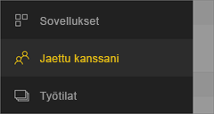
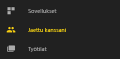
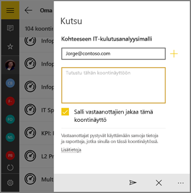

# Koontinäytön tai raportin jakaminen Power BI -mobiilisovelluksista
Koskee seuraavia:

|  |  |  |  |  |
|:--- |:--- |:--- |:--- |:--- |
| iPhonet |iPadit |Android-puhelimet |Android-tabletit |Windows 10 -laitteet |

[Power BI Pro -käyttöoikeuksilla](../../service-features-license-type.md) voit kutsua muita tarkastelemaan koontinäyttöjä ja raportteja jakamalla linkkejä Power BI -mobiilisovellusten kautta. Voit jakaa kenen tahansa kanssa, organisaation sisällä tai sen ulkopuolelle, yrityssähköpostitilillä tai ilman sitä. Heilläkin tosin täytyy olla Power BI Pro -käyttöoikeudet tai sisällön on oltava [Premium-kapasiteetissa](../../service-premium-what-is.md).

iOS-ja Android-laitteiden Power BI -mobiilisovelluksista voit [jakaa kenelle tahansa tilannevedoksen ruudusta, raportista tai visualisoinnista ja lisätä merkintöjä niihin](mobile-annotate-and-share-a-tile-from-the-mobile-apps.md). 

## Jakaminen iPhonesta
1. Napauta koontinäytön tai raportin alaosassa olevasta Toiminnot-palkista **Jaa**-kuvaketta .
   
   
2. Kirjoita nimet toisistaan pilkuilla erotettuina ja haluamasi viesti kutsusi mukaan.
3. Jos haluat sallia uudelleenjakamisen, jätä **Salli vastaanottajien jakaa uudelleen** valituksi.
   
   Uudelleenjakamisen ansiosta työtoverisi voivat lähettää sähköpostikutsun edelleen muille organisaatiossa, joko verkossa tai mobiilisovellusten kautta.
5. Napauta **Lähetä** oikeassa yläkulmassa.
   
   Vastaanottajat saavat sähköpostikutsun, jossa on suora linkki koontinäyttöön tai raporttiin. Kutsu vanhenee kuukauden kuluttua. Kun käyttäjä avaa sen selaimessa tai Power BI -mobiilisovelluksessa, se lisätään käyttäjän Power BI -tilin **Jaettu kanssani** -osaan.
   
   
   
   Lue lisää [muistiinpanoja jakamisesta työtovereiden kanssa](../../service-share-dashboards.md).

### Jaon poistaminen iPhonesta
Voit poistaa jakamisen vain, jos olet omistaja.

1. Napauta koontinäytön tai raportin alaosassa olevasta Toiminnot-palkista **Jaa**-kuvaketta .
2. Napauta **Kutsu työtoveri**.
   
   Näet luettelon työtovereista, joiden kanssa olet jakanut tämän koontinäytön tai raportin, jossa ovat nämä lauseet:
   
   * **Voi tarkastella**: he voivat tarkastella, mutta eivät jakaa.
   * **Voi tarkastella ja kutsua**: he voivat tarkastella ja jakaa muiden työtovereiden kanssa.
1. Napauta **Muokkaa**.
   
    
4. Jaon poistamiseksi on napautettava nimen vieressä olevaa punaista ympyrää ja napautettava sitten **Poista**.

## Jakaminen iPadista
1. Napauta **Jaa**-kuvaketta  -kuvake koontinäytön tai raportin oikeassa yläkulmassa.
2. Kirjoita sähköpostiosoitteet ja haluamasi viesti kutsusi mukaan.
3. Jos haluat sallia uudelleenjakamisen, jätä **Salli vastaanottajien jakaa uudelleen** valituksi.
   
   Uudelleenjakamisen ansiosta työtoverisi voivat lähettää sähköpostikutsun edelleen muille organisaatiossa, joko verkossa tai mobiilisovellusten kautta. 

4. Napauta **Lähetä** oikeassa yläkulmassa.
   
   Vastaanottajat saavat sähköpostikutsun, jossa on suora linkki koontinäyttöön tai raporttiin. Kutsu vanhenee kuukauden kuluttua. Kun käyttäjä avaa sen selaimessa tai Power BI -mobiilisovelluksessa, se lisätään käyttäjän Power BI -tilin **Jaettu kanssani** -osaan
   
   
   
   Lue lisää [muistiinpanoja jakamisesta työtovereiden kanssa](../../service-share-dashboards.md).

### Jaon poistaminen iPadista
Voit poistaa jakamisen vain, jos olet omistaja.

1. Napauta **Jaa**-kuvaketta  koontinäytön tai raportin oikeassa yläkulmassa.
   
   Näet luettelon työtovereista, joiden kanssa olet jakanut tämän koontinäytön tai raportin, jossa ovat nämä lauseet:
   
   * **Voi tarkastella**: he voivat tarkastella, mutta eivät jakaa.
   * **Voi tarkastella ja kutsua**: he voivat tarkastella ja jakaa muiden työtovereiden kanssa.
2. Napauta **Muokkaa**.
3. Jaon poistamiseksi on napautettava nimen vieressä olevaa punaista ympyrää ja napautettava sitten **Poista**.

## Jakaminen Android-laitteesta
1. Napauta koontinäyttöjen tai raporttien kotisivulla kolmea pistettä (...) ja napauta **Kutsu työtoveri**.
   
   
2. Tai napauta Kutsu-kuvaketta koontinäytössä tai raportissa .

    Jos olet koontinäytön omistaja, näet luettelon työtovereista, joiden kanssa olet jakanut tämän koontinäytön tai raportin, jossa ovat nämä merkinnät:

    -   **Voi tarkastella**: he voivat tarkastella, mutta eivät jakaa.
    -   **Voi tarkastella ja jakaa edelleen**: he voivat tarkastella ja jakaa muiden työtovereiden kanssa.

1. Kirjoita sähköpostiosoitteet ja haluamasi viesti koontinäyttökutsusi mukaan. Muussa tapauksessa Power BI lähettää oletusarvoisen viestin.
2. Jos haluat sallia uudelleenjakamisen, jätä **Salli vastaanottajien jakaa tämä koontinäyttö** valituksi.
   
   Uudelleenjakamisen ansiosta työtoverisi voivat lähettää sähköpostikutsun edelleen muille organisaatiossa, joko selaimen tai mobiilisovellusten kautta.
   
1. Napauta **Lähetä**-kuvaketta  oikeassa yläkulmassa sähköpostin lähettämiseksi.
   
   Vastaanottajat saavat sähköpostikutsun, jossa on suora linkki koontinäyttöön. Kutsu vanhenee kuukauden kuluttua. Kun käyttäjä avaa sen selaimessa tai Power BI -mobiilisovelluksessa, se lisätään käyttäjän Power BI -tilin **Jaettu kanssani** -osaan
   
   
   
   Lue lisää [muistiinpanoja koontinäyttöjen jakamisesta työtovereiden kanssa](../../service-share-dashboards.md).

### Jaon poistaminen Android-laitteesta
Voit poistaa jakamisen vain, jos olet omistaja.

1. Napauta Kutsu-kuvaketta koontinäytön tai raportin oikeassa yläkulmassa . 
   
   Näet luettelon työtovereista, joiden kanssa olet jakanut tämän koontinäytön tai raportin.
2. Voit lopettaa jakamisen työtoverin kanssa napauttamalla **X** nimen vieressä \> **Poista**.

## Jakaminen Windows 10 -laitteesta
1. Napauta Kutsu-kuvaketta koontinäytössä tai raportissa .
   
   Tai napsauta koontinäyttöjen tai raporttien kotisivulla hiiren kakkospainiketta ja pidä se painettuna ja napauta **Kutsu**.
   
   
   
   Jos olet koontinäytön omistaja, näet luettelon työtovereista, joiden kanssa olet jakanut tämän koontinäytön, jossa ovat nämä merkinnät:
   
   **Voi tarkastella**: he voivat tarkastella, mutta eivät jakaa.
   
   **Voi tarkastella ja jakaa edelleen**: he voivat tarkastella ja jakaa muiden työtovereiden kanssa.
2. Kirjoita sähköpostiosoitteet ja haluamasi viesti kutsusi mukaan. Muussa tapauksessa Power BI lähettää oletusarvoisen viestin.
   
   
3. Jos haluat sallia uudelleenjakamisen, jätä **Salli vastaanottajien jakaa uudelleen** valituksi.
   
   Uudelleenjakamisen ansiosta työtoverisi voivat jakaa muiden kanssa organisaatiossa, joko selaimen tai mobiilisovellusten kautta.
   
1. Napauta **Lähetä**-kuvaketta .
   
   Vastaanottajat saavat sähköpostikutsun, jossa on suora linkki koontinäyttöön tai raporttiin. Kutsu vanhenee kuukauden kuluttua. Kun käyttäjä avaa sen selaimessa tai Power BI -mobiilisovelluksessa, se lisätään käyttäjän Power BI -tilin **Jaettu kanssani** -osaan
   
   
   
   Lue lisää [muistiinpanoja jakamisesta työtovereiden kanssa](../../service-share-dashboards.md).

## Seuraavat vaiheet
* [Jaa tilannevedos ruudusta, raportista tai visualisoinnista ja lisää niihin merkintöjä mobiilisovelluksissa](mobile-annotate-and-share-a-tile-from-the-mobile-apps.md)
* [Jaa koontinäyttö tai raportti Power BI:ssä](../../service-share-dashboards.md)
* Ilmenikö kysyttävää? [Voit esittää kysymyksiä Power BI -yhteisössä](http://community.powerbi.com/)

