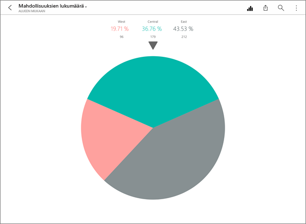
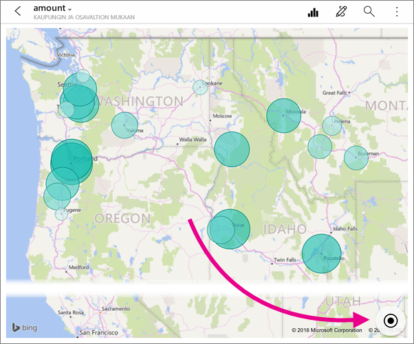
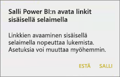
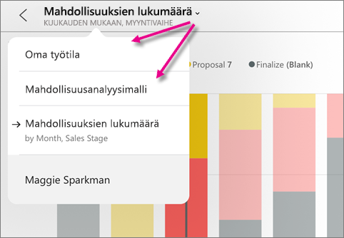
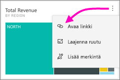
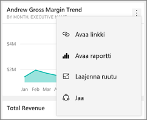
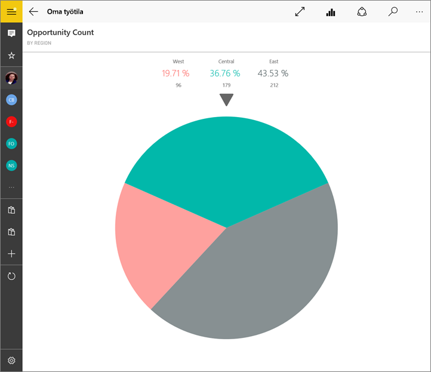
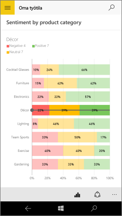

# Tutustu ruutuihin Power BI -mobiilisovelluksissa
Koskee seuraavia:

|  |  |  |  |  |
|:--- |:--- |:--- |:--- |:--- |
| iPhonet |iPadit |Android-puhelimet |Android-tabletit |Windows 10 -laitteet |

Ruudut ovat reaaliaikaisia tilannevedoksia tiedoistasi kiinnitettyinä koontinäyttöön. Niiden arvot muuttuvat tietojen muuttuessa. **Sinä [lisäät ruutuja koontinäyttöön Power BI -palvelussa](../end-user-tiles.md).** 

Power BI -mobiilisovelluksissa avaat ruutuja tarkastelutilassa ja olet vuorovaikutuksessa niiden kanssa. Voit avata ruutuja kaikenlaisten visualisointien kanssa, mukaan luettuina Bing- ja R-pohjaiset ruudut.

## iOS-sovellusten ruudut

1. Avaa [koontinäyttö iOS:n mobiilisovelluksessa](mobile-apps-view-dashboard.md).
2. Napauta ruutua. Se avautuu tarkastelutilassa, jossa on helpompi tarkastella ja tutkia ruudun tietoja. Tarkastelutilassa voit:
   
   Viiva-, palkki- tai pylväskaaviossa napauttamalla tarkastella visualisoinnin tiettyjen osien arvoja.
   
    
   
   *Esimerkiksi tässä viivakaaviossa valitut arvot tarkoittavat **tämän vuoden myyntiä** ja **viime vuoden myyntiä** **elokuussa**.*  
   
   Ympyräkaaviossa napauttaa jotakin ympyrän sektoria, niin saat sektorin arvon näkyviin ympyrän yläreunaan.  
   
   
3. Kartassa napauttaa **Keskitä kartta** -kuvaketta  kartan keskittämiseksi tämänhetkiseen sijaintiisi.
   
     
4. Napauttaa jaa-kuvaketta  [huomautuksen lisäämiseksi ruutuun ja sen jakamiseksi](mobile-annotate-and-share-a-tile-from-the-mobile-apps.md) muiden kanssa.
5. [Lisätä ruutuun ilmoituksen](mobile-set-data-alerts-in-the-mobile-apps.md). Jos arvot jäävät tavoitteiden ylä- tai alapuolelle, Power BI ilmoittaa tästä sinulle.
6. Joskus koontinäytön tekijä on lisännyt linkin ruutuun. Jos näin on, siinä on tarkastelutilassa linkkikuvake :
   
    
   
    Linkit voivat johtaa muihin Power BI -koontinäyttöihin tai ulkoiseen URL-osoitteeseen. Voit [napauttaa linkkiä](../../service-dashboard-edit-tile.md#hyperlink) avataksesi sen Power BI -sovelluksessa. Jos kyseessä on ulkoinen sivusto, Power BI pyytää sinua sallimaan sen.
   
    
   
    Kun olet avannut linkin Power BI -sovelluksessa, voit kopioida linkin ja avata sen selainikkunassa.
7. [Avaa raportti](mobile-reports-in-the-mobile-apps.md) , johon ruutu perustuu.
8. Poistuaksesi ruudun tarkastelutilasta napauta ruudun nimeä ja sitten koontinäytön nimeä tai kohtaa **Oma työtila**.
   
    

## Ruudut Android-puhelimille ja -tableteille tarkoitetussa mobiilisovelluksessa
1. Avaa [koontinäyttö Power BI -mobiilisovelluksessa](mobile-apps-view-dashboard.md).
2. Napauta ruutua avataksesi sen tarkastelutilassa, jossa on helpompi tarkastella ja tutkia ruudun tietoja.
   
   
   
    Tarkastelutilassa voit:
   
   * Napauttaa kaaviota siirtääksesi palkkia viiva-, palkki-, pylväs- tai kuplakaaviossa, jotta voit tarkastella visualisoinnin tietyn pisteen arvoja.  
   * Napauttaa Jaa tilannevedos -kuvaketta  [huomautuksen lisäämiseksi ruutuun ja sen jakamiseksi](mobile-annotate-and-share-a-tile-from-the-mobile-apps.md) muiden kanssa.
   * Napauttaa Avaa raportti -kuvaketta [tarkastellaksesi raporttia](mobile-reports-in-the-mobile-apps.md) mobiilisovelluksessa.
3. Joskus koontinäytön tekijä on lisännyt linkin ruutuun. Jos näin on, napauttaessasi pystysuuntaisia kolmea pistettä ( **...** ) näkyy **Avaa linkki** :
   
    
   
    Linkit voivat johtaa muihin Power BI -koontinäyttöihin tai ulkoiseen URL-osoitteeseen. Voit [napauttaa linkkiä](../../service-dashboard-edit-tile.md#hyperlink) avataksesi sen Power BI -sovelluksessa. Jos kyseessä on ulkoinen sivusto, Power BI pyytää sinua sallimaan sen.
   
    
   
    Kun olet avannut linkin Power BI -sovelluksessa, voit kopioida linkin ja avata sen selainikkunassa.
4. Napauta vasemmassa yläkulmassa olevaa nuolta ruudun sulkemiseksi ja koontinäyttöön palaamiseksi.

## Ruudut Windows 10 -mobiilisovelluksessa
1. Avaa [koontinäyttö Power BI -mobiilisovelluksessa](mobile-apps-view-dashboard.md) Windows 10:tä varten.
2. Napauta ruudussa olevia pystysuuntaisia kolmea pistettä. Täältä voit: 
   
    
   
    [Jakaa tilannevedoksen ruudusta](mobile-windows-10-phone-app-get-started.md).
   
    Napauttaa **Avaa raportti** [tarkastellaksesi pohjana olevaa raporttia](mobile-reports-in-the-mobile-apps.md).
   
    [Avata linkin](../../service-dashboard-edit-tile.md#hyperlink), jos siinä on linkki. Linkit voivat johtaa Power BI -koontinäyttöihin tai ulkoiseen URL-osoitteeseen.
3. Napauttaa **Laajenna ruutu**. Se avautuu tarkastelutilassa, jossa on helpompi tarkastella ja tutkia ruudun tietoja. Tässä tilassa voit:
   
   Pyörittää ympyräkaaviota, niin saat sektorin arvot näkyviin ympyrän yläreunaan.  
   
   
   
   Napauttaa kaaviota siirtääksesi palkkia viiva-, palkki-, pylväs- tai kuplakaaviossa, jotta voit tarkastella visualisoinnin tietyn pisteen arvoja.  
   
   
   
   *Tässä palkkikaaviossa palkin **Muotoilu** arvot näytetään kaavion yläreunassa.*
   
   Napauttaa **Koko näyttö** -kuvaketta  avataksesi ruudun koko näytön tilassa ilman siirtymis- ja valikkorivejä.
   
   > [!NOTE]
   > Voit myös [tarkastella koontinäyttöjä ja raportteja koko näytön tilassa](mobile-windows-10-app-presentation-mode.md) Windows 10:n Power BI -mobiilisovelluksessa.
   > 
   > 
   
   Kartassa napauttaa **Keskitä kartta** -kuvaketta  kartan keskittämiseksi tämänhetkiseen sijaintiisi.
   
   
   
   Napauttaa Jaa tilannevedos -kuvaketta  [ruudun jakamiseksi](mobile-windows-10-phone-app-get-started.md) muiden kanssa.   
   
   Napauttaa Avaa raportti -kuvaketta [tarkastellaksesi raporttia](mobile-reports-in-the-mobile-apps.md), johon ruutu pohjautuu. 
4. Sulkea ruudun ja palata koontinäyttöön napauttamalla taaksepäin osoittavaa nuolta tai takaisin-painiketta.

## Seuraavat vaiheet
* [Mikä on Power BI?](../../fundamentals/power-bi-overview.md)
* Onko sinulla kysyttävää? [Voit esittää kysymyksiä Power BI -yhteisössä](https://community.powerbi.com/)

