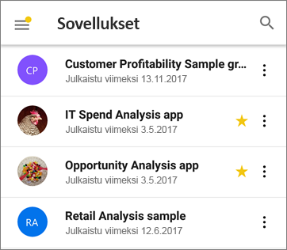
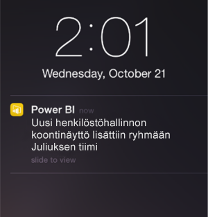

# Power BI -mobiilisovellusten uudet ominaisuudet
Lisätietoja aiheeseen liittyvistä uusista ominaisuuksista:

* [Power BI -tiimin mobiilisovelluksia käsittelevä blogi](https://powerbi.microsoft.com/blog/tag/mobile/)
* [Power BI Desktopin uudet ominaisuudet](../../desktop-latest-update.md)  
* [Power BI -palvelun uudet ominaisuudet](../../service-whats-new.md)  

## Kesäkuu 2019

### Viivakoodien lukeminen nyt mahdollista Androidilla
Voit nyt lukea Androidin (puhelin tai tabletti) Power BI -sovelluksella tuotteisiin tai hyllyihin myymälässä painettuja viivakoodeja ja saada näkyviin aiheeseen liittyviä Power BI -raportteja, jotka on suodatettu luetun arvon mukaan. Lue lisätietoja [tietojen suodattamisesta viivakoodeilla](mobile-apps-scan-barcode-iphone.md).

### PBI RS -raporttien tuki PBI-RS-isännöinnin ADFS- ja WAP-määritysten kautta (iOS & Android)

PBI RS:ssä isännöidyt ADFS-määrityksen kautta käytettävät Power BI -raportit (PBIX) toimivat nyt myös Power BI -mobiilisovelluksilla.

## Toukokuu 2019

### Siri-pikakuvatuki (iOS)
Käyttäjät voivat luoda Siri-pikakuvakkeita Power BI -raportteihin ja -koontinäyttöihin ja avata ne suoraan Sirin puheliittymän kautta. [Lue, miten voit käyttää Siri-pikakuvakkeita Power BI:n iOS-sovelluksessa](https://powerbi.microsoft.com/blog/introducing-siri-integration-with-power-bi-mobile-ios-app-preview/).

### Laitteen haku (iOS)
Power BI:n integrointi iOS-laitteiden haun (Spotlight) kanssa. Sisällön etsiminen iPhonella tai iPadilla sisältää nyt myös Power BI-kohteet. Kun käyttäjät käyttävät laitteen sisäänrakennettua hakua, tuloksissa näytetään myös hakuehtoja vastaavat Power BI -raportit, -koontinäytöt, -sovellukset, -työtilat ja henkilöt. [Katso lisätiedot seuraavasta blogikirjoituksesta](https://powerbi.microsoft.com/blog/introducing-siri-integration-with-power-bi-mobile-ios-app-preview/).

### Raportin käsittely yhdellä napautuksella ‎– GA

Käsittely yhdellä napautuksella on nyt yleisesti saatavilla, ja se on uusien käyttäjien oletusasetus. Käyttäjät voivat halutessaan poistaa sen käytöstä asetuksista ja käsitellä raportteja kaksoisnapauttamalla.

### Paranneltu ehdollinen käyttöoikeuksien suojaus (iOS, Android)

Integroimme AAD:n [uuden sovellusten suojaukseen perustuvan ehdollisen käyttöoikeusominaisuuden](https://docs.microsoft.com/azure/active-directory/conditional-access/app-protection-based-conditional-access) parantaaksemme suojausta rajoittamalla Power BI -käyttöoikeuksia, ennen kuin sovelluskäytäntö otetaan käyttöön.

### Laitteen suojaus (iOS)

Käyttäjät voivat suojata Power BI:n laitteen sisäisen suojauksen (kasvojentunnistus, kosketustunnistus tunnuskoodi) avulla. Käyttäjä voi hallita tätä ominaisuutta sovelluksen asetuksista. Myös järjestelmänvalvojat voivat hallita sitä Intunen ja muiden MDM-työkalujen avulla. [Lue lisää](https://docs.microsoft.com/power-bi/consumer/mobile/mobile-ios-native-secure-access).

### Yhden sivun raporttidiaesitys (Windows)

Automaattisen päivityksen tuki koskee myös yhden sivun raportteja diaesityksissä. Tämä tarkoittaa sitä, että jos raportin pohjana oleva tietolähde päivitetään, tieto päivitetään myös asianmukaiselle sivulle.

## Huhtikuu 2019

### Tärkeimpien vaikuttajien visualisointi 

Tärkeimpien vaikuttajien visualisointi on nyt käytettävissä mobiilisovelluksessa. Tämän visualisoinnin avulla voit analysoida tietoihin vaikuttavia tekijöitä muutamalla napautuksella.

### Kommenttien lisääminen raporttien sisällön (Android ja iOS)

Nyt voit tehdä yhteistyötä ja antaa palautetta lisäämällä kommentteja raporttisivuille ja visualisointeihin. Lue lisää raporttien kommentoinnista Power BI -palvelussa ja -mobiilisovelluksessa [tästä blogista](https://powerbi.microsoft.com/blog/announcing-report-commenting-for-power-bi-service-and-mobile/). 

### Näkymän suurentaminen koko näytön tilassa (Android ja iOS)

Olemme lisänneet uuden painikkeen, jonka avulla voit halutessasi syventyä tietoihin poistamalla raportin ylä- ja alatunnisteet, mikä tarjoaa mahdollisimman suuren tilan raporttien tarkasteluun.

## Maaliskuu 2019

### Ulkopuolisten vieraskäyttäjien tukeminen Power BI -sovelluksissa (iOS, Android)

Voit käyttää toisen organisaation kanssasi jakamaa Power BI -sisältöä suoraan sovelluksesta (B2B). Lue lisää Power BI -mobiilisovellusten B2B:stä [tästä](https://powerbi.microsoft.com/blog/power-bi-mobile-apps-now-support-azure-ad-b2b-guest-users/).

### Diaesityksen lisääminen Windows-esitystilaan (Windows)

[Diaesityksen](https://powerbi.microsoft.com/blog/enhancing-presentation-mode-with-slideshow-in-windows-power-bi-app/) ansiosta voit käyttää toimistosi julkisia näyttöjä Power BI -raporttien esittämiseksi koko näytön tilassa. Raporttisivut kiertävät automaattisesti.  

### PBI RS -raporttien tuki ADFS- ja WAP-määritysten kautta (vain iOS)

PBI RS:ssä isännöityjä, ADFS-määrityksen kautta käytettävät Power BI -raportit (PBIX) toimivat nyt Power BI:n iOS-sovelluksella.

### Yhdellä napautuksella käsittelemisen tuki raporttien visualisoinneissa

Raporttien käsittelyä muutettiin niin, että visualisoinnin, painikkeen tai sektorin tietojen käsittely onnistuu yhdellä napautuksella. Käyttäjien ei enää tarvitse valita haluamaansa osaa napauttamalla ensin ja käsitellä sitä napauttamalla uudelleen. Yksi napautus suorittaa molemmat toiminnot.

> [!NOTE]
> Aiemmin luotujen käyttäjien on otettava tämä asetus käyttöön sovelluksen asetuksista. Katso lisätiedot artikkelista [Raportin yhdellä napautuksella käsittelyn määrittäminen ](https://docs.microsoft.com/power-bi/consumer/mobile/mobile-app-single-tap).

## Tammikuu - helmikuu 2019
 
### Vision visualisoinnit

Kertakirjautumisen (SSO) käyttöönotto Visio-visualisoinneissa, joten ylimääräisiä sisäänkirjautumisen vaiheita ei vaadita, kun raporttia katsellaan sovelluksessa Visio-visualisoinnilla. 

### Koontinäytön kommentointi on tulossa Power BI Mobile Windows -sovellukseen

Voit lisätä kommentteja suoraan koontinäyttöihin ja tiettyihin ruutuihin keskustellaksesi tiedoistasi, ja kaikki koontinäyttöä tarkastelevat näkevät kommentit. 

## Joulukuu 2018

### Vaakasuuntaisia raportteja voi nyt suodattaa 

Raportin suodatusruutu on nyt käytettävissä vaakasuuntaisissa raporteissa (puhelinasettelua käyttävien raporttien lisäksi).

## Marraskuu 2018

### Moderni visuaalinen otsikko 

Uusia moderneja visuaalisia otsikoita käyttävät raportit eivät enää varaa tilaa otsikoille. Tyhjää tilaa on siksi entistä vähemmän, jolloin visualisoinneille jää enemmän tilaa.

### Parannettu esitystila (Windows)

Parannettu esitystila Surface Hubissa ja Windows 10 -laitteissa.  Surface Hubin kokoushuoneiden käyttökokemuksen esitys- ja yhteiskäyttötyökaluja on parannettu. Ulkoasuttoman, suurelle näytölle optimoidun näkymän avulla pystyt keskittymään tietoihisi. Esitystilassa voit käyttää myös erilaisia työkaluja, kuten käsinkirjoitusta, jotka tehostavat esittämistä ja herättävät keskustelua tiedoista. Lue lisää esitystilasta [täältä](https://powerbi.microsoft.com/blog/presentation-mode-in-power-bi-windows-app/).

### Taulukoiden pystysuuntainen asettelu (iOS ja Android)

Raportit näytetään nyt tabletissa pystysuuntaisina käyttämällä puhelinraporttiasettelua, kun se on käytettävissä. Lue lisää [puhelinasettelun luomisesta Power BI -palvelussa tai Power BI Desktopissa](https://docs.microsoft.com/power-bi/desktop-create-phone-report/).

### Raporttien kyselymerkkijonojen tuki 

Kyselymerkkijonon sisältävä raporttilinkki avataan nyt mobiilisovelluksessa ja esisuodatetaan kyselymerkkijonossa määritettyjen ehtojen perusteella. Lue lisää [raportin URL-osoitteen luomisesta kyselymerkkijonon avulla](https://docs.microsoft.com/power-bi/service-url-filters/).  

### Jaetut tunnistetiedot (nyt Androidissa)

Power BI:n mobiilisovellukseen kirjautuminen on helpompaa kuin aiemmin. Yksinkertaistimme kirjautumisprosessia jaettujen tunnistetietojen avulla käyttämällä laitteen muiden Office 365 -sovellusten tunnistetietoja Power BI -palvelun todentamisessa.

### Sovelluksen sisäiset URL-osoitteet (nyt Androidissa) 

Raporteissa olevat linkit, jotka viittaavat muihin Power BI:n artefakteihin, avataan nyt suoraan sovelluksessa. Tämän ansiosta voit luoda mukautettuja siirtymistyönkulkuja ja linkittää esimerkiksi raportista koontinäyttöön.

### Tietojen näyttäminen ja arvojen kopioiminen

Raportin visualisointien toimintovalikossa (...) on nyt mahdollisuus näyttää raportin pohjatiedot taulukkomuodossa. Taulukosta voit pitkään napauttamalla valita ja kopioida arvoja (olettaen, että Intune-käytännöt eivät rajoita kopiointia).

## Lokakuu 2018

### Sivutetun raportin esikatselu (kaikki laitteet)

Sivutetut raportit ovat nyt käytettävissä Power BI -palvelussa. Jos käyttäjällä on sivutettujen raporttien käyttöoikeus Power BI -palvelussa, hän voi käyttää näitä raportteja myös mobiilisovelluksessa. 

Lue Power BI [-blogikirjoitus sivutetuista raporteista mobiilisovelluksessa](https://powerbi.microsoft.com/blog/power-bi-paginated-reports-also-available-in-power-bi-mobile-apps-preview/).

### Jaetut tunnistetiedot (iOS)

Power BI:n mobiilisovellukseen kirjautuminen on helpompaa kuin aiemmin. Yksinkertaistimme kirjautumisprosessia jaettujen tunnistetietojen avulla käyttämällä laitteen muiden Office 365 -sovellusten tunnistetietoja Power BI -palvelun todentamisessa.

### Sovelluksen sisäiset URL-osoitteet (iOS) 

Raporteissa olevat linkit, jotka viittaavat muihin Power BI:n artefakteihin, avataan nyt suoraan sovelluksessa. Tämän ansiosta voit luoda mukautettuja siirtymistyönkulkuja ja linkittää esimerkiksi raportista koontinäyttöön.

### iOS12:n ja watchOS 5:n tuki 

Olemme päivittäneet iOS:n Power BI -sovelluksen, jotta se toimisi saumattomasti mobiililaitteiden ja kellon uudessa käyttöjärjestelmässä.

## Syyskuu 2018

### Puhelinraportin muokkaaminen selaimessa (kaikki laitteet)

Nyt voit luoda puhelinraporttiasettelun raportille, joka on jo julkaistu Power BI -palvelussa eikä ainoastaan Power BI Desktopissa. Voit luoda sen muokkaustilassa selaimessa.

### Koontinäytön kommentointi (iOS ja Android) 

Voit lisätä kommentteja suoraan koontinäyttöihin ja tiettyihin ruutuihin keskustellaksesi tiedoistasi, ja kaikki koontinäyttöä tarkastelevat näkevät kommentit. Voit myös tuoda muita organisaatiosi käyttäjiä keskusteluun @mentioning heidät. Jos käyttäjästä on @mentioned, hän saa palveluilmoituksen viestisi kera matkapuhelimeensa.

Tällä hetkellä saatavilla iOS- ja Android-laitteisiin. Windows-tuki tulossa pian.

Lue Power BI -[blogikirjoitus koontinäytön kommenteista](https://powerbi.microsoft.com/blog/announcing-dashboard-comments-in-power-bi/).

### Kertakirjautuminen (Windows)

Kertakirjautuminen on yksi pyydetyimmistä ominaisuuksista Power BI:n Windows-mobiilisovellukselle. Voit nyt käyttää ensisijaista organisaatiotiliäsi toimialueeseen liitettyihin Windows-mobiililaitteisiin kirjautumisen lisäksi myös kirjautumisessa sisään saumattomasti Power BI -palveluun. Lue lisää [kertakirjautumisesta ja Windows-mobiilisovelluksista](mobile-windows-10-app-single-sign-on-sso.md).

## Edelliset kuukaudet

### Heinäkuu 2018

#### Vain iOS ja Android

**Jaetut suodattimet**

Voit nyt vastaanottaa jaettuja suodattimia ja osittajia sisältäviä raportteja.

**Taustakuvien tuki**

Kun tarkastelet raporttia vaakatilassa mobiililaitteella, näet samat taustakuvat kuin Power BI:n verkkosovelluksessa.

### Kesäkuu 2018

#### Full-piirtoalustan raportit

Ylä- ja alatoimintopalkit katoavat nyt pian raportin lataamisen jälkeen, joten näet raportista enemmän kerralla.

#### Parannettu puhelinraportin piirtoalustan koko

Olemme lisänneet puhelinraportin piirtoalustan kokoa, jotta siihen mahtuu aiempaa enemmän visualisointeja.

### Tou 2018

#### Mobiili alirakenneraportti: kaikki mobiilisovellukset

Voit porautua mobiilisovelluksissa valitusta arvopisteestä raportin toiselle sivulle, jos raportin tekijä on määrittänyt tämän toiminnon. 

#### Takaisin-painike: kaikki mobiilisovellukset

Siirtyessäsi raportissa pyyhkäisyn avulla tai valitsemalla raportin sivu toimintorivistä tai porautumista käyttämällä, takaisin-painike vie sinut takaisin edelliselle tarkastelemallesi sivulle. 

#### Raporttinäkymän teemat: kaikki mobiilisovellukset

Kun raportin tekijä mukauttaa raporttinäkymän teemoja Power BI -palvelussa, myös mobiilisovelluksen raporttinäkymän ulkoasu ja tuntuma muuttuvat. Taustakuvat eivät kuitenkaan näy.

#### iOS: Raporttipalvelimen käyttöoikeuksien etämäärittäminen Power BI -iOS-mobiilisovellukselle

IT-järjestelmänvalvoja voi käyttää ydintietojen hallintatyökalua määrittääkseen raporttipalvelimelle Power BI iOS -mobiilisovelluksen käyttöoikeuden. Lisätietoja saat artikkelista [iOS: Raporttipalvelimen käyttöoikeuksien etämäärittäminen Power BI -iOS-mobiilisovelluksella](../../report-server/configure-powerbi-mobile-apps-remote.md).

#### Power BI ja tehostettu todellisuus -sovellus (esikatselu)

Power BI ja tehostettu todellisuus -sovellus nyt Microsoft Storessa. Tarkastele koontinäyttöjen ja raportteja uppoutuneena virtuaalimaailmaan tai sijoita niitä tiettyihin sijainteihin ympäristösi kontekstissa ja tarkastele niitä siellä. Katso uusi [Power BI Holelensissä -esittelyvideo](https://www.youtube.com/watch?v=J_X_nOFUBss) tai lue artikkeli uudesta [Power BI ja tehostettu todellisuus sovelluksesta](mobile-mixed-reality-app.md).

### Huhtikuu 2018

#### Porautuminen alas- ja ylöspäin mobiililaitteella

Voit porautua mobiililaiteellasi alas- ja ylöspäin raporttivisualisointeihin. Saadaksesi uuden toiminnon käyttöön, napauta ja pidä pohjassa, jolloin työkaluvihjevalikko avautuu raporttivisualisoinnissa. Napauta sitten poraus-painikkeita, tarkastellaksesi tietoja tarkemmin. Lisätietoja [Alas- ja ylöspäin porautumisesta mobiilisovelluksissa](https://powerbi.microsoft.com/blog/drill-down-up-in-power-bi-mobile-apps/).

#### Pysyvät suodattimet

Päivitimme raporttisuodattimet ja -osittajat, niin että ne tallennetaan automaattisesti Power BI:n verkkosovelluksesta Power BI:n mobiilisovellukseen. Mobiilisovelluksessa asettamasi suodattimet ja osittajat tallennetaan nyt automaattisesti Power BI:n verkkosovellukseen.

### Maaliskuu 2018

#### Power BI ja tehostettu todellisuus -sovellus (esikatselu)

Olemme luoneet Power BI ja tehostettu todellisuus -sovelluksen, jotta voimme tuoda tiedot luoksesi entistäkin tehokkaammin. Tarkastele koontinäyttöjen ja raportteja uppoutuneena virtuaalimaailmaan tai sijoita niitä tiettyihin sijainteihin ympäristösi kontekstissa ja tarkastele niitä siellä. Lue lisää uudesta [Power BI ja tehostettu todellisuus -sovelluksesta](mobile-mixed-reality-app.md).

#### Jaa raportteja ja koontinäyttöjä ulkoisesti

Jaa koontinäyttöjä ja raportteja organisaatiosi ulkopuolella olevien käyttäjien kanssa suoraan sovelluksesta. Ulkoinen jakaminen on käytössä sekä organisaatioiden että yhteisöpalveluiden tileissä. 

#### Pysyvät suodattimet

Kun asetat suodattimia ja osittajia Power BI:ssä verkossa, suodatinvalinnat tallennetaan myös mobiilisovellukseesi, jotta voit jatkaa siitä, mihin jäit.

#### Päivitä raportit iPadilla

Power BI -raporteissa on nyt päivityspainike iPad-sovelluksessa.

### Helmikuu 2018

#### Jaa raportteja

Voit nyt jakaa raportin suoraan mobiilisovelluksista. Lue lisää [koontinäyttöjen ja raporttien jakamisesta mobiilisovelluksista](mobile-share-dashboard-from-the-mobile-apps.md).

#### Parannetut työkaluvihjeet

Kun käytät työkaluvihjeitä raportin visualisoinnissa napauttamisen ja pitämisen avulla, voit nyt sormella visualisoinnissa vetämällä tarkastella matkalla tietoja jokaisesta arvopisteestä.

### Tammikuu 2018

#### Raporttisuosikit

Merkitse raportteja suosikeiksi, jolloin ne näkyvät **Suosikit**-sivulla. Lue lisää [suosikeista Power BI -mobiilisovelluksissa](mobile-apps-favorites.md).

#### Tarkastele jaettuja raportteja

Nyt kun joku jakaa raportin kanssasi, se näkyy **Jaettu kanssani** -sivulla koontinäyttöjen kanssa.

#### Parannettu hyperlinkkien tuki

Voit nyt mukautettujen visualisointien linkkejä napauttamalla avata ne mobiiliselaimessasi.

#### Intune-integrointi (Android)

Ehdollisen käyttöoikeuden tuki käytettäessä Intunen mobiililaitteiden hallintaa.

### Joulukuu 2017

#### Parannettu suojauksen hallinta 

Lisäsimme tuen ehdolliselle käyttöoikeudelle (CA) ja Microsoft Intunen mobiililaitteiden hallinnalle (MDM) Android-laitteissa, jotta organisaatiosi tietoja voidaan suojata entistä paremmin. Se on jo käytettävissä iOS-laitteissa.

#### Parannettu käyttöoikeuksien hallinta

Olemme tehneet joitakin muutoksia, joiden avulla voidaan hallita tietojoukkojen, koontinäyttöjen ja raporttien käyttöoikeuksia entistä tarkemmin.

#### Automaattisesti asennetut sovellukset

Joitakin Power BI:n sovelluksia ei tarvitse asentaa. Organisaatiosi Power BI -sovelluskehittäjät voivat luoda *sovelluksia*, jotka sisältävät kokoelman koontinäyttöjä ja raportteja. Sen jälkeen he voivat julkaista sovelluksen ja määrittää sen asentumaan automaattisesti Power BI -palvelussa ja Power BI -mobiilisovelluksissa. Kun sovellus on määritetty asennettavaksi puolestasi, se näkyy automaattisesti **Sovellukset**-valikossa:

### Marraskuu 2017
#### iPhone X -optimointi

Olemme optimoineet sovellusasettelun iPhone X:ää varten, jotta voit tarkastella tietojasi tyylikkäästi jokaisella laitteella.

### Lokakuu 2017
#### Puhelinraporttien suodattimet Android-laitteissa

Jos luot raportin Power BI Desktopin puhelimelle optimoiduilla sivuilla ja raportissa on suodattimia, voit nyt käyttää kyseisiä suodattimia puhelinraportissa Android-laitteessa. Lue lisää Power BI -raporttien suodattimista Android-laitteessa.

#### Näytä tiedot raporteissa

Nyt voit vaihtaa visualisoinnit raporteissasi taulukkonäkymään, jotta näet luvut tietojen takana. Voit käyttää tätä toimintoa napauttamalla Näytä tiedot visualisoinnin ...-valikossa raportissasi tai uutta kuvaketta laajennetussa visualisoinnin toimintovalikossa.

### Syyskuu 2017
#### Puhelinraporttien suodattimet iPhone-laitteissa
Jos luot raportin Power BI Desktopin puhelimelle optimoiduilla sivuilla ja raportissa on suodattimia, voit nyt käyttää kyseisiä suodattimia puhelinraportissa iPhone-laitteessa. Lue lisää [Power BI -raporttien suodattimista iPhone-laitteessa](https://powerbi.microsoft.com/blog/filters-coming-for-phone-reports-on-ios/).

### Elokuu 2017
#### iOS-välityspalvelimen asetusten tuki
Voit nyt määrittää välityspalvelimen asetukset Power BI:n iOS-mobiilisovelluksessa. Tämä tarkoittaa sitä, että Power BI toimii nyt VPN-yhteyksillä mobiililaitteessasi, joten entistä useammat käyttäjät ja organisaatiot voivat hyödyntää Power BI:n tehoa turvallisesti liikkeellä oltaessa.

### Heinäkuu 2017
Lue [mobiilisovellusten ominaisuusyhteenveto heinäkuulta 2017](https://powerbi.microsoft.com/blog/power-bi-service-and-mobile-july-feature-summary/#ios-preview).

#### iOS-laitteet
**Uusi Q&A-käyttökokemus iOS:lle (esikatselu)** Sen sijaan, että saisit vain vastauksen kysymykseesi, voit nyt käyttää luonnollista kieltä ja saada suodatettuja merkityksellisiä tietoja. Vaikka et tietäisi tarkasti, mitä etsit, Q&A tuo esiin ennakoivasti tietoihisi liittyvät merkitykselliset tiedot. Uusi Q&A-käyttökokemus mobiililaitteissa, joka on kehitetty yhteistyössä Microsoft Research -tiimin kanssa, esittelee tuotteemme tehokkaat teknologiat. Kokeile opetusohjelmaa: [Kysymysten kysyminen tiedoista iOS-mobiilisovelluksissa](mobile-apps-ios-qna.md).

### Reagoivat visualisoinnit
**Reagoiva visualisointi puhelinraporteille ja koontinäytöille** Voit määrittää koontinäytön tai raportin visualisoinnin *reagoivaksi*, jos haluat, että dataa ja merkityksellisiä tietoja näytetään dynaamisesti suurin mahdollinen määrä, oli näyttö minkäkokoinen tahansa. Lue [blogista lisätietoja reagoivista visualisoinneista](https://powerbi.microsoft.com/blog/power-bi-desktop-july-feature-summary-2/#responsiveVisuals).

### Kesäkuu 2107
#### Kaikki laitteet
**Sovellusten lisääminen suosikkeihin** Koontinäytön voi jo lisätä suosikkeihin. Hiljattain [Power BI:hin lisättiin sovelluksia](../../service-create-distribute-apps.md) ja nyt myös sovelluksia voi lisätä suosikkeihin. 

### Toukokuu 2017
#### Kaikki laitteet
**Uusi valikko: Jaettu kanssani** Siirry Jaettu kanssani -valikkoon mobiilisovelluksessa, kun haluat nähdä kaiken sisällön, joka on jaettu kanssasi.

**Uusi valikko: Sovellukset** Sovellus on kokoelma organisaatiollesi luotuja raporttinäkymiä ja raportteja, jotta tärkeimmät arvot voidaan esittää nopeammin ja helpommin tietoihin perustuvia päätöksiä varten.

Lue lisää [Power BI -sisällön organisoinnista](mobile-apps-quickstart-view-dashboard-report.md).

#### iOS- ja Android-laitteet
**Power BI -raporttipalvelimen esikatselu** Luo ja julkaise Power BI -raportteja paikallisesti. Sen jälkeen voit [tarkastella ja käsitellä niitä iOS- tai Android](mobile-app-ssrs-kpis-mobile-on-premises-reports.md)-mobiililaitteella. 

### Huhtikuu 2017
Lue [mobiilisovellusten ominaisuusyhteenveto huhtikuulta 2017](https://powerbi.microsoft.com/blog/power-bi-mobile-apps-feature-summary-march-april-2017/).

#### Kaikki laitteet
**Puhelinraporttien taustaväri** Kun määrität raportin taustavärin Power BI Desktopissa, puhelinraportissa käytetään samaa taustaväriä. Lue lisätietoja [raporttisivujen optimoinnista puhelimille](../../desktop-create-phone-report.md).

**Kehitä mobiililaitteille sopivia mukautettuja visualisointeja** Lue tästä [kehittäjän oppaasta](https://github.com/Microsoft/PowerBI-visuals/blob/master/Tutorial/MobileGuideline.md) vinkkejä, joiden avulla voit luoda mukautettuja visualisointeja, jotka näyttävät hyvältä ja toimivat hyvin mobiililaitteissa.

#### iOS-laitteet
**Puhu tiedoillesi: esitä kysymyksiä puhumalla** Voit nyt [esittää kysymyksiä tiedoistasi Q&A:lla](mobile-apps-ios-qna.md) puhumalla kirjoittamisen sijaan. 

### Maaliskuu 2017
Lue [mobiilisovellusten ominaisuusyhteenveto maaliskuulta 2017](https://powerbi.microsoft.com/blog/power-bi-mobile-apps-feature-summary-march-2017/).

#### Kaikki laitteet
**Osittajan käsittely**

Olemme kehittäneet aikaosittajien kosketuskäsittelyä entistä paremmaksi.

#### iOS-laitteet
**Esitä kysymyksiä tiedoistasi Q&A:lla – anna palautetta** Kokeile esittää kysymyksiä tiedoistasi Q&A:lla ja kerro meille hymynaamalla tai irvistyksellä, miten hyvin ominaisuus toimi.

**Käytä 3D Touchia yleisiin toimintoihin** Paina pitkään Power BI -sovelluksen kuvaketta iPhone 6s:n tai sitä uudemman version aloitusnäytössä, jotta pääset käyttämään ilmoituksia, hakua ja viimeksi käytettyjä koontinäyttöjä.

**Oikealta vasemmalle kirjoitettavien kielten tuki** Power BI:n mobiilisovellukset tukevat nyt oikealta vasemmalle kirjoitettavia kieliä. Tässä yhteydessä oikealta vasemmalle kirjoitettavilla kielillä tarkoitetaan heprean ja arabian kirjoitusjärjestelmiä, joissa teksti kirjoitetaan oikealta vasemmalle ja jotka edellyttävät kontekstisidonnaista muotoilua. Katso luettelo [Power BI -mobiilisovelluksissa tuetuista kielistä](mobile-apps-supported-languages.md).

#### Android-laitteet
**Yhteyden muodostaminen useaan SSRS-palvelimeen** 

Aktiivisia yhteyksiä voi olla nyt enintään viiteen eri SQL Server Reporting Services -palvelimeen samanaikaisesti.

**Pyydä käyttöoikeutta koontinäyttöihin** 

Jos skannaat QR-koodin koontinäytöstä, jonka käyttöoikeutta sinulla ei ole, voit nyt lähettää käyttöoikeuspyynnön suoraan mobiilisovelluksesta.

### Helmikuu 2017
#### Kaikki laitteet
**Vierittämisen helpottaminen** 

Nyt voit vierittää raportin palkki- ja pylväskaavioita koskettamalla itse kaaviota sen sijaan, että koskettaisit reunassa olevaa vierityspalkkia.

#### iOS-laitteet
**Kysymysten esittäminen tiedoista Q&A:n esikatselulla** 

Q&A:n avulla voit esittää kysymyksiä tiedoistasi omin sanoin ja Power BI antaa vastaukset. Q&A on jo Power BI -palvelussa osoitteessa http://powerbi.com. Nyt se on myös [käytettävissä iPhone- tai iPad-mobiilisovelluksessa](mobile-apps-ios-qna.md).

**Yhteyden muodostaminen useaan SSRS-palvelimeen** 

Aktiivisia yhteyksiä voi olla nyt enintään viiteen eri SQL Server Reporting Services -palvelimeen samanaikaisesti.

#### Android-tabletit
**Power BI-mobiilisovellus** Android-tableteille on nyt käytettävissä maailmanlaajuisesti. Aloita [Power BI:n käyttäminen Android-tabletissa](mobile-android-app-get-started.md).

#### iOS- ja Android-laitteet
**Uusi valikko koontinäytön ruuduille** Siirry taustalla olevaan raporttiin, laajenna ruutu tai hallitse ilmoitusta koontinäytön ruudussa olevan valikon kautta. 

Kyseinen valikko on uusi iOS- ja Android-puhelimissa vaakatilassa sekä Android-tableteissa. Se on lisätty jo aiemmin Windows- ja Android-puhelimiin pystytilassa.

### Tammikuu 2017
Lue [tammikuun 2017 mobiilisovellusten blogin ominaisuusyhteenveto](https://powerbi.microsoft.com/blog/power-bi-mobile-apps-feature-summary-january-2017).

#### Kaikki laitteet
**Lataa yli 100 riviä taulukoissa ja matriiseissa** Jos sinulla on nyt suuri taulukko tai matriisi koontinäytössä tai raportissa, näytämme ruudussa mahdollisimman paljon tietoa. Tarkastelutilassa voit vierittää alaspäin ja ladata lisää rivejä.

**Puhelinraportti – yleinen käytettävyys** Power BI:n puhelinraportit ovat nyt yleisesti saatavilla. Power BI Desktopissa voi luoda olemassa olevasta raportista pystynäkymän mobiilikatseluohjelmia varten. Lue lisätietoja [puhelinraporttien luomisesta Power BI Desktopissa](../../desktop-create-phone-report.md) ja [raportin käyttökokemuksesta puhelimissa](mobile-apps-view-phone-report.md).

#### iOS
**SSRS-todennus Active Directory -liittoutumispalveluiden (ADFS) avulla – esikatselu** Voit nyt kirjautua sisään paikallisiin SQL Server Reporting Services -palvelimiin mobiililaitteella käyttäen organisaation tiliä. Lue lisää [OAuthin käyttämisestä yhteyden muodostamisessa SSRS-palvelimiin](mobile-oauth-ssrs.md).

#### Android
**SSRS-todennus Active Directory -liittoutumispalveluiden (ADFS) avulla – esikatselu** Voit nyt kirjautua sisään paikallisiin SQL Server Reporting Services -palvelimiin mobiililaitteella käyttäen organisaation tiliä. Lue lisää [OAuthin käyttämisestä yhteyden muodostamisessa SSRS-palvelimiin](mobile-oauth-ssrs.md).

**Uudet ja parannetut ominaisuudet: Lisää merkintöjä ja jaa merkityksellistä tietoa nopeasti** Jakamisen ja merkintöjen lisäämisen kaikki ominaisuudet toimivat nyt Android-laitteissa. Parannetun valikon avulla on helpompi ja nopeampi lisätä merkintöjä ja jakaa merkityksellistä tietoa. Voit myös jakaa merkintöjä sisältävän raportin tai tiedot suoraan Power BI -sovelluksesta.

### Joulukuu 2016
Lue [joulukuun 2016 mobiilisovellusten blogin ominaisuusyhteenveto](https://powerbi.microsoft.com/blog/power-bi-mobile-apps-feature-summary-december-2016).

#### Kaikki laitteet
**Offline-taustapäivitys**

Jotta käytössäsi olisivat varmasti uusimmat tiedot offline-tilassa, teemme päivityksen sovelluksen taustalla, joten liiketoimintatietosi ovat ajan tasalla, vaikka et olisikaan käyttänyt niitä hetkeen. Jos haluat varmistaa, että tietyt koontinäytöt ovat aina ajan tasalla, lisää ne suosikkeihin. Lue lisätietoja [offline-ominaisuuksista Power BI -mobiilisovelluksissa](mobile-apps-offline-data.md).

#### iOS-laitteet
**Lisää merkintöjä ja jaa**

Voit nyt jakaa ruudun, raportin tai visualisoinnin ja lisätä niihin merkintöjä Power BI -mobiilisovelluksessa iOS-laitteissa. 

* [iPhone](mobile-annotate-and-share-a-tile-from-the-mobile-apps.md)
* [iPad](mobile-annotate-and-share-a-tile-from-the-mobile-apps.md)

**Pyydä käyttöoikeutta koontinäyttöihin**

Jos skannaat QR-koodin koontinäytöstä, jonka käyttöoikeutta sinulla ei ole, voit nyt lähettää käyttöoikeuspyynnön suoraan mobiilisovelluksesta.

**Mukautettu URL-osoite kuvaruudussa**

Jos kuvaruudulla on koontinäytön omistajan määrittämä mukautettu URL-osoite, siirryt nyt ruutua napauttaessasi suoraan kyseiseen URL-osoitteeseen avaamatta ruutua tarkastelutilassa. 

#### iPhone
**Apple Watch -parannukset**

Voit nyt päivittää Apple Watch -tiedot suoraan Watch-sovelluksesta. Päivitä tiedot painamalla koontinäytön indeksisivua pitkään. (Power BI -mobiilisovelluksen on oltava käynnissä taustalla iPhonessa, jotta tämä toimii.)

#### Android
**Mukautettu URL-osoite kuvaruudussa**

Jos kuvaruudulla on koontinäytön omistajan määrittämä mukautettu URL-osoite, siirryt nyt ruutua napauttaessasi suoraan kyseiseen URL-osoitteeseen avaamatta ruutua tarkastelutilassa. Lisäksi valmiiksi määritettyjä mukautettuja URL-osoitteita sisältävät koontinäytön ruudut voivat ohjata lukijat sovelluksessa suoraan raportteihin.

### Marraskuu 2016
Lue [marraskuun 2016 Power BI -mobiilisovellusten ominaisuusyhteenveto](https://powerbi.microsoft.com/blog/power-bi-mobile-apps-feature-summary-november-2016/).

#### Android-tabletit
**Power BI -mobiilisovellus Android-tableteille** Kyllä, esikatselu on täällä.

* Käytä [Power BI:tä Android-tabletissa](mobile-android-app-get-started.md).
* Tutustu [Reporting Servicesin mobiiliraportteihin ja suorituskykyilmaisimiin Android-tabletissa](mobile-app-ssrs-kpis-mobile-on-premises-reports.md).

#### Android-laitteet
**Esikatselu: Intunen mobiilisovellusten hallinta** Power BI:n Microsoft Intune Mobile Application Manager (MAM) -tuki on nyt esikatseltavissa Power BI Pron käyttäjille Android-laitteissa. 

**Suosikit** Merkitse suosikkikoontinäyttösi tunnisteella Android-laitteessa ja näet kaikki omat [suosikkeihin lisäämäsi Power BI -koontinäyttösi sekä Reporting Services -mobiiliraporttisi ja suorituskykyilmaisimet](mobile-android-app-get-started.md#view-your-favorite-dashboards-kpis-and-reports) yhdessä paikassa. 

#### iOS-laitteet
**Linkit** Ruutujen ja visualisointien URL-osoitteet ovat nyt napsautettavia ja ne avautuvat selaimessa.

#### Windows-laitteet
**Keskitä kartta** ja tarkastele lähelläsi olevia tietoja sijainnissasi

### Syyskuu/lokakuu 2016
Lue [lokakuun 2016 Power BI -mobiilisovellusten ominaisuusyhteenveto](https://powerbi.microsoft.com/blog/power-bi-mobile-apps-feature-summary-october-2016/).

#### Kaikki laitteet
**Suosikit aloitussivuna** Jos olet lisännyt koontinäyttöjä suosikeiksi, aloitussivusi on Suosikit-merkintä. 

**Parannettu siirtyminen** Pääsiirtymisellä on uusi ulkoasu ja ryhmien siirtyminen on siirretty ryhmäluetteloon. 

**Raporttien ja koontinäyttöjen suorituskyvyn parannuksia** Parannettu raporttien ja koontinäyttöjen lataamisen käyttökokemusta Power BI -mobiilisovelluksissa

**Parannetut hälytysten ilmoitukset** Tietopohjaisten hälytystesi ilmoitukset sisältävät nyt lisätietoja siitä, mikä hälytyksen laukaisi ja miksi se laukaistiin.

#### iOS iPhone-puhelimissa
**Apple Watch -päivityksen parannukset** Apple Watch -mobiilisovellusta on parannettu Watch OS3:a varten.

#### Android-puhelimet
**Lisätty manuaalinen ruudun päivitys** Voit nyt päivittää koontinäyttöruutusi manuaalisesti. DirectQueryyn perustuvien ruutujen kohdalla tämä noutaa uusimmat tiedot tietojoukosta.

#### Windows 10 -puhelimet
**Maantieteellinen suodatus** Voit nyt suodattaa Windows 10 -puhelimellasi raporttisi nykyisen sijaintisi perusteella ja nähdä vain tarvitsemasi tiedot.

**SandDance-visualisointi** Tämä mukautettu visualisointi on nyt käytettävissä Surface Hubissa.

### Elokuu 2016
#### Kaikki puhelimet
**Suosikit** Tarkastele suosikkikoontinäyttöjäsi kaikissa Power BI -mobiilisovelluksissa ja hallitse Suosikit-luetteloa iOS- ja Windows 10 -laitteiden Power BI -mobiilisovelluksissa. Lue lisää [suosikeista Power BI -mobiilisovelluksissa](mobile-apps-favorites.md).

**Koontinäytön tietojen luokitus** Katso tietojen luokittelu, jonka koontinäyttöjen omistajat ovat määrittäneet koontinäytöilleen. Lue lisää [koontinäyttöjen luokittelusta](../../service-data-classification.md).

**Tietopohjaiset hälytykset** Saat ilmoituksen, kun tiedot muuttuvat ennalta määritetyillä tavoilla suorituskykyilmaisin-, mittari- ja korttiruuduissa. Lue lisätietoja:

* [Ilmoitukset Android-puhelinten Power BI -sovelluksessa](mobile-set-data-alerts-in-the-mobile-apps.md) 
* [Ilmoitukset iOS:n Power BI -sovelluksissa](mobile-set-data-alerts-in-the-mobile-apps.md) 
* [Ilmoitukset Windows 10 -laitteiden Power BI -sovelluksessa](mobile-set-data-alerts-in-the-mobile-apps.md)

#### iOS iPhone-puhelimissa ja iPad-tableteissa
**Koko näytön kokoiset ruudut tarkastelutilassa iPadissa** Kun napautat ruutua iPadissasi, ruutu avautuu nyt koko näytön kokoisena tarkastelutilassa hyödyntäen iPadin koko näytön kokoa.

**Päivitä ruudut manuaalisesti** Päivitä ruudut manuaalisesti avaamalla koontinäyttö Power BI:n iOS-mobiilisovelluksessa ja vetämällä alaspäin näytön yläreunasta. 

**Intune MAM -tuki** Lisätty tuki Microsoft Intunen mobiilisovellusten hallinnan (MAM) ominaisuuksille.

Lue lisää [Microsoft Intunesta Power BI -mobiilisovelluksissa](../../service-admin-mobile-intune.md).

#### Windows 10 -laitteet
**Koko näytön tila ja esitystila** Voit esittää raportteja Surface Hubin esitystilassa ja raporttinäkymiä, raportteja ja ruutuja Windows 10 -laitteiden koko näytön tilassa.

### Heinäkuu 2016
#### Kaikki puhelimet
Voit nyt [luoda koontinäytöstä pystysuuntaisen näkymän puhelimille](../../service-create-dashboard-mobile-phone-view.md) Power BI -palvelussa. 

#### Android-puhelimet
**Suosikit-välilehti** Käytä kaikkia suosikkikoontinäyttöjäsi yksittäisestä sijainnista.

**Parannettu suojauksen hallinta** Valitse riskiluokitus tietyssä koontinäytössä esitettäville liiketoimintatiedoille.

**Parannetut varoitukset ja mainospalkit** Olemme kehittäneet mobiilisovelluksen varoituksia ja mainospalkkeja.

**Raporttisivujen QR-koodit** Palvelussa luotu QR-koodi linkittyy tiettyyn sivuun koko raportin sijasta.

**Parannetut ilmoitukset** Tietopohjaiset hälytykset muotoillaan nyt laitteen aluekohtaisten asetusten mukaan.

#### iOS iPhone-puhelimissa ja iPad-tableteissa
**Parannettu suojauksen hallinta** Valitse riskiluokitus tietyssä koontinäytössä esitettäville liiketoimintatiedoille.

**Merkityksellinen tieto mobiililaitteissa** Tarkastele yhteenvetotietoja (maksimi, minimi ja kaikki) klusteroidun pylväskaavion ruuduissa.

**Parannettu manuaalinen päivitys** Voit nyt päivittää koontinäyttöruutusi manuaalisesti. DirectQueryyn perustuvien ruutujen kohdalla tämä noutaa uusimmat tiedot tietomallista.

**Parannetut varoitukset ja mainospalkit** Olemme kehittäneet mobiilisovelluksen varoituksia ja mainospalkkeja.

**Raporttisivujen QR-koodit** Palvelussa luotu QR-koodi linkittyy tiettyyn sivuun koko raportin sijasta.

**Yleiset parannukset** Ruutujen virhesanomia on parannettu mobiilisovelluksessa.

#### Windows 10 -laitteet
**Parannettu suojauksen hallinta** Valitse riskiluokitus tietyssä koontinäytössä esitettäville liiketoimintatiedoille.

**Parannetut varoitukset ja mainospalkit** Olemme kehittäneet mobiilisovelluksen varoituksia ja mainospalkkeja.

### Kesäkuu 2016
Katso lisätietoja [kesäkuun Power BI -mobiilisovellusten blogimerkinnästä](https://powerbi.microsoft.com/blog/power-bi-mobile-apps-update-june-2016/).

#### QR-koodit näkyvät nyt lisätyssä todellisuudessa (iOS)
Kun nyt skannaat Power BI -palvelussa luodun QR-koodin, ruutu hahmontuu lisätyssä todellisuudessa. 

Lue lisätietoja [yhdistämisestä reaalimaailman tietoihin](mobile-apps-data-in-real-world-context.md).

#### Suodata tietoja viivakoodeilla (iPhone)
Voit nyt skannata tuotteisiin tai hyllyihin myymälässä painettuja viivakoodeja ja saada näkyviin aiheeseen liittyviä Power BI -raportteja, jotka on suodatettu skannatun arvon mukaan. 

Lue lisätietoja [tietojen suodattamisesta viivakoodeilla](mobile-apps-scan-barcode-iphone.md).

#### SQL Server 2016 Reporting Services -mobiiliraportit
Nyt voit porautua SQL Server Reporting Servicesin suorituskykyilmaisimesta tai mobiiliraportista toiseen mobiiliraporttiin tai mihin tahansa mukautettuun URL-osoitteeseen.

#### Ilmoituskeskus
Power BI -mobiilisovelluksen ilmoituskeskus näyttää uudet tiedot tai koontinäytöt, jotka on jaettu kanssasi, tai muutokset ryhmissä, joihin kuulut.

### Toukokuu 2016
#### iOS-laitteet ja Android-puhelimet
* **QR-koodit** ovat nyt käytettävissä myös **raporteille**. Lue koodi Power BI -sovelluksellasi, jotta pääset suoraan siihen liittyvään raporttiin ilman siirtymis- tai hakutoimintojen käyttämistä.
* **Parannettu tietojen hallinta** SQL Server 2016 Reporting Servicesissä: lyhyemmät latausajat ja vähemmän tiedonsiirtoa laitteessasi.
* **SQL Server 2016 -teemaiset mobiiliraportit**: katso mobiiliraporttien teemat laitteessasi.
* **Maantieteellinen suodatus**: suodata raportit nykyisen sijaintisi mukaan.

### Huhtikuu 2016
Katso lisätietoja [huhtikuun Power BI -mobiilisovellusten blogista](https://powerbi.microsoft.com/blog/power-bi-mobile-apps-update-april-2016/).

#### Kaikki sovellukset
* Valitse useita vaihtoehtoja raportin osittajassa.

#### Android-mobiilisovellus
* **SQL Server 2016 [Reporting Services -mobiiliraportit](mobile-app-ssrs-kpis-mobile-on-premises-reports.md)** nyt Android-puhelimissa.
* **Raporttivalikoima** Avaa raporttisi suoraan raporttivalikoimasta.
* **NTLM-todennuksen** tuki mobiiliraporteille SQL Server 2016 Reporting Servicesissä.

#### Power BI -sovellus Windows 10 -laitteille
* **Esitystila** Näytä Power BI -koontinäytöt ja raportit Power BI -sovelluksen esitystilassa.
* **SQL Server 2016 [Reporting Services -mobiiliraportit](mobile-app-windows-10-ssrs-kpis-mobile-reports.md)** nyt Windows 10 -laitteissa.
* Näet **tietojen työkaluvihjeet**, kun viet hiiren osoittimen koontinäytön ruudun päälle.

### Maaliskuu 2016
Lue [Power BI -mobiilisovellusten blogi maaliskuulle 2016](https://powerbi.microsoft.com/blog/power-bi-mobile-apps-update-march-2016/).

#### iPhone-mobiilisovellus
**Apple Watch** Tarkastele Power BI -ruutuja ja suorituskykyilmaisimia [Apple Watchissa](mobile-apple-watch.md).

**iOS 9.0 tai uudempi** Käyttökokemuksen parantamiseksi ja Power BI:n uusien ominaisuuksien takia tuemme nyt vain laitteita, joiden käyttöjärjestelmä on iOS 9.0 tai uudempi.

**Yleinen haku** Uusi viimeksi katsottujen luettelo ja yleinen haku on lisätty, jotta tarvittavat tiedot löytyvät nopeasti.

**Raporttivalikoima** Avaa raporttisi suoraan raporttivalikoimasta.

**Uusimmat tiedot offline-tilassa** Uusi taustapäivitys päivittää välimuistiin kopioidut tietosi automaattisesti, kun olet online-tilassa, joten sinulla on uusimmat tiedot [myös ollessasi offline-tilassa](mobile-apps-offline-data.md). 

**Bing- ja R-ruudut** Avaa Bing- ja R-ruudut tarkastelutilassa.

#### Android-mobiilisovellus
**SQL Server 2016 -mobiiliraportit ja -suorituskykyilmaisimet** [Tarkastele SQL Server 2016 -mobiiliraportteja ja -suorituskykyilmaisimia](mobile-app-ssrs-kpis-mobile-on-premises-reports.md) ja siirry SSRS-kansiosta toiseen.

**Tarkastele raportteja** Avaa raportteja koontinäyttöjen ruuduista.

**Uusimmat tiedot offline-tilassa** Uusi taustapäivitys päivittää välimuistiin kopioidut tietosi automaattisesti, kun olet online-tilassa, joten sinulla on uusimmat tiedot [myös ollessasi offline-tilassa](mobile-apps-offline-data.md). 

#### Power BI -sovellus Windows 10 -laitteille
**Nopea käyttö** Käytä koontinäyttöjä, raportteja ja ryhmiä nopeasti uuden viimeksi katsottujen luettelon ja yleisen haun avulla, jotta löydät tarvitsemasi tiedot.

**Bing- ja R-ruudut** Avaa Bing- ja R-ruudut tarkastelutilassa.

**Enemmän reaaliaikaisia ruutuja aloitusnäytössä** [Kiinnitä suorituskykyilmaisimia ja rivikortteja aloitusnäyttösi tapahtumaruutuun](mobile-pin-dashboard-start-screen-windows-10-phone-app.md) reaaliaikaisina ruutuina, jotta näet kaikki tärkeät mittarisi yhdellä silmäyksellä.

**Zoomaa nipistämällä** Tarkastele koontinäyttöjä entistä yksityiskohtaisemmin käyttämällä tabletissasi zoomaamista nipistämällä.

**Ilmoitukset** Saat ilmoituksen, kun tietojoukkoihin, raportteihin ja koontinäyttöihin päivitetään uusia tietoja.

**Raporttivalikoima** Avaa raporttisi suoraan raporttivalikoimasta.

### Helmikuu 2016
#### Android
Tarkastele koontinäyttöjä [vaakasuunnassa Android-puhelimissa](mobile-apps-view-dashboard.md#view-dashboards-on-your-android-phone). 

#### Power BI -sovellus Windows 10 -laitteille
Tarkastele koontinäyttöjä [vaakasuunnassa Windows 10 -puhelimissa](mobile-apps-view-dashboard.md#view-dashboards-on-your-windows-10-device).

Tarkastele [raportteja Windows 10 -puhelimessa](mobile-reports-in-the-mobile-apps.md).

Nopeammin [merkitykselliset tiedot Windows 10 -mobiilikoontinäytöissä](mobile-tiles-in-the-mobile-apps.md): Jaa ruudun tilannevedos tai avaa raportti suoraan raporttinäkymästä.

### Tammikuu 2016
Kaikki tammikuun parannukset ovat jo uudessa [Windows 10 -puhelinten Power BI -sovelluksessa](mobile-windows-10-phone-app-get-started.md), joka julkaistiin joulukuussa 2015. Nyt ne tuodaan Power BI -sovelluksiin muissa mobiililaitteissa. Lue blogimerkintä näistä parannuksista.

**Reaaliaikaisten tietojen tuki** Koontinäytöt päivittyvät reaaliaikaisesti, joten niitä ei tarvitse päivittää manuaalisesti.

**Offline-ilmaisimet** Kun signaalia ei ole, näet offline-ilmaisimen koontinäytön yläreunassa.

**Välimuistiin tallennettujen tietojen käyttö** Välimuistiin tallennetut tiedot eivät enää vanhene, joten voit käyttää välimuistiin tallennettuja tietoja loputtomasti offline-tilassa.

**R-ruudut ja web-pienoissovellukset** Voit tarkastella näitä uusia koontinäyttöjen ruututyyppejä mobiililaitteessasi.

**Bing-koontinäytöt** Voit nyt luoda Power BI -palvelussa [koontinäyttöjä Bing-hakutuloksista](../../service-connect-to-services.md) ja tarkastella niitä mobiililaitteessasi.

**Raporttisivut kiinnitettyinä ruuduiksi koontinäytöissä** Voit nyt kiinnittää koko raportin koontinäyttöön Power BI -palvelussa ja käyttää raporttisivuja iPhone- tai Android-puhelimesi Power BI -sovelluksessa.

### Joulukuu 2015
Power BI -tiimi päätti vuoden 2015 vahvasti tuoden useita merkittäviä lisäyksiä ja päivityksiä.

#### SQL Server 2016 Reporting Services -mobiiliraportit iOS:ssä
Voit nyt tarkastella SQL Server -mobiiliraportteja iOS-laitteesi (iPhone tai iPad) Power BI -sovelluksessa. Lue lisää:

* blogimerkintä [SQL 16 SSRS iOS:n Power BI -sovelluksessa](http://blogs.msdn.com/b/powerbi/archive/2015/12/30/sql-16-ssrs-on-power-bi-app-for-ios.aspx)
* Katso [SQL Server -mobiiliraporttien ja -suorituskykyilmaisimien iPhone- ja iPad-sovellusten](mobile-app-ssrs-kpis-mobile-on-premises-reports.md) dokumentaatio

#### Power BI -sovellus Windows 10 -puhelimille
Windows 10 -puhelinten uusi Power BI -sovellus on optimoitu kosketusnäyttöjä ja mobiilituottavuutta varten. Tutustu koontinäyttöihin ja raportteihin, kutsu työtovereita tarkastelemaan tietoja ja jaa merkityksellistä tietoa sähköpostitse tiimin sitouttamiseksi. Voit lisäksi [kiinnittää Power BI -koontinäyttöjä Windows-puhelimesi aloitusnäyttöön](mobile-pin-dashboard-start-screen-windows-10-phone-app.md).

* Lue [Windows 10 -puhelinten Power BI -sovellusta käsittelevä blogimerkintä](http://blogs.msdn.com/b/powerbi/archive/2015/12/30/announcing-the-power-bi-app-for-windows-10-mobile.aspx).
* [Aloita Windows 10 -puhelinten Power BI -sovelluksen käyttö](mobile-windows-10-phone-app-get-started.md).

#### Muut lisäykset
Lue lisätietoja [joulukuun Power BI -mobiilisovellusten blogimerkinnästä](http://blogs.msdn.com/b/powerbi/archive/2015/12/30/power-bi-mobile-apps-update-_2d00_-december-2015.aspx).

* Vastaanota ilmoituksia, kun työtoverisi jakaa koontinäytön kanssasi. (iOS)
* Tarkastele kiinnitettyjä raporttisivuja kokonaisuudessaan raporttinäkymissä. (iOS ja Android)
* [Skannaa QR-koodi](http://blogs.msdn.com/b/powerbi/archive/2015/12/08/bridge-the-gap-between-your-physical-world-and-your-bi-using-qr-codes.aspx) ja siirry suoraan asianmukaiseen ruutuun Android-puhelimessa.

### Marraskuu 2015
Lue [marraskuun 2015 Power BI -mobiilisovellusten blogimerkintä](http://blogs.msdn.com/b/powerbi/archive/2015/11/24/power-bi-mobile-apps-update-_2d00_-november-2015.aspx).

#### Kaikki Power BI -mobiilisovellukset
* Uusi tervetulokokemus.
* Parannettu kaavion tietojen kapasiteetti.

#### iOS- ja Android-mobiilisovellukset
* Yritykset voivat nyt [määrittää Power BI -mobiilisovellukset iOS:lle ja Androidille Microsoft Intunella](../../service-admin-mobile-intune.md) laitteiden ja sovellusten hallintaa varten.

#### iPhone-mobiilisovellus
* [Lisää kuvaruutu koontinäyttöön](mobile-iphone-app-get-started.md) suoraan iPhonesta.
* [Luo QR-koodeja Power BI -palvelussa](../../service-create-qr-code-for-tile.md) ja skannaa ne iPhonella, jotta Power BI -sovellus avautuu tiettyyn ruutuun.

#### Windows-laitteiden Power BI -sovellus
* [Linkitä ruudusta suoraan tiettyyn URL-osoitteeseen](../../service-dashboard-edit-tile.md#hyperlink).

### Lokakuu 2015
Lue [lokakuun puolivälin Power BI -mobiilisovellusten blogimerkintä](http://blogs.msdn.com/b/powerbi/archive/2015/10/21/power-bi-mobile-mid-october-updates-are-here.aspx).

#### Kaikki Power BI -mobiilisovellukset
* Viivakaavioista, joissa on prosenttipohjainen y-akseli, lasketaan nyt visuaalinen alue todellisten tietojen perusteella. Kaavio alkaa nyt kaavion alimmasta arvopisteestä oletusarvon sijaan.
* Viiva-, sarake- ja palkkikaavioissa on nyt arvopisteiden otsikot. 
  
    

#### iPhone
* Pysy ajan tasalla ryhmien uusimmilla koontinäytöillä – saat ilmoituksia iPhoneesi aina, kun tiimin jäsen lisää koontinäytön johonkin ryhmääsi.
  
    
* Voit nyt tarkastella koontinäyttöjä vaakasuunnassa kääntämällä puhelimen vaaka-asentoon. Lue lisää [vaakatilasta iPhone-sovelluksessa](http://blogs.msdn.com/b/powerbi/archive/2015/11/02/enjoy-the-landscape-with-the-power-bi-iphone-app.aspx).
  
    

### Syyskuu 2015
Parannuksia Power BI -mobiilisovelluksiin: Android, iOS (iPhone ja iPad) ja Windows. Lue [syyskuun puolivälin Power BI -mobiilisovellusten blogimerkintä](http://blogs.msdn.com/b/powerbi/archive/2015/09/23/power-bi-mobile-mid-september-updates-are-here.aspx).

#### Android-
* Ryhmätyötiloja tuki: tee yhteistyötä työtovereiden kanssa ryhmätyötiloissa. 
* Todentamattomien käyttäjien tuki:  tilanteisiin, joissa käyttäjät eivät jostain syystä pysty kirjautumaan sisään sovellukseen, on lisätty nopea ja kätevä tapa ottaa yhteyttä tukeen ja lähettää palautetta.
* Parannettu käyttökokemus käytettäessä roolipohjaista suojausta käyttäviä koontinäyttöjä.          
* Parannettu tietojen muotoilu kaavioissa ja kaikkien koontinäytön ruutujen tasaus. 

#### iOS (iPhone ja iPad)
* Uusi ja parannettu siirtyminen: uusi avattavaan laatikkoon perustuva siirtyminen hyödyntää näyttöalan mahdollisimman tehokkaasti ja parantaa siirtymistä sovelluksessa. 
* Ryhmätyötilat: tee yhteistyötä työtovereiden kanssa ryhmätyötiloissa. 
* Todennusprosessin päivitys: laadun, suorituskyvyn ja toimivuuden parannukset tehostavat sovelluksen todennusprosessia ja sisältävät tuen SSO-kertakirjautumiselle. 
* Parannettu tietojen esittäminen viivakaavioruuduissa x-akselin pakkaamiseksi paremmin.
* Parannettu käyttökokemus käytettäessä roolipohjaista suojausta.
* Matriisin kaavioruutujen kosketuskäytön optimoidut parannukset: voit nyt helposti selata matriisin tietoja ja tarkastella kaikkia sen tietoja helposti ja intuitiivisesti.
* Parannettu tietojen muotoilu kaavioissa ja koontinäytön ruutujen tasaus. 
* iOS 7 -tuen poistuminen: Jotta Power BI:n suojausvaatimukset pysyvät parhaalla tasolla, emme enää tue laitteita, joihin on asennettu iOS 7. iOS 8 tai uudempi versio on pakollinen. 
* Palautteen lähettäminen ja luokitus lisätty sovellukseen: Lisätty sovellukseen mahdollisuus lähettää palautetta ja antaa luokituksia, jotta voimme kasvattaa yhteisön vaikutusta suunnitelmiimme ja ylentää ongelmia helposti ja suoraan sovelluksesta.

#### Windows
* Parannettu karttaruudun hahmontaminen tarkastelutilassa, jotta näyttöala on käytettävissä mahdollisimman tehokkaasti.
* Parannettu käyttökokemus käytettäessä roolipohjaista suojausta käyttäviä koontinäyttöjä. 
* Uuden ominaisuuden avulla voit selata edestakaisin koontinäytön ruuduissa ja tarkastella niitä suoraan tarkastelutilassa ilman, että joudut palaamaan takaisin koontinäyttöön seuraavan ruudun valitsemista varten.
* Lisää vakauden ja suorituskyvyn parannuksia. 

