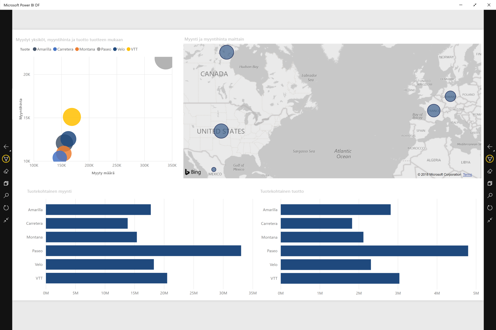
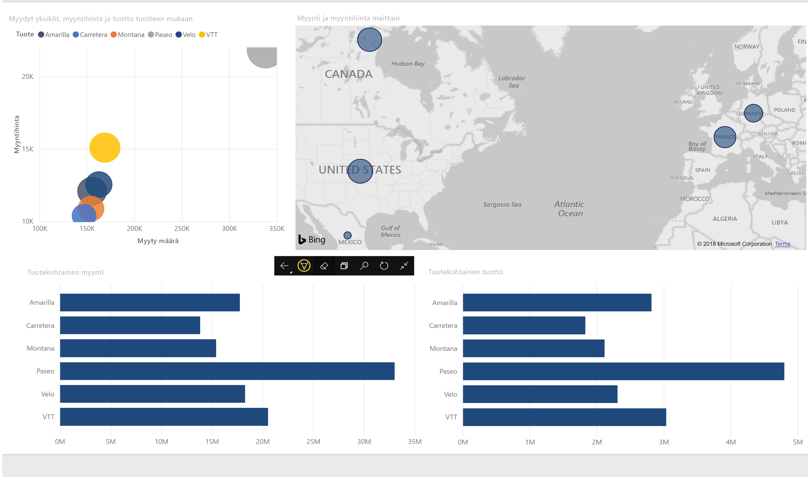

# Raporttien ja koontinäyttöjen esittäminen esitystilassa Surface Hubilla ja Windows 10 -laitteilla
Voit esittää raportteja ja koontinäyttöjä Surface Hubilla ja Windows 10 -laitteilla koko näytön esitystilassa. 

Esitystila on hyödyllinen, kun Power BI:tä näytetään kokouksessa tai konferenssissa tai erillisellä projektorilla toimistossa tai vaikka vain tilan maksimoimiseksi pienessä näytössä. 

Windows 10:n Power BI -mobiilisovelluksen esitystilassa kaikki ylimääräinen, kuten siirtymis- ja valikkorivit, poistetaan näkyvistä. Siten raportin tietoihin keskittyminen on helpompaa. Käytettävät toiminnot sisältävän työkalurivin saa käyttöön myös esitystilassa, kun tietoja on käytettävä tai niitä on työstettävä yhteistyössä.

Voit myös [esittää raporttinäkymiä ja raportteja Power BI -palvelusta koko näytön tilassa](../end-user-focus.md) verkosta.

> [!NOTE]
> Esitystila eroaa [ruutujen kohdistustilassa](mobile-tiles-in-the-mobile-apps.md).
> 
> 

## Käytä esitystilaa
Napauta Power BI -mobiilisovelluksessa **Koko näyttö -kuvaketta**, kun haluat vaihtaa koko näytön tilaan.
 Sovelluksen kaikki ylimääräinen poistetaan näkyvistä, ja näytön alaosaan tai sen molemmille puolille (näytön koon mukaan) tulee työkalurivi.

Työkaluriviltä voit suorittaa seuraavat toimet:

1. Napauttamalla Takaisin-kuvaketta  voit palata edelliselle sivulle. Pitämällä kuvaketta painettuna saat esiin navigointipolkuikkunat, jotta voit siirtyä raportin tai koontinäytön sisältävään kansioon.
2. Muste-kuvakkeella  voit valita värin, kun käytät Surface-kynää piirtämiseen ja merkintöjen tekemiseen raporttisivulle. 
3. Sivut-kuvakkeella  voit korvata esitteillä olevan raporttisivun.
4. Napsauta Haku-kuvaketta  muiden Power BI:ssä olevien artefaktien etsimistä varten.
5. Poistu esitystilasta napsauttamalla kuvaketta, jossa on kaksi sisäänpäin osoittavaa nuolta,  työkalurivillä.

Voit irrottaa työkalurivin ja vetää sen mihin tahansa paikkaan näytössä. Tästä on hyötyä suurilla näytöillä, kun haluat keskittyä raporttisi tiettyyn alueeseen ja pitää työkalut käsillä sen vieressä. Paina työkaluriviä sormella ja pyyhkäise se raporttipohjaan.

## Seuraavat vaiheet
* [Esitä raporttinäkymiä ja raportteja Power BI -palvelusta koko näytön tilassa](../end-user-focus.md)
* Ilmenikö kysyttävää? [Voit esittää kysymyksiä Power BI -yhteisössä](http://community.powerbi.com/)

