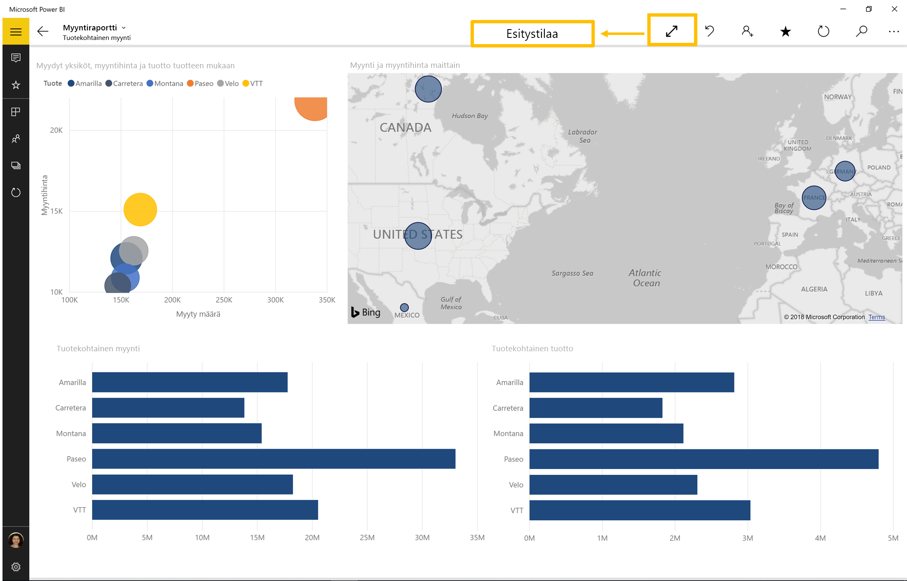

# Raporttien ja koontinäyttöjen esittäminen esitystilassa Surface Hubilla ja Windows 10 -laitteilla
Voit esittää raportteja ja koontinäyttöjä Surface Hubilla ja Windows 10 -laitteilla koko näytön esitystilassa. 

Esitystila on hyödyllinen, kun Power BI:tä näytetään kokouksessa tai konferenssissa tai erillisellä projektorilla toimistossa tai vaikka vain tilan maksimoimiseksi pienessä näytössä. 

Windows 10:n Power BI -mobiilisovelluksen esitystilassa kaikki ylimääräinen, kuten siirtymis- ja valikkorivit, poistetaan näkyvistä. Siten raportin tietoihin keskittyminen on helpompaa. Käytettävät toiminnot sisältävän työkalurivin saa käyttöön myös esitystilassa, kun tietoja on käytettävä tai niitä on työstettävä yhteistyössä.

Voit myös [esittää raporttinäkymiä ja raportteja Power BI -palvelusta koko näytön tilassa](../end-user-focus.md) verkosta.

> [!NOTE]
> Esitystila eroaa [ruutujen tarkastelutilassa](mobile-tiles-in-the-mobile-apps.md).

>[!NOTE]
>Power BI -mobiilisovellustuki **Windows 10 Mobilea käyttäville puhelimille** lopetetaan 16. maaliskuuta 2021. [Lisätietoja](https://go.microsoft.com/fwlink/?linkid=2121400)

## Käytä esitystilaa
Napauta Power BI -mobiilisovelluksessa **Koko näyttö -kuvaketta**, kun haluat vaihtaa koko näytön tilaan.
 Sovelluksen kaikki ylimääräinen poistetaan näkyvistä, ja näytön alaosaan tai sen molemmille puolille (näytön koon mukaan) tulee työkalurivi.

Yläosan työkaluriviltä voit suorittaa seuraavat toimet:

1. **Palaa takaisin**  edelliselle sivulle. Pitämällä kuvaketta painettuna saat esiin navigointipolkuikkunat, jotta voit siirtyä kansioon, joka sisältää raportin tai koontinäytön.
2. **Valitse käsinkirjoituksen väri** , kun käytät Surface-kynää piirtämiseen ja huomautusten lisäämiseen raporttisivulle.
3. **Poista käsinkirjoitusmerkit** , jotka olet ehkä tehnyt Surface-kynällä, kun piirsit tai lisäsit huomautuksia raporttisivullesi.  
4. **Vaihda sivut**  raportin toiselle sivulle esityksessä.
5. **Toista diaesitys** piilottamalla toimintopalkki ja käynnistämällä diaesitys; sovellus vaihtaa automaattisesti raporttisivujen välillä. 
6. **Haku**  Power BI:n muiden artefaktien hakemiseksi.
7. **Päivitä**  raportti.
8. **Poistu**  esitystilasta.
8. **Jaa**  esitysnäkymän kuva työtovereiden kanssa. Kuva sisältää kaikki huomautukset, jotka olet lisännyt Surface-kynällä esityksen aikana.

Voit irrottaa työkalurivin ja vetää sen mihin tahansa paikkaan näytössä. Tästä on hyötyä suurilla näytöillä, kun haluat keskittyä raporttisi tiettyyn alueeseen ja pitää työkalut käsillä sen vieressä. Paina työkaluriviä sormella ja pyyhkäise se raporttipohjaan.

## Seuraavat vaiheet
* [Esitä raporttinäkymiä ja raportteja Power BI -palvelusta koko näytön tilassa](../end-user-focus.md)
* Onko sinulla kysymyksiä? [Voit esittää kysymyksiä Power BI -yhteisössä](https://community.powerbi.com/)

