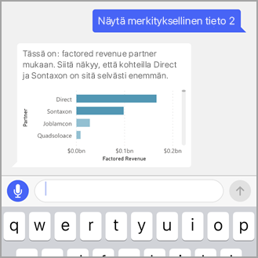

# Opetusohjelma: Tietoja koskevien kysymysten esittäminen Q&A:n virtuaalisen analyytikon avulla Power BI iOS-sovelluksissa

Helpoin tapa saada lisätietoja omista tiedoista on esittää kysymyksiä omin sanoin. Tässä opetusohjelmassa esitetään kysymyksiä ja tarkastellaan mallitietojen merkityksellisiä tietoja käyttämällä Q&A:n virtuaalista analyytikkoa iPadin tai iPhonen Microsoft Power BI -mobiilisovelluksessa. 

Koskee seuraavia:

|  |  |
|:--- |:--- |
| iPhonet |iPadit |

Q&A:n virtuaalinen analyytikko on keskustelumainen BI-käyttökokemus, joka käyttää taustalla olevia Q&A-tietoja [Power BI -palvelussa](https://powerbi.com). Se ehdottaa merkityksellisiä tietoja, ja voit esittää sille kysymyksiä joko kirjoittamalla tai puhumalla ääneen.

Tässä opetusohjelmassa tehdään seuraavat asiat:

> [!div class="checklist"]
> * Power BI -mobiilisovelluksen asentaminen iOS-laitteelle
> * Power BI -mallikoontinäytön ja -raportin lataaminen
> * Mobiilisovelluksen ehdottamien merkityksellisten tietojen tarkastelu

## Edellytykset

* **Rekisteröidy Power BI:hin**: Jos et ole rekisteröitynyt Power BI:hin, [rekisteröidy ilmaiseen kokeiluversioon](https://app.powerbi.com/signupredirect?pbi_source=web) ennen aloittamista.
* **Power BI:n iOS-sovelluksen asentaminen**: [Lataa iOS-sovellus](https://apps.apple.com/app/microsoft-power-bi/id929738808) Apple App Storesta iPhoneen, iPadiin tai iPod Touchiin. Seuraavat versiot tukevat Power BI:n iOS-sovellusta:
  * iPad, jossa on iOS 11 tai uudempi
  * iPhone 5 tai uudempi, jossa on iOS 11 tai uudempi 
  * iPod Touch, jossa on iOS 11 tai uudempi.
* **Lataa näytetiedot**: Ensimmäisessä vaiheessa ladataan **mahdollisuusanalyysimalli** Power BI -palveluun. Lisätietoja tästä on kohdassa [Mallien lataaminen Omaan työtilaan Power BI -palvelussa](./mobile-apps-download-samples.md).

Kun olet täyttänyt tarvittavat edellytykset ja ladannut mallitiedot, voit tarkastella malleja iOS-laitteessasi.

## Kokeile esiteltyjä merkityksellisiä tietoja
1. Avaa Power BI -sovellus iPhonessa tai iPadissa ja kirjaudu sisään Power BI -tilisi tunnistetiedoilla, samoilla joita käytit selaimen Power BI-palvelussa.

2. Napauta aloitussivun siirtymis palkissa **Työtilat**-kuvaketta.

    

3. Kun Työtilat-sivu avautuu, napauta **Omat työtilat** ja avaa sitten **Mahdollisuusanalyysimalli** napauttamalla sitä.

3. Napauta Q&A:n virtuaalinen analyytikko -kuvaketta Mahdollisuusanalyysimalli-koontinäytön toimintovalikossa.

    

    Q&A:n virtuaalinen analyytikko antaa joitain ehdotuksia, joilla pääset alkuun.

    

3. Napauta **esitellyt merkitykselliset tiedot**.

4. Q&A:n virtuaalinen analyytikko ehdottaa joitakin merkityksellisiä tietoja. Vieritä oikealle ja napauta **Merkityksellinen tieto 2**.

    

   Q&A:n virtuaalinen analyytikko näyttää merkityksellisen tiedon 2.

    

5. Avaa kaavio tarkastelutilassa napauttamalla sitä.

    

6. Siirry takaisin Q&A:n virtuaaliseen analyytikkoon napauttamalla vasemmassa yläkulmassa olevaa nuolta.

## Puhdista resurssit

Kun olet suorittanut opetusohjelman, voit poistaa Mahdollisuusanalyysimalli-koontinäytön, -raportin ja -tietojoukon.

1. Avaa Power BI -palvelu ([Power BI -palvelu](https://app.powerbi.com)) ja kirjaudu sisään.

2. Valitse siirtymisruudussa **Oma työtila**.

3. Valitse Koontinäytöt-välilehti ja napsauta sitten roskakoria Mahdollisuusanalyysimalli-rivillä.

    

    Valitse nyt Raportit-välilehti ja toimi samoin.

4. Valitse seuraavaksi Tietojoukot-välilehdessä **Lisää vaihtoehtoja** (...) ja valitse sitten **Poista**.

    

## Seuraavat vaiheet

Olet kokeillut Q&A:n virtuaaliavustajaa iOS-laitteiden Power BI -mobiilisovelluksissa. Lue lisää Q&A:sta Power BI -palvelussa.
> [!div class="nextstepaction"]
> [Q&A Power BI -palvelussa](../end-user-q-and-a.md)