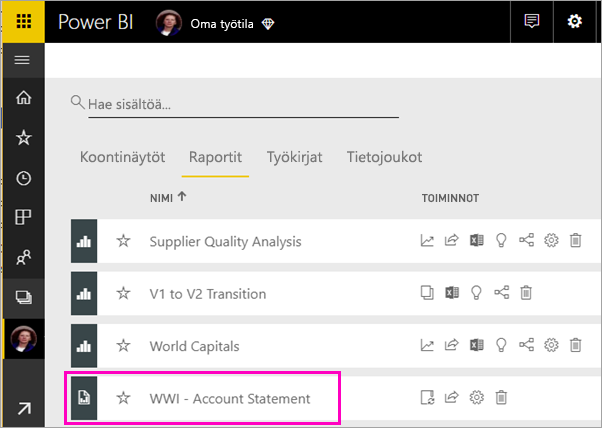
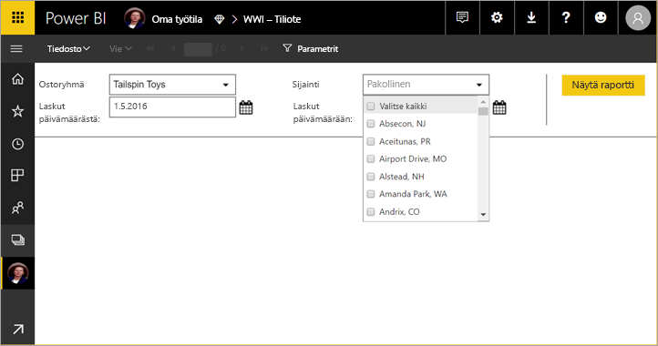
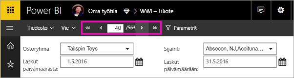
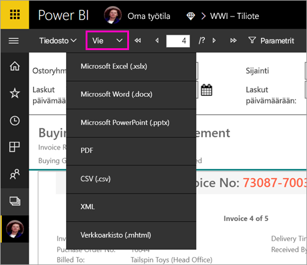

# Sivutetun raportin tarkasteleminen Power BI -palvelussa

Tässä artikkelissa opit tarkastelemaan sivutettuja raportteja Power BI -palvelussa. Sivutetut raportit ovat raportteja, jotka on luotu Raportin muodostimessa ja ladattu Premium-kapasiteetissa olevaan työtilaan. Etsi vinoneliökuvaketta  työtilan nimen vieressä. 

Sivutetuilla raporteilla on oma kuvakkeensa .

Voit myös viedä sivutetut raportit erityyppisinä tiedostoina: 

- Microsoft Excel
- Microsoft Flow
- Microsoft PowerApps
- PDF
- Pilkuin erotellut arvot (.csv)
- XML
- Verkkoarkisto (.mhtml)

## Tarkastele sivutettua raporttia

1. Valitse sivutettu raportti työtilassa.

    

2. Jos raportissa on parametreja, kuten tässä, et välttämättä näe raporttia heti avatessasi sen. Valitse parametrit ja valitse sitten **Näytä raportti**. 

     

    Voit muuttaa parametreja milloin tahansa.

1. Selaa raporttia sivun yläreunassa olevien nuolien avulla tai kirjoittamalla sivunumeron ruutuun.
    
   

4. Valitse **Vie** ja valitse vientimuoto sivutetulle raportille.

    

## Seuraavat vaiheet

[Sivutetut raportit Power BI -palvelussa](end-user-paginated-report.md)
