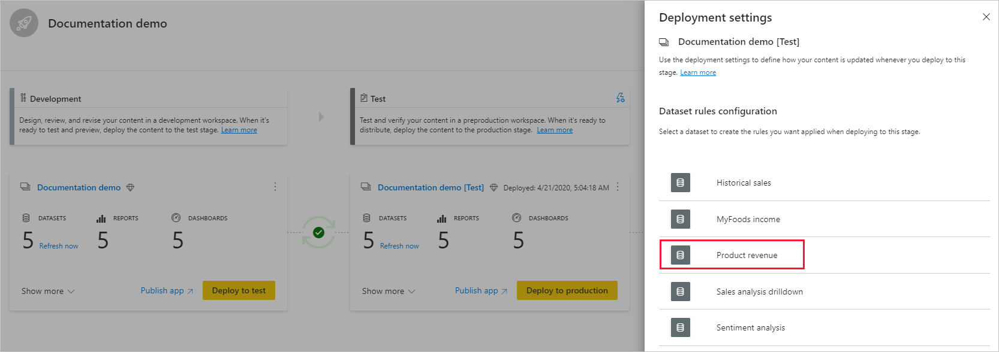

# Käyttöönottoputkien käytön aloittaminen (esikatselu)

Tässä artikkelissa käydään läpi käyttöönottoputkien käytössä tarvittavat perusasetukset.

## Käyttöönottoputkien käyttäminen

Voit käyttää käyttöönottoputkia, jos seuraavat ehdot täyttyvät:

* Olet Power BI [Pro -käyttäjä](../admin/service-admin-purchasing-power-bi-pro.md).

* Kuulut organisaatioon, jolla on Premium-kapasiteetti.

* Olet [uuden työtilakokemuksen](../collaborate-share/service-create-the-new-workspaces.md) järjestelmänvalvoja.

>[!NOTE]
> Pystyt myös näkemään käyttöönottoputkien painikkeen, jos olet aiemmin luonut putken tai jos putki on jaettu kanssasi.

## Vaihe 1 – Käyttöönottoputken luominen

Voit luoda käyttöönottoputken seuraavalla tavalla:

1. Valitse Power BI -palvelun siirtymisruudussa **Käyttöönottoputket** ja valitse **Luo putki**.

2. Kirjoita *Luo käyttöönottoputki* -valintaikkunaan putken nimi ja kuvaus ja valitse **Luo**.

Kun putki on määritetty, voit jakaa sen muiden käyttäjien kanssa tai poistaa sen. Kun jaat putken muiden kanssa, kyseiset käyttäjät saavat [putken käyttöoikeuden](deployment-pipelines-process.md#user-with-pipeline-access). Putken käyttöoikeuden avulla käyttäjät voivat tarkastella, jakaa ja muokata putkea sekä poistaa sen.

## Vaihe 2 – Työtilan määrittäminen käyttöönottoputkeen

Putken määrittämisen jälkeen siihen on lisättävä sisältöä, jota halutaan hallita. Putkeen lisätään sisältöä määrittämällä työtila putken vaiheeseen. Voit määrittää työtilan mihin tahansa vaiheeseen. 

Voit määrittää yhden työtilan käyttöönottoputkeen. Käyttöönottoputket luovat työtilan sisällöstä klooneja, joita käytetään putken eri vaiheissa.

Määritä työtila käyttöönottoputkeen noudattamalla seuraavia vaiheita:

1. Valitse juuri luodussa käyttöönottoputkessa **Määritä työtila**.

2. Valitse avattavasta *Valitse työtila* -valikosta työtila, jonka haluat määrittää putkeen.

3. Valitse vaihe, jolle haluat määrittää työtilan.

### Työtilan määrityksen rajoituksia

* Työtilan on oltava [uusi työtilakokemus](../collaborate-share/service-create-the-new-workspaces.md).

* Sinun on oltava työtilan järjestelmänvalvoja.

* Työtilaa ei ole määritetty millekään muulle putkelle.

* Työtilan on sijaittava  [Premium-kapasiteetissa](../admin/service-premium-what-is.md).

* [Power BI -näytteitä](../create-reports/sample-datasets.md) sisältävää työtilaa ei voi määrittää putkivaiheeseen.

>[!NOTE]
>Vain työtilat, joita voidaan käyttää käyttöönottoputkien kanssa, ovat näkyvissä valittavissa olevien työtilojen luettelossa.

## Vaihe 3 – Käyttöönotto tyhjässä vaiheessa

Kuka tahansa [Pro-käyttäjä](../admin/service-admin-purchasing-power-bi-pro.md), joka on lähdetyötilan jäsen tai järjestelmänvalvoja, voi ottaa sisältöä käyttöön tyhjässä vaiheessa (vaihe, joka ei sisällä sisältöä). Työtilan on sijaittava kapasiteetissa, jotta käyttöönotto voidaan suorittaa.

Kun sisältöä otetaan käyttöön tyhjässä vaiheessa, kohteiden väliset yhteydet säilytetään. Esimerkiksi raportti, joka on sidottu tietojoukkoon lähdevaiheessa, kopioidaan sen tietojoukon rinnalle, ja kloonit sidotaan samalla tavalla kohdetyötilaan.

Päivitä tietojoukko, kun käyttöönotto on valmis. Lisätietoja on kohdassa [Sisällön käyttöönotto tyhjässä vaiheessa](deployment-pipelines-process.md#deploying-content-to-an-empty-stage).

### Kaiken sisällön käyttöönotto

Valitse vaihe, josta käyttöönotto suoritetaan, ja napsauta käyttöönottopainiketta. Käyttöönottoprosessi luo työtilan kopion kohdevaiheeseen. Tämä työtila sisältää kaiken nykyisessä vaiheessa olevan sisällön.

### Valikoiva käyttöönotto

Jos haluat ottaa käyttöön vain tietyt kohteet, napsauta **Näytä lisää** -linkkiä ja valitse kohteet, jotka haluat ottaa käyttöön. Kun napsautat käyttöönottopainiketta, vain valitut kohteet otetaan käyttöön seuraavassa vaiheessa.

Koska koontinäytöt, raportit ja tietojoukot liittyvät toisiinsa ja niillä on riippuvuussuhteita, voit valita Valitse liittyvät -painikkeen avulla kaikki kohteet, joista kyseiset kohteet ovat riippuvaisia. Jos esimerkiksi haluat ottaa raportin käyttöön seuraavassa vaiheessa, Valitse liittyvät -painikkeen napsauttaminen merkitsee tietojoukon, johon raportti on yhdistetty, jotta molemmat otetaan käyttöön samalla kertaa eikä raporttia jaeta.

>[!NOTE]
> * Et voi ottaa raporttia tai koontinäyttöä käyttöön seuraavassa vaiheessa, jos sen riippuvaisia kohteita ei ole olemassa siinä vaiheessa, jossa olet ottamassa sitä käyttöön.
> * Saatat saada odottamattomia tuloksia, jos päätät ottaa käyttöön raportin tai koontinäytön ilman sen tietojoukkoa. Näin voi käydä, kun kohdevaiheen tietojoukko on muuttunut eikä se ole enää samanlainen kuin siinä vaiheessa, josta olet ottamassa sitä käyttöön.

### Käyttöönotto taaksepäin

Voit halutessasi suorittaa käyttöönoton aiemmassa vaiheessa esimerkiksi tilanteessa, jossa määrität aiemmin luodun työtilan tuotantovaiheeseen ja suoritat sitten sen käyttöönoton taaksepäin ensin testivaiheessa ja sitten kehitysvaiheessa.

Käyttöönotto aiemmassa vaiheessa toimii vain, jos edellisessä vaiheessa ei ole sisältöä. Kun suoritat käyttöönoton edellisessä vaiheessa, et voi valita tiettyjä kohteita. Vaiheen kaikki sisältö otetaan käyttöön.

## Vaihe 4 – Tietojoukon sääntöjen luominen

Kun työskentelet käyttöönottoputkessa, eri vaiheissa voi olla eri kokoonpanoja. Esimerkiksi kussakin vaiheessa voi olla eri tietokantoja tai eri kyselyparametreja. Kehitysvaiheessa mallitietojen kysely saatetaan tehdä tietokannasta, kun taas testi- ja tuotantovaiheissa kysely tehdään koko tietokannalle.

Kun otat sisältöä käyttöön putkivaiheiden välillä, tietojoukon sääntöjä määrittämällä voit sallia muutoksia sisältöön säilyttäen kuitenkin jotkin asetukset ennallaan.

Tietojoukon säännöt on määritetty jokaisen tietojoukon tietolähteissä ja parametreissa. Ne määrittävät tietyn tietojoukon tietolähteiden tai parametrien arvot. Jos esimerkiksi haluat, että tuotantovaiheessa oleva tietojoukko osoittaa tuotantotietokantaan, voit määrittää sille säännön. Sääntö määritetään tuotantovaiheessa halutun tietojoukon kohdalla. Kun sääntö on määritetty, testistä tuotantoon käyttöönotettu sisältö perii arvon tietojoukon säännöissä määritetyllä tavalla, ja sitä sovelletaan aina, kunhan sääntöä ei muuteta ja se on kelvollinen.

>[!NOTE]
> Tietojoukon säännöt toimivat vain, kun lähde- ja kohdetietolähde ovat samaa tyyppiä.

### Tietojoukon säännön luominen

1. Valitse **Käyttöönottoasetukset** siinä putkivaiheessa, jolle haluat luoda tietojoukon säännön.

    

2. Valitse Käyttöönottoasetukset-ruudussa tietojoukko, jolle haluat luoda säännön.

    

3. Valitse luotavan säännön tyyppi, laajenna luetteloa ja valitse **Lisää sääntö**.

     

### Tietojoukon sääntöjen tyypit

Voit luoda kahdentyyppisiä sääntöjä:

* **Tietolähdesäännöt** Tietolähdeluettelo otetaan putken lähdevaiheen tietojoukosta. Valitse tietolähdeluettelosta korvattava tietolähde. Valitsemalla jonkin seuraavista menetelmistä voit valita arvon ja korvata sillä lähdevaiheen arvon:

    1. Valitse luettelosta.

    2. Valitse **Muu** ja lisää uusi tietolähde manuaalisesti. Voit muuttaa tietolähteeseen vain samasta tyypistä.

* **Parametrisäännöt** Valitse parametri parametrien luettelosta. Nykyinen arvo näytetään. Muokkaa arvoa siihen arvoon, jonka haluat voimaan kunkin käyttöönoton jälkeen.

### Tietojoukon sääntöjen rajoitukset

* Sinun on oltava tietojoukon omistaja, jotta voit luoda tietojoukon säännön.

* Tietojoukon sääntöjä ei voi luoda kehitysvaiheessa.

* Kun kohde poistetaan, myös sen säännöt poistetaan. Näitä sääntöjä ei voi palauttaa.

* Jos säännössä määritettyjä tietolähteitä tai parametreja muutetaan tai jos ne poistetaan lähdetietojoukosta, sääntö ei ole kelvollinen ja käyttöönotto epäonnistuu.

* Tietolähteen sääntöjä voidaan määrittää vain seuraaville tietolähteille:
    * Analysis Services
    * Azure SQL Server
    * Azure Analysis Services
    * Odata-syöte
    * Oracle
    * SapHana
    * SharePoint
    * SQL Server
    * SQL Server Analysis Services (SSAS)
    * Teradata

    Muiden tietolähteiden kohdalla suosittelemme [määrittämään tietolähteen parametrien avulla](deployment-pipelines-best-practices.md#use-parameters-in-your-model).

## Vaihe 5 – Sisällön käyttöönotto yhdestä vaiheesta toiseen

Kun sisältöä on putkivaiheessa, voit ottaa sen käyttöön seuraavassa vaiheessa. Sisällön ottaminen käyttöön toisessa vaiheessa tapahtuu yleensä sen jälkeen, kun olet suorittanut joitakin toimintoja putkessa. Kun olet esimerkiksi tehnyt sisältöön kehitysmuutoksia kehitysvaiheessa tai testannut sisältöä testivaiheessa. Tyypillinen työnkulku sisällön siirtämiselle vaiheesta toiseen on kehityksestä testaukseen ja sitten testauksesta tuotantoon. Lisätietoja tästä prosessista on [sisällön käyttöönotosta aiemmin luodussa työtilassa](deployment-pipelines-process.md#deploy-content-to-an-existing-workspace) kertovassa osassa.

Jos haluat ottaa sisällön käyttöön käyttöönottoputken seuraavassa vaiheessa, napsauta käyttöönottopainiketta vaiheen alaosassa.

Viimeisin käyttöönottoaika on näkyvissä testi- ja tuotantovaiheen korteissa. Se kertoo, milloin sisältö otettiin viimeksi käyttöön vaiheessa.

Käyttöönottoajasta on hyötyä, kun halutaan määrittää, milloin vaihe päivitettiin viimeksi. Siitä voi olla hyötyä myös silloin, kun haluat seurata aikaa testin ja tuotannon käyttöönottojen välillä.

## Vaiheiden vertailu

Kun kahdessa peräkkäisessä vaiheessa on sisältöä, sisältöä verrataan sisältökohteiden metatietojen perusteella. Tämä vertailu ei sisällä tietojen tai päivitysajan vertaamista vaiheiden välillä.

 

Jos haluat sallia nopean visuaalisen katsauksen kahden peräkkäisen vaiheen välisiin eroihin, niiden välillä näkyy vertailukuvakkeen ilmaisin. Vertailuilmaisimella on kaksi tilaa:

* **Vihreä ilmaisin** – Kummankin vaiheen kunkin sisältökohteen metatiedot ovat samat.

* **Oranssi ilmaisin** – Tulee näkyviin, jos jompikumpi näistä ehdoista täyttyy:
    * Joitain kunkin vaiheen sisältökohteista muutettiin tai päivitettiin (niillä on eri metatiedot).
    * Kohteiden määrissä vaiheiden välillä on eroja.

Kun kaksi peräkkäistä vaihetta eivät ole samat, oranssin vertailukuvakkeen alla näkyy **Vertaa**-linkki. Linkin napsauttaminen avaa sisältökohteiden luettelon Vertaa-näkymän molemmissa vaiheissa. Vertaa-näkymän avulla voit seurata kohteiden välisiä muutoksia tai eroja kussakin putkivaiheessa. Muutetut kohteet saavat jonkin seuraavista tunnisteista:

* **Uusi** – Uusi kohde lähdevaiheessa. Tätä kohdetta ei ole olemassa kohdevaiheessa. Käyttöönoton jälkeen tämä kohde kopioidaan kohdevaiheeseen.

* **Eri** – Kohde, joka on olemassa sekä lähde- että kohdevaiheessa, jossa jotakin versiota muutettiin viimeisimmän käyttöönoton jälkeen. Käyttöönoton jälkeen lähdevaiheen kohde korvaa kohdevaiheen kohteen riippumatta siitä, missä muutos on tehty.

* **Puuttuu**  – Tämä tunniste ilmaisee, että kohde näkyy kohdevaiheessa mutta ei lähdevaiheessa.

    >[!NOTE]
    >Käyttöönotto ei vaikuta *Puuttuu*-tunnisteilla merkittyihin kohteisiin.

 

## Sisällön ohittaminen

Kun suoritat käyttöönoton tehtyäsi muutoksia sisältöön lähdevaiheessa, kohdevaiheessa muuttamasi sisältö korvataan. Kun valitset *Ota käyttöön*, näkyviin tulee varoitus, joka sisältää korvattavien kohteiden määrän.

Lisätietoja siitä, [mitkä kohteet kopioidaan seuraavaan vaiheeseen](deployment-pipelines-process.md#deployed-items) ja [mitä kohteita ei kopioida](deployment-pipelines-process.md#unsupported-items), on kohdassa [Tutustu käyttöönottoprosessiin](deployment-pipelines-process.md).

## Seuraavat vaiheet

>[!div class="nextstepaction"]
>[Käyttöönottoputkien esittely](deployment-pipelines-overview.md)

>[!div class="nextstepaction"]
>[Tutustu käyttöönoton jakson prosessiin](deployment-pipelines-process.md)

>[!div class="nextstepaction"]
>[Käyttöönottoputkien vianmääritys](deployment-pipelines-troubleshooting.md)

>[!div class="nextstepaction"]
>[Käyttöönottoputkien parhaat käytännöt](deployment-pipelines-best-practices.md)
