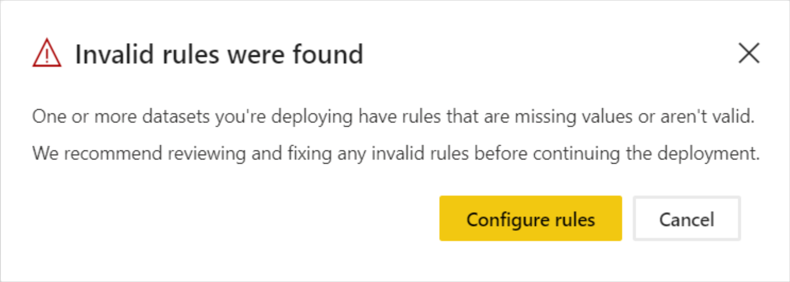

# Käyttöönottoputkien vianmääritys (esikatselu)

Tämän artikkelin avulla voit tehdä käyttöönottoputkien ongelmien vianmäärityksen.

## Yleiset

### Tietoa Power BI:n käyttöönottoputkista

Lisätietoja Power BI:n käyttöönottoputkista löytyy [käyttöönottoputkien yleiskatsauksesta](deployment-pipelines-overview.md).

### Kuinka voin aloittaa käyttöönottoputkien käyttämisen?

Aloita käyttöönottoputkien käyttö [aloittamiseen liittyvien ohjeiden avulla](deployment-pipelines-get-started.md).

### Miksi en näe käyttöönottoputkien painiketta?

Jos seuraavat ehdot eivät täyty, käyttöönottoputkien painike ei ole näkyvissä.

* Olet Power BI [Pro -käyttäjä](../admin/service-admin-purchasing-power-bi-pro.md).

* Kuulut organisaatioon, jolla on Premium-kapasiteetti.

* Työtila voidaan määrittää vain yksittäiseen putkeen.

* Olet uuden työtilan järjestelmänvalvoja.

## Käyttöoikeudet

### Mitä käyttöoikeuksia tarvitaan käyttöönottoputkien kanssa työskentelyyn?

Jotta voit käyttää käyttöönottoputkia, sinun on oltava [Pro-käyttäjä](../admin/service-admin-purchasing-power-bi-pro.md), jolla on [Premium-kapasiteetti](../admin/service-premium-what-is.md). Lisätietoja on [käyttöönottoputkien käyttöä koskevassa kohdassa](deployment-pipelines-get-started.md#accessing-deployment-pipelines).

### Minkä tyyppisen kapasiteetin voin määrittää putken työtilalle?

Kaikkien käyttöönottoputken työtilojen on sijaittava varatun kapasiteetin rajoissa, jotta putki voi toimia. Voit kuitenkin käyttää eri kapasiteetteja putken eri työtiloissa. Voit myös käyttää eri kapasiteettityyppejä saman putken eri työtiloissa.

Voit käyttää kehityksessä ja testaamisessa A- tai EM-kapasiteettia yhdessä Pro Power BI -tilin kanssa kullekin käyttäjälle.

Tuotantotyötiloissa tarvitset P-kapasiteettia. Jos olet upotettujen sovellusten kautta sisältöä jakava ohjelmistotoimittaja, voit käyttää A- tai EM-kapasiteetteja myös tuotannossa.

## Tekniset

### Miksi kaikki työtilat eivät ole näkyvissä, kun yritän määrittää työtilaa putkelle?

Jotta voit määrittää työtilan putkelle, seuraavien ehtojen on täytyttävä:

* Työtila on [uusi työtilakokemus](../collaborate-share/service-create-the-new-workspaces.md).

* Olet työtilan järjestelmänvalvoja.

* Työtilaa ei ole määritetty millekään muulle putkelle.

* Työtila sijaitsee [Premium-kapasiteetissa](../admin/service-premium-what-is.md).

Työtiloja, jotka eivät täytä näitä ehtoja, ei näytetä työtilojen luettelossa.

### Kuinka voin määrittää työtilat kaikille putken vaiheille?

Voit määrittää yhden työtilan putkea kohti. Kun työtila on määritetty putkelle, voit ottaa sen käyttöön seuraavissa putken vaiheissa. Ensimmäisen käyttöönoton aikana luodaan uusi työtila, jossa on kopioita lähdevaiheen kohteista. Kopioitujen kohteiden yhteydet säilytetään. Lisätietoja on [työtilan määrittämisestä käyttöönottoputkelle](deployment-pipelines-get-started.md#step-2---assign-a-workspace-to-a-deployment-pipeline) kertovassa kohdassa.

### Miksi ensimmäinen käyttöönotto epäonnistui?

Ensimmäinen käyttöönotto saattoi epäonnistua useista syistä johtuen. Osa näistä syistä on lueteltu alla olevassa taulukossa.

|Virhe  |Toiminto  |
|---------|---------|
|Sinulla ei ole [Premium-kapasiteetin käyttöoikeuksia](deployment-pipelines-process.md#creating-a-premium-capacity-workspace).     |Saat Premium-kapasiteetin käyttöoikeudet pyytämällä kapasiteetin järjestelmänvalvojaa lisäämään työtilasi kapasiteettiin tai pyytämällä kapasiteetin määrityksen käyttöoikeuksia. Kun työtila on kapasiteetissa, suorita käyttöönotto uudelleen.        |
|Sinulla ei ole työtilan käyttöoikeuksia.     |Sinun on oltava työtilan jäsen, jotta voit suorittaa käyttöönoton. Pyydä työtilan järjestelmänvalvojaa myöntämään sinulle tarvittavat käyttöoikeudet.         |
|Power BI -järjestelmänvalvoja poisti työtilojen luomisen käytöstä.     |Ota yhteyttä Power BI -järjestelmänvalvojaan.         |
|Työtila ei ole [uusi työtilakokemus](../collaborate-share/service-create-the-new-workspaces.md).     |Luo sisältöä uudessa työtilakokemuksessa. Jos sinulla on sisältöä perinteisessä työtilassa, voit [päivittää](../collaborate-share/service-upgrade-workspaces.md) sen uuteen työtilakokemukseen.         |
|Käytät [valikoivaa käyttöönottoa](deployment-pipelines-get-started.md#selective-deployment) etkä valitse sisällön tietojoukkoa.     |Tee jokin seuraavista:   Poista tietojoukkoon linkitetyn sisällön valinta. Valitsematonta sisältöä (kuten raportteja tai koontinäyttöjä) ei kopioida seuraavaan vaiheeseen.   Valitse tietojoukko, joka on linkitetty valittuun sisältöön. Tietojoukko kopioidaan seuraavaan vaiheeseen.         |

### Saan varoituksen, että työtilassa on artefakteja, joita ei tueta, kun yritän suorittaa käyttöönottoa. Kuinka voin tietää, mitä artefakteja ei tueta?

Kattava luettelo kohteista ja artefakteista, joita ei tueta käyttöönottoputkissa, on seuraavissa osissa:

* [Kohteet, joita ei tueta](deployment-pipelines-process.md#unsupported-items)

* [Kohteen ominaisuudet, joita ei kopioida](deployment-pipelines-process.md#item-properties-that-are-not-copied)

### Miksi käyttöönotto epäonnistui rikkinäisten sääntöjen vuoksi?

Jos sinulla on ongelmia tietojoukon sääntöjen määrittämisessä, tutustu [tietojoukon sääntöihin](deployment-pipelines-get-started.md#step-4---create-dataset-rules) ja varmista, että noudatat [tietojoukon sääntöjen rajoituksia](deployment-pipelines-get-started.md#dataset-rule-limitations).

Jos käyttöönotto onnistui aiemmin ja nyt epäonnistuu rikkinäisten sääntöjen vuoksi, syynä voi olla se, että tietojoukko julkaistaan uudelleen. Seuraavat muutokset lähdetietojoukkoon johtavat käyttöönoton epäonnistumiseen:

**Parametrisäännöt**

* Poistettu parametri

* Muutettu parametrin nimi

**Tietolähdesäännöt**

Tietojoukon säännöistä puuttuu arvoja. Tämä saattaa johtua tietojoukon muuttumisesta.

Kun aiemmin onnistunut käyttöönotto epäonnistuu rikkinäisten linkkien vuoksi, näyttöön tulee varoitus. Valitsemalla **Määritä säännöt** voit siirtyä käyttöönottoasetusten ruutuun, jossa epäonnistunut tietojoukko näkyy merkittynä. Kun napsautat tietojoukkoa, rikkinäiset säännöt näkyvät merkittyinä.

Korjaa tai poista rikkinäiset säännöt ja suorita sitten käyttöönotto uudelleen.

### Miten voin muuttaa tietolähdettä putken vaiheissa?

Et voi muuttaa tietolähteen yhteyttä Power BI -palvelussa.

Jos haluat muuttaa tietolähdettä testi- tai tuotantovaiheissa, voit käyttää [tietojoukon sääntöjä](deployment-pipelines-get-started.md#step-4---create-dataset-rules) tai [ohjelmointirajapintoja](https://docs.microsoft.com/rest/api/power-bi/datasets/updateparametersingroup). Tietojoukon säännöt tulevat voimaan vasta seuraavan käyttöönoton jälkeen.

### Korjasin virheen tuotannossa, mutta nyt en voi napsauttaa Käyttöönotto edellisessä vaiheessa -painiketta. Miksi se näkyy harmaana?

Voit suorittaa käyttöönoton taaksepäin vain tyhjässä vaiheessa. Jos testivaiheessa on sisältöä, et voi suorittaa käyttöönottoa taaksepäin tuotannosta.

Kun olet luonut putken, käytä kehitysvaihetta sisällön kehittämiseen ja testivaiheita sen tarkastelemiseen ja testaamiseen. Voit korjata virheitä näissä vaiheissa ja ottaa sitten käyttöön korjatun ympäristön tuotantovaiheessa.

>[!NOTE]
>Käyttöönotto taaksepäin tukee vain [täyttä käyttöönottoa](deployment-pipelines-get-started.md#deploying-all-content). Se ei tue [valikoivaa käyttöönottoa](deployment-pipelines-get-started.md#selective-deployment).

### Tukevatko käyttöönottoputket Multi-Geoa?

Multi-Geoa tuetaan. Sisällön käyttöönotto vaiheiden välillä eri Geoissa voi kestää kauemmin.

## Käyttöoikeudet

### Mikä on käyttöönottoputkien käyttöoikeusmalli?

Käyttöönottoputkien käyttöoikeusmalli on kuvattu [Käyttöoikeudet](deployment-pipelines-process.md#permissions)-osassa.

### Kuka voi ottaa käyttöön sisältöä vaiheiden välillä?

Sisältöä voidaan ottaa käyttöön tyhjässä vaiheessa tai sisältöä sisältävässä vaiheessa. Sisällön on sijaittava [Premium-kapasiteetissa](../admin/service-premium-what-is.md).

* **Käyttöönotto tyhjässä vaiheessa** – Kuka tahansa [Pro-käyttäjä](../admin/service-admin-purchasing-power-bi-pro.md), joka on lähdetyötilan jäsen tai järjestelmänvalvoja.

* **Käyttöönotto sisältöä sisältävässä vaiheessa** – Kuka tahansa [Pro-käyttäjä](../admin/service-admin-purchasing-power-bi-pro.md), joka on molempien työtilojen jäsen tai järjestelmänvalvoja käyttöönoton lähde- ja kohdevaiheissa.

* **Tietojoukon ohittaminen** – Käyttöönotto ohittaa kunkin kohdevaiheeseen sisältyvän tietojoukon, vaikka tietojoukkoa ei olisi muutettu. Käyttäjän on oltava kaikkien käyttöönotossa määritettyjen kohdevaiheen tietojoukkojen omistaja.

### Mitä oikeuksia minulla on oltava, jotta voin määrittää tietojoukon sääntöjä?

Jotta voit määrittää tietojoukon sääntöjä käyttöönottoputkissa, sinun on oltava tietojoukon omistaja.

### Miksi en näe putkessa olevia työtiloja?

Putken ja työtilan käyttöoikeuksia hallitaan erikseen. Sinulla voi olla putken käyttöoikeudet, mutta ei työtilan käyttöoikeuksia. Lisätietoja on [käyttöoikeuksia](deployment-pipelines-process.md#permissions) käsittelevässä osassa.

## Seuraavat vaiheet

>[!div class="nextstepaction"]
>[Käyttöönottoputkien esittely](deployment-pipelines-overview.md)

>[!div class="nextstepaction"]
>[Käyttöönottoputkien käytön aloittaminen](deployment-pipelines-get-started.md)

>[!div class="nextstepaction"]
>[Tutustu käyttöönoton jakson prosessiin](deployment-pipelines-process.md)

>[!div class="nextstepaction"]
>[Käyttöönottoputkien parhaat käytännöt](deployment-pipelines-best-practices.md)