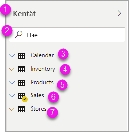
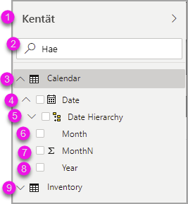
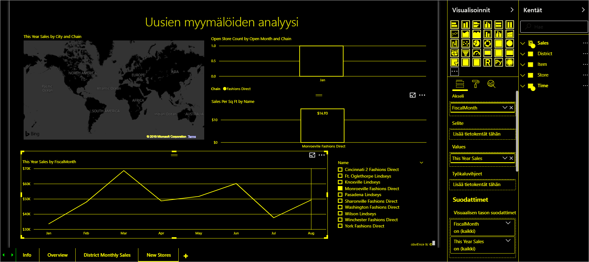

# Raporttien luominen Power BI:ssä helppokäyttötoimintojen työkaluilla

Power BI:ssä on helppokäyttötoimintojen työkaluja käyttäville raporttien tekijöille monia sisäisiä ominaisuuksia, jotka voivat auttaa raportin laadinnassa.

Tässä artikkelissa kuvataan erilaiset helppokäyttötoimintojen työkalut, jotka ovat raporttien luojien käytettävissä Power BI Desktopissa.

## Siirtyminen sovellustasossa
Kun siirryt Power BI Desktopissa, voit siirtää kohdistuksen sovelluksen pääalueisiin painamalla **CTRL + F6**. Kohdistuksen siirtäminen Power BI Desktop pääalueella etenee seuraavassa järjestyksessä:

1. Pohjan objektit
2. Sivun välilehdet
3. Ruudut (kukin erikseen, avoimet ruudut vasemmalta oikealle)
4. Näkymän siirtymistoiminto
5. Alatunniste
6. Kirjaudu sisään
7. Keltainen varoitus/virhe/päivitykset-palkki

Useimmiten Power BI:ssä voidaan valita tai siirtyä alueeseen painamalla **Enter**-näppäintä ja poistua painamalla **Esc**-näppäintä.

## Siirtyminen valintanauhassa

Painamalla **Alt** voit nähdä *näppäinvihjeiksi* kutsutut pienet laatikot kunkin sellaisen komennon päällä, joka on käytettävissä valintanauhan nykyisessä näkymässä. Sen jälkeen voit painaa *näppäinvihjeessä* näkyvää kirjainta, joka leijuu haluamasi komennon päällä. 

Esimerkiksi seuraavassa kuvassa **Alt**-näppäintä on painettu näyttämään näppäinvihjeet, jotka sisältävät käytettävissä olevien helppokäyttöisyyskomentojen kirjaimet. **M**-näppäimen painaminen avaisi valintanauhan **Mallinnus**-välilehden.

Saatat saada lisää näppäinvihjeitä sen mukaan, mitä kirjainta painat. Jos esimerkiksi **Aloitus**-välilehti on aktiivinen ja painat näppäintä **W**, **Näytä**-välilehti näytetään yhdessä kyseisen **Näytä**-valintanauhan välilehden ryhmien näppäinvihjeiden kanssa. Voit jatkaa näppäinvihjeissä näkyvien kirjainten painamista, kunnes painat haluamasi komennon kirjainta. Jos haluat siirtyä edelliseen näppäinvihjeiden joukkoon, paina **Esc**. Jos haluat peruuttaa tekemäsi toiminnon ja piilottaa näppäinvihjeet, paina **Alt**-näppäintä.

## Siirtyminen visualisointiruudussa

Jos haluat siirtyä **Visualisoinnit**-ruudussa, sinun on ensin varmistettava, että kohdistus on ruudussa. Paina **CTRL + F6**, kunnes saavut kyseiseen ruutuun. Kun käyttäjä siirtyy Visualisoinnit-ruudussa, kohdistus osuu ensin otsikkoon. Ylhäältä alkaen sarkainjärjestys on seuraava, kuten seuraavassa kuvassakin näkyy:

1. Ylätunnisteen otsikko
2. Laajenna/kutista-merkki
3. Ensimmäinen visualisoinnin kuvake

Kun pääset visualisointeihin, voit siirtyä tiettyyn visualisointiin nuolinäppäinten avulla ja valita sen painamalla **Enter**. Jos käytät näytönlukijaa, se ilmoittaa, jos olet luonut uuden kaavion, ja kertoo kaavion tyypin, tai se kertoo, että olet muuttanut tietyntyyppisen kaavion toisentyyppiseksi kaavioksi. 

Ruudun visualisointiosion jälkeen kohdistusjärjestys siirtyy ruudun pivotointeihin, kuten seuraavassa kuvassa näytetään.

Kun kohdistus on ruudun pivotoinneissa, sarkaimen painaminen vie vain valittuna olevan ruudun kuvakkeeseen. Jos haluat vaihtaa muihin ruutuihin, käytä nuolinäppäimiä.

## Kenttä

Kun kohdistus on ruudun pivotoinneissa, kuten edellisessä osiossa kuvattiin, sarkaimen uudelleen painaminen siirtää kohdistuksen **kenttään**. 

**Kentässä** kohdistusjärjestys on:

* kunkin lähteen otsikko (ensimmäiseksi)
* sitten tietty kenttä kussakin lähteessä (seuraavaksi)
* avattavan valikon painike, jolla avataan kenttävalikko (sen jälkeen)
* sitten poistamispainike (viimeiseksi)

Seuraavassa kuvassa näytetään tämän kohdistuksen etenemisjärjestys.

Näytönlukija lukee lähteen nimen ja sen työkaluvihjeen. Näytönlukija lukee kunkin lähteen kentän nimen ja työkaluvihjeen. Jos lähde on tyhjä, kohdistuksen pitäisi siirtyä koko tyhjään lähteeseen. Näytönlukijan pitäisi lukea lähteen nimi, työkaluvihje, ja että lähde on tyhjä.

Kun kenttävalikko on avoinna, voit siirtyä sen läpi käyttämällä **sarkainta** tai **vaihto + sarkain** -näppäimiä tai **ylänuoli** / **alanuoli**-näppäimiä. Näytönlukija ilmoittaa vaihtoehtojen nimet.

Jos haluat siirtää kentän yhdestä kentän lähteen säilöstä toiseen säilöön, voit käyttää näppäimistöäsi ja käyttää kentän valikon **Siirrä**-vaihtoehtoa, kuten seuraavassa kuvassa on esitetty.

## Muotoilu-ruutu

**Muotoilu**-ruudun kohdistusjärjestys siirtyy ylhäältä alas korttijärjestyksessä. Kohdistus siirtyy kortin nimen ympärille, ja sen jälkeen sen **Käytössä/Ei käytössä**-valintapainikkeeseen, jos se on olemassa. Kun kohdistus on kortin nimessä, näytönlukija lukee kortin nimen ja sen, onko kortti laajennettu vai kutistettu. Voit laajentaa tai kutistaa kortin painamalla **Enter**. **Enter**-näppäimellä voi myös valita, onko valintapainike **käytössä** tai **ei käytössä**.

Jos kortti on avoinna, **sarkaimella** voi siirtyä kortin ohjausobjektien läpi ennen seuraavaan korttiin siirtymistä. Kortin ohjausobjekteissa näytönlukija ilmoittaa otsikon, nykyisen arvon ja ohjausobjektin tyypin.  

## Siirtyminen Kentät-luettelossa

Voit painaa **sarkainta** siirtyäksesi ympäri **Kentät**-luetteloa. Kuten Muotoilu-ruudussakin, kohdistusjärjestys etenee seuraavassa järjestyksessä, jos taulukot on kutistettu:

1. **Kentät**-luettelon ylätunniste
2. Hakupalkki
3. Kunkin taulukon nimi

Jos haluat laajentaa **Kentät-lähteen kaikki taulukot**, paina **Alt + vaihto + 9**. Jos haluat kutistaa kaikki taulukot, paina **Alt + vaihto + 1**. Voit laajentaa yksittäisen taulukon painamalla **oikeaa nuolinäppäintä**. Jos haluat kutistaa yksittäisen taulukon, paina **vasenta nuolinäppäintä**. Kuten Muotoilu-taulukossakin, sarkaimen painaminen ja siirtyminen kentät-luettelossa pitää sisällään näytettävät kentät, jos taulukko on laajennettu. Näytönlukija ilmoittaa, oletko laajentanut vai kutistanut taulukon.

Voit lisätä valintamerkin kenttään siirtymällä haluamaasi kenttään ja painamalla **Enter**.   Näytönlukija ilmoittaa kentän, jossa kohdistus on, ja onko kenttä valittuna vai valitsematta.

Hiiren käyttäjät yleensä vetävät ja pudottavat kenttiä pohjaan tai haluamiinsa suodatinsäilöihin. Jos haluat käyttää näppäimistöä, voit lisätä kentän suodatinsäilöön siirtymällä kentän pikavalikkoon painamalla **Shift + F10**, siirtymällä nuolinäppäimillä kohtaan **Lisää suodattimiin**ja painamalla **Enter** suodatintyypissä, johon haluat lisätä kentän.

## Siirtyminen Valinta-ruudussa
**Valinta**-ruudussa kohdistusjärjestys etenee seuraavasti:

1. Ylätunnisteen otsikko
2. Lopeta-painike
3. Kerros- tai sarkainjärjestyksen vaihtaja
4. Siirry ylös kerroksessa -painike
5. Siirry alas kerroksessa -painike
6. Näytä painike
7. Piilota-painike
8. Objektit

Voit siirtyä sarkaimella kohdistusjärjestyksessä ja painaa **Enter-näppäintä** valitaksesi kiinnostavan elementin.  

Kun saavut kerros- tai sarkainjärjestyksen vaihtajaan, käytä vasenta ja oikeaa nuolinäppäintä vaihtaaksesi kerrosjärjestyksen ja sarkainjärjestyksen välillä.

Kun saavut **Valinta**-ruudun objekteihin, aktivoi **Valinta**-ruutu painamalla **F6**. Kun olet aktivoinut **Valinta**-ruudun, voit käyttää ylä- ja alanuolinäppäimiä **Valinta**-ruudun eri objekteihin siirtymiseen.
Kun olet siirtynyt kiinnostavan objektin kohdalle, voit tehdä muutaman eri toimen:

* Piilota tai näytä objekti painamalla **CTRL + vaihto + S**
* Siirrä objekti ylöspäin kerrosjärjestyksessä painamalla **Ctrl + vaihto + F**
* Siirrä objekti alaspäin kerrosjärjestyksessä painamalla **Ctrl + vaihto + B**
* Valitse useita objekteja painamalla **Ctrl + välilyönti**

## Power BI Desktop -valintaikkunat

Kaikki Power BI Desktop -valintaikkunat ovat käytettävissä näppäimistön avulla ja toimivat näytönlukijan kanssa.

Power BI Desktop -valintaikkunoihin kuuluvat seuraavat:

* Pikamittarit-valintaikkuna
* Ehdollinen muotoilu ja tietopalkit -valintaikkuna
* Q&A Explorer -valintaikkuna
* Aloitusopas-valintaikkuna
* Tiedosto-valikko ja Tietoja-valintaikkuna
* Varoituspalkki
* Tiedoston palauttaminen -valintaikkuna
* Frowns-valintaikkuna

## Suuren kontrastin tuki

Käytettäessä suuren kontrastin -tiloja Windowsissa, niiden asetukset ja valitsemasi värivalikoiman otetaan käyttöön myös Power BI Desktopin raporteissa.

Power BI Desktop tunnistaa automaattisesti, mitä suuren kontrastin teemaa Windows käyttää, ja käyttää näitä asetuksia raporteissasi. Suuren kontrastin värit säilyvät raportissa, kun se julkaistaan Power BI -palvelussa tai muualla.

## Seuraavat vaiheet

Power BI:n helppokäyttötoimintojen kokoelma sisältää seuraavat artikkelit:

* [Power BI:n helppokäyttötoimintojen yleiskatsaus](desktop-accessibility-overview.md) 
* [Helppokäyttöisten Power BI -raporttien luominen](desktop-accessibility-creating-reports.md) 
* [Power BI -raporttien käyttäminen helppokäyttötoimintojen työkalujen avulla](desktop-accessibility-consuming-tools.md)
* [Power BI -raporttien helppokäyttötoimintojen pikanäppäimet](desktop-accessibility-keyboard-shortcuts.md)
* [Raportin helppokäyttöisyyden tarkistuslista](desktop-accessibility-creating-reports.md#report-accessibility-checklist)

