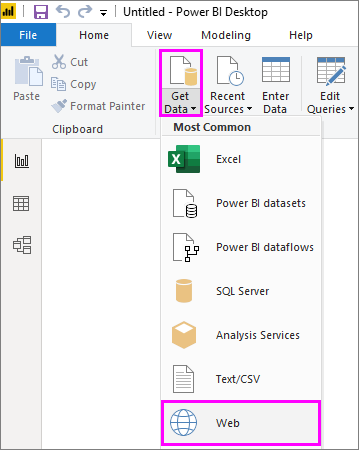

# Sarakkeen lisääminen esimerkeistä Power BI Desktopissa
Power Query -editorin *Lisää sarake esimerkeistä* -toiminnolla voit lisätä uusia sarakkeita tietomalliisi yksinkertaisesti antamalla vähintään yhden esimerkkiarvon uusille sarakkeille. Voit luoda uudet sarake-esimerkit valinnasta tai antaa syötteen kaikkien taulukossa olemassa olevien sarakkeiden perusteella.

*Lisäämällä sarakkeen esimerkistä* voit nopeasti ja helposti luoda uusia sarakkeita, mikä sopii erinomaisesti seuraavissa tilanteissa:

- Sinulla on valmiina uuden sarakkeen tiedot, mutta et ole varma, mitä muunnosta tai muunnoksia sinun pitäisi käyttää.
- Tiedät, mitä muunnoksia tarvitset, mutta et ole varma mitä sinun pitäisi valita käyttöliittymästä.
- Tiedät kaikki tarvitsemasi muunnokset *mukautettu sarake* -lausekkeen käyttöön *M*-kielessä, mutta vähintään yksi lausekkeista ei ole käytettävissä käyttöliittymässä.

Sarakkeen lisääminen esimerkistä on helppoa ja yksinkertaista. Seuraavissa osissa näytetään, miten helppoa se on.

## Uuden sarakkeen lisääminen esimerkeistä

Jos haluat noutaa mallitietoja Wikipediasta, valitse **Nouda tiedot** > **Verkko** Power BI Desktopin valintanauhan **Aloitus**-välilehdestä. 

Liitä seuraava URL-osoite näyttöön avautuvassa valintaikkunassa ja valitse **OK**: 

*https:\//wikipedia.org/wiki/List_of_states_and_territories_of_the_United_States*

Valitse **Siirtymistoiminto**-valintaikkunassa **Yhdysvaltain osavaltiot** -taulukko ja valitse sitten **Muunna tiedot**. Taulukko avautuu Power Query -editorissa.

Jos taas haluat avata jo ladatut tiedot Power BI Desktopista, valitse **Muokkaa kyselyitä** valintanauhan **Aloitus**-välilehdestä. Tiedot avautuvat Power Query -editoriin. 

Kun mallitiedot ovat avautuneet Power Query Editorissa, valitse valintanauhassa **Lisää sarake** -välilehti valintanauhassa ja valitse sitten **Sarake esimerkeistä**. Valitse **Sarake esimerkeistä** -kuvake, jos haluat luoda sarakkeen kaikista olemassa olevista sarakkeista, tai valitse avausnuoli, jos haluat valita vaihtoehdon **Kaikista sarakkeista** tai **Valinnasta**. Käytä tässä opastuksessa vaihtoehtoa **Kaikista sarakkeista**.

## Lisää sarake esimerkeistä -ruutu
Kun valitset **Lisää sarake** > **esimerkeistä**, **Lisää sarake esimerkeistä** -ruutu avautuu taulukon yläosaan. Uusi **Sarake 1** näkyy olemassa olevien sarakkeiden oikealla puolella (saatat joutua vierittämään nähdäksesi ne kaikki). Kun annat esimerkkiarvot **Sarakkeen 1** tyhjille soluille, Power BI luo esimerkkejäsi vastaavat säännöt ja muunnokset ja täyttää loput sarakkeesta niillä.

Huomaa, että **Sarake esimerkeistä** näkyy myös **Kyselyasetukset**-ruudun **Käytetty vaihe** -kohdassa. Tavalliseen tapaan Power Query -editori tallentaa muunnosvaiheet ja käyttää niitä kyselyssä järjestyksessä.

Kun olet kirjoittamassa esimerkkiä uuteen sarakkeeseen, Power BI näyttää esikatselun sarakkeesta luomiensa muunnosten perusteella. Jos kirjoitat esimerkiksi *Alabama* ensimmäiselle riville, se vastaa **Alabama**-arvoa taulukon ensimmäisessä sarakkeessa. Kun painat Enter-näppäintä, Power BI täyttää loput uudesta sarakkeesta ensimmäisen sarakkeen arvon perusteella ja antaa sarakkeelle nimen **Nimi ja postiosoitetunnus[12] - Kopio**.

Siirry nyt uuden sarakkeen riville **Massachusetts [E]** ja poista merkkijonosta osa **[E]** . Power BI havaitsee muutoksen ja luo muunnoksen esimerkin perusteella. Power BI kuvailee **Lisää sarake esimerkeistä** -ruudussa olevat muunnokset ja nimeää sarakkeen uudelleen muotoon **Ennen erotinta oleva teksti.** 

Kun jatkat esimerkkien lisäämistä, Power Query -editori lisää muunnoksia. Kun olet tyytyväinen, ota muutokset käyttöön valitsemalla **OK**. 

Voit nimetä uuden sarakkeen uudelleen kaksoisnapsauttamalla sarakeotsikkoa tai napsauttamalla sitä hiiren kakkospainikkeella ja valitsemalla **Nimeä uudelleen**. 

Tässä videossa esitellään **Lisää sarake esimerkeistä** -toiminnon käyttöä mallitietolähteen avulla: 

[Power BI Desktop: Lisää sarake esimerkeistä](https://www.youtube.com/watch?v=-ykbVW9wQfw). 

## Luettelo tuetuista muunnoksista
Monet muunnokset (eivät kaikki) ovat käytettävissä käytettäessä **Lisää sarake esimerkeistä** -toimintoa. Seuraavassa luettelossa ovat tuetut muunnokset:

**Yleistä**

- Ehdollinen sarake

**Viittaus**
  
- Viittaus tiettyyn sarakkeeseen, mukaan lukien rajaukset, puhdistukset ja kirjainkoon muutokset

**Tekstin muunnokset**

- Yhdistä (tukee merkkijonojen ja kokonaisen sarakkeen arvojen yhdistämistä)
- Korvaa
- Pituus
- Poimi   
  - Ensimmäiset merkit
  - Viimeiset merkit
  - Alue
  - Ennen erotinta oleva teksti
  - Erottimen jälkeen oleva teksti
  - Erottimien välissä oleva teksti
  - Pituus
  - Poista merkit
  - Säilytä merkit

> [!NOTE]
> Kaikki *tekstin* muunnokset ottavat huomioon mahdolliset rajaus-, puhdistus- tai kirjainkoon muunnostarpeet sarakkeen arvoissa.

**Päivämäärän muunnokset**

- Päivä
- Viikon päivä
- Viikon päivän nimi
- Vuoden päivä
- Kuukausi
- Kuukauden nimi
- Vuoden neljännes
- Kuukauden viikko
- Vuoden viikko
- Vuosi
- Ikä
- Vuoden alku
- Vuoden loppu
- Kuukauden alku
- Kuukauden loppu
- Vuosineljänneksen alku
- Kuukauden päivien määrä
- Vuosineljänneksen loppu
- Viikon alku
- Viikon loppu
- Kuukauden päivä
- Päivän alku
- Päivän loppu

**Ajan muunnokset**

- Hour
- Minute
- Second  
- Paikallinen aika

> [!NOTE]
> Kaikki *päivämäärän* ja *ajan* muunnokset ottavat huomioon mahdollisen tarpeen muuntaa sarakkeen arvot *päivämääräksi* tai *ajaksi* tai *päivämääräksi/ajaksi*.

**Lukujen muunnokset** 

- Absoluuttinen arvo
- Arkuskosini
- Arkussini
- Arkustangentti
- Muunna luvuksi
- Kosini
- Kuutio
- Jaa
- Eksponentti
- Kertoma
- Kokonaislukujako
- Parillinen
- Pariton
- Ln
- 10-kantainen logaritmi
- Jakojäännös
- Kertolasku
- Pyöristä alaspäin
- Pyöristä ylöspäin
- Etumerkki
- Sin
- Neliöjuuri
- Neliö
- Erotus
- Summa
- Tangentti
- Jakauma/alueet

