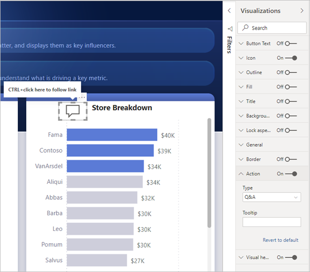

# Painikkeiden käyttäminen Power BI:ssä
Power BI:n **painikkeiden** avulla voit luoda raportteja, jotka toimivat sovellusten tavoin ja jotka luovat siten kiinnostavan ympäristön. Siinä käyttäjät voivat osoittaa ja valita Power BI -sisältöä hiirellä ja olla vuorovaikutuksessa sen kanssa muilla tavoilla. Voit lisätä painikkeita raportteihin **Power BI Desktopissa** ja **Power BI -palvelussa**. Kun jaat raporttisi Power BI -palvelussa, ne tarjoavat käyttäjillesi sovelluksen kaltaisen käyttökokemuksen.

## Painikkeiden luominen raporteissa

### Painikkeen luominen Power BI Desktopissa

Voit luoda painikkeen **Power BI Desktopissa** valitsemalla **Lisää**-valintanauhassa **Painikkeet**. Näyttöön tulee avattava valikko, josta voit valita haluamasi painikkeen seuraavassa kuvassa esitetyistä eri vaihtoehdoista. 

### Painikkeen luominen Power BI -palvelussa

Luo painike **Power BI -palvelussa** avaamalla raportti muokkausnäkymässä. Valitse yläreunan valikkorivillä **Painikkeet**. Näyttöön tulee avattava valikko, josta voit valita haluamasi painikkeen seuraavassa kuvassa esitetyistä eri vaihtoehdoista. 

## Painikkeen mukauttaminen

Prosessin loppuosa on sama riippumatta siitä, luotko painikkeen Power BI Desktopissa vai Power BI -palvelussa. Kun valitset painikkeen raporttialustalla, **Visualisoinnit**-ruudussa näytetään useita tapoja, joilla voit mukauttaa painikkeen tarpeidesi mukaiseksi. Voit esimerkiksi ottaa käyttöön **Painikkeen tekstin** tai poistaa sen käytöstä **Visualisoinnit**-ruudun liukusäätimellä. Voit myös muuttaa mm. painikkeen kuvaketta, painikkeen täyttöä, otsikkoa ja sitä, minkä toiminnon painikkeen valitseminen raportissa käynnistää.

## Voit määrittää painikkeen ominaisuudet, kun sillä ei tehdä mitään, kun osoitin on sen päällä tai kun painike on valittu

Power BI:n painikkeilla on kolme tilaa: oletus (miltä painike näyttää, kun sitä ei osoiteta ja kun se ei ole valittuna), osoitettuna ja valittuna (kun painiketta on *napsautettu*). Monia **Visualisoinnit**-ruudun kortteja voidaan muokata yksitellen mukaan näiden kolmen tilan mukaan, minkä ansiosta painikkeita voidaan mukauttaa joustavasti.

**Visualisoinnit**-ruudun seuraavien korttien avulla voit säätää painikkeen muotoilua tai toimintaa sen kolmen tilan perusteella:

* Painikkeen teksti
* Kuvake
* Ääriviiva
* Täyttö

Jos haluat valita, miltä painikkeen pitäisi näkyä kussakin tilassa, laajenna jokin korteista ja valitse kortin yläosassa näkyvä avautuva luettelo. Seuraavassa kuvassa **Kuvake**-kortti on laajennettu ja avattava luettelo valittu niin, että kaikki kolme tilaa näkyvät:

## Painikkeen toiminnon valitseminen

Voit valita, mikä toiminto käynnistetään, kun käyttäjä valitsee painikkeen Power BI:ssä. Voit käyttää painikkeiden toimintojen asetuksia **Visualisoinnit**-ruudun **Toiminto**-kortista.

Painikkeen toiminnon asetukset ovat seuraavat:

- **Takaisin** palauttaa käyttäjän raportin edelliselle sivulle. Tämä on hyödyllinen ominaisuus sivuilla, joissa poraudutaan.
- **Kirjanmerkki** näyttää raporttisivun, joka on liitetty senhetkisen raportin kirjanmerkkiin. Katso lisätietoja [kirjanmerkeistä Power BI:ssä](desktop-bookmarks.md). 
- **Porautuminen (esikatselu)** siirtää käyttäjän porautumissivulle hänen valinnoillaan suodatettuna ilman kirjanmerkkien käyttämistä. Katso lisätietoja [raporttien porautumispainikkeista](desktop-drill-through-buttons.md).
- **Sivussa siirtyminen** siirtää käyttäjän raportin eri sivulle myös ilman kirjanmerkkien käyttämistä. Katso lisätietoja tämän artikkelin kohdasta [Sivussa siirtymisen luominen](#create-page-navigation).
- **Q&A** avaa **Q&A Explorer** -ikkunan. 

Tietyillä painikkeilla on automaattisesti valittu oletustoiminto. Esimerkiksi **Q&A**-painiketyypin oletustoiminnoksi valitaan automaattisesti **Q&A**. Katso lisätietoja **Q&A Explorerista**[tästä blogikirjoituksesta](https://powerbi.microsoft.com/blog/power-bi-desktop-april-2018-feature-summary/#Q&AExplorer).

Voit kokeilla tai testata raportin painikkeita käyttämällä *CTRL + NAPSAUTUS* -yhdistelmää haluamaasi painikkeeseen. 

### Sivussa siirtymisen luominen

**Toiminto**-tyypin **sivussa siirtymisellä** voit luoda nopeasti kaikki siirtymistoiminnot ilman, että sinun tarvitsee tallentaa tai hallita yhtään kirjanmerkkiä.

Jos haluat määrittää sivussa siirtymisen painikkeen, luo painike **Sivussa siirtyminen** -kohdassa toimintotyyppinä ja valitse **Kohde**-sivu.

Voit luoda mukautetun siirtymisruudun nopeasti. Sinun ei tarvitse muokata ja hallita kirjanmerkkejä, jos haluat muuttaa siirtymisruudussa näytettäviä sivuja.

Lisäksi voit muotoilla työkaluvihjeen ehdollisesti samalla tavalla kuin muutkin painiketyypit.

## Seuraavat vaiheet
Seuraavissa artikkeleissa on lisätietoja ominaisuuksista, jotka muistuttavat painikkeita tai toimivat niiden kanssa:

* [Porautumisen käyttäminen Power BI -raporteissa](desktop-drillthrough.md)
* [Kirjanmerkkien käyttäminen merkityksellisten tietojen jakamiseen ja tarinoiden koostamiseen Power BI:ssä](desktop-bookmarks.md)

