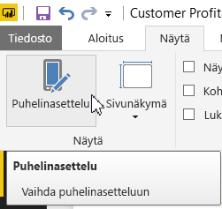
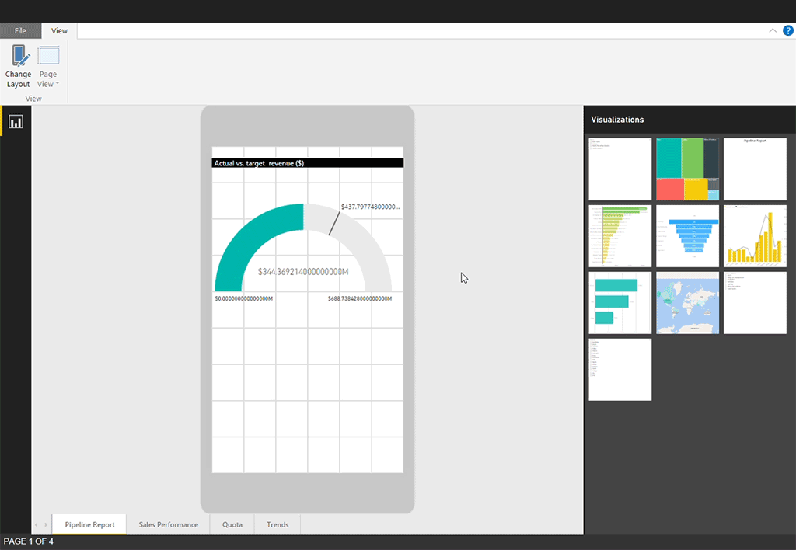
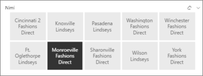
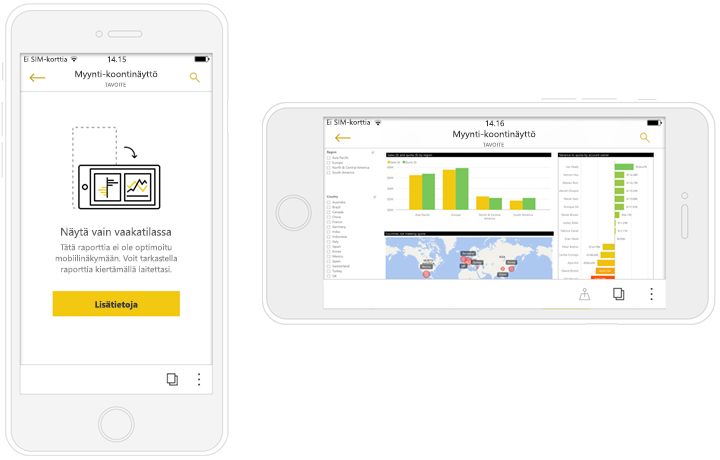

# Power BI -raporttien optimointi mobiilisovellukselle
Voit parantaa raporttiesi tarkastelua mobiilisovelluksissa luomalla pystysuuntaisen asettelun. Power BI Desktopissa ja Power BI -palvelussa voit järjestellä raporttien visualisointeja uudelleen ja muuttaa niiden kokoa saadaksesi parhaan mahdollisen käyttökokemuksen pystysuuntaisessa tilassa.  

Etsitkö sen sijaan tietoja raporttien tarkastelemisesta mobiililaitteessa? Kokeile pikaopasta [Raporttinäkymien ja raporttien tarkastelu Power BI -mobiilisovelluksissa](../consumer/mobile/mobile-apps-quickstart-view-dashboard-report.md).

Lisäksi voit luoda [reagoivia visualisointeja](#optimize-a-visual-for-any-size) ja [reagoivia osittajia](#enhance-slicers-to-work-well-in-phone-reports), joiden koko muuttuu kätevästi millä laitteella tahansa. Jos lisäät raporttiin suodattimia, ne näkyvät automaattisesti optimoidussa raportissa.

## Raporttisivun pystysuuntaisen version asettelu

Kun olet luonut raportin, voit optimoida sen puhelin- ja tablettikäyttöä varten.

1. Valitse Power BI Desktopin **raporttinäkymässä** **Näkymä**-välilehdeltä **Puhelinasettelu**.  
   
    
   
    Valitse Power BI -palvelussa **Muokkaa raporttia** > **Mobiiliasettelu**.

    Näet tyhjän pohjan, joka on muotoiltu puhelimen mukaan. Oikean reunan **Visualisoinnit**-paneelissa on luettelo kaikista alkuperäisen raporttisivun visualisoinneista.

1. Lisää puhelinasetteluun haluamasi visualisointi vetämällä se **Visualisoinnit**-paneelista puhelinpohjalle.
   
    Puhelinraporteissa käytetään ruudukkoasettelua. Kun vedät visualisointeja mobiilipohjaan, ne kohdistuvat ruudukon ruutujen mukaisesti.
   
    
   
    Voit lisätä puhelimen raporttisivulle joko osan pääraporttisivun visualisoinneista tai ne kaikki. Voit lisätä kunkin visualisoinnin vain kerran. Kaikkia visualisointeja ei tarvitse sisällyttää.

1. Voit muuttaa visualisointien kokoa ruudukossa samalla tavalla kuin ruutujen kokoa muutetaan koontinäytöissä tai mobiililaitteiden koontinäytöissä.
   
   Puhelinraportin ruudukko skaalautuu erikokoisiin puhelimiin, joten raportti näyttää hyvältä niin pienillä kuin suurillakin puhelimen näytöillä.
   
   

## Visualisoinnin optimointi mihin tahansa kokoon
Voit määrittää raporttinäkymän tai raportin visualisoinnit *reagoiviksi*. Visualisoinnit muuttuvat dynaamisesti näyttämään dataa ja merkityksellisiä tietoja suurin mahdollinen määrä, oli näyttö minkäkokoinen tahansa. 

Visualisoinnin koon muuttuessa Power BI priorisoi tietonäkymän. Se voi esimerkiksi poistaa täytön ja siirtää selitteen visualisoinnin yläpuolelle, jolloin visualisointi pysyy informatiivisena myös pienessä koossa.

Voit valita visualisointikohtaisesti, otetaanko reagointi käyttöön. Lisätietoja [visualisointien optimoinnista](../visuals/power-bi-report-visualizations.md).

## Huomioon otettavia seikkoja luotaessa raporttien puhelinasetteluja
* Jos raportissa on useita sivuja, voit joko optimoida kaikki sivut tai vain osan niistä. 
* Jos olet määrittänyt raporttisivulle taustavärin, puhelinraportissa käytetään samaa taustaväriä.
* Muotoiluasetuksia ei voi määrittää erikseen puhelinkäyttöä varten. Alkuperäisen asettelun ja mobiiliasettelun muotoilut ovat yhdenmukaiset. Esimerkiksi fonttikoot ovat samat.
* Jos haluat muuttaa visualisointia, esimerkiksi sen muotoilua, tietojoukkoa, suodattimia tai muita ominaisuuksia, palaa normaaliin raportin luontitilaan.
* Power BI tarjoaa puhelinraportteja varten oletusarvoisia otsikoita ja sivujen nimiä mobiilisovelluksessa. Jos olet luonut raporttiin tekstivisualisointeja otsikoita ja sivujen nimiä varten, niitä ei ehkä kannata lisätä puhelinraportteihin.     

## Visualisoinnin poistaminen puhelinasettelusta
* Jos haluat poista visualisoinnin, napsauta **X**-kohtaa visualisoinnin oikeasta yläkulmasta tai valitse visualisointi ja paina **Delete**-näppäintä.
  
   Visualisoinnin poistaminen tällä tavalla poistaa sen vain puhelinasettelun pohjalta. Se ei vaikuta itse visualisointiin tai alkuperäiseen raporttiin.
  
   

## Osittajien optimointi puhelinraporteissa käyttämistä varten
Osittajien avulla voidaan suodattaa raportin tietoja raporttipohjalla. Luodessasi osittajia normaalissa raportin luontitilassa voit muokata joitakin osittaja-asetuksia niin, että osittajat toimivat paremmin myös puhelinraporteissa:

* Valitse, saavatko raportin lukijat valita vain yhden kohteen vai useita.
* Kehystä osittajat, jotta raportti on helpompi silmäillä läpi.
* Tee osittajista joko pystysuoria, vaakasuoria tai *reagoivia*. 

Jos teet osittajasta reagoivan, se näyttää enemmän tai vähemmän vaihtoehtoja sen mukaan, miten sen kokoa ja muotoa muutetaan. Se voi näkyä joko korkeana, lyhyenä, leveänä tai kapeana. Jos pienennät sitä riittävästi, siitä tulee pelkkä suodatinkuvake raporttisivulle. 

Lisätietoja [reagoivien osittajien luomisesta](power-bi-slicer-filter-responsive.md).

## Puhelinraportin julkaiseminen
Kun haluat julkaista raportin puhelinversion, [julkaise varsinainen raportti Power BI Desktopista Power BI -palveluun](desktop-upload-desktop-files.md), niin puhelinversio julkaistaan samassa yhteydessä.
  
Lisätietoja [jakamisesta ja käyttöoikeuksista Power BI:ssä](../collaborate-share/service-how-to-collaborate-distribute-dashboards-reports.md).

## Optimoitujen ja optimoimattomien raporttien näyttäminen puhelimessa tai tabletissa
Power BI tunnistaa puhelinten mobiilisovelluksissa automaattisesti optimoidut ja optimoimattomat puhelinraportit. Jos raportista on puhelinoptimoitu versio, Power BI:n puhelinsovellus avaa automaattisesti raportin puhelinraporttina.

Jos raportista ei ole puhelinoptimoitua versiota, raportti avautuu optimoimattomana, vaakanäkymässä.  

Puhelinraportissa puhelimen suunnan muuttaminen vaakasuuntaiseksi avaa raportin optimoimattomassa näkymässä alkuperäisellä raporttiasettelulla, oli raportista olemassa optimoitu versio tai ei.

Jos optimoit vain joitakin sivuja, lukijat saavat pystynäkymässä ilmoituksen siitä, että raportti on saatavilla vaakanäkymässä.

Raportin lukijat voivat kääntää puhelimen tai tabletin sivuttain ja tarkastella sivua vaakasuuntaisena. Lisätietoja [vuorovaikutuksesta vaakasuuntaiseen tilaan optimoitujen Power BI ‑raporttien kanssa](../consumer/mobile/mobile-apps-view-phone-report.md).

## Seuraavat vaiheet
* [Luo koontinäytön puhelinnäkymä Power BI:ssä](service-create-dashboard-mobile-phone-view.md).
* [Tarkastele puhelimelle optimoituja Power BI ‑raportteja](../consumer/mobile/mobile-apps-view-phone-report.md).
* [Luo mihin tahansa kokoon optimaalisten reagoivia visualisointeja](../visuals/power-bi-report-visualizations.md).
* Onko sinulla kysyttävää? [Voit esittää kysymyksiä Power BI -yhteisössä](https://community.powerbi.com/).
