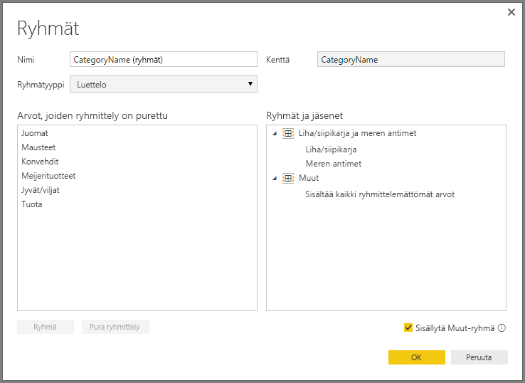

# Ryhmittely ja lokeroiminen Power BI Desktopissa
Kun Power BI Desktop luo visualisointeja, se kokoaa tiedot lohkoiksi (tai ryhmiksi), jotka perustuvat pohjalla olevien tietojen sisältämiin arvoihin. Useimmiten esitys on kunnossa, mutta joskus saatat haluta tarkentaa miten kyseiset lohkot esitetään. Saatat esimerkiksi haluta sijoittaa kolme tuoteluokkaa yhteen suurempaan luokkaan (yksi *ryhmä*). Tai haluat ehkä nähdä myyntiluvut yhdessä lokerossa lukuna 1 000 000 euroa 923 983 euron suuruisten lohkojen sijaan.

Power BI Desktopissa voit *ryhmitellä* arvopisteet auttamaan sinua tarkastelemaan, analysoimaan ja tutkiman visualisointien tietoja ja trendejä. Voit myös määrittää *lokeron koon*, jos haluat sijoittaa arvot yhtä suuriin ryhmiin, joiden avulla voit paremmin visualisoida tietoja merkitsevällä tavalla. Tätä toimintoa kutsutaan usein *lokeroimiseksi*.

## Ryhmittelyn käyttö
Jos haluat käyttää ryhmittelyä, valitse vähintään kaksi visualisoinnin elementtiä käyttämällä näppäinyhdistelmää CTRL + NAPSAUTUS useiden elementtien valintaan. Napsauta sitten jotakin monivalintaelementtiä hiiren kakkospainikkeella ja valitse pikavalikosta **Ryhmittele**.

Kun ryhmä on luotu, se lisätään **Selite**-säiliöön visualisointia varten. Ryhmä näkyy myös **Kentät**-luettelossa.

Kun sinulla on ryhmä, voit helposti muokata kyseisen ryhmän jäseniä. Napsauta hiiren kakkospainikkeella **Selite**-säilön tai **Kentät**-luettelon kenttää ja valitse **Muokkaa ryhmiä**.

**Ryhmät**-ikkunassa voit luoda uusia ryhmiä tai muokata olemassa olevia ryhmiä. Voit myös *nimetä uudelleen* minkä tahansa ryhmän. Kaksoisnapsauta ryhmän otsikkoa **Ryhmät ja jäsenet** -ruudussa ja kirjoita sitten uusi nimi.

Voit tehdä ryhmillä kaikenlaista. Voit lisätä kohteita **Arvot, joiden ryhmittely on purettu** -luettelosta uuteen ryhmään tai yhdeksi olemassa olevaksi ryhmäksi. Jos haluat luoda uuden ryhmän, valitse kaksi tai useampi kohde (käyttäen painikeyhdistelmää CTRL + napsautus) **Arvot, joiden ryhmittely on purettu** -ruutuun ja valitse sitten **Ryhmä** -painiketta kyseisen ruudun alta.

Voit lisätä puretun arvon aiemmin luotuun ryhmään: valitse jokin **purettu arvo** ja valitse sitten aiemmin luotu ryhmä, johon haluat lisätä arvon ja valitse **Ryhmä**-painike. Jos haluat poistaa tietoyksikön ryhmästä, valitse se **Ryhmät ja jäsenet** -ruudusta ja valitse sitten **Pura ryhmittely**. Voit myös siirtää ryhmittelemättömiä luokkia **Muut**-ryhmään tai jättää ne ryhmittelemättä.

> [!NOTE]
> Voit luoda ryhmiä mille tahansa kentälle kohdassa **Kentät** ilman monivalintaa olemassa olevasta visualisoinnista. Napsauta kenttää hiiren kakkospainikkeella ja valitse **Uusi ryhmä** esiin tulevasta valikosta.

## Lokeroinnin käyttäminen
Voit määrittää numeeristen ja aika-kenttien lokeron koon **Power BI Desktopissa.** Voit käyttää lokeroimisen Power BI Desktopissa näkyvien tietojen oikeaan kokoon saattamiseksi.

Voit käyttää lokeron kokoa napsauttamalla hiiren kakkospainikkeella **Kenttä** ja valitsemalla **Uusi ryhmä**.

**Ryhmät**-valintaikkunassa asetetaan haluttu **lokeron koko**.

Kun valitset **OK** huomaat, että uusi kenttä tulee näkyviin **Kentät**-ruutuun **(lokerot)** liitettynä. Sitten voit vetää tämän kentän alustalle lokeron koon käyttämiseksi visualisoinnissa.

Jos haluat nähdä *lokeroimisen* käytännössä, katso tämä [video](https://www.youtube.com/watch?v=BRvdZSfO0DY).

Tässä kaikki *ryhmittelystä* ja *lokeroimisesta*, kun haluat varmistaa visualisointien näkymisen raporteissa juurin niin kuin haluat niiden näkyvän.
