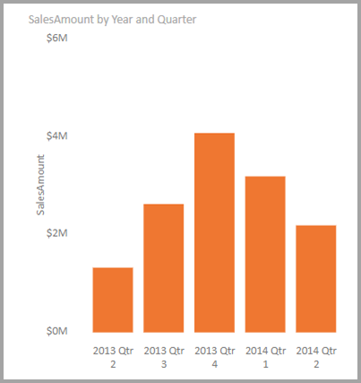
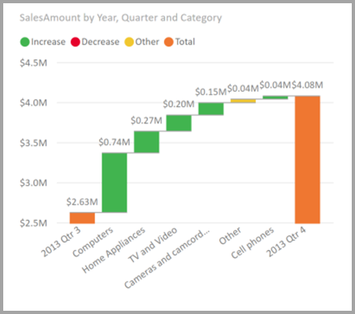

# Visualisointien muutosten selittäminen merkityksellisillä tiedoilla Power BI Desktopissa (esiversio)

Visualisointien arvoissa näkyy usein suuria lisäyksiä ja jyrkkiä laskuja, mitkä saattavat herättää ihmetystä. **Power BI Desktopin** **merkitykselliset tiedot** paljastavat syyn muutamalla napsautuksella.

Otetaan esimerkiksi seuraava visualisointi, jossa *myynnin määrä* esitetään *vuoden* ja *vuosineljänneksen* mukaan. Myynti pienenee suuresti vuonna 2014, jolloin myynnissä ilmenee jyrkkä lasku *1. neljänneksen* ja *2. neljänneksen* välillä. Tällaisissa tapauksissa voit tutkia tietoja ja selvittää, mistä muutos on johtunut. 

Voit käyttää **Power BI Desktopia** selittämään nousut ja laskut kaavioissa, jakaumakertoimen tarkasteluun kaavioissa sekä merkityksellisten tietojen hankkimiseen tiedoistasi nopeasti ja automaattisesti. Napsauta vain arvopistettä hiiren kakkospainikkeella ja valitse **Analysoi > Selitä lasku** (tai nousu, jos edellinen palkki oli pienempi) tai **Analysoi > Etsi, missä tämä jakauma on erilainen**. Merkityksellinen tieto toimitetaan sinulle helppokäyttöisessä ikkunassa.

Ominaisuus on tilannekohtainen ja perustuu sitä edeltävään arvopisteeseen – kuten edelliseen palkkiin tai sarakkeeseen.

> [!NOTE]
> Tämä ominaisuus on esikatselutilassa, ja tiedot voivat muuttua. Ominaisuus on käytössä oletusarvoisesti (sinun ei tarvitse tarkistaa Esikatselu-ruutua käyttöönottoa varten) alkaen **Power BI Desktopin** syyskuun 2017 versiosta.

## Merkityksellisten tietojen käyttö
Jos haluat käyttää merkityksellisiä tietoja kaavioissa näkyvien nousujen tai laskujen selittämiseen, napsauta hiiren kakkospainikkeella mitä tahansa palkin tai viivakaavion arvopistettä ja valitse **Analysoi > Selitä lisäys** (tai *Selitä vähennys*, koska kaikki merkitykselliset tiedot perustuvat edellisen arvopisteen muutokseen).

**Power BI Desktop** suorittaa sitten koneoppimisen algoritmeja tiedoista ja täyttää ikkunan, jossa on visualisointi ja kuvaus, joka kuvaa, mihin luokkiin nousut ja laskut ovat vaikuttaneet eniten. Oletusarvon mukaan merkitykselliset tiedot on esitetty *vesiputous*-visualisointina seuraavassa esitetyllä tavalla.

Valitsemalla pienet kuvakkeet vesiputouksen alareunasta voit valita merkityksellisten tietojen näyttämisen pistekaaviona, pinottuna pylväskaaviona tai nauhakaaviona.

*Peukalo ylös*- ja *Peukalo alas* -kuvakkeet sivun yläreunassa ovat visualisoinnin ja ominaisuuden palautetta varten. Näin voit antaa palautetta, mutta palaute ei tällä hetkellä opeta algoritmia niin, että sillä olisi vaikutusta tuloksiin, kun seuraavan kerran käytät ominaisuutta.

Ja ennen kaikkea **+** -painike visualisoinnin yläosassa mahdollistaa valitun visualisoinnin lisäämisen raporttiin, aivan kuin olisit luonut visualisoinnin manuaalisesti. Voit sitten muotoilla tai muuten säätää lisättyä visuaalisuutta samalla tavalla kuin mitä tahansa muuta visualisointia raportissasi. Voit lisätä valitun merkityksellisen tiedon visualisoinnin vain, kun muokkaat raporttia**Power BI Desktopissa**.

Voit käyttää merkityksellistä tietoa raportin ollessa luku- tai muokkaustilassa ja monipuolistaa sekä tietojen analysointia että helpottaa visualisointien luomista, jotka voit helposti lisätä raportteihisi.

## Palautettujen tulosten tiedot

Merkityksellisten tietojen palauttamat tiedot korostavat eroja kahden ajanjakson välillä, jotta ymmärtäisit paremmin ajanjaksojen välisen muutoksen.  

Esimerkiksi jos *myynti* on noussut yhteensä 55 prosenttia *3. neljänneksen* ja *4. neljänneksen* välillä ja sama pätee tuotteiden jokaiseen *luokkaan* (tietokoneiden myynti nousi 55 %, audiotuotteiden myynti nousi 55 % ja niin edelleen) sekä jokaiseen maahan ja jokaiseen asiakastyyppiin, tiedoissa ei ole paljoakaan, mikä auttaisi selittämään muutoksen. Yleensä tilanne on kuitenkin toinen, joten tiedoista löytyy eroja. Saattaa esimerkiksi olla, että *Tietokoneet*- ja *Kodinkoneet*-luokat kasvoivat huomattavasti enemmän (63 %), kun taas *TV ja äänentoisto* kasvoi vain 23 %. Näin ollen *Tietokoneet* ja *Kodinkoneet* muodostivat *4. neljänneksellä* suuremman osan kokonaismyynnistä kuin *3. neljänneksellä*.  Tässä esimerkissä sopiva selitys myynnin kasvulle olisi: *erityisen paljon myyntiä: tietokoneet ja TV ja äänentoisto*. 

Algoritmi ei siis pelkästään palauta arvoja, jotka liittyvät suurimpaan muutokseen. Jos esimerkiksi ylivoimaisesti suurin osuus myynnistä (98 %) olisi peräisin Yhdysvalloista, tällöin yleensä myös suurin myynnin lisäys tapahtuisi Yhdysvalloissa. Ellei Yhdysvalloissa tai muissa maissa kuitenkaan ilmene huomattavaa muutosta maan suhteelliseen osuuteen kokonaisuudesta, *Maa* ei ole kiinnostava tässä yhteydessä.  

Yksinkertaisesti sanottuna algoritmin voidaan ajatella ottavan huomioon mallin kaikki muut sarakkeet ja laskevan kyseisen sarakkeen perusteella erottelun *ennen*- ja *jälkeen*-ajanjaksoille, jolloin saadaan määritettyä, kuinka suuri muutos ilmeni kyseisenä ajanjaksona, sekä palautettua ne sarakkeet, joissa ilmeni suurin muutos. Yllä olevassa esimerkissä esimerkiksi valittiin *Luokka*, sillä *TV ja video* -luokan osuus laski 7 % (33 % => 26 %), kun taas *Kodinkoneet*-luokan osuus kasvoi nollasta yli 6 prosenttiin. 

Kunkin palautetun sarakkeen osalta voidaan esittää neljä visualisointia. Näistä visualisoinneista kolme on tarkoitettu korostamaan muutosta sarakkeen osuudessa kahden ajanjakson välillä. Visualisointi voi esimerkiksi selittää kasvun *2. neljänneksestä* *3. neljännekseen*.

### Pistekaavio

Pistekaavio-visualisointi näyttää mittarin arvon ensimmäisellä ajanjaksolla (x-akselilla) verrattuna mittarin arvoon toisella ajanjaksolla (y-akselilla) kullekin sarakkeen arvolle (tässä tapauksessa *Luokka*). Kuten seuraavassa kuvassa näkyy, arvopisteet ovat vihreällä alueella, jos arvo on kasvanut, ja punaisella alueella, jos arvo on laskenut. 

Pisteviiva näyttää parhaan vastaavuuden, joten tämän viivan yläpuolella olevat arvopisteet ovat kasvaneet yleistä trendiä enemmän ja viivan alapuolella olevat arvopisteet vähemmän.  

Huomaa, että pistekaaviossa eivät näy sellaiset tieto-osat, joiden arvo oli tyhjä jommankumman ajanjakson aikana (esimerkiksi *Kodinkoneet* tässä tapauksessa)

### 100 %:n pinottu pylväskaavio

100 %:n pinottu pylväskaavio -visualisointi näyttää mittarin arvon ennen ja jälkeen, valitun sarakkeen mukaisesti ja esitettynä 100 %:n pinottuna pylväskaaviona. Näin voit vertailla osuuden suuruutta rinnakkain ennen ja jälkeen. Työkaluvihjeet näyttävät valitun arvon todellisen osuuden.

### Nauhakaavio

Myös nauhakaavio-visualisointi näyttää mittarin arvon ennen ja jälkeen. Se on erityisen hyödyllinen esitettäessä muutoksia osuuteen, kun muutosten seurauksena osallistujien *järjestys* muuttuu (jos esimerkiksi *Tietokoneet* oli aiemmin suurin osallistuja, mutta nyt pudonnut sijalle kolme). 

### Vesiputouskaavio

Neljäs visualisointi on vesiputouskaavio, joka esittää jaksojen väliset huomattavimmat varsinaiset suurenemiset tai pienenemiset. Tämä visualisointi esittää selvästi varsinaiset muutokset, mutta ei yksinään erittele muutoksia sille tasolle, joka osoittaisi, miksi sarake on valittu kiinnostavaksi. 

Kun sarakkeita luokitellaan sen mukaan, missä sarakkeissa on suurimmat erot suhteellisten osallistumisten mukaan, huomioon otetaan seuraava asia: 

* Kardinaliteetti on otettu lukuun, sillä muutos on tilastollisesti vähemmän merkittävä (ja vähemmän kiinnostava), jos sarakkeen kardinaliteetti on suuri. 

* Sellaisten luokkien muutoksia, joiden alkuperäiset arvot ovat erittäin suuria tai hyvin lähellä nollaa, painotetaan enemmän kuin muita. Jos esimerkiksi jonkin luokan osuus myynnistä oli vain 1 % ja kyseinen osuus muuttui 6 %:iin, tämä on tilastollisesti merkittävämpää ja näin ollen kiinnostavampaa kuin luokka, jonka osuus muuttui 50 prosentista 55 prosenttiin. 

* Merkittävimpien tulosten valintaan käytetään monenlaista heuristiikkaa, ja valinnassa otetaan huomioon esimerkiksi tietojen väliset muut suhteet.
 
Eri sarakkeiden tutkimisen jälkeen sarakkeista valitaan ne, joissa ilmenee suurin muutos suhteelliseen osuuteen, ja kyseiset sarakkeet esitetään. Kunkin sarakkeen osalta kuvauksessa eritellään ne arvot, joiden osuus on muuttunut merkittävimmin. Lisäksi esitellään arvot, joissa ilmenivät suurimmat varsinaiset nousut ja laskut.

## Huomioitavat asiat ja rajoitukset
Nämä merkitykselliset tiedot perustuvat edellisen arvopisteen muutokseen, joten ne eivät ole käytettävissä, kun valitset visualisoinnin ensimmäisen arvopisteen. 

Seuraavassa luettelossa on esitetty tilanteita, joissa **lisäyksen/vähennyksen selitystä** ei tällä hetkellä tueta:

* TopN-suodattimet
* Sisällyttää tai jättää pois suodattimet
* Mittarisuodattimet
* Muu kuin numeeriset mittarit
* ”Näytä arvo muodossa” -toiminnon käyttö
* Suodatetut mittarit - Suodatetut mittarit ovat visuaalisen tason laskutoimituksia, joihin sovelletaan tiettyä suodatinta (esimerkiksi *Ranskan kokonaismyynti*), ja joita käytetään joissakin merkityksellisten tietojen toiminnon luomissa visualisoinneissa
* X-akselin luokitellut sarakkeet, elleivät ne määritä lajittelua sarakkeen mukaan, joka on skalaarisia. Jos käytät hierarkiaa, aktiivisen hierarkian jokaisen sarakkeen on vastattava tätä ehtoa

Lisäksi seuraavia mallityyppejä ja tietolähteitä ei tueta tällä hetkellä merkityksellisten tietojen osalta:

* DirectQuery
* Live connect
* On-premises Reporting Services
* Upottaminen

## Seuraavat vaiheet
Saat lisätietoja **Power BI Desktopista** ja käytön aloittamisesta tutustumalla seuraaviin artikkeleihin.

* [Mikä on Power BI Desktop?](../fundamentals/desktop-what-is-desktop.md)
* [Power BI Desktopin kyselyiden yleiskatsaus](../transform-model/desktop-query-overview.md)
* [Power BI Desktopin tietolähteet](../connect-data/desktop-data-sources.md)
* [Tietoihin yhdistäminen Power BI Desktopissa](../connect-data/desktop-connect-to-data.md)
* [Tietojen muotoilu ja yhdistäminen Power BI Desktopissa](../connect-data/desktop-shape-and-combine-data.md)
* [Yleiset kyselytehtävät Power BI Desktopissa](../transform-model/desktop-common-query-tasks.md)   
