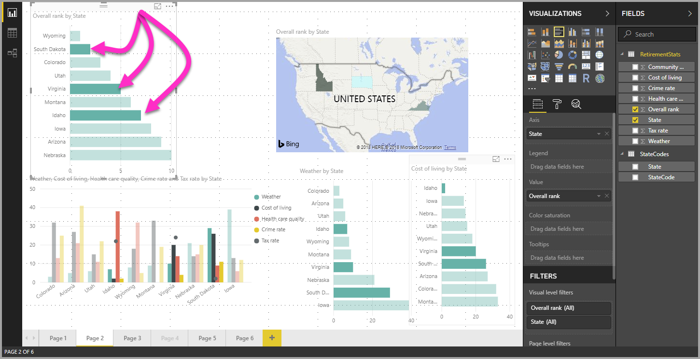

# Tietoelementtien monivalinta visualisoinneissa Power BI Desktopia käyttämällä

Power BI Desktopissa voit korostaa annetun visualisoinnin arvopistettä napsauttamalla arvopistettä visualisoinnissa. Esimerkiksi jos sinulla on tärkeä palkin tai kaavion osa ja haluat muiden visualisointien raportin sivulla korostavan tietoja valintasi perusteella, voit napsauttaa yhden visualisoinnin tietoelementtiä, jolloin tulokset näkyvät myös sivun muissa visualisoinneissa. Tämä on perustason tai yksittäisen valinnan korostusta. Seuraavassa kuvassa näkyy perustason korostus. 

Monivalinnassa voit nyt valita useamman kuin yhden arvopisteen **Power BI Desktop** -raportin sivulla ja korostaa tulokset sivun visualisoinneissa. Tämä vastaa **Ja**-lauseketta tai toimintoa, kuten ”korosta Idahon **ja** Virginian tulokset”. Voit valita useita arvopisteitä visualisoinneissa vain  **painamalla Ctrl-näppäintä ja napsauttamalla** arvopisteitä. Alla olevassa kuvassa on näkyvissä **useita arvopisteitä** valittuna (monivalinta).

Tämä kuulostaa yksinkertaiselta ominaisuudelta, mutta siitä on paljon hyötyä raportteja luotaessa, jaettaessa ja käsiteltäessä. 

## Seuraavat vaiheet

Voit olla kiinnostunut myös seuraavista artikkeleista:

* [Ruudukon ja kohdista ruudukkoon -toiminnon käyttö Power BI Desktop -raporteissa](desktop-gridlines-snap-to-grid.md)
* [Tietoja Power BI -raporttien suodattimista ja korostamisesta](power-bi-reports-filters-and-highlighting.md)

