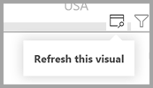

# Raporttielementtien suorituskyvyn analysointi Suorituskyvyn analysointi -toiminnolla

**Power BI Desktopissa** voit selvittää, miten kaikki raporttielementit, kuten visualisoinnit ja DAX-kaavat, toimivat. **Performance Analyzerin** avulla voit tarkastella ja tallentaa lokeja, jotka mittaavat, miten kukin raporttielementti toimii, kun käyttäjät käyttävät niitä, ja missä suhteessa niiden suorituskyky on eniten (tai vähiten) resursseja vievä.

Performance Analyzer tutkii ja näyttää keston, joka tarvitaan kaikkien käyttäjien välisten visualisointien käynnistämiseen tai päivittämiseen, ja esittää tiedot, jotta voit tarkastella tai viedä tuloksia tai porautua niihin. Suorituskyvyn analysoiminen auttaa tunnistamaan visualisointeja, jotka vaikuttavat raporttiesi tehokkuuteen ja tunnistamaan vaikutuksen syyn.

## Performance Analyzer -ruudun näyttäminen

Valitse **Power BI Desktopissa** **Näytä**-valintanauha. **Näytä**-alueella **Näkymä**-valintanauhasta voit valita **Performance Analyzerin** vieressä olevan valintaruudun Performance Analyzer -ruudun näyttämistä varten.

Kun tämä on valittu, Performance Analyzer näkyy sen omassa ruudussa raportin piirtoalustan oikealla puolella.

## Performance Analyzerin käyttäminen

Performance Analyzer mittaa prosessointiaikaa (mukaan lukien visualisoinnin luonti-tai päivitysaika), joka vaaditaan, jotta voidaan päivittää kyselyn suorittamiseen johtaneen käyttäjän vuorovaikutuksen tuloksena aloitetut raporttielementit. Osittajan säätäminen edellyttää esimerkiksi osittajan visualisoinnin muuttamista, tietomalliin lähetettävän kyselyn ja siihen vaikuttavat visualisoinnit, jotka on päivitettävä uusien asetusten seurauksena. 

Jos haluat Performance Analyzerin aloittavan tallennuksen, valitse **Aloita tallennus**

Kaikki raportin toiminnot näytetään ja kirjataan Performance Analyzer -ruudussa siinä järjestyksessä, jossa Power BI on ladannut visualisoinnin. Sinulla voi olla esimerkiksi raportti, jonka päivittäminen käyttäjien mukaan kestää kauan. Joidenkin raportin visualisointien näyttäminen voi kestää kauan, kun liukusäädintä säädetään. Performance Analyzer voi kertoa sinulle, mikä visualisointi on syyllinen, ja tunnistaa, mitkä visualisoinnin näkökohdat vievät prosessissa pisimpään. 

Kun aloitat tallennuksen, **Aloita tallennus** -painike näkyy harmaana (passiivinen, koska olet jo aloittanut tallennuksen) ja **Pysäytä**-painike on aktiivinen. 

Performance Analyzer kerää ja näyttää suorituskykymittauksen tiedot reaaliajassa. Joten aina, kun napsautat visualisointia, siirrät osittajaa tai teet jotakin muuta, Performance Analyzer näyttää heti suorituskykytulokset ruudussa.

Jos ruudussa on enemmän tietoja kuin voidaan näyttää, vierityspalkki näyttää siirtyvän lisätietoihin.

Kullakin toimella on osiotunniste ruudussa, joka kuvaa toiminnon, joka käynnisti lokimerkinnät. Seuraavassa kuvassa toimi oli se, että käyttäjät muuttivat osittajaa.

Kunkin visualisoinnin lokitiedoissa on käytetty aika (kesto) seuraavien tehtäväluokkien suorittamiseen:

* **DAX-kysely** - jos DAX-kysely vaaditaan, tämä on kyselyn lähettävän visualisoinnin ja Analysis Services -tulosten palauttamisen välinen aika.
* **Visuaalinen näyttö** - visualisoinnin vaatima aika näytössä, mukaan lukien verkkokuvien noutamiseen tai geokoodaukseen tarvittava aika. 
* **Muu** - aika, jonka visualisointi vaatii kyselyiden valmistelemista varten, muiden visualisointien valmistumista odotettaessa tai muun taustan käsittelemisen suorittamista varten.

**Kesto (ms)** -arvot osoittavat kunkin toiminnon *aloituksen* ja *lopetuksen* aikaleiman välisen eron. Useimmat pohja- ja visualisointitoiminnot suoritetaan peräkkäin yksittäisessä käyttöliittymäsäikeessä, joka on jaettu useisiin toimintoihin. Ilmoitetut kestot sisältävät jonossa vietetyn ajan, kun muut toiminnot ovat valmiit. [Suorituskyvyn analysointimalli](https://github.com/microsoft/powerbi-desktop-samples/tree/master/Performance%20Analyzer) GitHubissa ja siihen liittyvässä [dokumentaatiossa](https://github.com/microsoft/powerbi-desktop-samples/blob/master/Performance%20Analyzer/Power%20BI%20Performance%20Analyzer%20Export%20File%20Format.docx) antaa tietoja siitä, miten visualisoinnit kyselevät tietoja, ja miten ne hahmotetaan.

Kun olet käsitellyt Performance Analyzer-toiminnon avulla mitattavan raportin elementtejä, voit valita **Pysäytä**-painikkeen. Suorituskykytiedot pysyvät ruudussa omaa analyysiasi varten sen jälkeen, kun olet valinnut **Lopeta**.

Jos haluat tyhjentää Performance Analyzer -ruudun tiedot, valitse **Tyhjennä**. Kaikki tiedot poistetaan, eikä niitä tallenneta, kun valitset **Tyhjennä**. Seuraavassa osiossa on tietoja datan tallentamisesta lokeissa. 

## Visualisointien päivitys

Voit valita **Päivitä visualisoinnit** Suorituskyvyn analysoiminen -ruudussa, jos haluat päivittää kaikki visualisoinnit raportin nykyisellä sivulla, jolloin Performance Analyzer kerää tietoja kaikista tällaisista visualisoinneista.

Voit myös päivittää yksittäisiä visualisointeja. Kun Performance Analyzer tallennetaa, voit valita **Päivitä tämä visualisointi** kunkin visualisoinnin oikeasta yläkulmasta, jos haluat päivittää visualisoinnin ja tallentaa sen suorituskykytiedot.

## Tallennetaan suorituskykytietoja

Voit tallentaa tiedot, jotka Performance Analyzer luo raportista, valitsemalla **Vienti**-painikkeen. **Vienti**-toiminnon valitseminen luo .json-tiedoston, jonka tiedot saadaan Performance Analyzer-ruudusta. 

## Seuraavat vaiheet
Saat lisätietoja **Power BI Desktopista** ja käytön aloittamisesta tutustumalla seuraaviin artikkeleihin.

* [Mikä on Power BI Desktop?](../fundamentals/desktop-what-is-desktop.md)
* [Power BI Desktopin kyselyiden yleiskatsaus](../transform-model/desktop-query-overview.md)
* [Power BI Desktopin tietolähteet](../connect-data/desktop-data-sources.md)
* [Tietoihin yhdistäminen Power BI Desktopissa](../connect-data/desktop-connect-to-data.md)
* [Tietojen muotoilu ja yhdistäminen Power BI Desktopissa](../connect-data/desktop-shape-and-combine-data.md)
* [Yleiset kyselytehtävät Power BI Desktopissa](../transform-model/desktop-common-query-tasks.md)   

Katso tietoja suorituskyvyn analysointimallista seuraavista resursseista.

* [Suorituskyvyn analysointimalli](https://github.com/microsoft/powerbi-desktop-samples/tree/master/Performance%20Analyzer)
* [Suorituskyvyn analysointimallin dokumentaatio](https://github.com/microsoft/powerbi-desktop-samples/blob/master/Performance%20Analyzer/Power%20BI%20Performance%20Analyzer%20Export%20File%20Format.docx)
