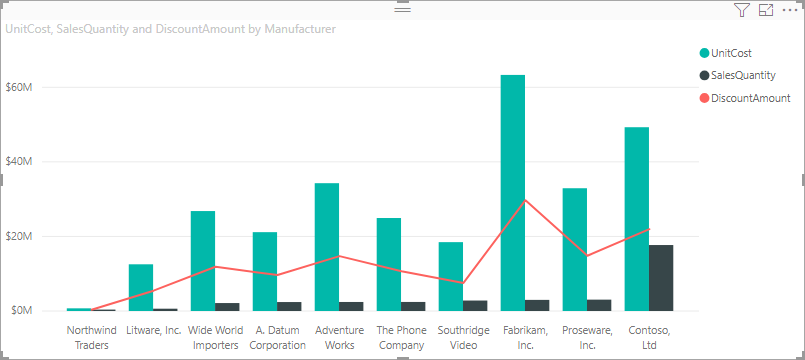

# Sarakkeen perusteella lajittelu Power BI Desktopissa
Voit muuttaa visualisoinnin ulkoasua Power BI Desktopissa ja Power BI -palvelussa lajittelemalla sen eri tietokenttien mukaan. Muuttamalla visualisoinnin lajittelua voit korostaa välitettäviä tietoja ja varmistaa, että visualisointi kuvastaa tätä trendiä (tai tietoa).

Voit lajitella visualisoinnit ja muokata niiden ulkoasua, olipa käytössä siten numeerisia tietoja (kuten myyntilukuja) tai tekstiä (kuten osavaltioiden nimiä). Power BI tarjoaa käyttöösi useita joustavia lajitteluvaihtoehtoja ja pikavalikoita. Voit lajitella minkä tahansa visualisoinnin valitsemalla sen **Lisää toimintoja** (...) ‑valikon, valitsemalla **Lajitteluperuste** ja valitsemalla sitten kentän, jota haluat käyttää lajitteluperusteena.

## Esimerkki lajittelusta
Otetaan seuraavaksi esimerkki, jossa on lisää syvyyttä, ja katsotaan, kuinka se toimii Power BI Desktopissa.

Seuraava visualisointi esittää kustannukset, määrät ja summat valmistajan nimen perusteella. Tässä on visualisointi sellaisena kuin se näkyy ennen lisälajittelua:

Visualisointi lajitellaan tällä hetkellä **Myyntimäärät**-sarakkeen mukaan. Lajittelusarake voidaan päätellä vertaamalla nousevien palkkien väriä selitteeseen, mutta on myös parempi tapa: **Lisää toimintoja** ‑valikko, jonka voit avata valitsemalla kolme pistettä (...).

Lajitteluvaihtoehdot ovat seuraavat:

* Nykyinen lajittelukenttä on **Myyntimäärät**, joka ilmenee lihavoidusta **Myyntimäärät**-kohdasta, jota edeltää keltainen palkki. 

* Nykyinen lajittelusuunta on nouseva, mikä ilmenee lihavoidusta **Lajittele nousevaan järjestykseen** ‑kohdasta, jota edeltää keltainen palkki.

Tarkastellaan lajittelukenttää ja lajittelun suuntaa seuraavissa kahdessa osassa.

## Lajittelusarakkeen valitseminen
Huomasit **Myyntimäärät**-kohtaa edeltävän keltaisen palkin **Enemmän vaihtoehtoja** ‑valikossa. Palkki ilmaisee, että visualisointi on lajiteltu **Myyntimäärät**-sarakkeen mukaan. Toisen sarakkeen perusteella lajittelu on helppoa: valitse kolme pistettä (...) avataksesi **Lisää toimintoja** ‑valikon, valitse **Lajitteluperuste** ja valitse sitten eri sarake.

Seuraavassa kuvassa olemme valinneet **Alennuksen määrä** -sarakkeen lajitteluperusteeksi. Kyseinen sarake näkyy yhtenä visualisoinnin riveistä palkkien sijaan. 

Huomaa, miten visualisointi on muuttunut. Arvot järjestetään nyt suurimmasta **alennuksen arvosta** eli Fabrikam Inc:sta alimpaan eli Northwind Tradersiin asti. 

Mutta entä jos haluamme lajittele tiedot nousevasti laskevan järjestyksen sijaan? Seuraavasta osasta näet, miten helppoa se on.

## Lajittelujärjestyksen valitseminen
Kun tarkastelemme edellisen kuvan **Lisää toimintoja** ‑valikkoa tarkemmin, huomaamme, että **Lajittele laskevaan järjestykseen** on lihavoitu ja että sitä edeltää keltainen palkki.

Kun **Lajittele laskevaan järjestykseen** on näkyvissä, se tarkoittaa, että visualisointi on lajiteltu valitun sarakkeen mukaan suurimmasta arvosta pienimpään arvoon. Haluatko muuttaa sen? Ei hätää. Valitse **Lajittele nousevaan järjestykseen**, niin valitun sarakkeen lajittelujärjestys muuttuu pienimmästä suurimpaan arvoon.

Tässä on sama visualisointi sen jälkeen, kun **Alennuksen arvon** järjestys on muutettu. Huomaa, että Northwind Traders on nyt luettelossa ensimmäinen valmistaja ja Fabrikam Inc. on viimeinen, toisin kuin aiemmassa lajittelussa.

Voit lajitella visualisoinnin minkä tahansa sarakkeen mukaan. Olisimme voineet helposti esimerkiksi valita lajittelusarakkeeksi **Myyntimäärät**-sarakkeen, jolloin eniten myyneet valmistajat näkyvät ensimmäisinä. Muut sarakkeet säilyvät mukana visualisoinnissa valmistajaa koskevien arvojen mukaan. Tältä visualisointi näyttää näillä asetuksilla.

## Lajittelu Lajittele sarakkeen mukaan -painikkeella
Tiedot voidaan lajitella myös käyttämällä **Lajittele sarakkeen mukaan** -painiketta **Mallinnus**-valintanauhassa.

Tämä tapa edellyttää, että valitset ensin sarakkeen (kentän) **Kentät**-ruudusta ja lajittelet visualisoinnin valitsemalla sitten **Mallinnus** > **Lajittele sarakkeen mukaan**. Jos et valitse saraketta, **Lajittele sarakkeen mukaan** ‑painike ei ole aktiivinen.

Katsotaan yleistä esimerkkiä. Sinulla on tietoja jokaiselta kuukaudelta ja haluat lajitella ne aikajärjestyksessä. Seuraavissa vaiheissa esitellään, miten se on mahdollista:

1. Huomaa, että kun visualisointi on valittuna, mutta mitään saraketta ei ole valittu **Kentät**-ruudussa, **Lajittele sarakkeen mukaan** -painike ei ole käytössä (painike näkyy harmaana).
   
   

2. Kun valitsemme lajiteltavan sarakkeen **Kentät**-ruudussa, **Lajittele sarakkeen mukaan** -painike muuttuu aktiiviseksi.
   
   
3. Nyt kun visualisointi on valittuna, voimme valita **Kuukausi**-vaihtoehdon oletusarvon **Kuukauden nimi** sijaan, jolloin visualisointi lajitellaan haluamassamme järjestyksessä eli kuukauden mukaan.
   
   

<!---
This functionality is no longer active. Jan 2020

## Getting back to default column for sorting
You can sort by any column you'd like, but there may be times when you want the visual to return to its default sorting column. No problem. For a visual that has a sort column selected, open the **More options** menu and select that column again, and the visualization returns to its default sort column.

For example, here's our previous chart:

When we go back to the menu and select **SalesQuantity** again, the visual defaults to being ordered alphabetically by **Manufacturer**, as shown in the following image.

With so many options for sorting your visuals, creating just the chart or image you want is easy.
--->

## Seuraavat vaiheet

Voit olla kiinnostunut myös seuraavista artikkeleista:

* [Raporttien välillä porautumisen käyttäminen Power BI Desktopissa](desktop-cross-report-drill-through.md)
* [Osittajat Power BI:ssä](../visuals/power-bi-visualization-slicers.md)
