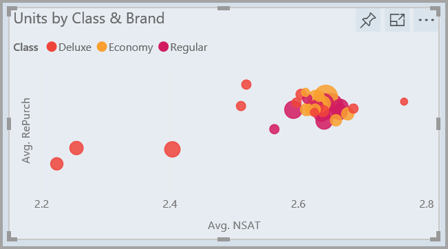
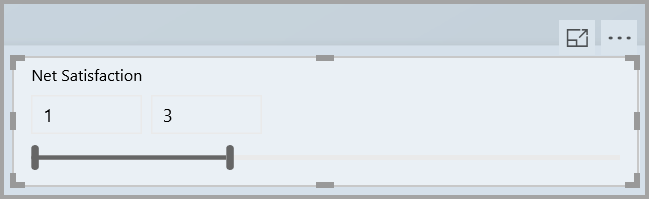

# Power BI -raporttien parantaminen visuaalisia elementtejä käyttämällä

**Power BI Desktopin** raporttien ulkoasua voi parantaa käyttämällä visualisoinneissa visuaalisia elementtejä, kuten taustakuvia ja parannettuja visuaalisia ylätunnisteita.

**Power BI Desktopin** heinäkuun 2018 julkaisusta alkaen voit tehdä raporteistasi ja analyyseistasi entistäkin kiinnostavamman näköisiä erilaisia parannuksia lisäämällä. Tässä artikkelissa kuvattuja parannuksia: 

* Lisäämällä **taustakuvan** raportteihin voit parantaa niitä tai korostaa tietojen elementtejä.
* Yksittäisiin visualisointeihin voit lisätä parannettuja **visuaalisia ylätunnisteita**, niin voit luoda niille yhdenmukaisen raporttikankaalla. 

Seuraavissa osioissa kuvataan parannusten käyttäminen ja lisääminen raportteihin.

## Taustakuvan käyttäminen Power BI -raporteissa

Voit muotoilla raporttisivun ulkopuolista harmaata aluetta käyttämällä **taustakuvaa**. Seuraavassa kuvassa on nuoli, joka näyttää taustakuvan alueen. 

Voit asettaa taustakuvan sivukohtaisesti tai käyttää raportin jokaisella sivun samaa taustakuvaa. Jos haluat asettaa taustakuvan, valitse **muotoilukuvake**, kun raportissasi ei ole visualisointia valittuna. **Taustakuva**-kortti avautuu ruutuun.

Voit valita **taustakuvaksi** värin valitsemalla avattavan **Väri**-valikon. Voit valita taustakuvaksi kuvan valitsemalla **Lisää kuva**. Voit myös käyttää taustakuvassa läpinäkyvyyttä, olipa kyseessä väri tai kuva. Se tapahtuu **Läpinäkyvyys**-liukusäätimellä.

On hyvä pitää mielessä **taustakuvaa** koskevat seuraavat määritelmät:

* Raporttialueen ulkopuolella oleva harmaa alue on **taustakuvan** alue.
* Kankaan aluetta, johon visualisoinnit sijoitetaan, kutsutaan **raporttisivuksi**. Sitä voi mukauttaa **Muotoilu-ruudun** avattavan **Sivun tausta** -luettelon kautta.

**Raporttisivu** on aina edustalla (taustakuvaan verrattuna) ja **taustakuva** on sen takana. Se on taaimmainen elementti raporttisivulla. Kun otat käyttöön läpinäkyvyyden sivulle, myös raportin visualisointeihin käytetään läpinäkyvyyttä. Siten taustakuva voi näkyä taustalla visualisointien läpi.

Kaikkien uusien raporttien oletusasetukset ovat seuraavat:

* Raportin **sivu** on määritetty **valkoiseksi** ja sen läpinäkyvyytenä on **100 %**
* **Taustakuva** on määritetty **valkoiseksi** ja läpinäkyvyytenä on **0 %**

Kun sivun taustan läpinäkyvyys on suurempi kuin 50 %, näet raporttia luodessasi tai muokatessasi pisteviivan, joka näyttää raporttikankaan reunan. 

On tärkeää huomata, että pisteviivareuna näkyy *vain* raporttia muokattaessa. Sitä *ei* näytetä julkaistua raporttiasi esimerkiksi **Power BI -palvelussa** tarkasteleville.

> [!NOTE]
> Jos käytät taustakuvalle mustaa taustaa ja tekstivärinä valkoista tai hyvin vaaleaa väriä, muista, että **Vie PDF-tiedostoon** -ominaisuus ei sisällä taustakuvaa, joten valkoisia fontteja sisältävät viennit ovat lähes näkymättömiä viedyssä PDF-tiedostossa. Katso lisätietoja [viennistä PDF-tiedostoon](desktop-export-to-pdf.md) kohdasta **Vienti PDF-tiedostoon**.

## Parannettujen visuaalisten ylätunnisteiden käyttäminen Power BI -raporteissa

**Power BI Desktopin** raporttien visualisointien ylätunnisteita on parannettu merkittävästi heinäkuun 2018 julkaisusta alkaen. Ensisijaisena parannuksena ylätunniste on irrotettu visualisoinnista, jotta sen paikkaa voi muuttaa halutun asettelun ja sijoittelun saavuttamiseksi. Ylätunniste lisäksi näkyy itse visualisoinnin sisällä sen sijaan että kelluisi sen yläpuolella. 

Ylätunniste näkyy oletusarvoisesti visualisoinnin sisällä tasattuna otsikon kanssa. Seuraavassa kuvassa näet ylätunnisteen (kiinnityskuvake, laajennuskuvake ja ellipsikuvake) visualisoinnin sisällä tasattuna oikealle samaan vaakatasoon kuin visualisoinnin otsikko.

Jos visualisoinnilla ei ole otsikkoa, ylätunniste kelluu visualisoinnin oikean yläkulman päällä seuraavassa kuvassa esitetyllä tavalla. 

Jos visualisointi sijoitetaan aivan raportin yläreunaan, visuaalinen ylätunniste siirtyy visualisoinnin alaosaan. 

Jokaisella visualisoinnilla on **Visuaalinen ylätunniste** -kortti **Visualisoinnit**-ruudun **Muotoilu**-osiossa. Tässä kortissa voit säätää visuaalisen ylätunnisteen kaikenlaisia piirteitä.

> [!NOTE]
> Vaihtopainikkeiden näkyvyys ei vaikuta raporttiin, kun olet luomassa tai muokkaamassa raporttia. Näet vaikutuksen, kun julkaiset raportin ja tarkastelet sitä lukutilassa. Tällä tavalla varmistetaan, että visuaalisten ylätunnisteiden monet tärkeät vaihtoehdot ovat muokkaamisen aikana näkyvillä – erityisesti ongelmista ilmoittavat varoituskuvakkeet.

Vain **Power BI -palvelussa** näkyvien raporttien visuaalisten ylätunnisteiden käyttöä voi säätää valitsemalla **Oma työtila > Raportit** ja valitsemalla sitten **asetuskuvakkeen**. Näet asetukset sille raportille, jonka valitsit **Asetukset**-osiossa. Voit muuttaa asetuksia seuraavassa kuvassa esitetyllä tavalla.

### Parannettujen visuaalisten ylätunnisteiden käyttäminen aiemmin luoduissa raporteissa

Uudet visuaaliset ylätunnisteet on otettu oletusarvoisesti käyttöön kaikissa uusissa raporteissa. Aiemmin luotujen raporttien osalta sinun on otettava ne käyttöön **Power BI Desktopissa** valitsemalla **Tiedosto > Asetukset ja vaihtoehdot > Asetukset**. Valitse **Raportin asetukset** -osiossa **Käytä nykyaikaista visuaalista ylätunnistetta ja päivitettyjä tyyliasetuksia** -valintaruutu.

## Seuraavat vaiheet
Saat lisätietoja **Power BI Desktopista** ja käytön aloittamisesta tutustumalla seuraaviin artikkeleihin.

* [Mikä on Power BI Desktop?](../fundamentals/desktop-what-is-desktop.md)
* [Power BI Desktopin kyselyiden yleiskatsaus](../transform-model/desktop-query-overview.md)
* [Power BI Desktopin tietolähteet](../connect-data/desktop-data-sources.md)
* [Tietoihin yhdistäminen Power BI Desktopissa](../connect-data/desktop-connect-to-data.md)
* [Tietojen muotoilu ja yhdistäminen Power BI Desktopissa](../connect-data/desktop-shape-and-combine-data.md)
* [Yleiset kyselytehtävät Power BI Desktopissa](../transform-model/desktop-common-query-tasks.md)   
