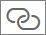

# Hyperlinkkien (URL-osoitteiden) lisääminen taulukkoon tai matriisiin
Tässä ohjeaiheessa kerrotaan, miten hyperlinkkejä (URL-osoitteita) lisätään taulukkoon. Power BI Desktopin avulla voit lisätä hyperlinkkejä (URL-osoitteita) tietojoukkoon. Voit lisätä kyseiset hyperlinkit raporttisi taulukoihin tai matriiseihin joko Power BI Desktopissa tai Power BI -palvelussa. Sen jälkeen voit näyttää URL-osoitteen tai linkin kuvakkeen tai muotoilla toista saraketta linkin tekstinä.

Voit myös luoda hyperlinkkejä [raporttien tekstiruuduissa](service-add-hyperlink-to-text-box.md) Power BI -palvelussa ja Power BI Desktopissa. Power BI -palvelussa voit myös lisätä hyperlinkkejä [koontinäyttöjen ruutuihin](service-dashboard-edit-tile.md) ja [koontinäyttöjen tekstikenttiin](service-dashboard-add-widget.md). 

## URL-osoitteen muotoileminen hyperlinkkinä Power BI Desktopissa

Voit muotoilla URL-osoitteita sisältävää kenttää hyperlinkkeinä Power BI Desktopissa, mutta et Power BI -palvelussa. Voit myös [muotoilla hyperlinkkejä Excel Power Pivotissa](#create-a-table-or-matrix-hyperlink-in-excel-power-pivot) ennen työkirjan tuomista Power BI:hin.

1. Jos tietojoukossa ei ole jo hyperlinkkiä sisältävää kenttää Power BI Desktopissa, lisää se [mukautettuna sarakkeena](../transform-model/desktop-common-query-tasks.md).

    > [!NOTE]
    > Et voi luoda saraketta DirectQuery-tilassa.  Jos tiedoissasi kuitenkin on jo URL-osoitteita, voit muuttaa ne hyperlinkeiksi.

2. Valitse sarake tieto- tai raporttinäkymässä. 

3. Valitse **Mallinnus**-välilehdeltä **Tietoluokka** > **Verkko-URL-osoite**.
   
    

    > [!NOTE]
    > URL-osoitteiden tulee alkaa tietyillä etuliitteillä. Täysi luettelo löytyy tämän artikkelin [Huomioon otettavat seikat ja vianmääritys](#considerations-and-troubleshooting) -kohdasta.

## Hyperlinkin sisältävän taulukon tai matriisin luominen

1. Kun olet [muotoillut hyperlinkin URL-osoitteena](#format-a-url-as-a-hyperlink-in-power-bi-desktop), siirry raporttinäkymään.
2. Luo taulukko tai matriisi, joka sisältää kentän, jonka olet luokitellut verkko-URL-osoitteeksi. Hyperlinkit näkyvät sinisinä ja alleviivattuina.

    

## Näytä hyperlinkkikuvake URL-osoitteen sijaan

Jos et halua taulukossa näkyvän pitkää URL-osoitetta, voit näyttää sen sijaan  hyperlinkkikuvakkeen. 

> [!NOTE]
> Matriisissa ei voi näyttää kuvakkeita.
   
1. [Luo ensin taulukko, joka sisältää hyperlinkin](#create-a-table-or-matrix-with-a-hyperlink).

2. Valitse taulukko, jotta se on aktiivinen.

    Avaa Muotoilu-välilehti valitsemalla **Muotoile**-kuvake .

    Laajenna **Arvot**-kohtaa, etsi **URL-osoitteen kuvake** ja ota se **käyttöön**.

    

1. (Valinnainen) [Julkaise raportti](desktop-upload-desktop-files.md) Power BI Desktopista Power BI -palvelussa. Kun avaat raportin Power BI -palvelussa, myös hyperlinkit toimivat siellä.

## Muotoile linkin tekstiä hyperlinkkinä

Voit myös muotoilla taulukon toista kenttää hyperlinkkinä ilman URL-osoitteen saraketta. Tässä tapauksessa et muotoile saraketta verkko-URL-osoitteena.

> [!NOTE]
> Et voi muotoilla toista kenttää hyperlinkkinä matriisissa.

1. Jos hyperlinkin sisältävää kenttää ei ole vielä tietojoukossa, lisää se [mukautettuna sarakkeena](../transform-model/desktop-common-query-tasks.md) Power BI Desktopin avulla. Et voi tässäkään tapauksessa luoda saraketta DirectQuery-tilassa.  Jos tiedoissasi kuitenkin on jo URL-osoitteita, voit muuttaa ne hyperlinkeiksi.

2. Valitse tieto- tai raporttinäkymässä sarake, joka sisältää URL-osoitteen. 

3. Valitse **Mallinnus**-välilehdeltä **Tietoluokka**. Varmista, että sarakkeen muotoilu on **Luokittelematon**.

2. Luo raporttinäkymässä taulukko tai matriisi, joka sisältää URL-sarakkeen ja sarakkeen, jota aiot muotoilla linkin tekstinä.

3. Pidä taulukko valittuna ja avaa Muotoilu-välilehti valitsemalla **Muotoile**-kuvake .

4. Laajenna **Ehdollinen muotoilu** -kohtaa ja varmista, että ruudussa oleva nimi on sarake, jonka haluat linkin tekstiksi. Etsi **WWW-URL-osoite** ja **ota se käyttöön**.

    

    > [!NOTE]
    > Jos et näe **WWW-URL-osoite**-vaihtoehtoa, varmista, että hyperlinkit sisältävän sarakkeen muotoilu *ei* ole **WWW-URL-osoite** avattavassa **Tietoluokka**-valikossa.

5. Valitse **Verkko-URL-osoite**-valintaikkunassa kenttä, joka sisältää URL-osoitteen, **Perustuu kenttään** -ruudussa > **OK**.

    

    Nyt kyseisen sarakkeen teksti muotoillaan linkkinä.

    

1. (Valinnainen) [Julkaise raportti](desktop-upload-desktop-files.md) Power BI Desktopista Power BI -palvelussa. Kun avaat raportin Power BI -palvelussa, myös hyperlinkit toimivat siellä.

## Hyperlinkin luominen taulukkoon tai matriisiin Excel Power Pivotilla

Toinen tapa lisätä hyperlinkkejä Power BI -taulukoihin ja -matriiseihin on luoda hyperlinkit tietojoukkoon ennen kyseisen tietojoukon tuomista Power BI:hin tai siihen liittämistä Power BI:ssä. Tässä esimerkissä käytetään Excel-työkirjaa.

1. Avaa työkirja Excelissä.
2. Valitse **PowerPivot**-välilehti ja valitse sitten **Hallinta**.
   
   
1. Kun PowerPivot avautuu, valitse **Lisäasetukset**-välilehti.
   
   
4. Aseta kohdistin sarakkeeseen, joka sisältää ne URL-osoitteet, jonka haluaisit muuttaa hyperlinkeiksi Power BI -taulukoissa.
   
   > [!NOTE]
   > URL-osoitteiden tulee alkaa tietyillä etuliitteillä. Täysi luettelo löytyy alla olevasta [Huomioon otettavat seikat ja vianmääritys](#considerations-and-troubleshooting) -kohdasta.
   > 
   
5. Valitse **Raportointiominaisuudet**-ryhmästä avattava **Tietoluokka**-valikko ja valitse **URL-verkko-osoite**. 
   
   

6. Muodosta yhteys tähän työkirjaan tai tuo se Power BI -palvelussa tai Power BI Desktopissa.
7. Luo taulukon visualisointi, joka sisältää URL-kentän.
   
   

## Huomioon otettavat seikat ja vianmääritys

URL-osoitteiden tulee alkaa jollakin seuraavista:
- http
- https
- -mailto
- file
- ftp
- news
- telnet

K: Voinko käyttää mukautettua URL-osoitetta taulukon tai matriisin hyperlinkkinä?    
V: Et. Voit käyttää linkkikuvaketta. Jos haluat käyttää mukautettua tekstiä hyperlinkkinä ja URL-osoitteiden luettelo on lyhyt, kokeile käyttää tekstiruutua.

## Seuraavat vaiheet
[Visualisoinnit Power BI -raporteissa](../visuals/power-bi-report-visualizations.md)

[Power BI -palvelun peruskäsitteitä suunnittelijoille](../fundamentals/service-basic-concepts.md)

Onko sinulla kysyttävää? [Kokeile Power BI -yhteisöä](https://community.powerbi.com/)
