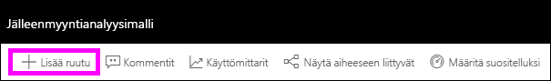

# Johdatus raporttinäkymien ruutuihin Power BI -suunnittelijoille

Ruutu on tietojen tilannevedos, joka on kiinnitetty koontinäyttöön. Ruutu voidaan luoda raportista, tietojoukosta, raporttinäkymästä, Q&A-ruudusta, Excelistä, SQL Server Reporting Services (SSRS) -raporteista ja niin edelleen.  Tämä näyttökuva esittää useita eri ruutuja, jotka on kiinnitetty koontinäyttöön.

Koontinäytöt ja koontinäyttöruudut ovat Power BI -palvelun ominaisuus eivätkä Power BI Desktopin. Raporttinäkymiä ei voi luoda mobiililaitteilla, mutta niitä voi [tarkastella ja jakaa](../consumer/mobile/mobile-apps-view-dashboard.md) niillä.

Ruutujen kiinnittämisen lisäksi yksittäisiä ruutuja voidaan luoda suoraan koontinäyttöön [Lisää ruutu](service-dashboard-add-widget.md) -toiminnon avulla. Yksittäisiä ruutuja ovat tekstiruudut, kuvat, videot, suoratoistotiedot ja verkkosisältö.

Tarvitsetko apua Power BI:n rakenneosien kanssa? Lue [Power BI -palvelun peruskäsitteitä suunnittelijoille](../fundamentals/service-basic-concepts.md).

> [!NOTE]
> Jos ruudun luomiseen käytetty alkuperäinen visualisointi muuttuu, ruutu ei muutu.  Jos esimerkiksi kiinnitit raportin viivakaavion ja muutit sitten viivakaavion palkkikaavioksi, koontinäytön ruudussa näkyy edelleen viivakaavio. Tiedot päivittyvät, mutta visualisointityyppi ei.
> 
> 

## Kiinnitä ruutu
Voit lisätä (kiinnittää) ruudun koontinäyttöön monella eri tavalla. Voit kiinnittää ruutuja kohteesta:

* [Power BI:n kysymyksiä ja vastauksia](service-dashboard-pin-tile-from-q-and-a.md)
* [Raportti](service-dashboard-pin-tile-from-report.md)
* [Toinen koontinäyttö](service-pin-tile-to-another-dashboard.md)
* [OneDrive for Businessin Excel-työkirja](service-dashboard-pin-tile-from-excel.md)
* [Quick Insights (Nopeat merkitykselliset tiedot)](service-insights.md)
* [Paikallinen Sivutettu raportti Power BI -raporttipalvelimessa tai SQL Server Reporting Servicesissa](https://docs.microsoft.com/sql/reporting-services/pin-reporting-services-items-to-power-bi-dashboards)

Voit luoda erillisiä ruutuja kuville, muokkausruuduille, videoille, virtautettaville tiedoille ja verkkosisällölle suoraan koontinäytössä [Lisää ruutu](service-dashboard-add-widget.md) -toiminnon avulla.

  

## Koontinäytön ruutujen käsitteleminen
Kun olet lisännyt ruudun koontinäyttöön, voit siirtää sitä ja muuttaa sen kokoa tai muuttaa sen ulkoasua ja toimintaa.

### Ruudun siirtäminen ja koon muuttaminen
Tartu ruutuun ja [siirrä sitä koontinäytössä](service-dashboard-edit-tile.md). Muuta ruudun kokoa pitämällä osoitinta kahvan  päällä ja valitsemalla se.

### Muuta ulkoasua ja toimintaa pitämällä osoitinta ruudun päällä
1. Tuo kolme pistettä näyttöön pitämällä osoitinta ruudun päällä.
   
    
2. Avaa ruudun toimintovalikko valitsemalla kolme pistettä.
   
    
   
    Täältä voit:
   
     * [lisätä kommentteja koontinäyttöön](../consumer/end-user-comment.md).
     * [avata raportin, jolla tämä ruutu on luotu](../consumer/end-user-reports.md).  
     * [tarkastella tarkastelutilassa](../consumer/end-user-focus.md).   
     * [viedä ruudussa käytettyjä tietoja](../visuals/power-bi-visualization-export-data.md).
     * [muokata otsikkoa ja alaotsikkoa sekä lisätä hyperlinkin](service-dashboard-edit-tile.md). 
     * [suorittaa merkityksellisiä tietoja](service-insights.md). 
     * [kiinnitä ruudun toiseen koontinäyttöön](service-pin-tile-to-another-dashboard.md).
     * [poistaa ruudun](service-dashboard-edit-tile.md).

3. Jos haluat sulkea toimintovalikon, valitse koontinäytön tyhjä alue.

### Ruudun valitseminen
Kun valitset ruudun, seuraavaksi tapahtuva asia riippuu siitä, miten ruutu on luotu. Muussa tapauksessa ruudun valitseminen avaa raportin, Excel Online -työkirjan, paikallisen Reporting Services -raportin tai Q&A-kysymyksen, jolla ruutu on luotu. Jos sillä on [mukautettu linkki](service-dashboard-edit-tile.md), ruudun valitseminen ohjaa sinut kyseiseen linkkiin.

> [!NOTE]
> Poikkeuksen tekevät videoruudut, jotka on luotu suoraan koontinäyttöön **Lisää ruutu** -toiminnolla. Video toistetaan suoraan koontinäytössä, kun valitaan (tällä tavalla luotu) videoruutu.   
> 
> 

## Huomioon otettavat seikat ja vianmääritys

* Jos raporttia, jolla visualisointi on luotu, ei tallennettu, ruudun valitseminen ei tuota mitään toimia.
* Jos ruutu on luotu Excel Online -työkirjasta, tarvitset vähintään työkirjan lukuoikeudet. Muussa tapauksessa työkirjaa ei avata Excel Onlinessa, kun ruutu valitaan.
* Oletetaan, että luot ruudun suoraan koontinäyttöön käyttämällä **Lisää ruutu** -vaihtoehtoa ja määrität sille mukautetun hyperlinkin. Siinä tapauksessa otsikon, alaotsikon tai ruudun valitseminen avaa kyseisen URL-osoitteen. Muussa tapauksessa suoraan koontinäytössä luodun kuvan, verkkokoodin tai muokkausruudun ruudun valitseminen ei oletusarvoisesti tuota mitään toimia.
* Ruutuja voidaan luoda paikallisista sivutetuista raporteista Power BI -raporttipalvelimessa tai SQL Server Reporting Servicesissa. Jos sinulla ei ole paikallisen raportin käyttöoikeutta, ruudun valitseminen vie sinut sivulle, joka ilmaisee, että sinulla ei ole käyttöoikeutta (rsAccessDenied).
* Oletetaan, että valitset ruudun, joka on luotu paikallisesta sivutetusta raportista Power BI -raporttipalvelimessa tai SQL Server Reporting Servicesissa. Jos sinulla ei ole käyttöoikeutta raporttipalvelimen sisältävään verkkoon, kyseisestä sivutetusta raportista luodun ruudun valitseminen avaa sivun, joka osoittaa, ettei palvelinta löytynyt (HTTP 404). Laitteellasi on oltava verkkoyhteys raporttipalvelimeen raportin tarkastelemista varten.
* Jos ruudun luomiseen käytetty alkuperäinen visualisointi muuttuu, ruutu ei muutu. Jos esimerkiksi kiinnitit raportin viivakaavion ja muutat sitten viivakaavion palkkikaavioksi, raporttinäkymän ruudussa näkyy edelleen viivakaavio. Tiedot päivittyvät, mutta visualisointityyppi ei.

## Seuraavat vaiheet
- [Kortin (suurinumeroisen ruudun) luominen koontinäytölle](../visuals/power-bi-visualization-card.md)
- [Johdatus raporttinäkymiin Power BI -kehittäjille](service-dashboards.md)  
- [Tietojen päivittäminen Power BI:ssä](../connect-data/refresh-data.md)
- [Power BI -palvelun peruskäsitteitä suunnittelijoille](../fundamentals/service-basic-concepts.md)
- [Power BI -ruutujen integrointi Office-tiedostoihin](https://powerbi.microsoft.com/blog/integrating-power-bi-tiles-into-office-documents/)
- [Reporting Services -kohteiden kiinnittäminen Power BI -koontinäyttöihin](/sql/reporting-services/pin-reporting-services-items-to-power-bi-dashboards)

Onko sinulla kysyttävää? [Kokeile Power BI -yhteisöä](https://community.powerbi.com/).
