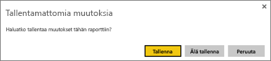
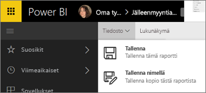

# Raportin tallentaminen Power BI -palvelussa ja Power BI Desktopissa
Kun olet tehnyt muutoksia raporttiin Power BI:ssä, voit tallentaa sen, tallentaa sen uudella nimellä tai sulkea sen tallentamatta muutoksia. Oletetaan, että avaat raportin, luot visualisoinnin ja kiinnität sen raporttinäkymään. Jos suljet sen tallentamatta muutoksia, ruutu säilyy raporttinäkymässä, mutta visualisointia ei tallenneta raporttiin. Kun napsautat kyseistä ruutua raporttinäkymässä, raportti avautuu, mutta visualisointia ei ole raportissa.

> [!TIP]
> Kiinnitä erityistä huomiota siihen, mikä työtila on aktiivinen, jotta löydät tallennetun raportin. Raportti tallennetaan aktiiviseen työtilaan.
> 
> 

### Raportin tallentaminen:
1. Jos yrität siirtyä pois raportista ja raportissa on muutoksia, Power BI näyttää kehotteen.
   
   
2. Toinen tapa tallentaa raportti on valita **TIEDOSTO**\>**Tallenna** tai **Tallenna nimellä**. Jos olet [Lukunäkymässä](../consumer/end-user-reading-view.md), ainoastaan Tallenna nimellä -vaihtoehto on näkyvissä. 
   
   
3. Jos kyse on uudesta raportista (Tallenna) tai aiemmin luodun raportin uudesta versiosta (Tallenna nimellä), anna sille kuvaava nimi.  **Raportti lisätään aktiiviseen työtilaan**.
   
    

### Seuraavat vaiheet
Lue lisää [Power BI -raporteista](../consumer/end-user-reports.md)

[Power BI -palvelun peruskäsitteitä suunnittelijoille](../fundamentals/service-basic-concepts.md)

Onko sinulla kysyttävää? [Kokeile Power BI -yhteisöä](https://community.powerbi.com/)
