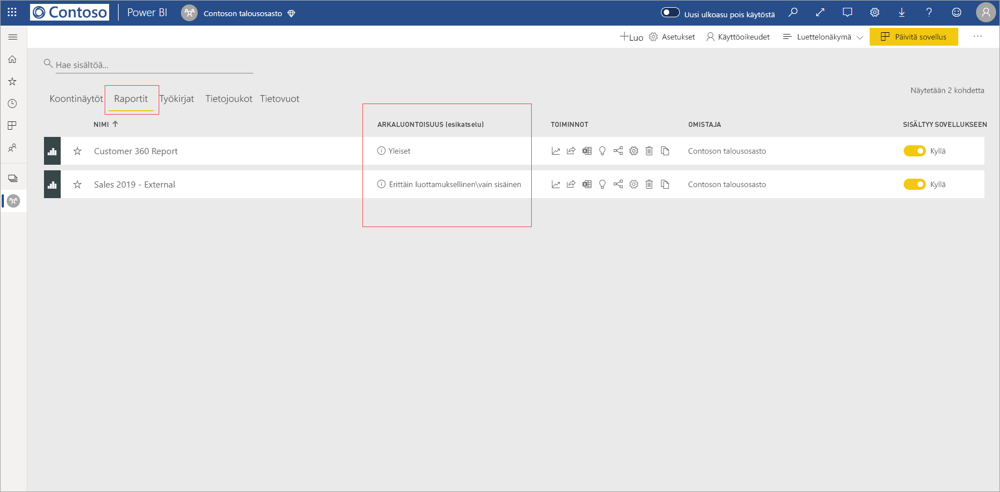
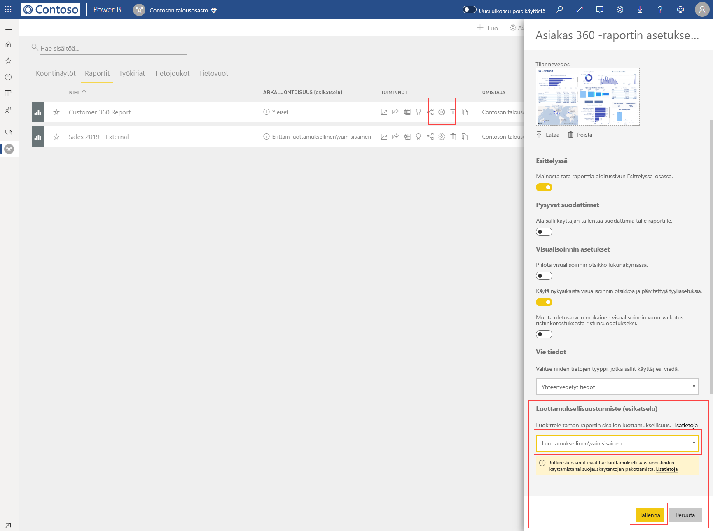
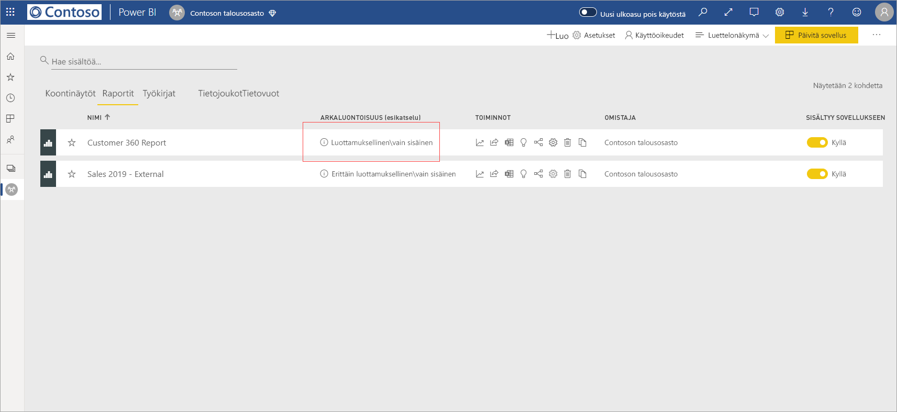
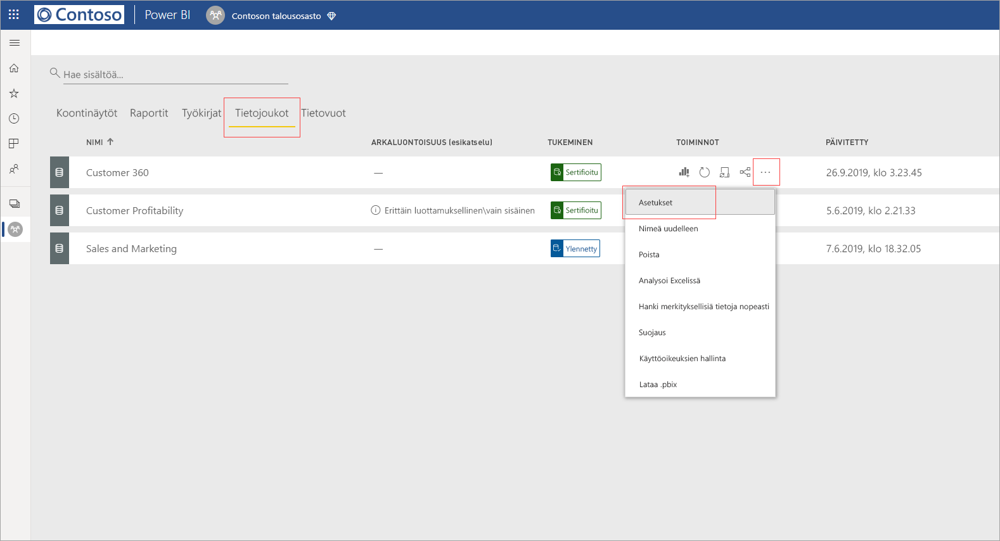
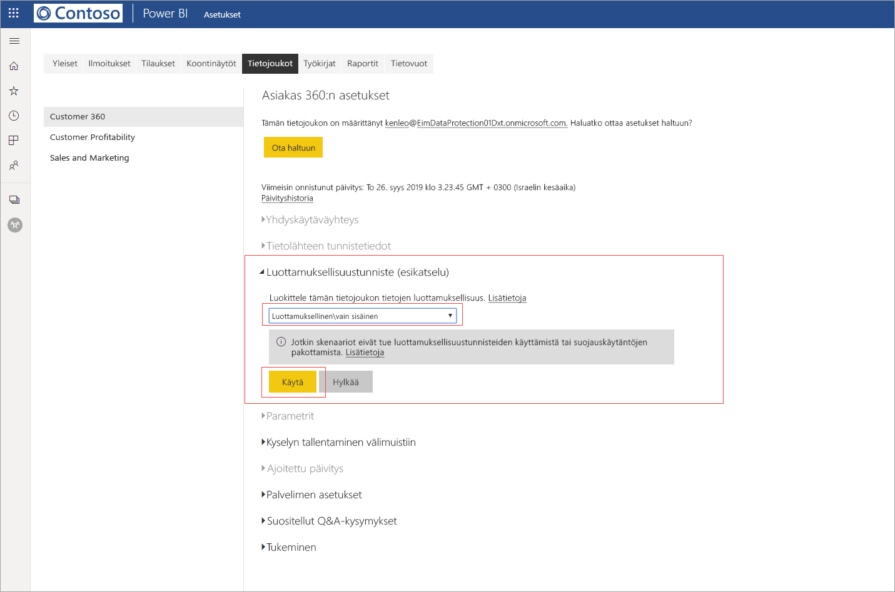
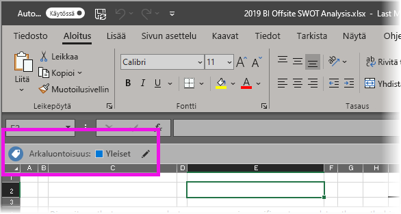

# Luottamuksellisuustunnisteiden käyttö Power BI:ssä (esiversio)

Kun luottamuksellisuustunnisteet ovat käytössä Power BI -palvelussa, voit suojata koontinäyttösi, raporttisi, tietojoukkosi ja tietovuosi luvattomalta käytöltä ja vuodoilta käyttämällä tietojen luottamuksellisuustunnisteita. Tietojen merkitseminen oikein tietojen luottamuksellisuustunnisteiden avulla varmistaa, että vain valtuutetut käyttäjät voivat käyttää tietojasi.

Kun tietojen suojaus on käytössä, luottamuksellisuustunnisteet näkyvät arkaluonteisuus-sarakkeessa koontinäyttöjen, raporttien, tietojoukkojen ja tietovoiden luettelonäkymässä.

> [!NOTE]
> Luottamuksellisuustunnisteiden käyttö Power BI:n koontinäytöissä, raporteissa, tietojoukoissa ja tietovoissa edellyttää tiettyjä käyttöoikeuksia. Lisätietoja on artikkelissa [Luottamuksellisuustunnisteiden ottaminen käyttöön](#applying-sensitivity-labels).

## Luottamuksellisuustunnisteiden ottaminen käyttöön

Jotta voit käyttää luottamuksellisuustunnisteita Power BI:ssä, sinun ja organisaatiosi tulee täyttää seuraavat vaatimukset:

* Organisaatiosi on pitänyt määrittää luottamuksellisuustunnisteet joko [Microsoft 365 -tietoturvakeskuksessa](https://security.microsoft.com/) tai [Microsoft 365 -yhteensopivuuskeskuksessa](https://compliance.microsoft.com/).
* Sinun on kuuluttava käyttöoikeusryhmään, jolla on oikeudet käyttää tietojen luottamuksellisuustunnisteita artikkelissa [Luottamuksellisuustunnisteiden käyttöönotto Power BI:ssä (esiversio)](../admin/service-security-enable-data-sensitivity-labels.md#enable-data-sensitivity-labels) kuvatun mukaisesti.
* Sinulla on oltava Power BI Pro -käyttöoikeus ja muokkausoikeudet niihin resursseihin, joihin haluat lisätä tunnisteen. 
* Sinulla on oltava Azure Information Protection Premium P1- tai Premium P2 -käyttöoikeus. Microsoft Azure Information Protectionin voi ostaa joko erillisenä tuotteena tai jonkin Microsoftin käyttöoikeuspaketin kautta. Lisätietoja on artikkelissa [Azure Information Protectionin hinnoittelu](https://azure.microsoft.com/pricing/details/information-protection/).

Jos haluat ottaa käyttöön tai muuttaa luottamuksellisuustunnistetta raportissa, napsauta työtilan luettelokohteen raporttiasetukset-kuvaketta ja siirry sitten asetukset-palkin osioon tietojen arkaluontoisuus. Valitse haluamasi luottamuksellisuustunniste ja tallenna asetukset.

Päivitetty luottamuksellisuustunniste näkyy arkaluontoisuus-sarakkeessa. 

Luottamuksellisuustunnisteen ottaminen käyttöön tai muuttaminen koontinäytössä toimii samoin kuin raporttien kohdalla. 

Voit myös lisätä luottamuksellisuustunnisteita tietojoukoille ja tietovoille. Seuraavassa kuvassa näytetään, miten luottamuksellisuustunniste voidaan määrittää tietojoukolle. Samoja ohjeita voi käyttää myös tietovoiden kohdalla.

Jos haluat määrittää luottamuksellisuustunnisteen tietojoukolle, valitse tietojoukot-välilehti, napsauta kolmea pistettä haluamasi tietojoukon vieressä, ja valitse **Asetukset**.

Avaa tietojoukon asetukset-sivulla luottamuksellisuustunniste-osio, valitse haluamasi luottamuksellisuustunniste, ja valitse **Käytä**.

Luottamuksellisuustunnisteen ottaminen käyttöön tai muuttaminen tietovuossa toimii samoin kuin tietojoukkojen kohdalla.

## Tietojen suojaus viedyissä tiedostoissa

Kun [viet tietoja raportista](https://docs.microsoft.com/power-bi/consumer/end-user-export), jolla on luottamuksellisuustunniste, luottamuksellisuustunniste periytyy muodostettuun tiedostoon (Excel, PowerPoint ja PDF – CSV-tiedostoja ei tueta). Luottamuksellisuustunniste näkyy tiedostossa, ja tiedostoa voivat käyttää vain ne käyttäjät, joilla on riittävät käyttöoikeudet.

## Huomioitavat asiat ja rajoitukset

Tietojen luottamuksellisuustunnisteiden käyttöön liittyy seuraavat seikat:

* Microsoft Information Protectionin luottamuksellisuustunnisteiden käyttö ja tarkastelu Power BI:ssä edellyttää Azure Information Protection Premium P1- tai Premium P2 -käyttöoikeutta. Microsoft Azure Information Protectionin voi ostaa joko erillisenä tuotteena tai jonkin Microsoftin käyttöoikeuspaketin kautta. Lisätietoja on artikkelissa [Azure Information Protectionin hinnoittelu](https://azure.microsoft.com/pricing/details/information-protection/).
* Luottamuksellisuustunnisteita voi käyttää vain koontinäytöissä, raporteissa, tietojoukoissa ja tietovoissa.
* Tunnisteiden ja suojausten pakotus vietäviin tiedostoihin on tuettu vain Excel-, PowerPoint- ja PDF-tiedostoille. Tunnisteita ja suojausta ei pakoteta, kun tietoja viedään .CSV-tiedostoihin, tilataan sähköpostiin,upotetaan visualisointeihin tai tulostetaan.
* Käyttäjällä, joka vie tiedoston Power BI:stä, on oikeus käyttää ja muokata tiedostoa luottamuksellisuustunnisteasetusten mukaisesti. Tiedot vienyt käyttäjä ei saa omistajan käyttöoikeuksia tiedostoon. 
* Luottamuksellisuustunnisteet eivät ole tällä hetkellä käytettävissä [sivutetuille raporteille]( https://docs.microsoft.com/power-bi/paginated-reports-report-builder-power-bi) tai työkirjoille. 
* Et voi tällä hetkellä poistaa tunnistetta Power BI -resurssista, kun se on otettu käyttöön.
* Power BI -resurssien luottamuksellisuustunnisteet näkyvät vain työtilan luettelo- ja historiatiedot-näkymissä. Tunnisteet eivät tällä hetkellä näy näkymissä suosikit, jaettu kanssani, viimeaikaiset tai sovellukset. Huomaathan kuitenkin, että Power BI -resurssissa käytetty tunniste säilyy aina Excel-, PowerPoint- ja PDF-tiedostoihin viedyissä tiedoissa, vaikka se ei olisikaan näkyvissä.
* Luottamuksellisuustunnisteen *tiedoston salausasetukset*, jotka on määritetty joko [Microsoft 365 -tietoturvakeskusessa](https://security.microsoft.com/) tai [Microsoft 365 -yhteensopivuuskeskuksessa](https://compliance.microsoft.com/), ovat käytössä vain tiedostoissa, jotka *viedään* Power BI:stä; eivät Power BI:n *sisällä*.
* [HYOK-suojausta](https://docs.microsoft.com/azure/information-protection/configure-adrms-restrictions) ei tueta Power BI:ssä käytetyille luottamuksellisuustunnisteille.
* Tunnisteiden tarkastelu ja käyttö Office-sovelluksissa vaatii tiettyjä [käyttöoikeuksia](https://docs.microsoft.com/microsoft-365/compliance/sensitivity-labels-office-apps#subscription-and-licensing-requirements-for-sensitivity-labels).
* Luottamuksellisuustunnisteita tuetaan vain yleisten (julkisten) pilvipalveluiden vuokraajille. Luottamuksellisuustunnisteita ei tueta muiden pilvipalveluiden vuokraajille.

## Seuraavat vaiheet

Tässä artikkelissa kerrottiin luottamuksellisuustunnisteiden käytöstä Power BI:ssä. Seuraavissa artikkeleissa annetaan lisätietoja tietojen suojaamisesta Power BI:ssä. 

* [Power BI:n tietojen suojauksen yleiskatsaus](../admin/service-security-data-protection-overview.md)
* [Luottamuksellisuustunnisteiden käyttöönotto Power BI:ssä](../admin/service-security-enable-data-sensitivity-labels.md)
* [Microsoft Cloud App Securityn hallinnan käyttö Power BI:ssä](../admin/service-security-using-microsoft-cloud-app-security-controls.md)