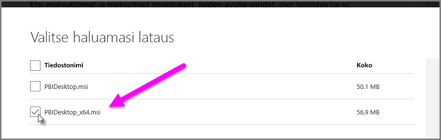

# Ratkaise Käyttöoikeuksien ja .XLS-tiedostojen tuontiongelmat Power BI Desktopissa

Power BI Desktopissa sekä Access-tietokannat että Excel-työkirjojen aikaisemmat versiot (Excel 97-2003 -tyypin .XLS-tiedostot) käyttävät *Access-tietokantamoduulia*. On olemassa kolme yleistä tilannetta, jotka estävät käyttöoikeustietokantamoduulia toimimasta kunnolla.

## Esimerkki 1: Käyttöoikeustietokantamoduulia ei ole asennettu

Jos Power BI Desktop -virheilmoitus ilmaisee, ettei Access-tietokantamoduulia ole asennettu, tulee Access-tietokantamoduulista asentaa joko 32- tai 64-bittinen versio, joka vastaa käytössä olevaa Power BI Desktop -versiota. Voit asentaa Access-tietokantamoduulin [lataussivulta](https://www.microsoft.com/download/details.aspx?id=13255).

>[!NOTE]
>Jos asennettu käyttöoikeustietokantamoduulin versio on eri kuin Microsoft Officen asennettu bittiversio, Office-sovellukset eivät voi käyttää käyttöoikeustietokantamoduulia.

## Esimerkki 2: Käyttöoikeustietokantamoduulin bittiversio (32- tai 64-bittinen) on eri kuin käyttämäsi Power BI Desktopin bittiversio

Tässä tilanteessa on usein ongelmana, että Microsoft Officesta on asennettu 32-bittinen versio ja Power BI Desktopista 64-bittinen versio. Myös päinvastainen voi ilmetä, ja bittiversioristiriita tapahtuu kummassakin tapauksessa. Jos käytät Office 365 -tilausta, tutustu [tilanteeseen 3](#situation-3-trouble-using-access-or-xls-files-with-an-office-365-subscription), jossa kuvataan toinen ongelma ja sen ratkaisu. Kaikki seuraavat ratkaisut korjaavat tämä bittiversio ristiriidan:

### Ratkaisu 1

Muuta Power BI Desktopin versio vastaamaan Microsoft Office -asennuksesi bittiversiota. 

1. Muuttaaksesi Power BI Desktopin bittiversion, poista Power BI Desktopin asennus ja asenna sitten Power BI Desktopin bittiversio, joka vastaa käyttämääsi Office-versiota. 

1. Valitaksesi version Power BI Desktopille, valitse Power BI Desktopin lataussivulta **Latauksen lisäasetukset**.
   
   
   
1. Valitse avautuvalta lataussivulta kielesi ja napauta sitten **Lataa**-painiketta. 
 
1. Valitse näkyviin tulevassa näytössä PBIDesktop.msi-valintaruutu 32-bittisen version tapauksessa tai PBIDesktop_x64.msi-valintaruutu 64-bittisen version tapauksessa. 

   Seuraavassa näyttökuvassa on valittuna 64-bittinen versio.
   
   
   
   >[!NOTE]
   >Jos käytät Power BI Desktopin 32-bittistä versiota ja erittäin suuria tietomalleja, muistin riittävyyden kanssa saattaa tulla ongelmia.

### Ratkaisu 2

Muuta Microsoft Office bittiversiosi vastaamaan asennettua Power BI Desktop -versiota:

1. Poista Microsoft Officen asennus

2. Asenna Office-versio, joka vastaa Power BI Desktopin asennustasi.

### Ratkaisu 3

Jos virhe ilmenee yrittäessäsi avata .XLS-tiedostoa (Excel 97-2003 -työkirjaa), voit välttää Access-tietokantamoduulin käytön avaamalla .XLS-tiedoston Excelissä ja tallentamalla sen XLSX-tiedostona.

### Ratkaisu 4

Jos kolme edellistä ratkaisua eivät ole toteutettavissa, on käyttöoikeustietokantamoduulista mahdollista asentaa sen molemmat versiot. Tätä ratkaisua ei kuitenkaan suositella. Vaikka molemmat versiot asennettaessa ongelma ratkeaa Excelin Power Queryn ja Power BI Desktopin kohdalta, se johtaa virheisiin ja ongelmiin kaikissa niissä sovelluksissa, jotka käyttävät automaattisesta (oletuksena) ensimmäisenä asennettua käyttöoikeustietokantamoduulin versiota. 

Jos haluat asentaa molemmat bittiversiot Access-tietokantamoduulista, toimi seuraavasti:

1. Asenna molemmat bittiversiot Access-tietokantamoduulin [lataussivulta](https://www.microsoft.com/download/details.aspx?id=13255). 

1. Suorita jokainen Access-tietokantamoduulin versio käyttämällä */passive*-valitsinta. Esimerkki:
   
       c:\users\joe\downloads\AccessDatabaseEngine.exe /passive
   
       c:\users\joe\downloads\AccessDatabaseEngine_x64.exe /passive

## Esimerkki 3: Ongelmia käyttöoikeuksien tai .XLS-tiedostojen kanssa yhdessä Office 365 -tilin kanssa

Jos käytät Office 365 -tiliä ja joko **Office 2013** tai **Office 2016** -versiota, käyttöoikeustietokantamoduulin tarjoaja on rekisteröity virtuaalisessa rekisterisijainnissa, jota voivat käyttää *vain* Microsoft Officen prosessit. Tämän seurauksena koostemoduuli (joka on vastuussa ei-Office 365 Excelin ja Power BI Desktopin suorittamisesta eikä ole Office-prosessi), ei saa yhteyttä Access-tietokantamoduulin tarjoajaan.

Korjataksesi tämän tilanteen [lataa ja asenna uudelleenjaettu Access-tietokantamoduuli](https://www.microsoft.com/download/details.aspx?id=13255), joka vastaa asennettua Power BI Desktopin bittiversiota. Lisätietoa bittiversioista on tämän artikkelin aiemmissa osioissa.

## Muut vientiongelmia aiheuttavat tilanteet

Pyrimme kattamaan mahdollisimman monta Käyttöoikeuksien tai .XLS-tiedostojen kanssa ilmenevää ongelmaa. Jos kohtaat ongelman, jota ei tässä artikkelissa ole käsitelty, lähetä kysymyksesi ongelmasta [Power BI -tukeen](https://powerbi.microsoft.com/support/). Tutkimme säännöllisesti ongelmia, joita useilla asiakkailla saattaa ilmetä, ja lisäämme artikkeleihin niitä koskevat ohjeet.

