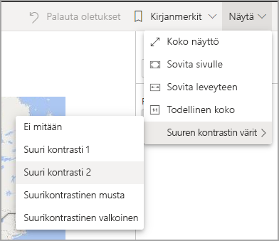
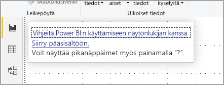
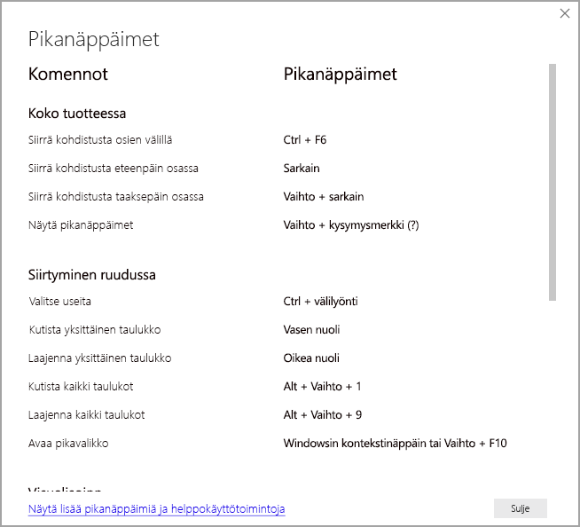
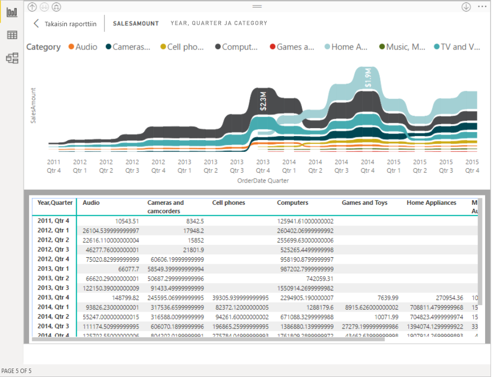

# Power BI -raporttien käyttö helppokäyttötoimintojen avulla
Power BI:ssä on monia ominaisuuksia, joiden avulla toimintarajoitteisten henkilöiden on helppo käyttää ja käsitellä Power BI -raportteja. Näiden työkalujen avulla käyttäjät saavat raportista samat tiedot kuin ne, jotka eivät käytä apuvälineitä.

Seuraavat termit on hyvä tietää, kun luet tätä artikkelia:

* **Kohdistus** tarkoittaa, että hiiren osoitin on sivun päällä. Kohdistus ilmaistaan yleensä objektin ympärillä olevalla sinisellä reunuksella.
* **Pohja** tarkoittaa raporttisi sivualuetta.

Seuraavissa osissa on kuvattu helppokäyttötoimintojen työkalut, jotka ovat käytettävissä Power BI -raporttien käyttöä varten.

## Näppäimistön käyttäminen

Kun käynnistät Power BI Desktopin tai Power BI -palvelun, työkaluvihje tulee näkyviin oikeaan yläkulmaan, kun painat **sarkainta**. Linkki otsikolla **Vihjeitä Power BI:n käyttämiseen näytönlukijan kanssa** ohjaa sinut artikkeliin, josta saat tietoja siitä, miten voit käyttää raporttia helppokäyttötyökaluilla. Napsauttamalla **Siirry pääsisältöön** -linkkiä pääset raporttipohjaan.

Painamalla **?** -painiketta saat auki valintaikkunan, jossa on lueteltu Power BI:n yleisimmät pikanäppäimet. Jos haluat nähdä luettelon kaikista Power BI:ssä käytettävissä olevistaa pikanäppäimistä, voit siirtyä valintaikkunan alaosassa olevaan linkkiin, joka vie sinut Power BI:n dokumentaatioon [pikanäppäimistä](desktop-accessibility-keyboard-shortcuts.md).

Voit vaihtaa kohdistusta raporttisivujen välilehtien tai raportin tietyn sivun objektien välillä painamalla **Ctrl + F6**. Kun kohdistus on ladatulla raportin sivulla, voit siirtää kohdistuksen **sarkainpainikkeella** sivun objektien välillä. Objekteja ovat kaikki tekstiruudut, kuvat, muodot ja kaaviot. 

Valitseminen tai vahvistaminen **Enter**-näppäimellä ja poistuminen **Esc**-näppäimellä ovat yleisesti käytettyjä komentoja Power BI:ssä.

### Visualisoinneissa siirtyminen näppäimistöllä

Monet Power BI -raporttien luojat rakentavat raportteja, jotka sisältävät paljon tietoja. Visualisointia tarkastellessa voi olla ärsyttävää joutua selaamaan jokaisen visualisoinnin kohdan läpi. Visualisoinneissa siirtyminen näppäimistön avulla on suunniteltu kolmetasoiseksi hierarkiaksi. Nämä kolme tasoa on kuvattu seuraavissa kappaleissa.

Visualisoinnin ensimmäisellä tasolla voit siirtyä painamalla **Ctrl + oikea nuoli**, jolloin siirryt visualisointiin. Kun olet siirtynyt visualisointiin, voit selata visualisoinnin pääalueita painamalla **sarkainta**. Selattavat pääalueet ovat tietojen piirtoalue, akselin luokat (jos niitä on käytössä) ja selite (jos sellainen on käytössä).

Seuraava. gif-kuva ilmaisee, miten käyttäjä selaa visualisoinnin ensimmäisen tason läpi:

Hierarkian toisella tasolla siirrytään johonkin visualisoinnin pääalueeseen (tietojen piirtoalue, x-akselin luokat, selite). Kun käytät raporttia, voit siirtyä johonkin näistä pääalueista ja selata kyseisen visualisoinnin osion arvopisteiden tai luokkien läpi. Kun olet päättänyt, mitä aluetta haluat tutkia tarkemmin, voit selata kyseistä aluetta painamalla **Enter**.

Jos haluat valita kaikki sarjan arvopisteet, siirry selitteeseen ja paina **Enter**. Kun olet selitteessä, voit siirtyä selitteessä eri luokkiin painamalla **sarkainta**. Valitse haluamasi sarja painamalla **Enter**.

Jos haluat valita tiettyjä arvopisteitä, siirry tietojen piirtoalueelle ja paina **Enter**. Kun olet tietojen piirtoalueella, voit siirtyä arvopisteiden välillä painamalla **sarkainta**. Jos visualisoinnissa on useita sarjoja, voit siirtyä eri sarjan arvopisteisiin painamalla **ylänuoli-** tai **alanuolinäppäintä**.

Jos haluat valita kaikki akselin arvopisteet, siirry akselinimiin ja paina **Enter**. Kun olet akselinimissä, voit siirtyä nimien välillä painamalla **sarkainta**. Valitse haluamasi nimi painamalla **Enter**.

Jos olet siirtynyt kerrokseen, voit palata takaisin painamalla **Esc**. Seuraavassa .gif-kuvassa näytetään, miten käyttäjä voi siirtyä visualisoinnin tasolle ja poistua sieltä sekä valita arvopisteitä tai x-akselin luokkanimiä, siirtyä eri sarjaan ja valita kaikki sarjan arvopisteet.

Jos huomaat, että et voi siirtyä johonkin objektiin tai visualisointiin näppäimistöä käyttäen, syynä voi olla se, että raportin tekijä on päättänyt piilottaa objektin sarkainjärjestyksestä. Raporttien tekijät usein piilottavat koristeobjekteja sarkainjärjestyksestä. Jos huomaat, että et voi selata raportin läpi loogisella tavalla, ota yhteyttä raportin tekijään. Raporttien tekijät voivat määrittää objektien ja visualisointien sarkainjärjestyksen.

### Osittajissa siirtyminen näppäimistöllä

Myös osittajille on olemassa helppokäyttötoiminnot. Kun valitset osittajan, voit säätää osittajan arvoa siirtymällä sen ohjausobjektista toiseen painamalla **Ctrl + oikea nuoli**. Kun esimerkiksi painat aluksi **Ctrl + oikea nuoli**, kohdistus on pyyhkimessä. Tämän jälkeen **välilyönnin** painaminen vastaa pyyhinpainikkeen napsauttamista, mikä poistaa kaikki osittajan arvot.

Voit siirtyä osittajan ohjausobjektista toiseen painamalla **sarkainta**. **Sarkaimen** painaminen pyyhkimen kohdalla siirtää kohdistuksen avattavan valikon painikkeeseen. Seuraava **sarkaimen** painallus siirtää kohdistuksen ensimmäiseen osittaja-arvoon, jos niitä on useita (kuten alue).

### Sivun vaihtaminen

Kun kohdistus on raportin sivujen välilehdillä, käytä **sarkain**- tai **nuolinäppäimiä** siirtääksesi kohdistuksen sivulta toiselle. Näytönlukuohjelma lukee raporttisivun otsikon ja sen, onko kyseinen sivu sillä hetkellä valittuna. Voit ladata raportin sivun, jossa kohdistus on sillä hetkellä, painamalla **Enter**- tai **välilyöntinäppäintä**.

### Visualisoinnin otsikon avaaminen
Kun siirryt visualisointien välillä, voit siirtää kohdistuksen visualisoinnin otsikkoon painamalla **Alt + vaihto + F10**. Visualisoinnin otsikko sisältää erilaisia vaihtoehtoja, kuten lajittelun, kaavion pohjana olevien tietojen viemisen ja tarkastelutilan. Visualisoinnin otsikossa näkyvät kuvakkeet määräytyvät sen mukaan, mitä asetuksia raportin tekijä on päättänyt näyttää.

## Näytönlukuohjelma

Raporttia tarkasteltaessa on parasta jättää skannaustila pois päältä. Power BI:tä kannattaa ajatella enemmän sovelluksena kuin asiakirjana. Siihen on määritetty mukautettuja siirtymisasetuksia siirtymisen helpottamiseksi. Kun käytät näytönlukuohjelmaa Power BI Desktopin kanssa, varmista, että näytönlukuohjelma on auki ennen kuin avaat Power BI Desktopin.

Objektista toiseen siirryttäessä näytönlukuohjelma lukee objektin tyypin ja objektin otsikon (jos sellainen on). Näytönlukuohjelma lukee myös objektin kuvauksen (vaihtoehtoisen tekstin), jos raportin tekijä on antanut sellaisen.

### Näytä tiedot
Voit avata **Näytä tiedot** -ikkunan helppokäyttöisen version painamalla **Alt + vaihto + F11**. Tämän ikkunan avulla voit tutkia visualisoinnissa käytettäviä tietoja HTML-taulukkona käyttäen samoja pikanäppäimiä, joita käytät normaalisti näytönlukuohjelmassa.

**Näytä tiedot** -ominaisuus on HTML-taulukko, joka on käytettävissä vain näytönlukuohjelman kanssa tällä pikanäppäinyhdistelmällä. Jos avaat **Näytä tiedot** -ominaisuuden visualisoinnin otsikossa, näkyviin tulee taulukko, joka *ei ole* yhteensopiva näytönlukuohjelman kanssa.  Ota skannaustila käyttöön, kun käytät **Näytä tiedot** -ominaisuutta pikanäppäinten avulla. Näin voit hyödyntää kaikkia näytönlukuohjelman tarjoamia pikanäppäimiä.

Jos haluat sulkea **Näytä tiedot** -näkymän ja palata raporttiin, paina **Esc**.

## Suuren kontrastin tilat

Power BI -palvelu yrittää tunnistaa Windowsissa valitut suuren kontrastin asetukset. Tunnistamisen tehokkuus ja tarkkuus riippuvat selaimesta, jossa Power BI -palvelu näkyy. Jos haluat määrittää teeman manuaalisesti Power BI -palvelussa, valitse **Näkymä > Suuren kontrastin värit** ja valitse sitten teema, jota haluat raportissa käyttää.

## Seuraavat vaiheet

Power BI:n helppokäyttötoimintojen kokoelma sisältää seuraavat artikkelit:

* [Power BI:n helppokäyttötoimintojen yleiskatsaus](desktop-accessibility-overview.md) 
* [Helppokäyttöisten Power BI -raporttien luominen](desktop-accessibility-creating-reports.md) 
* [Power BI -raporttien luominen helppokäyttötoimintojen työkalujen avulla](desktop-accessibility-creating-tools.md)
* [Power BI -raporttien helppokäyttötoimintojen pikanäppäimet](desktop-accessibility-keyboard-shortcuts.md)
* [Raportin helppokäyttöisyyden tarkistuslista](desktop-accessibility-creating-reports.md#report-accessibility-checklist)

