# Helppokäyttöisten raporttien luominen Power BI:ssä
Voit suunnitella ja luoda vaikuttavia raportteja, joissa huomioidaan myös helppokäyttötoiminnot. Kun luot raporttia, riippumatta kohdeyleisöstäsi, raportti kannattaa luoda siten, että mahdollisimman moni pystyy käyttämään sitä ilman, että sitä tarvitsee mukauttaa erikoismuotoiluilla.

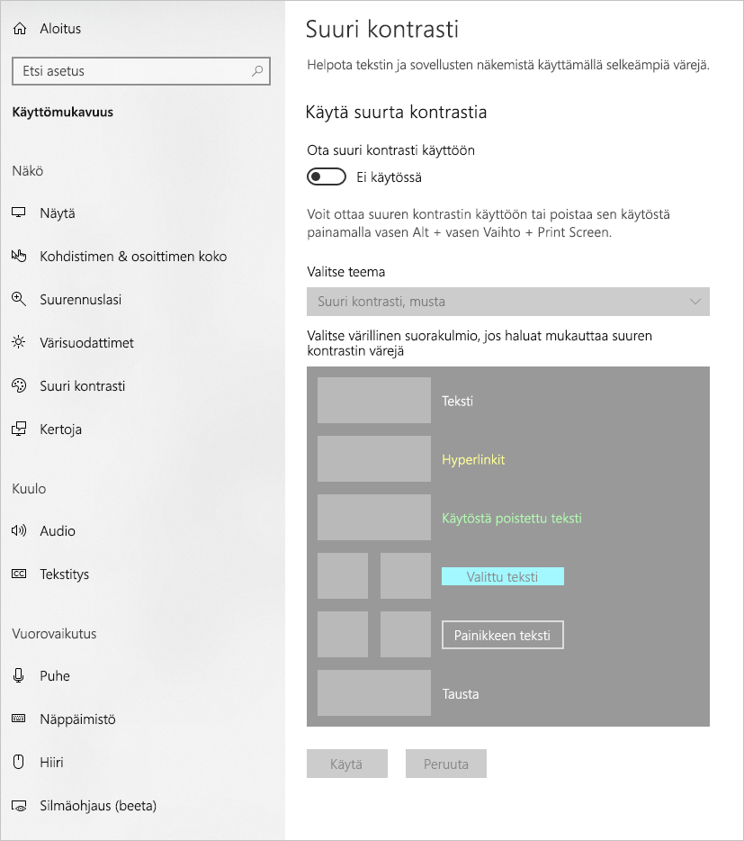

Tässä artikkelissa kuvataan helppokäyttötoimintoja ja-työkaluja, joiden avulla voit luoda helppokäyttöisiä raportteja Power BI:ssä.

Jos haluat parantaa raporttien luomisprosessia näytönlukuohjelmilla, käytettävissä on pikavalikko. Valikon **Kentät**-luettelossa on helppo siirtyä ylös- tai alaspäin. Valikossa voidaan myös siirtää kenttä toisiin lähteisiin, kuten **selitteeseen** tai **arvoon**.

## Helppokäyttötoimintojen tyypit

Power BI tarjoaa mahdollisuuden luoda helppokäyttöisiä raportteja, mutta raportin tekijänä on sinun valittavissasi mitä toimintoja sisällytät raportteihisi. Tässä artikkelissa on kuvattu kolme helppokäyttötoimintojen luokkaa:

* Sisäänrakennetut helppokäyttötoiminnot (määrityksiä ei tarvita)
* Sisäänrakennetut helppokäyttötoiminnot (määrityksiä tarvitaan)
* Muita vinkkejä ja huomioita

Kutakin näistä luokista käsitellään seuraavissa osioissa.

## Sisäänrakennetut helppokäyttötoiminnot

Power BI sisältää tuotteeseen sisäänrakennettuja helppokäyttötoimintoja, jotka eivät edellytä määritysten tekemistä raportin tekijältä. Nämä ominaisuudet ovat seuraavat:

* Siirtyminen näppäimistöllä
* Yhteensopivuus näytönlukuohjelmien kanssa
* Suuren kontrastin värien näkymä
* Tarkastelutila
* Näytä tietotaulukko

Käytettävissä on myös ominaisuuksia, jotka helpottavat raportin käyttökokemusta. Näitä ominaisuuksia kuvaavat artikkelit löytyvät tämän artikkelin lopusta [Seuraavat vaiheet](#next-steps) -osiosta.

Seuraavaksi tutustumme kaikkiin näihin sisäänrakennettuihin helppokäyttötoimintoihin vuorollaan. 

### Siirtyminen näppäimistöllä

Raportin tekijänä sinun ei tarvitse huolehtia siitä, voivatko raportin käyttäjät käyttää näppäimistöä raportin selaamiseen. Kaikissa Power BI:n visualisoinneissa voi siirtyä näppäimistöllä, ja raportin käyttäjä voi selata arvopisteiden läpi visualisoinneissa, vaihtaa sivun välilehtien välillä ja käyttää vuorovaikutteisia ominaisuuksia, kuten ristiinkorostusta, suodatusta ja osittajia.

Kun raportin käyttäjä siirtyy raportin sisällä, kohdistus näyttää, missä käyttäjä on raportissa. Tarkastelutila saattaa näkyä eri tavalla käytettävästä selaimesta riippuen.

Saat käyttöösi yleisimmät pikanäppäimet painamalla *?* , jolloin näkyviin tulee pikanäppäinvalintaikkuna. Jos haluat lisätietoja, tutustu näihin artikkeleihin helppokäyttötoiminnoista ja pikanäppäimistä tämän artikkelin lopussa olevassa [Seuraavat vaiheet](#next-steps) -osiossa.

### Yhteensopivuus näytönlukuohjelmien kanssa

Yleensä kaikki Power BI -objektit, joihin voi siirtyä näppäimistöllä, ovat yhteensopivia myös näytönlukuohjelmien kanssa. Kun raportin käyttäjä siirtyy visualisointiin, näytönlukuohjelma lukee otsikon, visualisoinnin tyypin ja vaihtoehtoisen tekstin, jos se on määritetty.

### Suuren kontrastin värien näkymä

Power BI:ssä on suuren kontrastin tuki raporteille. Jos käytät Windowsissa suuren kontrastin tilaa, Power BI Desktop tunnistaa automaattisesti, mitä suuren kontrastin teemaa Windows käyttää, ja käyttää näitä asetuksia raporteissasi. Suuren kontrastin värit säilyvät raportissa, kun se julkaistaan Power BI -palvelussa tai muualla.

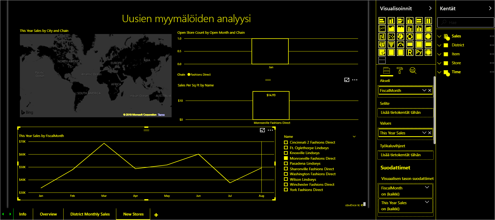

Power BI -palvelu yrittää myös tunnistaa Windowsille valitut suuren kontrastin -asetukset, mutta tunnistamisen tehokkuus ja tarkkuus riippuu Power BI-palvelun käyttämästä selaimesta. Jos haluat määrittää teeman manuaalisesti Power BI -palvelussa, valitse oikeasta yläkulmasta **V > Suuren kontrastin värit** ja valitse sitten teema, jota haluat raportissa käyttää.

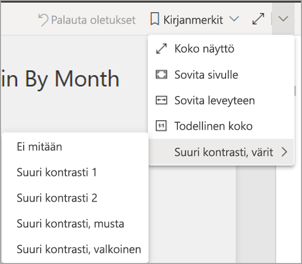

### Tarkastelutila
Jos raportin käyttäjä tarkastelee visualisointia raporttinäkymässä, hän voi laajentaa visualisoinnin täyttämään suuremman osan näytöstä siirtymällä visualisoinnin pikavalikkoon ja valitsemalla **Avaa tarkastelutilassa**.

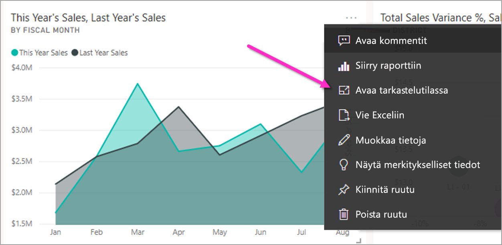

### Näytä tietotaulukko
Raportin käyttäjät voivat myös tarkastella visualisoinnin tietoja taulukkomuodossa painamalla **Alt + Vaihto + F11**. Tämä taulukko on samankaltainen kuin painettaessa **Näytä tiedot** visualisoinnin pikavalikossa, mutta se näyttää taulukon näytönlukuohjelmalle soveltuvassa muodossa.

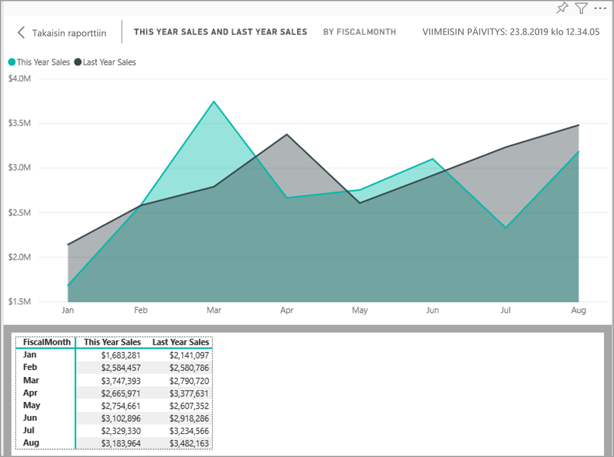

## Sisäänrakennetut helppokäyttötoiminnot, jotka vaativat määrityksiä

Power BI sisältää tuotteeseen sisäänrakennettuja helppokäyttötoimintoja, jotka vaativat määritysten tekemistä raportin tekijältä.  Näihin ominaisuuksiin kuuluvat:

* Vaihtoehtoinen teksti
* Sarkainjärjestys
* Otsikot ja selitteet
* Merkinnät
* Raporttiteemat

## Vaihtoehtoinen teksti

Vaihtoehtoinen teksti (vaihtoehtoiset tekstikuvaukset) kuvaa visualisointien ja kuvien ulkoasua ja toimintoja raporttisivulla näytönlukuohjelman käyttäjille. Raportin tekijöiden tulisi lisätä jokaiseen objektiin vaihtoehtoinen teksti, joka välittää merkityksellisiä tietoja raportista. Lisäämällä vaihtoehtoisen tekstin varmistat, että raportissa olevan visualisoinnin merkitys välittyy myös sellaisille käyttäjille, jotka eivät voi nähdä visualisointia, kuvaa, muotoa tai tekstiruutua. Voit antaa vaihtoehtoisen tekstin mistä tahansa Power BI Desktop -raportin objektista valitsemalla objektin (esimerkiksi visualisointi tai muoto) ja valitsemalla sitten **Visualisoinnit**-ruudusta **Muoto**-osion, laajentamalla **Yleiset**-kohdan, siirtymällä sivun alareunaan ja täyttämällä **Vaihtoehtoinen teksti** -tekstiruudun. **Vaihtoehtoinen teksti** -ruudun enimmäispituus on 250 merkkiä.

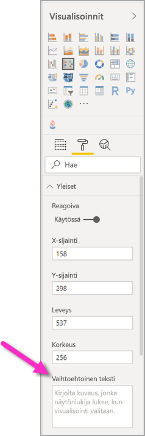

Vaihtoehtoisen tekstin tulee sisältää tietoja siitä, mitä haluat välittää raportin käyttäjälle visualisoinnin avulla. Näytönlukuohjelma lukee visualisoinnin otsikon ja tyypin, joten sinun tarvitsee vain täyttää kuvaus. Seuraavassa on esimerkki visualisoinnin vaihtoehtoisesta tekstistä: *Käyttäjien nettotyytyväisyys myydyn tuotteen värin mukaan, eriteltynä tuoteluokan mukaan.*

Muista, että tietojen tai erityisten arvopisteiden tarkka kuvaaminen ei välttämättä ole paras tapa vaihtoehto staattiseen vaihtoehtoiseen tekstiin, koska Power BI:n tiedot ovat dynaamisia. Jos haluat käyttää dynaamista vaihtoehtoista tekstiä, lue seuraava osio, jossa kerrotaan vaihtoehtoisen tekstin ehdollisesta muotoilusta.

### Vaihtoehtoisen tekstin ehdollinen muotoilu

Yksi niistä ominaisuuksista, joka tekee Power BI:stä niin vaikuttavan, on se, että sen tiedot ovat dynaamisia. Voit luoda dynaamisia vaihtoehtoisia tekstejä DAX-mittareiden ja ehdollisen muotoilun avulla. Näytönlukuohjelmat voivat sitten lukea tietoja, jotka koskevat juuri niitä tietoja, joita raportin käyttäjä katselee.

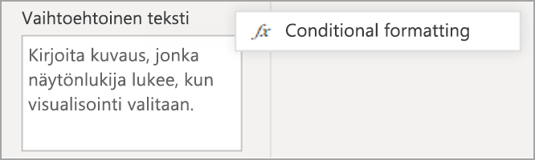

### Sarkainjärjestys
Sarkainjärjestyksen määrittäminen auttaa näppäimistön käyttäjiä siirtymään raportissasi järjestyksessä, joka vastaa sitä, miten käyttäjät käsittelevät raportin visualisointeja visuaalisesti. Jos haluat sisällyttää raporttiin koristeellisia muotoja ja kuvia, poista ne sarkainjärjestyksestä. 

Määritä sarkainjärjestys valitsemalla **Näytä**-välilehti valintanauhasta ja valitsemalla sitten **Valitsemisruutu**-painikkeen, jolloin valitsemisruutu tulee näkyviin.

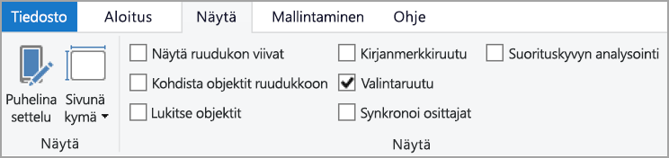

Valitse **Valitsemisruudussa** **Sarkainjärjestys** nähdäksesi raporttisi nykyisen sarkainjärjestyksen. Voit valita objektin ja siirtää sitten objektia hierarkiassa käyttämällä ylä- ja alanuolipainikkeita, tai voit valita objektin hiirellä ja vetää sen haluamaasi sijaintiin luettelossa. Napsauttamalla objektin vieressä olevaa lukua voit piilottaa objektin sarkainjärjestyksestä.

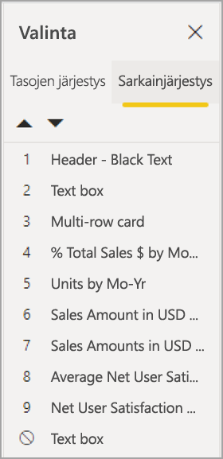

### Otsikot ja selitteet
Visualisointien ja raporttisivujen otsikot ovat tärkeitä helppokäyttötoimintoja, jotka ohjeistavat raportin käyttäjää. Vältä lyhenteiden tai ammattisanaston käyttämistä raporttien otsikoissa. Jos jaat raportin uudelle käyttäjälle tai organisaatiosi ulkopuolisille henkilöille, he eivät välttämättä tiedä, mitä termit tai lyhenteet tarkoittavat. Seuraavassa kuva on visualisointi, jonka otsikossa on lyhenne (vasemmalla), ja selkeämpi otsikko visualisoinnille oikealla.

Varmista, että visualisoinnin sisäiset otsikot, akselinimet, selitteet ja arvopisteiden otsikot on helppo lukea ja ymmärtää. Vertaa seuraavia kuvia, joista ensimmäisessä on vain vähän lukuja ja kuvauksia, kun taas toisessa niitä on paljon.

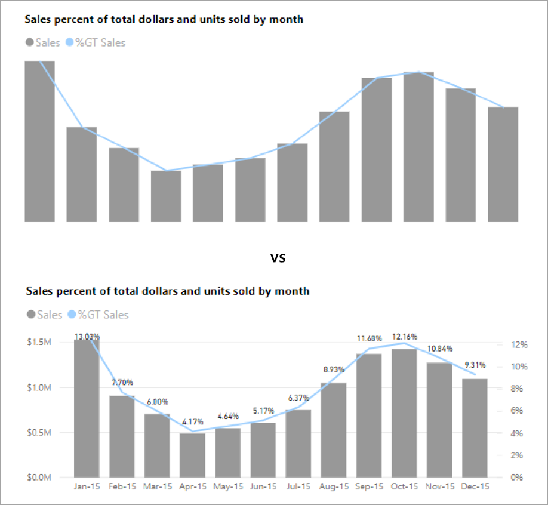

Arvopisteiden otsikoiden kohdalla voit myös ottaa käyttöön tai poistaa käytöstä kunkin sarjan selitteet tai sijoittaa ne sarjan ylä-tai alapuolelle. Vaikka Power BI sijoittaakin arvopisteiden otsikot parhaansa mukaan viivan ylä-tai alapuolelle, toisinaan ne eivät ole kovin selkeitä. Seuraavassa visualisoinnissa arvopisteiden otsikot on aseteltu epäselvästi, eikä niiden lukeminen ole helppoa.

Arvopisteiden otsikoiden sijoittaminen sarjan ylä-tai alapuolelle voi auttaa, varsinkin jos käytät viivakaaviota, jossa on useita viivoja. Pienellä säädöllä arvopisteiden otsikot näyttävät nyt paljon paremmilta.

### Merkinnät

Vältä pelkkien värien käyttämistä (mukaan lukien ehdollisessa muotoilussa) ainoana tiedonvälityksen tapana. Sen sijaan voit käyttää merkintöjä eri sarjojen merkitsemiseen.

Jos käytössä on Rivi-, Alue-, Yhdistelmä-, Pistekaavio- tai Kupla-tyyppisiä visualisointeja, voit ottaa merkinnät käyttöön ja käyttää kullakin rivillä eri merkintämuotoa.

Voit ottaa Merkinnät käyttöön valitsemalla Muoto-osion Visualisoinnit-ruudussa, laajentamalla **Muodot**-osion ja vierittämällä sitten alaspäin **Näytä merkinnät** -kohtaan. Valitse sen asetukseksi **Käytössä** alla olevan kuvan mukaisesti. 

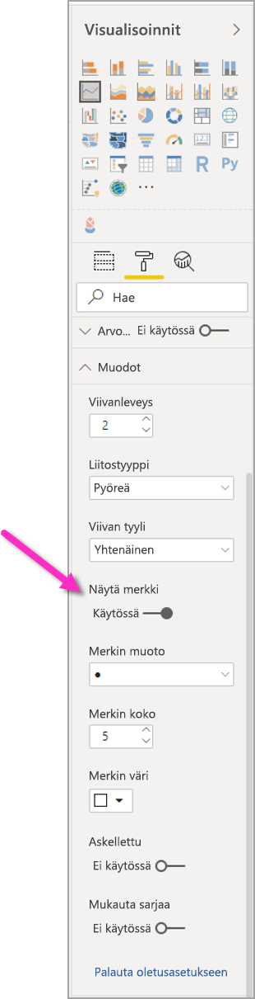

Voit myös käyttää toimintoa **Mukauta sarjaa** valitaksesi kunkin rivin (tai alueen, jos käytössä on Alue-kaavio) nimen Muodot-osion avattavasta ruudusta. Avattavan luettelon alta voit säätää valitun rivin merkinnän muotoa, väriä, kokoa ja muita ominaisuuksia.

Vaikka suosittelemmekin, että raportin tekijät ottavat käyttöön arvopisteiden otsikot ja merkinnät, niiden käyttöönotto jokaiselle visualisoinnille saattaa olla häiritsevää ja tehdä raportista vaikeasti käytettävän. Seuraavassa kuvassa voit verrata visualisointia, jossa on käytössä sekä arvopisteiden otsikot että merkinnät, sekä helpommin ymmärrettävää versiota, jossa arvopisteiden otsikot on poistettu käytöstä.

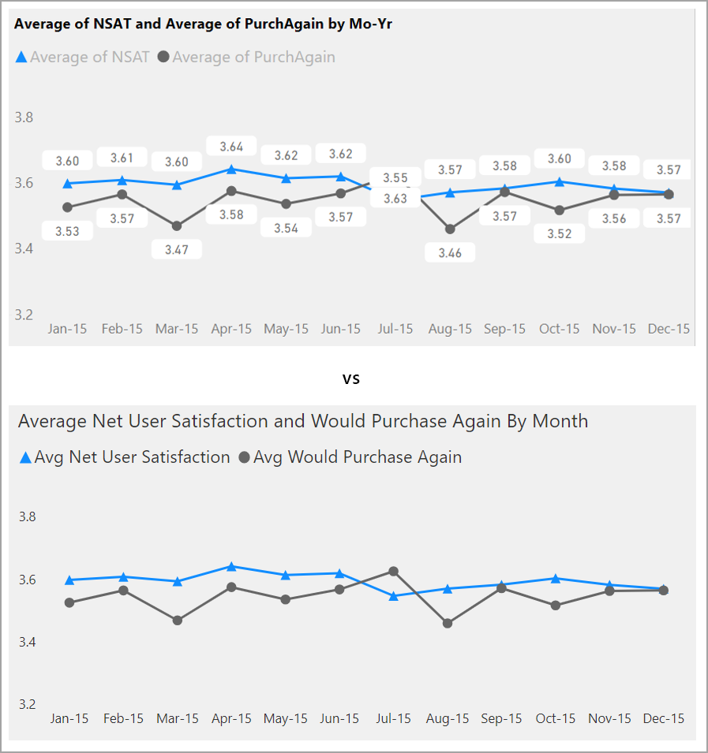

Jos et ole varma siitä, onko visualisointisi tai raporttisi liian sekava, testaa sitä tekemällä [siristystesti](https://chrome.google.com/webstore/detail/the-squint-test/gppnipfbappicilfniaimcnagbpfflpg).  Jos silmäsi kohdistuvat enemmän arvopisteiden otsikoihin kuin itse arvopisteisiin, poista arvopisteiden otsikot käytöstä.

### Teemat, kontrasti ja värisokeille sopivat värit

Varmista, että raportin tekstin ja taustavärien välinen kontrasti on riittävä. WCAG 2.1:n kohta 1.4.3 määrittää, että tekstin ja taustan värien välisen kontrastisuhteen tulee olla vähintään 4,5:1. Useiden käytettävissä olevien työkalujen, kuten [värikontrastianalysaattorin](https://developer.paciellogroup.com/resources/contrastanalyser/), [WebAIM:n](https://webaim.org/resources/contrastchecker/) ja [helppokäyttöisyysvärien](https://accessible-colors.com/), avulla voit tarkastella raporttisi värejä.

Huomaathan myös, että joillakin raporttisi käyttäjillä voi olla hankaluuksia nähdä joitain värejä. Voit käyttää erilaisia työkaluja, kuten [Coblisia](https://www.color-blindness.com/coblis-color-blindness-simulator/) ja [Vischeckiä](https://www.vischeck.com/vischeck/vischeckImage.php), jotka simuloivat sitä, miten värisokeat ihmiset näkevät raporttisi.  Kun käytät raportissasi vähemmän värejä tai harmaansävyjä, teet siitä helppokäyttöisemmän.

Tietyt väriyhdistelmät ovat erityisen hankalia käyttäjille, joilla on hankaluuksia värien näkemisessä. Näitä ovat seuraavat yhdistelmät: 

* vihreä ja punainen
* vihreä ja ruskea
* sininen ja violetti
* vihreä ja sininen
* vaaleanvihreä ja keltainen
* sininen ja harmaa
* vihreä ja harmaa
* vihreä ja musta

Vältä näiden värien käyttämistä yhdessä kaaviossa tai samalla raporttisivulla. Power BI:ssä on joitakin valmiita teemoja, joiden avulla voit tehdä raportistasi helpommin käytettävän, mutta suosittelemme kuitenkin raporttisi tarkistamista jollakin tässä artikkelissa ehdotetulla lisätyökalulla.

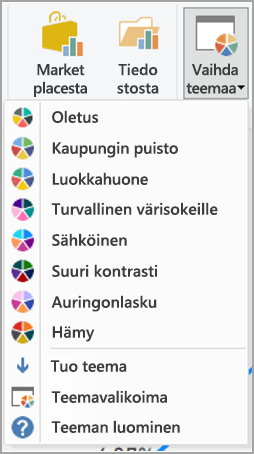

## Vinkkejä ja huomioita
Tässä osiossa on joitakin helppokäyttöisyyteen liittyviä ohjeita, vinkkejä ja huomioita, jotka kannattaa pitää mielessä, kun luot raportteja.

### Ymmärrä, mitä yleisösi haluaa

Raportin luominen on itseään toistava prosessi. Ennen kuin alat sijoittaa visualisointeja sivulle, puhu jollekulle, joka käyttää raporttiasi, jotta ymmärrät paremmin, mitä tietoja he haluavat saada raportista ja miten he haluavat ne nähdä.  

Helppokäyttöisyyden kehittämisen tulisi olla osa tätä prosessia. Saatat huomata, että visiosi ei olekaan sitä, mitä raporttisi käyttäjillä on mielessään. Kun olet valmistellut raportin ensimmäisen luonnoksen, näytä se raportin käyttäjälle ja pyydä palautetta. Palautteen kerääminen voi auttaa raportin tekijää vähentämään muutostoiveiden tulvaa raportin tyytymättömiltä käyttäjiltä.

### Pidä raporttisi yksinkertaisena ja yhtenäisenä

Pidä raporttisi mahdollisimman yksinkertaisena. Käyttäjät yrittävät usein laittaa liian paljon tietoja yksittäiseen visualisointiin. Usein tietojen jakaminen useisiin visualisointeihin helpottaa ymmärtämistä. Harkitse useiden visualisointien käyttämistä, jos ne kuvaavat tietoja eri näkökulmista, ja käytä suodattimia tai visualisointitoimia monipuolisen käyttökokemuksen luomiseksi. Pidä kuitenkin sivun visualisointien määrä mahdollisimman pienenä. Yritä välttää tarpeetonta toistoa ja täyttämästä sivua liian täyteen. Et tarvitse kahta visualisointia saman asian näyttämiseksi. Raportin käyttäjät saattavat hukkua kaikkeen tietoon, jos visualisointeja on liikaa, tai heidän keskittymisensä saattaa herpaantua. Sen lisäksi, että raporttisi on helppokäyttöisempi pienemmällä visualisointien määrällä, liian suuri määrä saattaa hidastaa raportin suorituskykyä.

Pidä raporttisi yhdenmukaisena käyttämällä samaa fontin väriä ja tyyliä kaikissa raportin visuaalisissa elementeissä. Käytä samaa fonttikokoa kaikille visuaalisille otsikoille, samoin kuin arvopisteiden otsikoille ja akselinimille. Jos käytät osittajia useilla raportin sivuilla, pidä ne samassa sijainnissa raportin jokaisella sivulla.

### Heikon näön testi

Nopea tapa testata, miltä raportti näyttäisi käyttäjille, joiden näkökyky on heikentynyt, on näytön tai mobiililaitteen kirkkauden säätäminen pienemmäksi.  Voit myös käyttää selaimen lisäosia, joiden avulla voit suorittaa siristystestin.

## Raportin helppokäyttöisyyden tarkistuslista

Helppokäyttötoimintojen ja -työkalujen Power BI tarjoaa seuraavan tarkistuslistan, jota voit käyttää luodessasi raportteja. Tämän tarkistuslistan avulla voit varmistaa ennen julkaisua, että raporttisi ovat helppokäyttöisiä ja että ne ovat mahdollisimman suuren yleisön käytettävissä. 

### Kaikki visualisoinnit

* Varmista, että värikontrasti taustan ja otsikoiden, akselinimien ja arvopisteiden otsikoiden tekstien välillä on vähintään 4,5:1.
* Vältä värien käyttämistä ainoana tietojen välittämisen tapana. Käytä tekstiä tai kuvakkeita värien täydentämiseen tai korvaamiseen.
* Korvaa tarpeettomat lyhenteet ja ammattisanasto.
* Varmista, että kaikille ei-koristeellisille visualisoinneille on lisätty  **vaihtoehtoinen teksti**.
* Tarkista, että raporttisivusi on myös sellaisten henkilöiden käytettävissä, joilla on hankaluuksia erottaa värejä.

### Osittajat
* Jos raporttisivuillasi on useita osittajia, varmista, että niiden asettelu on yhdenmukainen kaikilla sivuilla. Käytä mahdollisuuksien mukaan samaa fonttia sekä samoja värejä ja sijainteja.

### Tekstiruutu
* Varmista, että fontin ja taustan värien kontrasti on vähintään 4,5:1.
* Varmista, että sijoitat tekstisisällöt **vaihtoehtoinen teksti** -ruutuun, jotta näytönlukuohjelmat voivat lukea ne.

### Visualisointitoimet
* Onko tärkeitä tietoja ilmaistu ainoastaan vuorovaikutteisesti? Jos näin on, järjestä visualisoinnit uudelleen niin, että ne on esisuodatettu siten, että tärkeät päätelmät ovat ilmeisiä.
* Käytätkö siirtymiseen kirjanmerkkejä? Kokeile siirtyä raportissasi näppäimistön avulla, jotta voit varmistaa, että käyttökokemus on kelvollinen käyttäjille, joilla on käytössään vain näppäimistö.

### Lajittelujärjestys
* Oletko määrittänyt sivun kunkin visualisoinnin lajittelujärjestyksen? Helppokäyttöinen **Näytä tiedot** -taulukko näyttää tiedot visualisoinnille määrittämässäsi lajittelujärjestyksessä.

### Työkaluvihjeet
* Älä käytä työkaluvihjeitä tärkeiden tietojen välittämiseen. Käyttäjillä, joilla on motorisia häiriöitä, ja käyttäjillä, jotka eivät käytä hiirtä, on vaikeuksia käyttää niitä.
* Voit kuitenkin lisätä työkaluvihjeitä kaavioihin lisätietona. Nämä tiedot sisällytetään helppokäyttöiseen **Näytä tiedot** -taulukkoon kullekin visualisoinnille.

### Video
* Vältä videoita, jotka käynnistyvät automaattisesti, kun sivu hahmonnetaan.
* Varmista, että videollasi on tekstitys.

### Audio
* Vältä äänitiedostoja, jotka käynnistyvät automaattisesti, kun sivu hahmonnetaan.
* Lisää äänitiedostoille tekstitystiedosto.

### Muodot
* Varmista, että kaikki koristemuodot on merkitty piilotetuiksi sarkainjärjestyksessä, jotta näytönlukuohjelma jättää ne huomioimatta.
* Älä käytä liikaa koristemuotoja, jotta niistä ei tule häiritseviä.
* Kun käytät muotoja kiinnittämään huomiota arvopisteisiin, lisää **vaihtoehtoinen teksti**, joka selittää muodon tarkoituksen.

### Kuvat
* Kun käytät kuvia kiinnittämään huomiota arvopisteisiin, lisää **vaihtoehtoinen teksti**, joka selittää muodon tarkoituksen.
* Varmista, että kaikki koristekuvat on merkitty piilotetuiksi sarkainjärjestyksessä, jotta näytönlukuohjelma jättää ne huomioimatta.
* Älä käytä liikaa koristekuvia, jotta niistä ei tule häiritseviä.

### Mukautetut visualisoinnit
* Tarkista mukautettujen visualisointien helppokäyttöinen **Näytä tiedot** -taulukko. Jos näytettävät tiedot eivät riitä, kokeile toista visualisointia.
* Jos käytät mukautettua *PlayAxis*-visualisointia, varmista, että se ei toistu automaattisesti. Ilmaise selkeästi, että käyttäjän on painettava Toista/keskeytä-painiketta käynnistääkseen/pysäyttääkseen arvojen muuttumisen.

### Kaikki yhden sivun visualisoinnit
* Aseta sarkainjärjestys ja poista sarkainjärjestys käytöstä koristekohteille (merkitse kohde piilotetuksi).

## Huomioitavat asiat ja rajoitukset
Helppokäyttötoimintoihin liittyy muutamia tunnettuja ongelmia ja rajoituksia. Kuvaukset näistä ongelmista ja rajoituksista ovat seuraavassa luettelossa:

* Saadaksesi parhaan kokemuksen, kun käytät näytönlukijaa **Power BI Desktopin** kanssa, avaa valitsemasi näytönlukija ennen kuin avaat tiedostoja **Power BI Desktopissa**.

## Seuraavat vaiheet

Power BI:n helppokäyttötoimintojen kokoelma sisältää seuraavat artikkelit:

* [Power BI:n helppokäyttötoimintojen yleiskatsaus](desktop-accessibility-overview.md) 
* [Power BI -raporttien käyttäminen helppokäyttötoimintojen työkalujen avulla](desktop-accessibility-consuming-tools.md)
* [Power BI -raporttien luominen helppokäyttötoimintojen työkalujen avulla](desktop-accessibility-creating-tools.md)
* [Power BI -raporttien helppokäyttötoimintojen pikanäppäimet](desktop-accessibility-keyboard-shortcuts.md)
* [Raportin helppokäyttöisyyden tarkistuslista](#report-accessibility-checklist)
