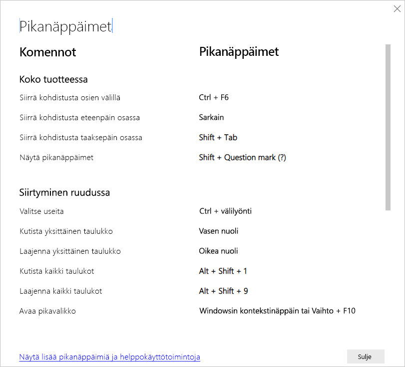

# Pikanäppäimet Power BI Desktopissa

Pikanäppäimet ovat hyödyllisiä Power BI -raporteissa liikuttaessa näppäimistöä käyttämällä. Artikkelin taulukoissa kuvataan Power BI -raportissa käytettävissä olevat pikakuvakkeet. 

Kun käytät Power BI Desktopia, voit painaa **Shift +?** näyttääksesi pikanäppäimet seuraavassa kuvassa esitetyllä tavalla.

Näitä pikanäppäimiä voidaan käyttää **Power BI Desktopin** lisäksi myös seuraavissa kokemuksissa:

* **Q&A Explorer** -valintaikkuna
* **Aloitusopas**-valintaikkuna
* **Tiedosto**-valikko ja **Tietoja**-valintaikkuna
* **Varoituspalkki**
* **Tiedoston palauttaminen** -valintaikkuna
* **Frowns**-valintaikkuna

Pyrkimyksissämme parantaa helppokäyttötoimintoja yllä olevan luettelon kokemukset tukevat myös näytönlukuohjelmia ja suuren kontrastin asetuksia.

## Usein käytetyt pikanäppäimet
| Toiminnon suorittaminen           | Paina                |
| :------------------- | :------------------- |
| Siirrä kohdistusta osien välillä  | **Ctrl + F6** |
| Siirrä kohdistusta eteenpäin osassa | **Sarkain**         |
| Siirrä kohdistusta taaksepäin osassa | **Vaihto + Sarkain** |
| Valitse objekti tai tyhjennä objektin valinta | **Enter** tai **välilyönti** |
| Usean objektin valinta | **Ctrl + välilyönti** |

## Visualisoinnille
| Toiminnon suorittaminen           | Paina                |
| :------------------- | :------------------- |
| Siirrä kohdistus visuaaliseen valikkoon | **Alt + vaihto + F10** |
| Näytä tiedot | **Alt + vaihto + F11**  |
| Anna visualisointi | **Ctrl + oikea nuoli** |
| Anna kerros | **Enter** |
| Poistu kerroksesta tai visualisoinnista | **Esc** |
| Valitse arvopiste tai tyhjennä sen valinta | **Enter** tai **välilyönti** |
| Valitse useita | **Ctrl + Enter** tai **Ctrl + välilyönti** |
| Napsauta hiiren kakkospainikkeella | <ul><li>Windows-näppäimistö: **Windows-kontekstinäppäin + F10**. Windows-kontekstiavain on vasemman Alt-näppäimen ja vasemman nuolinäppäimen välissä</li><li>Muu näppäimistö: **Vaihto + F10**</li></ul> |
| Tyhjennä valinta | **Ctrl + vaihto + C** |
| Näytä tai piilota työkaluvihje | **Ctrl + H** |

## Taulukossa ja matriisissa siirtyminen
| Toiminnon suorittaminen          | Paina                |
| :------------------- | :------------------- |
| Siirrä kohdistusta ylös/alas yhden solun verran (kaikissa soluissa kaikilla alueilla)  | **Nuoli ylöspäin** / **nuoli alaspäin** |
| Siirrä kohdistusta vasemmalle/oikealle yhden solun verran (kaikissa soluissa kaikilla alueilla)  | **Vasen nuolinäppäin** / **Oikea nuolinäppäin** |

## Siirtyminen ruudussa
| Toiminnon suorittaminen           | Paina                |
| :------------------- | :------------------- |
| Valitse useita | **Ctrl + välilyönti** |
| Kutista yksittäinen taulukko | **Vasen nuolinäppäin** |
| Laajenna yksittäinen taulukko | **Oikea nuolinäppäin** |
| Kutista kaikki taulukot | **Alt + vaihto + 1** |
| Laajenna kaikki taulukot | **Alt + vaihto + 9** |
| Avaa pikavalikko | <ul><li>Windows-näppäimistö: **Windows-kontekstinäppäin + F10**.  Windows-kontekstiavain on vasemman Alt-näppäimen ja vasemman nuolinäppäimen välissä</li><li>Muu näppäimistö: **Vaihto + F10**</li></ul> |

## Osittaja
| Toiminnon suorittaminen         | Paina                |
| :------------------- | :------------------- |
| Osittajan käyttö | **Ctrl + oikea nuolinäppäin** |

## Valintaruutu
| Toiminnon suorittaminen           | Paina                |
| :------------------- | :------------------- |
| Aktivoi valintaruutu | **F6** |
| Siirrä objektia tasoissa ylöspäin | **Ctrl + vaihto + F** |
| Siirrä objektia tasoissa alaspäin | **Ctrl + vaihto + B** |
| Piilota tai näytä objekti | **Ctrl + vaihto + S** |

## DAX-editori
| Toiminnon suorittaminen          | Paina                |
| :------------------- | :------------------- |
| Siirrä riviä ylöspäin/alaspäin | **Alt + nuoli ylöspäin** / **nuoli alaspäin** |
| Kopioi rivi ylöspäin/alaspäin | **Vaihto + Alt + nuoli ylöspäin** / **nuoli alaspäin** |
| Lisää rivi alapuolelle | **Ctrl + Enter** |
| Lisää rivi yläpuolelle | **Ctrl + vaihto + Enter** |
| Siirry vastaavaan hakasulkeeseen | **Ctrl + vaihto +**  \ |
| Sisennä riviä tai laajenna rivi reunukseen | **Ctrl + ]**  /  **[** |
| Lisää kohdistin | **Alt + napsautus** |
| Valitse nykyinen rivi | **Ctrl + I** |
| Valitse nykyisen valinnan kaikki esiintymät | **Ctrl + vaihto + L** |
| Valitse nykyisen sanan kaikki esiintymät | **Ctrl + F2** |

## Anna tiedot
| Toiminnon suorittaminen           | Paina                |
| :------------------- | :------------------- |
| Poistu muokattavasta ruudukosta | **Ctrl + sarkain** |

## Huomioitavat asiat ja rajoitukset
Helppokäyttötoimintoihin liittyy muutamia tunnettuja ongelmia ja rajoituksia. Kuvaukset näistä ongelmista ja rajoituksista ovat seuraavassa luettelossa:

* Saadaksesi parhaan kokemuksen, kun käytät näytönlukijaa **Power BI Desktopin** kanssa, avaa valitsemasi näytönlukija ennen kuin avaat tiedostoja **Power BI Desktopissa**.
* Jos käytät Lukijaa, **tietojen näyttämisenä** HTML-taulukkomuodossa on joitakin rajoituksia.

## Seuraavat vaiheet

Power BI:n helppokäyttötoimintojen kokoelma sisältää seuraavat artikkelit:

* [Power BI:n helppokäyttötoimintojen yleiskatsaus](desktop-accessibility-overview.md) 
* [Helppokäyttöisten Power BI -raporttien luominen](desktop-accessibility-creating-reports.md) 
* [Power BI -raporttien käyttäminen helppokäyttötoimintojen työkalujen avulla](desktop-accessibility-consuming-tools.md)
* [Power BI -raporttien luominen helppokäyttötoimintojen työkalujen avulla](desktop-accessibility-creating-tools.md)
* [Raportin helppokäyttöisyyden tarkistuslista](desktop-accessibility-creating-reports.md#report-accessibility-checklist)

Voit olla kiinnostunut myös seuraavista:

* [Raporttiteemojen käyttäminen Power BI Desktopissa](desktop-report-themes.md)

