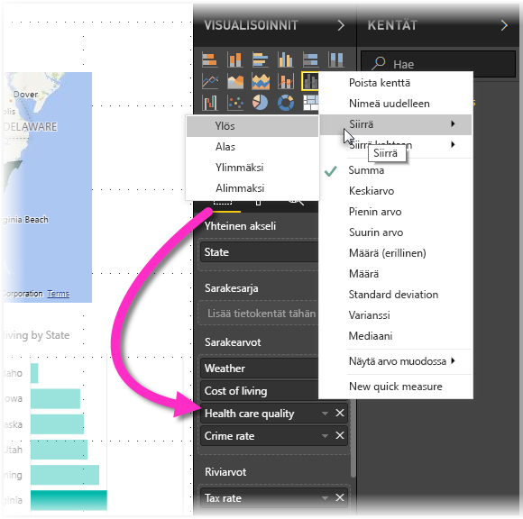

# Power BI Desktop -raporttien helppokäyttöisyys
Power BI:ssa on ominaisuuksia, joiden avulla toimintarajoitteisten henkilöiden on helppo käyttää ja käsitellä Power BI -raportteja. Näitä ominaisuuksia ovat esimerkiksi mahdollisuus käyttää raporttia näppäimistön tai näytönlukuohjelman avulla, kohdistaminen sivun eri objekteihin sarkaimella sekä ymmärtäväinen merkkien käyttö visualisoinneissa.

> [!NOTE]
> Nämä helppokäyttötoiminnot ovat käytettävissä **Power BI Desktopin** kesäkuun 2017 julkaisussa ja sitä uudemmissa versioissa. Tuleviin versioihin on suunnitellaan lisää helppokäyttötoimintoja.
> 
> 

## Power BI Desktop -raporttien käyttö näppäimistöllä tai näytönlukuohjelmalla
Syyskuun 2017 julkaisusta alkaen **Power BI Desktopissa** on voinut painaa **?**-näppäintä, joka avaa **Power BI Desktopissa** käytettävien pikanäppäinten ohjeruudun.

Helppokäyttötoimintoihin tehtyjen parannusten myötä voit käyttää Power BI -raportteja näppäimistöllä tai näytönlukuohjelmalla seuraavin tavoin:

Voit myös vaihtaa kohdistusta raporttisivujen välilehtien tai raportin tietyn sivun objektien välillä painamalla **Ctrl + F6**.

* Kun kohdistus on *raportin sivujen välilehdillä*, käytä *sarkain*- tai *nuolinäppäimiä* siirtääksesi kohdistuksen sivulta toiselle. Näytönlukuohjelma voi lukea raporttisivun otsikon ja sen, onko kyseinen sivu sillä hetkellä valittuna. Voit ladata raportin sivun, jossa kohdistus on sillä hetkellä, painamalla *Enter*- tai *välilyöntinäppäintä*.
* Kun kohdistus on ladatulla *raportin sivulla*, voit siirtää kohdistuksen *sarkainpainikkeella* sivun objektien välillä. Objekteja ovat kaikki tekstiruudut, kuvat, muodot ja kaaviot. Näytönlukija lukee objektin tyypin, kyseisen objektin mahdollisen otsikon ja objektin kuvauksen, jos sille on sellainen raportin kirjoittajan toimesta annettu. 

Jos haluat navigoidessasi visualisointien välillä, käsitellä jotain niistä tarkemmin, paina **Alt + VAIHTO + F10** siirtääksesi kohdistuksen visualisoinnin otsikkoon, joka sisältää eri vaihtoehtoja, kuten lajittelun, kaavion tietojen tarkastelun ja kohdistustilan. 

Voit avata *Näytä tiedot* -ikkunan helppokäyttöisen version painamalla **Alt + vaihto + F11**. Tämän avulla voit tutkia visualisoinnissa käytettäviä tietoja HTML-taulukkona, käyttäen samoja pikanäppäimiä, joita käytät normaalisti näytönlukijassa. 

> [!NOTE]
> Näytä tiedot -ominaisuus on käytettävissä vain näytönlukijan kanssa tällä pikanäppäinyhdistelmällä. Jos avaat Näytä tiedot -ominaisuuden visualisoinnin otsikon vaihtoehdoista, ei se ole näytönlukija käytettävissä.

**Power BI Desktopin** heinäkuun 2018 julkaisusta alkaen myös osittajiin on lisätty helppokäyttötoimintoja. Kun valitset osittajan, voit säätää osittajan arvoa siirtymällä sen ohjausobjektista toiseen käyttämällä CTRL-näppäintä ja oikeaa nuolinäppäintä. Voit esimerkiksi ensin keskittyä pyyhkimeen painamalla CTRL + oikea nuoli. Sen jälkeen välilyönnin painaminen vastaa pyyhinpainikkeen napsauttamista eli poistaa kaikki osittajan arvot. 

Voit siirtyä osittajan ohjausobjektista toiseen painamalla sarkainnäppäintä. Sarkaimen painaminen pyyhkimen kohdalla siirtää kohdistuksen avattavan valikon painikkeeseen. Seuraava painallus siirtää kohdistuksen ensimmäiseen osittaja-arvoon, jos niitä on useita (kuten alue). 

Näiden helppokäyttötoimintojen lisäysten avulla Power BI -raportteja voidaan käyttää täydellisesti näytönlukuohjelmalla ja pikanäppäimillä.

## Vihjeitä helppokäyttöisten raporttien luomiseen
Seuraavien vihjeiden avulla voit luoda entistä helppokäyttöisempiä **Power BI Desktop** -raportteja.

### Yleisiä vinkkejä helppokäyttöisten raporttien luomiseen

* Jos käytössä on **Rivi-**, **Alue-**, **Yhdistelmä-**, **Pistekaavio-** ja/tai **Kupla**-tyyppisiä visualisointeja, ota merkinnät käyttöön ja käytä kullakin rivillä eri *merkintämuotoa*.
  
  * Voit ottaa *Merkinnät* käyttöön valitsemalla **Muoto**-osion **Visualisoinnit**-ruudussa, laajentamalla **Muodot**-osion ja vierittämällä sitten alaspäin **Merkit**-kohtaan. Valitse sen asetukseksi *Käytössä*.
  * Valitse kunkin rivin (tai alueen, jos käytössä on **Alue**-kaavio) nimi **Muodot**-osion avattavasta ruudusta. Avattavan luettelon alta voit säätää valitun rivin merkinnän muotoa, väriä, kokoa ja muita ominaisuuksia.
  
  
  
  * Erilaisen *merkinnän muodon* käyttö kullakin rivillä helpottaa rivien (tai alueiden) erottamista toisistaan.
* Kuten edellisessäkin luettelokohdassa, välitä tietoa muillakin keinoilla kuin värillä. Muotojen käytön lisäksi rivi- ja pistekaavioissa, sinun ei ole pakko noudattaa ehdollista muotoilua tarjotaksesi merkityksellisiä tietoja taulukoiden ja matriisien muodossa. 
* Valitse raporttisi jokaiselle visualisoinnille tarkoituksellinen lajittelujärjestys. Kun näytönlukijan käyttäjä tarkastelee kaavion tietoja, tiedon poimitaan samassa järjestyksessä kuin visualisoinnissa.
* Valitse teemagalleriasta *teema*, jonka kontrasti on suuri ja soveltuu henkilöille, joiden värinäkö on alentunut. Voit tuoda teeman [**Teema** -esikatseluominaisuudella](desktop-report-themes.md).
* Tarjoa *vaihtoehtoinen teksti* jokaisesta raportin objektista. Näin varmistat, että raportissa olevan visualisoinnin merkitys välittyy myös sellaisille käyttäjille, jotka eivät voi nähdä visualisointia, kuvaa, muotoa tai tekstiruutua. Voit antaa *vaihtoehtoisen tekstin* mistä tahansa **Power BI Desktop** -raportin objektista valitsemalla objektin (esimerkiksi visualisointi tai muoto) ja valitsemalla sitten **Visualisoinnit**-ruudusta **Muoto**-osion, laajentamalla **Yleiset**-kohdan, siirtymällä sivun alareunaan ja täyttämällä **Vaihtoehtoinen teksti** -tekstiruudun.
  
  
* Varmista, että raportin tekstin ja taustavärien välinen kontrasti on riittävä. Useiden käytettävissä olevien työkalujen, kuten [värikontrastianalysaattorin](https://developer.paciellogroup.com/resources/contrastanalyser/) avulla voit tarkastella raporttisi värejä. 
* Käytä tekstin kokoa ja fontteja, jotka ovat helppoja lukea. Pieni teksti ja vaikeaselkoiset fontit heikentävät helppokäyttöisyyttä.
* Sisällytä kaikkiin visualisointeihin otsikko, akselinimet ja arvopisteiden nimet.
* Käytä kuvaavia otsikoita kaikille raportin sivuille.
* Vältä koristeellisia muotoja tai kuvia raportissasi mahdollisuuksien mukaan, sillä ne sisällytetään raportin välilehtijärjestykseen. Jos raporttiin tarvitsee sisällyttää koristeellisia objekteja, päivitä objektin vaihtoehtoinen teksti, kertoaksesi näytönlukijan käyttäjille, että kyseessä on koriste.

### Kenttä-säilöjen kohteiden järjestäminen
**Power BI Desktopin** lokakuun 2018 julkaisusta lähtien **Kentät**-lähteessä voi siirtyä näppäimistöä käyttämällä ja näytönlukuohjelmia tuetaan. 

Jotta raporttien luominen näytönlukuohjelman avulla olisi helpompaa, käytettävissä on pikavalikko lähteen kenttien siirtämiseksi ylös- tai alaspäin **Kentät**-luettelossa tai kenttien siirtämiseksi muihin lähteisiin, kuten **Selite**tai **Arvo**.

## Suuren kontrastin tuki raporteille

Käytettäessä suuren kontrastin -tiloja Windowsissa, niiden asetukset ja valitsemasi värivalikoiman otetaan käyttöön myös **Power BI Desktopin** raporteissa. 

**Power BI Desktop** tunnistaa automaattisesti mikä suuren kontrastin teemaa Windows käyttää, ja käyttää näitä asetuksia raporteissasi. Suuren kontrastin värit säilyvät raportissa, kun se julkaistaan Power BI-palvelussa tai muualla.

Power BI -palvelu yrittää myös tunnistaa Windowsille valitut suuren kontrastin -asetukset, mutta tunnistamisen tehokkuus ja tarkkuus riippuu Power BI-palvelun käyttämästä selaimesta. Jos haluat määrittää teeman manuaalisesti Power BI -palvelussa, valitse **Näkymä > Suuren kontrastin värit** ja valitse sitten teema, jota haluat raportissa käyttää.

**Power BI Desktopissa**on joitakin osia, kuten **Visualisoinnit**- ja **Kentät** -kentät, jotka eivät ilmennä valittua suuren kontrastin Windows-väriskaalaa.

## Huomioitavat asiat ja rajoitukset
Helppokäyttötoimintoihin liittyy muutamia tunnettuja ongelmia ja rajoituksia, jotka on kuvattu seuraavassa luettelossa:

* Saadaksesi parhaan kokemuksen, kun käytät näytönlukijaa **Power BI Desktopin** kanssa, avaa valitsemasi näytönlukija ennen kuin avaat tiedostoja Power BI Desktopissa.
* Jos käytät Narratoria, tietojen näyttämisenä HTML-taulukkomuodossa on joitakin rajoituksia.

## Seuraavat vaiheet
* [Raporttiteemojen käyttö Power BI Desktopissa (esikatseluversio)](desktop-report-themes.md)

