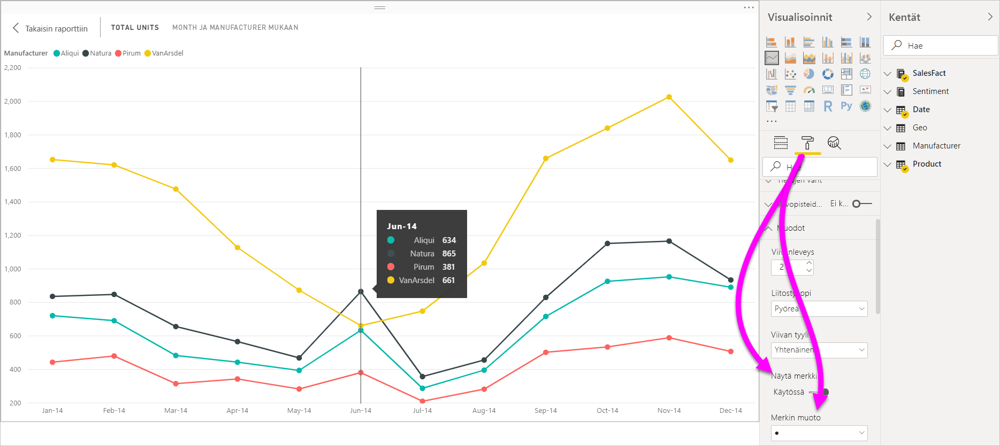
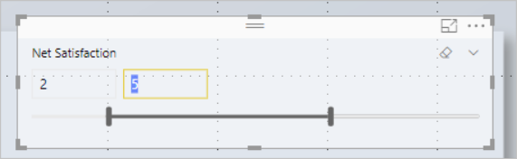
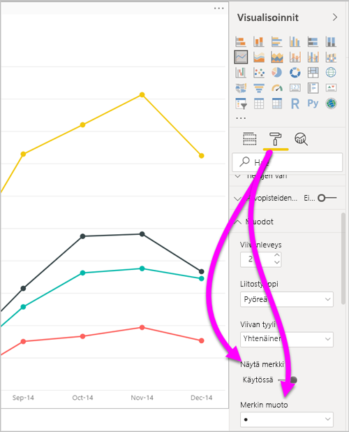
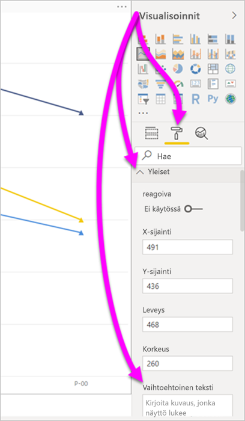
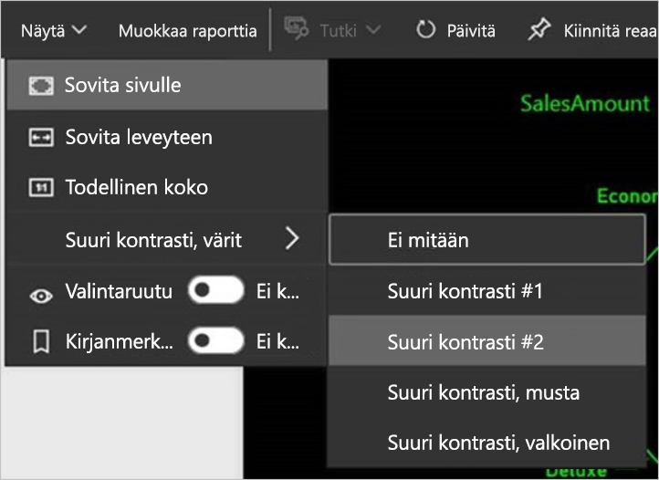

# Power BI Desktop -raporttien helppokäyttöisyys
Power BI:ssa on ominaisuuksia, joiden avulla toimintarajoitteisten henkilöiden on helppo käyttää ja käsitellä Power BI -raportteja. Näitä ominaisuuksia ovat esimerkiksi mahdollisuus käyttää raporttia näppäimistön tai näytönlukuohjelman avulla, kohdistaminen sivun eri objekteihin sarkaimella sekä ymmärtäväinen merkkien käyttö visualisoinneissa.

## Power BI Desktop -raporttien käyttö näppäimistöllä tai näytönlukuohjelmalla
Syyskuun 2017 julkaisusta alkaen **Power BI Desktopissa** on voinut painaa **vaihto + ?** -näppäinyhdistelmää, joka avaa **Power BI Desktopissa** käytettävien pikanäppäinten ohjeruudun.

Helppokäyttötoimintoihin tehtyjen parannusten myötä voit käyttää Power BI -raportteja näppäimistöllä tai näytönlukuohjelmalla seuraavin tavoin:

> [!NOTE]
> Kun tarkastelet raporttia, skannaustilan tulisi yleensä olla poissa käytöstä.

Voit myös vaihtaa kohdistusta raporttisivujen välilehtien tai raportin tietyn sivun objektien välillä painamalla **Ctrl + F6**.

* Kun kohdistus on raportin sivujen välilehdillä, käytä **sarkain**- tai **nuolinäppäimiä** siirtääksesi kohdistuksen sivulta toiselle. Näytönlukuohjelma lukee raporttisivun otsikon ja sen, onko kyseinen sivu sillä hetkellä valittuna. Voit ladata raportin sivun, jossa kohdistus on sillä hetkellä, painamalla **Enter**- tai välilyöntinäppäintä.
* Kun kohdistus on ladatulla raportin sivulla, voit siirtää kohdistuksen **sarkainpainikkeella** sivun objektien välillä. Objekteja ovat kaikki tekstiruudut, kuvat, muodot ja kaaviot. Näytönlukija lukee objektin tyypin ja objektin otsikon (jos sellainen on). Näytönlukija lukee myös objektin kuvauksen, jos raportin tekijä on antanut sellaisen. 

Kun siirryt visualisointien välillä, voit siirtää kohdistuksen visualisoinnin otsikkoon painamalla **Alt + vaihto + F10**. Visualisoinnin otsikko sisältää erilaisia vaihtoehtoja, kuten lajittelun, kaavion pohjana olevien tietojen viemisen ja tarkastelutilan. 

Voit avata **Näytä tiedot** -ikkunan helppokäyttöisen version painamalla **Alt + vaihto + F11**. Tämän ikkunan avulla voit tutkia visualisoinnissa käytettäviä tietoja HTML-taulukkona käyttäen samoja pikanäppäimiä, joita käytät normaalisti näytönlukuohjelmassa. 

> [!NOTE]
> **Näytä tiedot** -ominaisuus on käytettävissä vain näytönlukijan kanssa tällä pikanäppäinyhdistelmällä. Jos avaat **Näytä tiedot** -ominaisuuden visualisoinnin otsikon vaihtoehdoista, se ei ole näytönlukija käytettävissä. Ota skannaustila käyttöön, kun käytät **Näytä tiedot** -ominaisuutta. Näin voit hyödyntää kaikkia näytönlukuohjelman tarjoamia pikanäppäimiä.

**Power BI Desktopin** heinäkuun 2018 julkaisusta alkaen myös osittajiin on lisätty helppokäyttötoimintoja. Kun valitset osittajan, voit säätää osittajan arvoa siirtymällä sen ohjausobjektista toiseen käyttämällä CTRL-näppäintä ja oikeaa nuolinäppäintä (**Ctrl + oikea nuoli**). Kun esimerkiksi painat aluksi **Ctrl + oikea nuoli**, kohdistus on pyyhkimessä. Tämän jälkeen välilyönnin painaminen vastaa pyyhinpainikkeen napsauttamista, mikä poistaa kaikki osittajan arvot. 

Voit siirtyä osittajan ohjausobjektista toiseen painamalla **sarkainnäppäintä**. **Sarkaimen** painaminen pyyhkimen kohdalla siirtää kohdistuksen avattavan valikon painikkeeseen. Seuraava **sarkaimen** painallus siirtää kohdistuksen ensimmäiseen osittaja-arvoon, jos niitä on useita (kuten alue). 

Näiden helppokäyttötoimintojen lisäysten avulla Power BI -raportteja voidaan käyttää täydellisesti näytönlukuohjelmalla ja pikanäppäimillä.

## Vihjeitä helppokäyttöisten raporttien luomiseen
Seuraavien vihjeiden avulla voit luoda entistä helppokäyttöisempiä **Power BI Desktop** -raportteja.

### Yleisiä vinkkejä helppokäyttöisten raporttien luomiseen

* Jos käytössä on **Rivi**-, **Alue**- ja **Yhdistelmä**-visualisointeja ja **Pistekaavio**- ja **Kupla**-tyyppisiä visualisointeja, ota **Näytä merkinnät** käyttöön ja käytä kullakin rivillä eri **merkintämuotoa**.
  
  * Voit ottaa **Näytä merkinnät** käyttöön valitsemalla **Muoto**-osan **Visualisoinnit**-ruudusta. Laajenna sitten **Muodot**-osa. Vieritä alas, jotta löydät **Näytä merkinnät** -valinnan ja ota se **käyttöön**.
  * Jos haluat mukauttaa yksittäisiä rivejä, Etsi **Mukauta sarjaa** -valinta ja ota se **käyttöön**. Valitse kunkin rivin (tai alueen, jos käytössä on **Alue**-kaavio) nimi **Muodot**-osion avattavasta ruudusta. Avattavan luettelon alta voit säätää valitun rivin merkinnän muotoa, väriä, kokoa ja muita ominaisuuksia.
  
    
  
  * Erilaisen **merkinnän muodon** käyttö kullakin rivillä helpottaa rivien (tai alueiden) erottamista toisistaan.
* Kuten edellisessäkin luettelokohdassa, välitä tietoa muillakin keinoilla kuin värillä. Käytettäessä muotoja rivi- ja pistekaavioissa sinun ei ole pakko noudattaa ehdollista muotoilua tarjotaksesi merkityksellisiä tietoja taulukoiden ja matriisien muodossa. 
* Valitse raporttisi jokaiselle visualisoinnille tarkoituksellinen lajittelujärjestys. Kun näytönlukuohjelman käyttäjä tarkastelee kaavion tietoja, tiedot poimitaan samassa järjestyksessä kuin visualisoinnissa.
* Valitse teemagalleriasta teema, jonka kontrasti on suuri ja soveltuu henkilöille, joiden värinäkö on alentunut. Voit tuoda sen [**Teemat**-esikatseluominaisuudella](desktop-report-themes.md).
* Tarjoa vaihtoehtoinen teksti jokaisesta raportin objektista. Näin varmistat, että raporttisi käyttäjät ymmärtävät, mitä yrität kertoa visualisoinnin avulla. Siitä on hyötyä, vaikka he eivät näe visualisointia, kuvaa, muotoa tai tekstiruutua. Voit antaa vaihtoehtoisen tekstin mistä tahansa **Power BI Desktop** -raportin objektista valitsemalla objektin (esimerkiksi visualisoinnin tai muodon) ja valitsemalla sitten **Visualisoinnit**-ruudusta **Muoto**-osion. Laajenna sitten **Yleiset**-kohta, siirry sivun alareunaan ja täytä **Vaihtoehtoinen teksti** -tekstiruutu.
  
  
  
  Vaihtoehtoista tekstiä voidaan muuttaa dynaamisesti lausekkeen avulla esimerkiksi käyttämällä visualisointiin käytettyjä suodattimia. Lauseke määritetään samalla tavalla kuin visualisoinnin otsikko. [Visualisoinnin otsikon ehdollinen muotoilu](desktop-conditional-format-visual-titles.md)
  
* Varmista, että raportin tekstin ja taustavärien välinen kontrasti on riittävä. Useiden käytettävissä olevien työkalujen, kuten [värikontrastianalysaattorin](https://developer.paciellogroup.com/resources/contrastanalyser/), avulla voit tarkastella raporttisi värejä. 
* Käytä tekstin kokoa ja fontteja, jotka ovat helppoja lukea. Pieni teksti ja vaikeaselkoiset fontit heikentävät helppokäyttöisyyttä.
* Sisällytä kaikkiin visualisointeihin otsikko, akselinimet ja arvopisteiden nimet.
* Käytä kuvaavia otsikoita kaikille raportin sivuille.
* Vältä koristeellisia muotoja tai kuvia raportissasi mahdollisuuksien mukaan, sillä ne sisällytetään raportin välilehtijärjestykseen. Jos raporttiin tarvitsee sisällyttää koristeellisia objekteja, päivitä objektin vaihtoehtoinen teksti, kertoaksesi näytönlukijan käyttäjille, että kyseessä on koriste.

### Kenttä-säilöjen kohteiden järjestäminen
**Power BI Desktopin** lokakuun 2018 julkaisusta lähtien voit siirtyä **Kentät**-lähteestä toiseen näppäimistöä käyttämällä ja näytönlukuohjelmia tuetaan. 

Jos haluat parantaa raporttien luomisprosessia näytönlukuohjelmilla, käytettävissä on pikavalikko. Valikon **Kentät**-luettelossa on helppo siirtyä ylös- tai alaspäin. Valikossa voidaan myös siirtää kenttä toisiin lähteisiin, kuten **selitteeseen** tai **arvoon**.

## Suuren kontrastin tuki raporteille

Käytettäessä suuren kontrastin -tiloja Windowsissa, niiden asetukset ja valitsemasi värivalikoiman otetaan käyttöön myös **Power BI Desktopin** raporteissa. 

**Power BI Desktop** tunnistaa automaattisesti, mitä suuren kontrastin teemaa Windows käyttää, ja käyttää näitä asetuksia raporteissasi. Suuren kontrastin värit säilyvät raportissa, kun se julkaistaan Power BI -palvelussa tai muualla.

Power BI -palvelu yrittää myös tunnistaa Windowsissa valitut suuren kontrastin asetukset. Tunnistamisen tehokkuus ja tarkkuus riippuvat selaimesta, jossa Power BI -palvelu näkyy. Jos haluat määrittää teeman manuaalisesti Power BI -palvelussa, valitse **Näkymä** > **Suuren kontrastin värit** ja valitse sitten teema, jota haluat raportissa käyttää.

## Huomioitavat asiat ja rajoitukset
Helppokäyttötoimintoihin liittyy muutamia tunnettuja ongelmia ja rajoituksia. Kuvaukset näistä ongelmista ja rajoituksista ovat seuraavassa luettelossa:

* Saadaksesi parhaan kokemuksen, kun käytät näytönlukijaa **Power BI Desktopin** kanssa, avaa valitsemasi näytönlukija ennen kuin avaat tiedostoja **Power BI Desktopissa**.
* Jos käytät Lukijaa, **tietojen näyttämisenä** HTML-taulukkomuodossa on joitakin rajoituksia.

## Pikanäppäimet
Pikanäppäimet ovat hyödyllisiä Power BI -raporteissa liikuttaessa näppäimistöä käyttämällä. Seuraavissa taulukoissa kuvataan Power BI -raportissa käytettävissä olevat pikakuvakkeet. Näitä pikanäppäimiä voidaan käyttää **Power BI Desktopin** lisäksi myös seuraavissa kokemuksissa:

* **Q&A Explorer** -valintaikkuna
* **Aloitusopas**-valintaikkuna
* **Tiedosto**-valikko ja **Tietoja**-valintaikkuna
* **Varoituspalkki**
* **Tiedoston palauttaminen** -valintaikkuna
* **Frowns**-valintaikkuna

Pyrkimyksissämme parantaa helppokäyttötoimintoja yllä olevan luettelon kokemukset tukevat myös näytönlukuohjelmia ja suuren kontrastin asetuksia.

### Usein käytetyt pikanäppäimet
| Toiminnon suorittaminen           | Paina                |
| :------------------- | :------------------- |
| Siirrä kohdistusta osien välillä  | **Ctrl + F6** |
| Siirrä kohdistusta eteenpäin osassa | **Sarkain**         |
| Siirrä kohdistusta taaksepäin osassa | **Vaihto + Sarkain** |
| Valitse objekti tai tyhjennä objektin valinta | **Enter** tai **välilyönti** |
| Usean objektin valinta | **Ctrl + välilyönti** |

### Visualisoinnille
| Toiminnon suorittaminen           | Paina                |
| :------------------- | :------------------- |
| Siirrä kohdistus visuaaliseen valikkoon | **Alt + vaihto + F10** |
| Näytä tiedot | **Alt + vaihto + F11**  |
| Anna visualisointi | **Ctrl + oikea nuoli** |
| Anna kerros | **Enter** |
| Poistu kerroksesta tai visualisoinnista | **Esc** |
| Valitse arvopiste tai tyhjennä sen valinta | **Enter** tai **välilyönti** |
| Valitse useita | **Ctrl + Enter** tai **Ctrl + välilyönti** |
| Napsauta hiiren kakkospainikkeella | <ul><li>Windows-näppäimistö: **Windows-kontekstinäppäin + F10**. Windows-kontekstiavain on vasemman Alt-näppäimen ja vasemman nuolinäppäimen välissä</li><li>Muu näppäimistö: **Vaihto + F10**</li></ul> |
| Tyhjennä valinta | **Ctrl + vaihto + C** |

### Taulukossa ja matriisissa siirtyminen
| Toiminnon suorittaminen          | Paina                |
| :------------------- | :------------------- |
| Siirrä kohdistusta ylös/alas yhden solun verran (kaikissa soluissa kaikilla alueilla)  | **Nuoli ylöspäin** / **nuoli alaspäin** |
| Siirrä kohdistusta vasemmalle/oikealle yhden solun verran (kaikissa soluissa kaikilla alueilla)  | **Vasen nuolinäppäin** / **Oikea nuolinäppäin** |

### Siirtyminen ruudussa
| Toiminnon suorittaminen           | Paina                |
| :------------------- | :------------------- |
| Valitse useita | **Ctrl + välilyönti** |
| Kutista yksittäinen taulukko | **Vasen nuolinäppäin** |
| Laajenna yksittäinen taulukko | **Oikea nuolinäppäin** |
| Kutista kaikki taulukot | **Alt + vaihto + 1** |
| Laajenna kaikki taulukot | **Alt + vaihto + 9** |
| Avaa pikavalikko | <ul><li>Windows-näppäimistö: **Windows-kontekstinäppäin + F10**.  Windows-kontekstiavain on vasemman Alt-näppäimen ja vasemman nuolinäppäimen välissä</li><li>Muu näppäimistö: **Vaihto + F10**</li></ul> |

### Osittaja
| Toiminnon suorittaminen         | Paina                |
| :------------------- | :------------------- |
| Osittajan käyttö | **Ctrl + oikea nuolinäppäin** |

### Valintaruutu
| Toiminnon suorittaminen           | Paina                |
| :------------------- | :------------------- |
| Aktivoi valintaruutu | **F6** |
| Siirrä objektia tasoissa ylöspäin | **Ctrl + vaihto + F** |
| Siirrä objektia tasoissa alaspäin | **Ctrl + vaihto + B** |
| Piilota tai näytä objekti | **Ctrl + vaihto + S** |

### DAX-editori
| Toiminnon suorittaminen          | Paina                |
| :------------------- | :------------------- |
| Siirrä riviä ylöspäin/alaspäin | **Alt + nuoli ylöspäin** / **nuoli alaspäin** |
| Kopioi rivi ylöspäin/alaspäin | **Vaihto + Alt + nuoli ylöspäin** / **nuoli alaspäin** |
| Lisää rivi alapuolelle | **Ctrl + Enter** |
| Lisää rivi yläpuolelle | **Ctrl + vaihto + Enter** |
| Siirry vastaavaan hakasulkeeseen | **Ctrl + vaihto +**  \ |
| Sisennä riviä tai laajenna rivi reunukseen | **Ctrl + ]**  /  **[** |
| Lisää kohdistin | **Alt + napsautus** |
| Valitse nykyinen rivi | **Ctrl + I** |
| Valitse nykyisen valinnan kaikki esiintymät | **Ctrl + vaihto + L** |
| Valitse nykyisen sanan kaikki esiintymät | **Ctrl + F2** |

### Anna tiedot
| Toiminnon suorittaminen           | Paina                |
| :------------------- | :------------------- |
| Poistu muokattavasta ruudukosta | **Ctrl + sarkain** |

## Seuraavat vaiheet
* [Raporttiteemojen käyttö Power BI Desktopissa (esikatseluversio)](desktop-report-themes.md)

