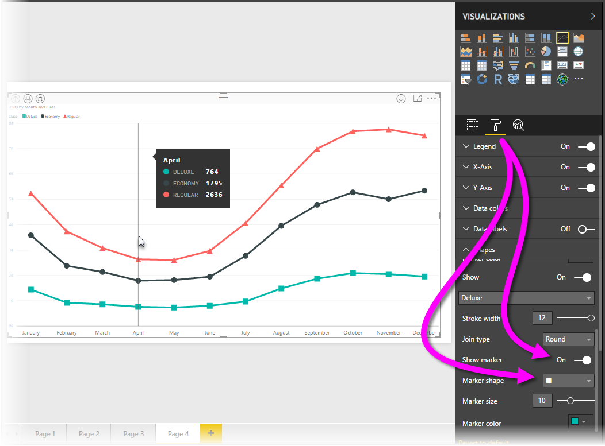
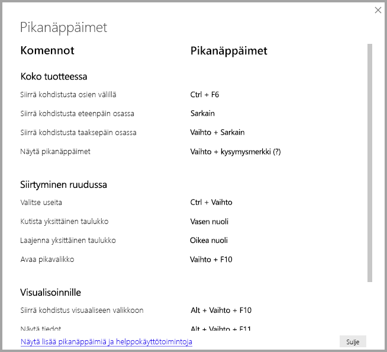
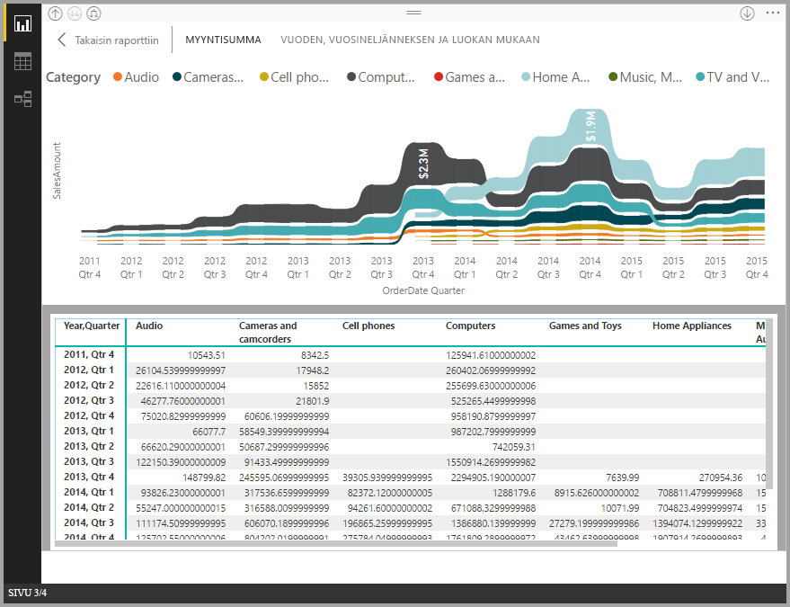
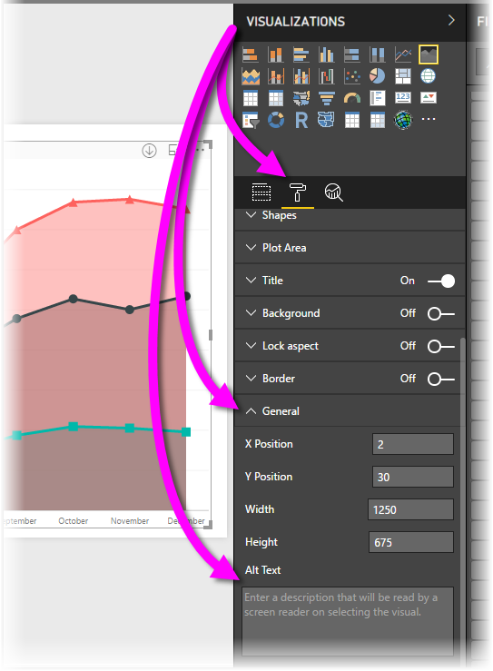

# Power BI Desktop -raporttien helppokäyttöisyys
**Power BI Desktopissa** on ominaisuuksia, joiden avulla toimintarajoitteisten henkilöiden on helppo käyttää ja käsitellä **Power BI Desktop** -raportteja. Näitä ominaisuuksia ovat esimerkiksi mahdollisuus käyttää raporttia näppäimistön tai näytönlukuohjelman avulla, kohdistaminen sivun eri objekteihin sarkaimella sekä ymmärtäväinen merkkien käyttö visualisoinneissa.

> [!NOTE]
> Nämä helppokäyttötoiminnot ovat käytettävissä **Power BI Desktopin** kesäkuun 2017 julkaisussa ja sitä uudemmissa versioissa. Tuleviin versioihin on suunnitellaan lisää helppokäyttötoimintoja.
> 
> 

## Power BI Desktop -raporttien käyttö näppäimistöllä tai näytönlukuohjelmalla
Syyskuun 2017 julkaisusta alkaen **Power BI Desktopissa** on voinut painaa **?**-näppäintä, joka avaa **Power BI Desktopissa** käytettävien pikanäppäinten ohjeruudun.

Helppokäyttötoimintoihin tehtyjen parannusten myötä voit käyttää **Power BI Desktop** -raportteja näppäimistöllä tai näytönlukuohjelmalla seuraavin tavoin:

Voit myös **vaihtaa kohdistusta** raporttisivujen välilehtien tai raportin tietyn sivun objektien välillä painamalla **Ctrl + F6**.

* Kun kohdistus on *raportin sivujen välilehdillä*, käytä *sarkain*- tai *nuolinäppäimiä* siirtääksesi kohdistuksen sivulta toiselle. Näytönlukuohjelma voi lukea raporttisivun otsikon ja sen, onko kyseinen sivu sillä hetkellä valittuna. Voit ladata raportin sivun, jossa kohdistus on sillä hetkellä, painamalla *Enter*- tai *välilyöntinäppäintä*.
* Kun kohdistus on ladatulla *raportin sivulla*, voit siirtää kohdistuksen *sarkainpainikkeella* sivun objektien välillä. Objekteja ovat kaikki tekstiruudut, kuvat, muodot ja kaaviot. Näytönlukuohjelma lukee objektin tyypin ja objektin tekijän kirjoittaman kuvauksen. 

Voit siirtää kohdistuksen visuaaliseen valikkoon painamalla **Alt + vaihto + F10**.

Voit avata *Näytä tiedot* -ikkunan helppokäyttöisen version painamalla **Alt + vaihto + F11**.

Näiden helppokäyttötoimintojen lisäysten avulla **Power BI Desktop** -raportteja voidaan käyttää täydellisesti näytönlukuohjelmalla ja pikanäppäimillä.

## Vihjeitä helppokäyttöisten raporttien luomiseen
Seuraavien vihjeiden avulla voit luoda entistä helppokäyttöisempiä **Power BI Desktop** -raportteja.

* Jos käytössä on **Rivi-**, **Alue-**, **Yhdistelmä-**, **Pistekaavio-** ja/tai **Kupla**-tyyppisiä visualisointeja, ota merkinnät käyttöön ja käytä kullakin rivillä eri *merkintämuotoa*.
  
  * Voit ottaa *Merkinnät* käyttöön valitsemalla **Muoto**-osion **Visualisoinnit**-ruudussa, laajentamalla **Muodot**-osion ja vierittämällä sitten alaspäin **Merkit**-kohtaan. Valitse sen asetukseksi *Käytössä*.
  * Valitse kunkin rivin (tai alueen, jos käytössä on **Alue**-kaavio) nimi **Muodot**-osion avattavasta ruudusta. Avattavan luettelon alta voit säätää valitun rivin merkinnän muotoa, väriä, kokoa ja muita ominaisuuksia.
  
  
  
  * Erilaisen *merkinnän muodon* käyttö kullakin rivillä helpottaa rivien (tai alueiden) erottamista toisistaan.
* Kuten edellisessäkin luettelokohdassa, välitä tietoa muillakin keinoilla kuin värillä. Muotojen käyttäminen riveillä (edellä kuvattujen merkintöjen) parantaa helppokäyttöisyyttä.
* Valitse teemagalleriasta *teema*, jonka kontrasti on suuri ja soveltuu henkilöille, joiden värinäkö on alentunut. Voit tuoda teeman [**Teema** -esikatseluominaisuudella](desktop-report-themes.md).
* Tarjoa *vaihtoehtoinen teksti* jokaisesta raportin objektista. Näin varmistat, että raportissa olevan visualisoinnin merkitys välittyy myös sellaisille käyttäjille, jotka eivät voi nähdä visualisointia, kuvaa, muotoa tai tekstiruutua. Voit antaa *vaihtoehtoinen tekstin* mistä tahansa **Power BI Desktop** -raportin objektista valitsemalla objektin (esim. visualisointi tai muoto) ja valitsemalla sitten **visualisoinnit**-ruudusta **Muoto**-osion, laajentamalla **Yleiset**-kohdan, siirtymällä sivun alareunaan ja täyttämällä **Vaihtoehtoinen teksti** -tekstiruudun.
  
  
* Varmista, että raportin tekstin ja taustavärien välinen kontrasti on riittävä.
* Käytä tekstin kokoa ja fontteja, jotka ovat helppoja lukea. Pieni teksti ja vaikeaselkoiset fontit heikentävät helppokäyttöisyyttä.
* Sisällytä kaikkiin visualisointeihin otsikko, akselinimet ja arvopisteiden nimet.

## Huomioon otettavat seikat ja rajoitukset
Helppokäyttötoimintoihin liittyy muutamia tunnettuja ongelmia ja rajoituksia, jotka on kuvattu seuraavassa luettelossa:

* JAWS-tuki koskee raportteja, joita tarkastellaan **Power BI -palvelussa**, mukaan lukien upotetut raportit. JAWS-tuki koskee myös **Power BI Desktopia**, mutta sinun on avattava näytönlukuohjelma ennen **Power BI Desktop** -tiedostojen avaamista, jotta näytön luku toimii oikein.

## Seuraavat vaiheet
* [Raporttiteemojen käyttö Power BI Desktopissa (esikatseluversio)](desktop-report-themes.md)

