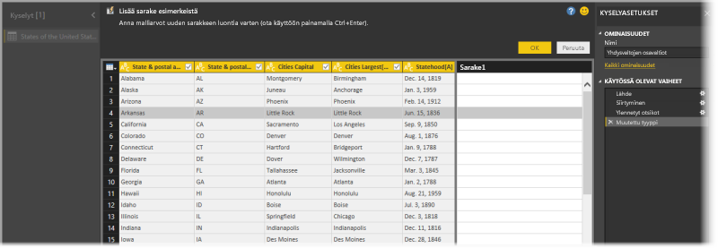
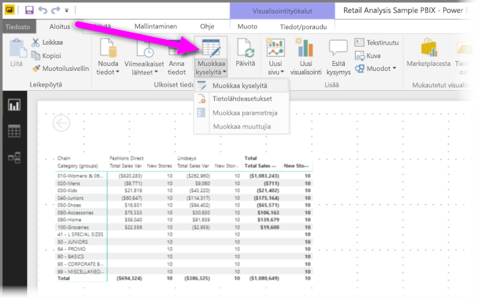
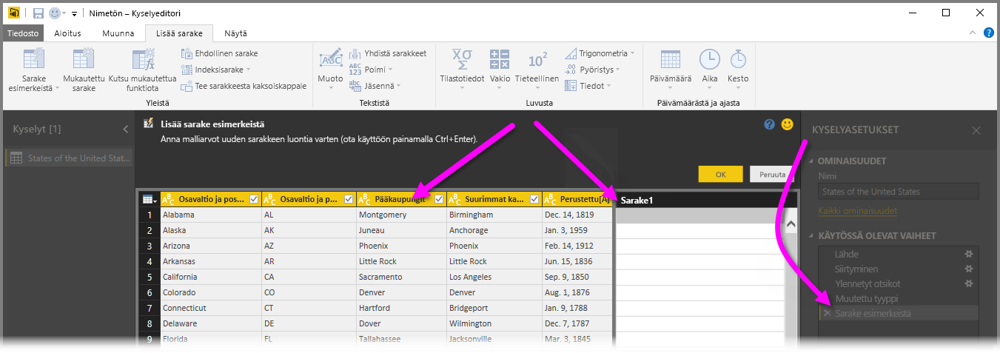
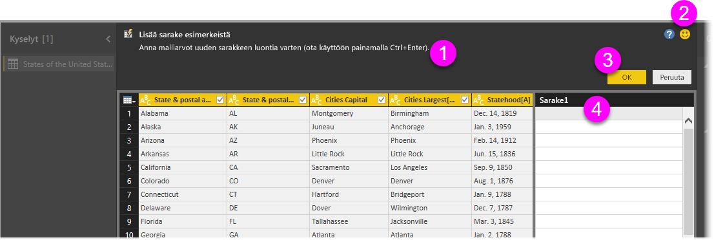
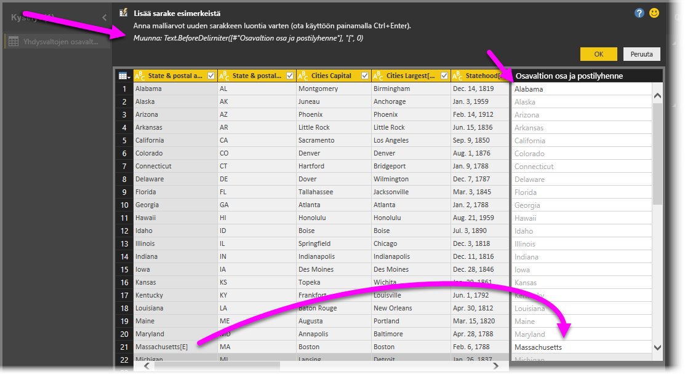

# Sarakkeen lisääminen esimerkistä Power BI Desktopissa
Huhtikuussa 2017 julkaistusta **Power BI Desktop** -versiosta alkaen voit lisätä uusia tietosarakkeita malliin **Kyselyeditorin** avulla antamalla vähintään yksi malliarvo uudelle sarakkeelle. Voit luoda uuden sarakkeen nykyisestä valinnasta tai syöttämällä tietoja perustuen kaikkiin (tai valittuihin) sarakkeisiin tietyssä taulukossa.

Näin voit nopeasti ja helposti luoda uusia sarakkeita, mikä sopii erinomaisesti seuraavissa tilanteissa:

* Sinulla on valmiina uuden sarakkeen tiedot, mutta et ole varma, mitä muunnosta (tai muunnoksia) sinun tulisi käyttää.
* Tiedät, mitä muunnoksia tarvitset, mutta et ole varma mistä kohtaa löydät ne käyttöliittymästä.
* Tiedät kaikki tarvitsemasi muunnokset *mukautettu sarake* -lausekkeen käyttöön **M**:ssä, mutta vähintään yksi lausekkeista ei ole käytettävissä tai valittavissa käyttöliittymässä.

**Lisää sarake esimerkistä** -ominaisuuden käyttö on helppoa ja yksinkertaista. Seuraavissa osissa on käytännön esimerkkejä.

## Uuden sarakkeen lisääminen esimerkeistä Kyselyeditorin avulla
Luo uusi sarake esimerkistä käynnistämällä **Kyselyeditori**. Voit käynnistää Kyselyeditorin valitsemalla **Power BI Desktopin** **Aloitus**-valintanauhasta **Muokkaa kyselyitä**.

Jos haluat saada tietoja verkkosivulta, siirry **Aloitus**-välilehteen, valitse **Nouda tiedot > Verkko** ja liitä URL-osoite valintaikkunaan, joka tulee näkyviin. Tässä artikkelissa käytetään tietoja, jotka ovat peräisin Wikipedia-artikkelista. Voit noutaa tiedot itsellesi napsauttamalla seuraavaa linkkiä ja seuraamalla ohjeita:

* [**Yhdysvaltain osavaltiot**](https://wikipedia.org/wiki/List_of_states_and_territories_of_the_United_States)

Kun olet käynnistänyt **Kyselyeditorin** ja ladannut tietoja, voit aloittaa sarakkeen lisäämisen esimerkeistä. Lisää uusi sarake valitsemalla **Kyselyeditorissa** **Lisää sarake** -välilehti valintanauhassa ja valitsemalla **Sarake esimerkeistä**. Jos valitset avattavan luettelon, voit valita joko **Kaikista sarakkeista** (oletusarvo, jos valitset painikkeen luettelon sijaan) tai **Valinnasta**. Tässä artikkelissa käydään läpi valinta **Kaikista sarakkeista**.

## Lisää sarake esimerkeistä -ruutu
Kun valitsen uuden sarakkeen lisäämisen esimerkeistä, uusi ruutu tulee näkyviin kyseisen taulukon sarakkeilla (sinun on ehkä vieritettävä alaspäin nähdäksesi ne kaikki). Uusi **Sarake1** näkyy myös oikealla. Tämä on sarake, jonka **Power BI Desktop** luo esimerkkien perusteella. Uuden **Sarake1**-otsikon alla on tyhjiä soluja, johon voit lisätä omia esimerkkejä, joiden avulla Power BI luo esimerkkien mukaisia sääntöjä ja muunnoksia.

Huomaa myös, että tämä on **Käytössä oleva vaihe** **Kyselyasetukset**-ruudussa. Tavalliseen tapaan **Kyselyeditori** tallentaa muunnosvaiheet ja käyttää niitä kyselyssä järjestyksessä.

Tätä kutsutaan **Lisää sarakkeita esimerkeistä** -ruuduksi, joka koostuu neljästä pääalueesta:

1. **Komentopalkki**, joka sisältää lyhyen kuvauksen ominaisuudesta tai muunnoksesta.
2. **Lähetä palautetta** -vaihtoehto, jonka avulla lähetettyjä ehdotuksia käytetään Power BI:n kehittämisessä.
3. **OK**- ja **Peruuta**-painikkeet, joiden avulla voit vahvistaa muunnokset ja lisätä sarakkeen tai peruuttaa toiminnon.
4. Uuden sarakkeen alue, jonka riveille voit lisätä malliarvoja (Power BI -esimerkkiä varten), jotka liittyvät kyseisen rivin muihin sarakkeisiin.

Kun olet kirjoittamassa esimerkkiä uuteen sarakkeeseen, Power BI näyttää esikatselun sarakkeesta havaittujen muunnosten perusteella. Jos kirjoitat esimerkiksi *Alabama* ensimmäiselle riville, se vastaa *Alabama*-arvoa taulukon ensimmäisessä sarakkeessa. Heti, kun painat *Enter*-näppäintä, Power BI täyttää sarakkeen kyseisen arvon mukaan.

Jos kuitenkin siirryt sen jälkeen esimerkiksi riviin, jonka sisältö on *Massachusetts [E]* ja poistat lopussa olevan *[E]*-osan (koska et tarvitse sitä enää), Power BI havaitsee muutoksen ja luo muunnoksen esimerkin perusteella. Huomaa muunnoksen selitys keskimmäisessä yläruudussa.

Kun jatkat esimerkkien lisäämistä, **Kyselyeditori** lisää muunnoksia. Kun olet tyytyväinen, voit vahvistaa muutokset valitsemalla **OK**.

## Lisää sarake esimerkeistä käytännössä
Haluatko nähdä tämän käytännössä? Seuraavassa videossa kuvataan toimintoa käytännössä aiemmin tässä esimerkissä annetulla tietolähteellä. Tutustu ja seuraa mukana!

<iframe width="560" height="315" src="https://www.youtube.com/embed/-ykbVW9wQfw" frameborder="0" allowfullscreen></iframe>

## Huomioitavat asiat ja rajoitukset
Monia muunnoksia voi käyttää **lisättäessä saraketta esimerkeistä**, mutta ei kaikkia. Seuraavassa luettelossa on kaikki tuetut muunnokset.

* **Viittaus**
  
  * Viittaus tiettyyn sarakkeeseen (mukaan lukien rajaukset, puhdistukset ja kirjainkoon muutokset)

* **Tekstin muunnokset**
  
  * Yhdistä (tukee merkkijonojen ja kokonaisen sarakkeen arvojen yhdistämistä)
  * Korvaa
  * Pituus
  * Poimi   
    * Ensimmäiset merkit
    * Viimeiset merkit
    * Alue
    * Ennen erotinta oleva teksti
    * Erottimen jälkeen oleva teksti
    * Erottimien välissä oleva teksti
    * Pituus

* Seuraavat **tekstin muunnokset** ovat käytettävissä marraskuussa 2017 julkaistusta **Power BI Desktop** -versiosta lähtien:
    
  * Poista merkit
  * Säilytä merkit

> [!NOTE]
> Kaikki *tekstin* muunnokset ottavat huomioon mahdolliset rajaus-, puhdistus- tai kirjainkoon muunnostarpeet sarakkeen arvoissa.
> 
> 

* **Päivämäärän muunnokset**
  
  * Päivä
  * Viikon päivä
  * Viikon päivän nimi
  * Vuoden päivä
  * Kuukausi
  * Kuukauden nimi
  * Vuoden neljännes
  * Kuukauden viikko
  * Vuoden viikko
  * Vuosi
  * Ikä
  * Vuoden alku
  * Vuoden loppu
  * Kuukauden alku
  * Kuukauden loppu
  * Vuosineljänneksen alku
  * Kuukauden päivien määrä
  * Vuosineljänneksen loppu
  * Viikon alku
  * Viikon loppu
  * Kuukauden päivä
  * Päivän alku
  * Päivän loppu

* **Ajan muunnokset**
  
  * Tunti
  * Minuutti
  * Sekunti  
  * Paikallinen aika

> [!NOTE]
> Kaikki *päivämäärän* ja *ajan* muunnokset ottavat huomioon mahdollisen tarpeen muuntaa sarakkeen arvot *päivämääräksi* tai *ajaksi* tai *päivämääräksi/ajaksi*.
> 
> 

* **Lukujen muunnokset** 

  * Absoluuttinen arvo
  * Arkuskosini
  * Arkussini
  * Arkustangentti
  * Muunna luvuksi
  * Kosini
  * Kuutio
  * Jaa
  * Eksponentti
  * Kertoma
  * Kokonaislukujako
  * Parillinen
  * Pariton
  * Ln
  * 10-kantainen logaritmi
  * Jakojäännös
  * Kertolasku
  * Pyöristä alaspäin
  * Pyöristä ylöspäin
  * Etumerkki
  * Sin
  * Neliöjuuri
  * Neliö
  * Erotus
  * Summa
  * Tangentti

* Seuraavat **luvun muunnokset** ovat käytettävissä marraskuussa 2017 julkaistusta **Power BI Desktop** -versiosta lähtien:

  * Jakauma/alueet

* **Yleiset**
  
  * Ehdollinen sarake