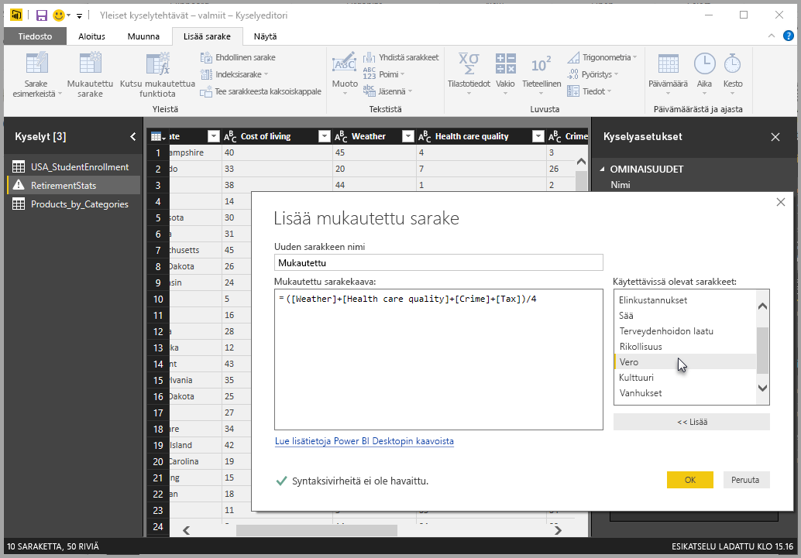
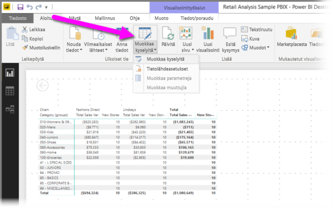
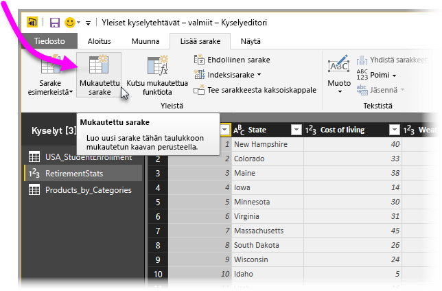
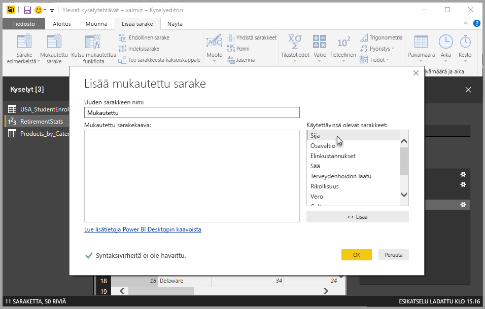
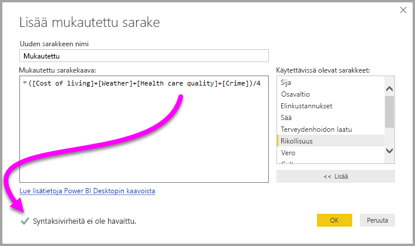
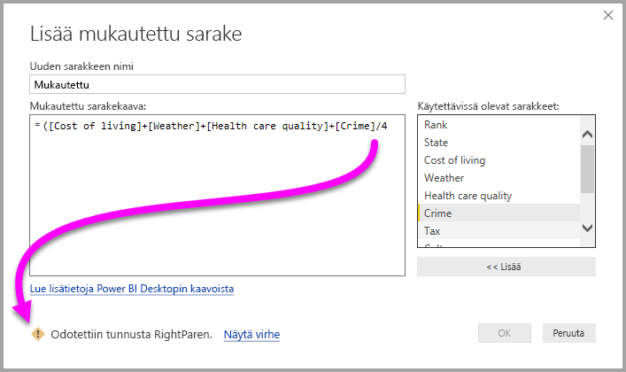
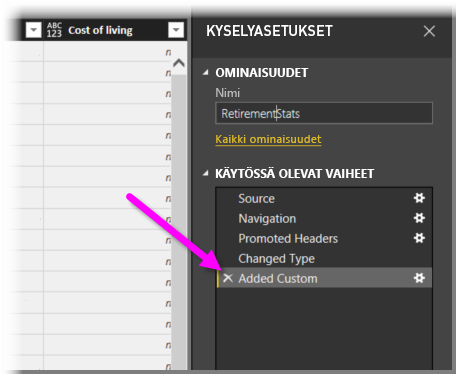
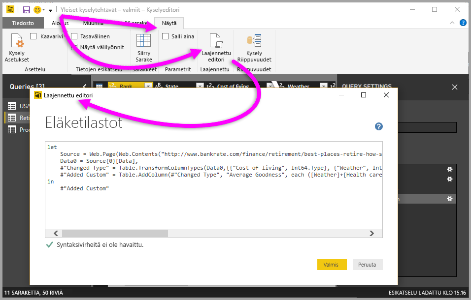

# Mukautettujen sarakkeiden lisääminen Power BI Desktopissa
Voit helposti lisätä uuden mukautetun tietosarakkeen mallin avulla **Kyselyeditoria** - **Power BI Desktopia**. Voit luoda ja nimetä mukautetun sarakkeen helppokäyttöisten painikkeiden avulla käyttämällä [M-kaavoja](https://msdn.microsoft.com/library/mt270235.aspx) , joka määrittävät mukautetun sarakkeen. M-kaava on [kattavan funktion viittauksen sisältöjoukko](https://msdn.microsoft.com/library/mt779182.aspx). 

Mukautetun sarakkeen luominen on toinen **käytetty vaihe** kyselyssä, jonka luot **Kyselyeditorissa**, mikä tarkoittaa, että sitä voidaan muuttaa, siirtää aiemmaksi tai myöhemmäksi tai muokata milloin tahansa.

## Uuden mukautetun sarakkeen lisääminen kyselyeditorin avulla
Jos haluat luoda uuden mukautetun sarakkeen, käynnistä **Kyselyeditori**. Voit käynnistää Kyselyeditorin valitsemalla **Power BI Desktopin** **Aloitus**-valintanauhasta **Muokkaa kyselyitä**.

Kun **Kyselyeditori** on käynnistetty ja sinulla on joitakin ladattuja tietoja, voit lisätä mukautetun sarakkeen valitsemalla **Lisää sarake** -välilehti valintanauhasta ja valitsemalla sitten **Mukautettu sarake** .

**Lisää mukautettu sarake** -ikkuna ilmestyy näkyviin. Se kuvaillaan seuraavassa osassa.

## Lisää mukautettu sarake -ikkuna
**Lisää mukautettu sarake** -ikkunassa näkyviin ruutuun oikealla ylhäällä tulee luettelo käytettävissä olevista kentistä (voit nimetä sen uudelleen kirjoittamalla uuden nimen kyseiseen tekstiruutuun), sekä [ **M** -kaava](https://msdn.microsoft.com/library/mt779182.aspx), jonka luot (tai kirjoitat) perusteena lisättävät kentät oikealla, lisäämällä operaattorit ja kehittämällä muulla tavoin kaavan, jolle uusi mukautettu sarake määritetään. 

## Mukautetun sarakkeen kaavojen luominen
Voit valita kentän kohdasta **Käytettävissä olevat sarakkeet:** oikeanpuoleisesta luettelosta ja valita **<< Lisää** lisätäksesi ne mukautetun sarakkeen kaavan. Voit yksinkertaisesti kaksoisnapsauttaa luettelon saraketta sen lisäämiseksi.

Kun kirjoitat kaavaa ja muodostat sarakkeen, ikkunan alareunassa näkyy ilmaisin, joka kertoo reaaliaikaisesti (samalla kuin kirjoitat), onko syntaksivirheitä havaittu. Jos kaikki on kunnossa, esiin tulee vihreä valintamerkki.

Jos syntaksissa on jonkinlainen virhe, näyttöön tulee keltainen varoituskuvake sekä havaittu virhe ja linkki, joka asettaa kohdistimen (kaavassa) kohtaan, jossa virhe havaitaan.

Kun valitset **OK**, mukautettu sarake lisätään malliin ja **Lisätty mukautettu** -vaihe lisätään kyselyn **käytettyihin vaiheisiin**.

Jos kaksoisnapsautat **Lisätty mukautettu** -vaihetta **Käytetyt vaiheet** -ruudussa, **Lisää mukautettu sarake** -ikkuna tulee uudelleen esiin jo ladatun luomasi mukautetun sarakkeen kaavan kanssa, ja voit muokata sitä tarvittaessa.

## Laajennetun editorin käyttö mukautettuihin sarakkeisiin
Voit myös luoda mukautetun sarakkeen (ja muokata mitä tahansa kyselysi vaihetta) käyttämällä **laajennettua editoria**. Valitse **Kyselyeditorissa** **Näkymä**-välilehti ja valitse sitten **Laajennettu editori** nähdäksesi **laajennetun editorin**.

**Laajennettu editori** antaa kyselyyn täydet oikeudet.

## Seuraavat vaiheet
On olemassa myös muita tapoja luoda mukautettu sarake, mukaan lukien sarakkeen luominen niiden esimerkkien avulla, jotka annat **Kyselyeditoriin**. Katso seuraavasta artikkelista lisätietoja mukautettujen sarakkeiden luomisesta esimerkeistä:

* [Sarakkeen lisääminen esimerkistä Power BI Desktopissa](desktop-add-column-from-example.md)
* [Johdanto M-kaavan kieleen](https://msdn.microsoft.com/library/mt270235.aspx)
* [M-funktion viite](https://msdn.microsoft.com/library/mt779182.aspx)  

