# Koosteet Power BI Desktopissa

**Koosteiden** käyttäminen Power BI:ssä mahdollistaa massadatan vuorovaikutteisen analysoinnin aivan uusilla tavoilla. **Koosteiden** avulla voidaan pienentää suurten tietojoukkojen avaamisen kustannuksia huomattavasti päätöksentekoa varten.

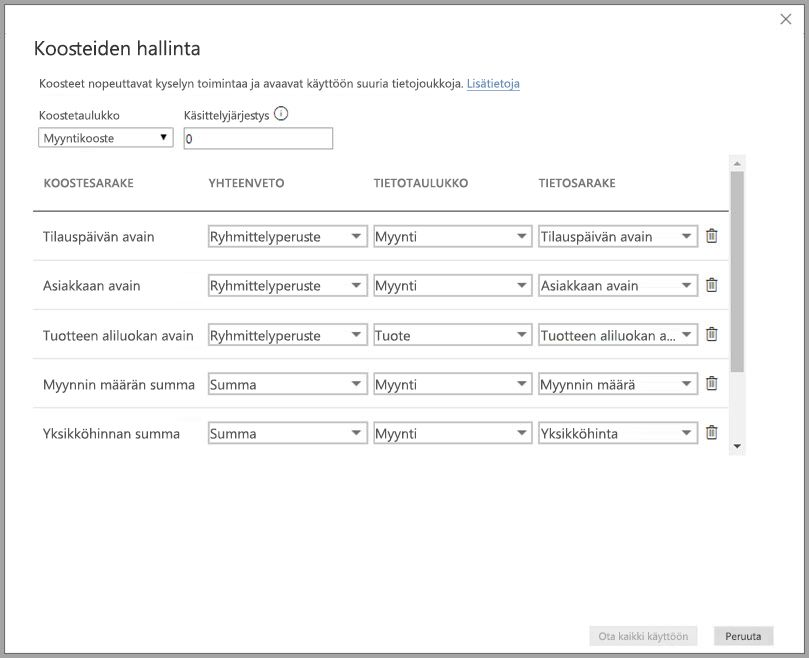

Alla luetellaan **koosteiden** käytön etuja:

* **Kyselyn suorituskyky massadatassa**: Kun käyttäjät käsittelevät visualisointeja Power BI -raporteissa, DAX-kyselyt lähetetään tietojoukkoon. Tehosta kyselyn nopeutta tallentamalla tietoja välimuistiin koostetasolla käyttämällä murto-osa yksityiskohtaisella tasolla tarvittavista resursseista. Avaa massadataa tavalla, joka olisi muutoin mahdotonta.
* **Tietojen päivittämisen optimointi**: Pienennä välimuistin kokoa ja lyhennä päivitysaikoja tallentamalla tietoja välimuistiin koostetasolla. Tuo tietoja käyttäjien käyttöön entistä nopeammin.
* **Tasapainoiset arkkitehtuurit**: Salli Power BI:n välimuistin käsitellä koostettuja kyselyjä, minkä se tekee tehokkaasti. Rajoita tietolähteeseen DirectQuery-tilassa lähetettyjä kyselyjä, mikä auttaa pysymään samanaikaisuuden rajoissa. Hyväksytyt kyselyt yleensä suodatetaan, tapahtumatason kyselyt, joita tietovarastot ja massadatajärjestelmät yleensä käsittelevät hyvin.

### Taulukkotason tallennustila
Taulukkotason tallennustilaa käytetään yleensä koostamisominaisuuden yhteydessä. Lisätietoja on [Power BI Desktopin tallennustilaa](desktop-storage-mode.md) koskevassa artikkelissa.

### Tietolähdetyypit
Koosteita käytetään dimensiomalleja edustavien tietolähteiden, kuten tietovarastojen, tietovaraston osajoukkojen sekä Hadoop-pohjaisten massadatalähteiden yhteydessä. Tässä artikkelissa kuvataan kunkin tietolähdetyypin yleiset mallintamisen erot Power BI:ssä.

Kaikki Power BI:n tuonnin lähteet ja (muut kuin moniulotteiset) DirectQuery-lähteet toimivat koosteiden kanssa.

## Yhteyksiin perustuvat koosteet

Yhteyksiin perustuvia **koosteita** käytetään yleensä dimensiomallien kanssa. Power BI -tietojoukot, joiden lähteenä ovat tietovarastot ja tietovaraston osajoukot, muistuttavat tähti- tai lumihiutalerakenteita, joissa on dimensiotaulukoiden ja faktataulukoiden välisiä yhteyksiä.

Tarkastele seuraavaa mallia, joka on yhdestä tietolähteestä. Oletetaan, että kaikki taulukot käyttävät DirectQuerya. **Myynti**-faktataulukko sisältää miljardeja rivejä. **Myynti**-taulukon määrittäminen **tuonti**-tallennustilaan välimuistiin tallentamista varten kuluttaisi huomattavasti muistia ja lisäisi hallintakustannuksia.

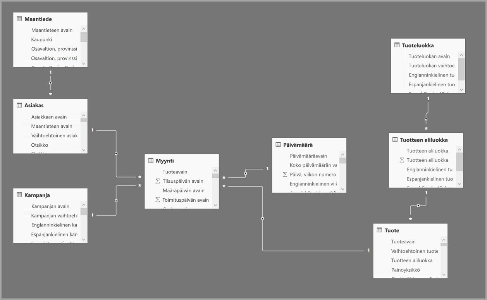

Luodaan sen sijaan **Myyntikooste**-taulukko koostetaulukkona. Sen rakeisuus on suurempi kuin **Myynti**-taulukon, joten se sisältää paljon vähemmän rivejä. Rivien määrän on oltava sama kuin **Myyntimäärä**-summan, ja rivit on jaettu **Asiakasavain**-, **Päivämääräavain**- ja **Tuotteen aliluokka-avain** -ryhmiin. Miljardien sijaan rivejä saattaa olla miljoonia, jolloin hallinta on paljon helpompaa.

Oletetaan, että seuraavia dimensiotaulukoita käytetään yleisimmin suuren liiketoiminta-arvon kyselyissä. Kyseiset taulukot voivat suodattaa **Myyntikooste**-taulukon käyttämällä *yksi moneen* (tai *monta yhteen*) -yhteyksiä.

* Maantiede
* Asiakas
* Päivämäärä
* Tuotteen aliluokka
* Tuoteluokka

Malli näkyy seuraavassa kuvassa.

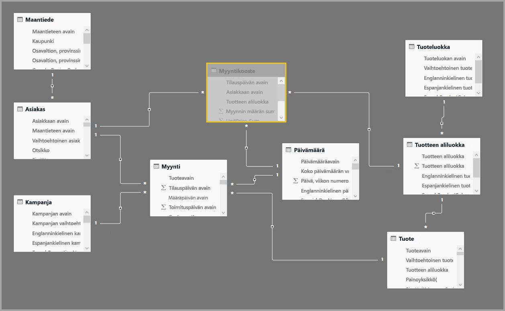

> [!NOTE]
> **Myyntikooste**-taulukko on vain taulukko, joten se voidaan ladata monin tavoin. Koostaminen voidaan suorittaa esimerkiksi lähdetietokannassa ETL/ELT-prosessin avulla tai taulukon [M-lausekkeen](https://msdn.microsoft.com/query-bi/m/power-query-m-reference) mukaan. Se voi käyttää Tuo-tallennustilaa [Power BI Premiumin lisäävän päivityksen](service-premium-incremental-refresh.md) kanssa tai ilman sitä, tai se voi olla DirectQuery ja optimoitu nopeille kyselyille [sarakesäilöindeksejä](https://docs.microsoft.com/sql/relational-databases/indexes/columnstore-indexes-overview) käyttämällä. Joustavuus mahdollistaa tasapainotetut arkkitehtuurit, jotka jakavat kyselyn kuormituksen pullonkaulojen välttämiseksi.

### Tallennustilan tila 
Käytetään aiempaa esimerkkiä. **Myyntikooste**-taulukon tallennustilaksi määritetään **Tuo** kyselyjen nopeuttamiseksi.

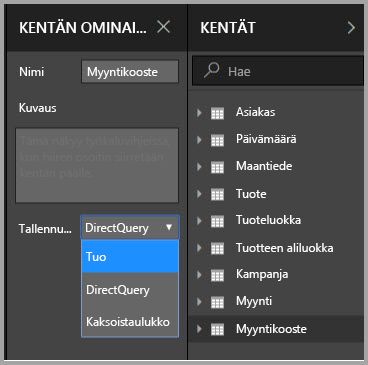

Tällöin avautuu seuraava valintaikkuna, jossa kerrotaan, että aiheeseen liittyvät dimensiotaulukot määritetään **Kaksoistaulukot**-tallennustilaan. 

Kun tallennustilaksi määritetään **Kaksoistaulukot**, aiheeseen liittyvien dimensiotaulukoiden toimintatila voi olla tuonti tai DirectQuery alikyselyn mukaan.

* Kyselyjä, jotka koostavat arvoja **Myyntikooste**-taulukosta, joka on tuonti, ja ryhmittelevät aiheeseen liittyvien kaksoistaulukoiden määritteiden mukaan, voidaan palauttaa muistissa olevasta välimuistista.
* Kyselyjä, jotka koostavat arvoja **Myynti**-taulukosta, joka on DirectQuery, ja ryhmittelevät aiheeseen liittyvien kaksoistaulukoiden määritteiden mukaan, voidaan palauttaa DirectQuery-tilassa. Ryhmittelyperuste-toiminnon sisältävä kyselyn logiikka välitetään lähdetietokantaan.

Lisätietoja **Kaksoistaulukko**-tallennustilasta on [tallennustilaa](desktop-storage-mode.md) koskevassa artikkelissa.

### Vahvat vs. heikot suhteet
Koosteiden osumat suhteiden perusteella edellyttävät vahvoja suhteita.

Vahvat suhteet sisältävät seuraavia yhdistelmiä, joissa molemmat taulukot ovat *yhdestä lähteestä*.

| *Monta-puolten taulukko | *1*-puolen taulukko |
| ------------- |----------------------| 
| Kaksoistaulukko          | Kaksoistaulukko                 | 
| Tuo        | Tuonti- tai kaksoistaulukko       | 
| DirectQuery   | DirectQuery- tai kaksoistaulukko  | 

Ainoa tapaus, jossa *ristilähde*suhdetta pidetään vahvana, on silloin, jos molemmat taulukot ovat tuontitaulukoita. Monta moneen -suhteita pidetään aina heikkoina.

Tietoa *ristilähde*koosteiden osumista, jotka eivät ole riipu suhteista, on alla olevassa Ryhmittelyperuste-sarakkeisiin perustuvista koosteista kertovassa osassa.

### Koostetaulukoihin ei voi osoittaa
Käyttäjät, joilla on tietojoukon vain luku -käyttö, eivät voi luoda kyselyn koostetaulukoita. Näin vältetään suojausongelmat käytettäessä RLS:ää. Käyttäjät ja kyselyt viittaavat tietotaulukkoon eivätkä koostetaulukkoon. Heidän ei tarvitse edes tietää koostetaulukon olemassaolosta.

Tästä syystä **Myyntikooste**-taulukon tulee olla piilotettu. Jos se ei ole, Koosteiden hallinta -valintaikkuna määrittää sen piilotetuksi, kun napsautat Ota kaikki käyttöön -painiketta.

### Koosteiden hallinta -valintaikkuna
Seuraavaksi määritellään koosteet. Valitse **Myyntikooste**-taulukon **Koosteiden hallinta** -pikavalikko napsauttamalla taulukkoa hiiren kakkospainikkeella.

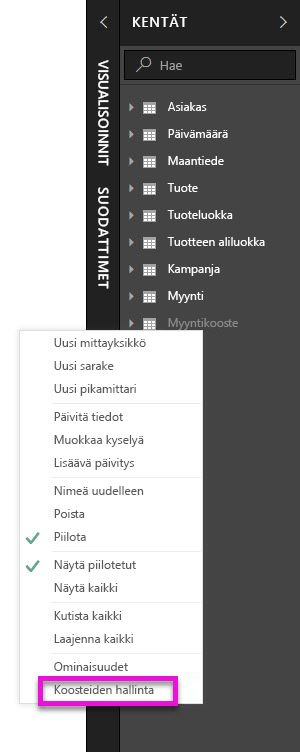

**Koosteiden hallinta** -valintaikkuna tulee näkyviin. Valintaikkunassa näkyy rivi kullekin **Myyntikooste**-taulukon sarakkeelle, joiden avulla voidaan määrittää koosteen toiminta. Power BI -tietojoukkoon lähetetyt kyselyt, jotka viittaavat **Myynti**-taulukkoon, ohjataan sisäisesti **Myyntikooste**-taulukkoon. Tietojoukon käyttäjien ei tarvitse edes tietää **Myyntikooste**-taulukon olemassaolosta.

Seuraavassa taulukossa näytetään **Myyntikooste**-taulukon koosteet.

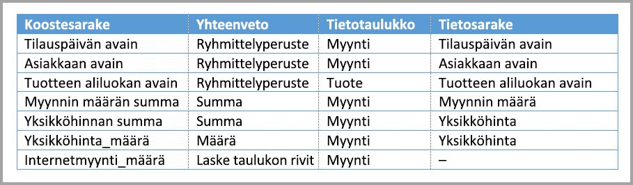

#### Yhteenveto-funktio

Avattava Yhteenveto-valikko sisältää seuraavat valittavat arvot.
* Määrä
* Ryhmittelyperuste
* Maks
* Min
* Summa
* Laske taulukon rivit

#### Vahvistukset

Valintaikkuna pakottaa seuraavat tärkeät vahvistukset:

* Valitun tietosarakkeen tietotyypin on oltava sama kuin koostesarakkeessa lukuun ottamatta Määrä- ja Laske taulukon rivit -yhteenvetofunktioita. Määrä ja Laske taulukon rivit ovat käytettävissä vain kokonaislukukoostesarakkeissa, eivätkä ne edellytä vastaavaa tietotyyppiä.
* Kolmen tai useamman taulukon kattavia ketjutettuja koosteita ei sallita. Ei ole esimerkiksi mahdollistaa määrittää koosteita **taulukosta A**, joka viittaa **taulukkoon B**, joka sisältää **taulukkoon C** viittaavia koosteita.
* Kaksoiskappaleita koosteista, jossa kaksi merkintää käyttää samaa yhteenvetofunktiota ja viittaa samaan tietotaulukkoon tai -sarakkeeseen, ei sallita.
* Tietotaulukon on oltava DirectQuery eikä tuonti.

Useimmat tällaiset vahvistukset pakotetaan poistamalla avattavan valikon arvot käytöstä ja näyttämällä ohjeteksti työkaluvihjeessä seuraavan kuvan mukaisesti.

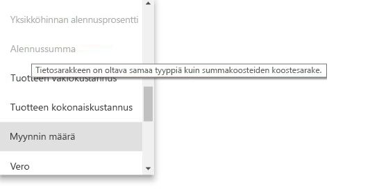

### Ryhmittelyperuste-sarakkeet

Tässä esimerkissä kolme Ryhmittelyperuste-merkintää ovat valinnaisia. Ne eivät vaikuta koosteen toimintaan (lukuun ottamatta myöhemmässä kuvassa näkyvää DISTINCTCOUNT-esimerkkikyselyä). Ne ovat mukana pääasiassa luettavuuden vuoksi. Ilman Ryhmittelyperuste-merkintöjä koosteet saavat silti osumia yhteyksien perusteella. Tämä toiminta eroaa koosteiden käyttämisestä ilman yhteyksiä, joka käydään läpi myöhemmin tässä artikkelissa olevassa massadataa koskevassa esimerkissä.

### Passiiviset yhteydet
Ryhmittelyä passiivisen yhteyden käyttämän viiteavainsarakkeen mukaan ja luottamista USERELATIONSHIP-toimintoon koostamisosumien saamiseksi ei tueta.

### Koosteista osumia tuottavien tai tuottamattomien kyselyiden tunnistaminen

Lisätietoja siitä, miten voit tunnistaa, palautetaanko kyselyjä muistissa olevasta välimuistista (säilömoduuli) vai DirectQuerysta (lähetettynä tietolähteeseen) SQL Profilerin avulla, on [tallennustilaa](desktop-storage-mode.md) koskevassa artikkelissa. Tämän prosessin avulla voidaan myös tunnistaa, saavatko myös koosteet osumia.

Lisäksi SQL Profiler antaa seuraavan laajennetun tapahtuman.

    Query Processing\Aggregate Table Rewrite Query

Seuraava JSON-katkelma on esimerkki tapahtuman tuloksesta koostetta käytettäessä.

* **matchingResult** näyttää, että koostetta käytettiin alikyselyssä.
* **dataRequest** näyttää alikyselyn käyttämät ryhmittelyperustesarakkeet ja koostesarakkeet.
* **mapping** näyttää koostetaulukon sarakkeet, joihin yhdistettiin.

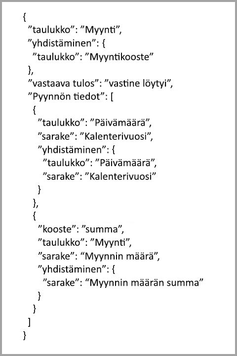

### Kyselyesimerkkejä
Seuraava kysely osuu koosteeseen, koska *Päivämäärä*-taulukon sarakkeiden rakeisuus voi tuottaa osuman koosteessa. **Myyntimääränä** käytetään **Summa**-koostetta.

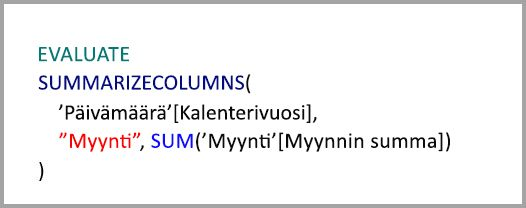

Seuraava kysely ei osu koosteeseen. **Myyntimäärä**-summan pyytämisestä huolimatta se suorittaa ryhmittelyperuste-toiminnon **Tuote**-taulukon sarakkeessa, jonka rakeisuus ei voi tuottaa osumaa koosteessa. Jos tarkastelet mallin yhteyksiä, tuotteen aliluokka voi sisältää useita **Tuote**-rivejä. Kysely ei pysty määrittämään, mihin tuotteeseen koostetaan. Tässä tapauksessa kysely palautuu DirectQueryksi ja lähettää SQL-kyselyn tietolähteeseen.

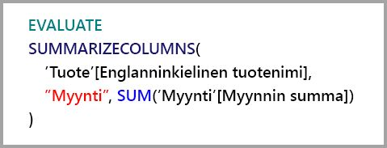

Koosteita ei ole tarkoitettu vain yksinkertaisiin laskutoimituksiin, jotka suorittavat suoraviivaisen yhteenlaskun. Myös monimutkaiset laskutoimitukset voivat hyötyä niistä. Käsitteellisesti monimutkainen laskutoimitus jaetaan alikyselyiksi kullekin SUMMA-, PIENIN-, SUURIN- ja MÄÄRÄ-arvolle, ja kukin alikysely arvioidaan sen määrittämiseksi, voiko kooste saada osuman. Tämä logiikka ei päde kaikissa tapauksissa kyselysuunnitelman optimoinnin vuoksi, mutta yleensä sen pitäisi toimia. Seuraava esimerkki tuottaa osuman koosteessa:

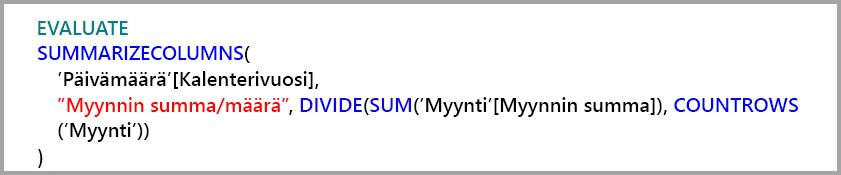

COUNTROWS-funktio voi hyötyä koosteista. Seuraava kysely tuottaa osuman koosteessa, koska **Myynti**-taulukolle on määritetty **Määrä**-taulukon rivien kooste.

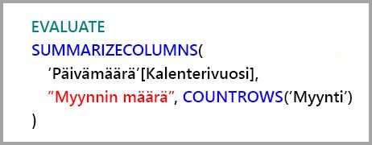

AVERAGE-funktio voi hyötyä koosteista. Seuraava kysely tuottaa osuman koosteessa, koska AVERAGE-funktio muutetaan sisäisesti MÄÄRÄ-arvolla jaetuksi SUMMA-arvoksi. Koska **Yksikköhinta**-sarakkeessa on sekä SUMMA- että MÄÄRÄ-arvoille määritettyjä koosteita, kooste saa osuman.

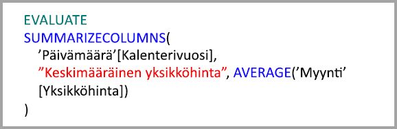

Joissakin tapauksissa DISTINCTCOUNT-funktio voi hyöytä koosteista. Seuraava kysely tuottaa osuman koosteessa, koska **Asiakasavain**-ryhmälle on Ryhmittelyperuste-merkintä, mikä säilyttää **Asiakasavain**-ryhmän erotettavuuden koostetaulukossa. Tähän tekniikkaan liittyy edelleen suorituskyvyn raja-arvo, jolloin noin 2–5 miljoonaa erillistä arvoa voi vaikuttaa kyselyn suorituskykyyn. Se voi kuitenkin olla hyödyllinen tilanteissa, joissa tietotaulukossa on miljardeja rivejä ja sarakkeessa 2–5 miljoonaa erillistä arvoa. Tässä tapauksessa erillisten määrä voidaan suorittaa nopeammin kuin miljardeja rivejä sisältävän taulukon tarkistaminen, vaikka se olisi tallennettu välimuistiin.

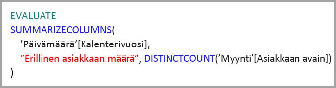

### RLS
Rivitason suojauksen (RLS) lausekkeiden tulee suodattaa sekä koostetaulukko että tietotaulukko, jotta ne toimivat oikein. Seuraavassa esimerkissä **Paikkatieto**-taulukon RLS-lauseke toimii, koska Paikkatieto on yhteyden suodatuspuolella sekä **Myynti**-taulukossa että **Myyntikooste**-taulukossa. Kyselyissä, jotka osuvat koostetaulukkoon, ja niissä, jotka eivät osu siihen, RLS otetaan käyttöön.

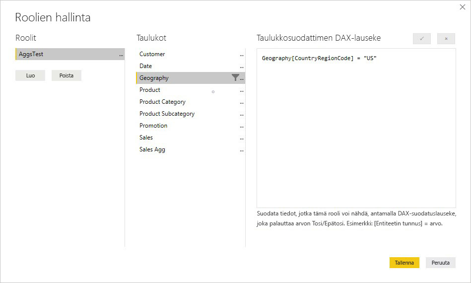

**Tuote**-taulukossa oleva RLS-lauseke suodattaa vain **Myynti**-taulukon. Se ei suodata **Myyntikooste**-taulukkoa. Tätä ei suositella. Tällä roolilla tietojoukkoa käyttävien käyttäjien lähettämät kyselyt eivät hyödy koosteosumista. Koska koostetaulukko on tietotaulukossa olevien samojen tietojen toinen esitystapa, kyselyihin vastaaminen koostetaulukosta ei olisi turvallista, koska RLS-suodatinta ei voi käyttää.

Itse **Myyntikooste**-taulukossa oleva RLS-lauseke suodattaa vain koostetaulukon, eikä lainkaan tietotaulukkoa. Tätä ei sallita.

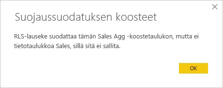

## Ryhmittelyperuste-sarakkeisiin perustuvat koosteet 

Hadoop-pohjaiset massadatatietomallit eroavat ominaisuuksiltaan dimensiomalleista. Suurten taulukkojen välisten liitosten välttämiseksi ne eivät usein perustu yhteyksiin. Sen sijaan dimensiomääritteet denormalisoidaan usein faktataulukoiksi. Tällaiset massadatatietomallit voidaan avata vuorovaikutteista analyysia varten ryhmittelyperuste-sarakkeisiin perustuvien **koosteiden** avulla.

Seuraava taulukko sisältää koostettavan numeerisen **Siirto**-sarakkeen. Kaikki muut sarakkeet ovat määritteitä, joiden mukaan ryhmitellään. Taulukko sisältää IoT-tietoja ja valtavan rivimäärän. Tallennustila on DirectQuery. Kyselyt tietolähteestä, jotka koostavat koko tietojoukon, toimivat hitaasti jo pelkän koon vuoksi.

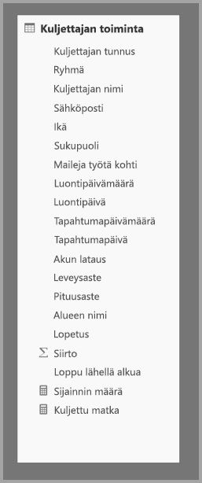

Jotta vuorovaikutteinen analyysi voidaan ottaa käyttöön tässä tietojoukossa, lisätään koostetaulukko, joka ryhmittelee useimpien määritteiden mukaan, mutta jättää pois kardinaliteetiltaan suuret määritteet, kuten pituus- ja leveysasteen. Tämä vähentää rivien määrää huomattavasti, jolloin koko pienenee riittävästi välimuistiin mahtumiseksi. **Kuljettajan toiminnan koosteen** tallennustila on tuonti.

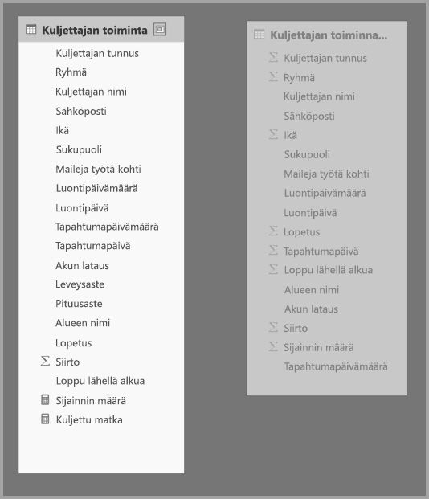

Seuraavaksi määritetään koosteen yhdistämismääritykset **Koosteiden hallinta** -valintaikkunassa. Valintaikkunassa näkyy rivi kullekin **Kuljettajan toiminnan kooste** -taulukon sarakkeelle, joiden avulla voidaan määrittää koosteen toiminta.

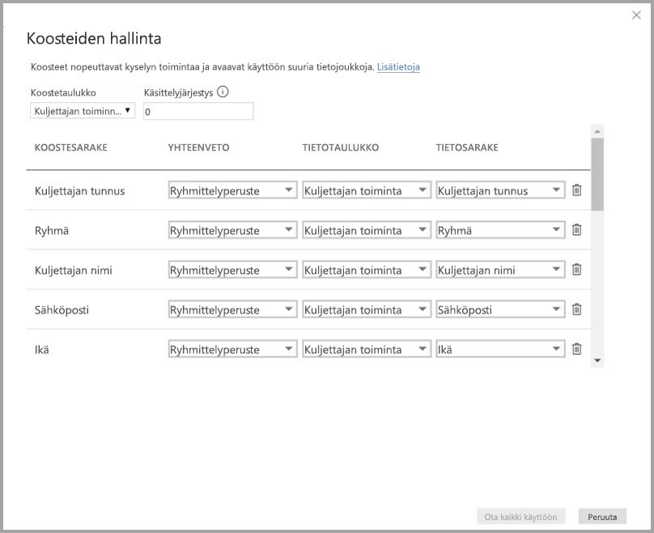

Seuraavassa taulukossa näytetään **Kuljettajan toiminnan kooste** -taulukon koosteet.

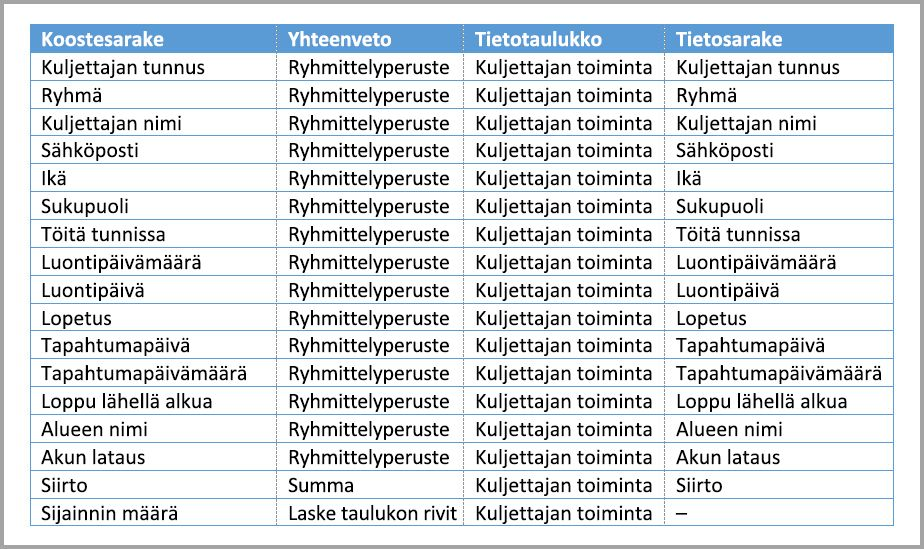

### Ryhmittelyperuste-sarakkeet

Tässä esimerkissä **Ryhmittelyperuste**-merkinnät **eivät ole valinnaisia**. Ilman niitä koosteet eivät saa osumia. Toiminta eroaa yhteyksiin perustuvien koosteiden käyttämisestä, joka käydään läpi edellä tässä artikkelissa olevassa dimensiomallia koskevassa esimerkissä.

### Kyselyesimerkkejä

Seuraava kysely tuottaa osuman koosteessa, koska koostetaulukko kattaa **Tapahtumapäivä**-sarakkeen. COUNTROWS-funktio käyttää Laske taulukon rivit -koostetta.

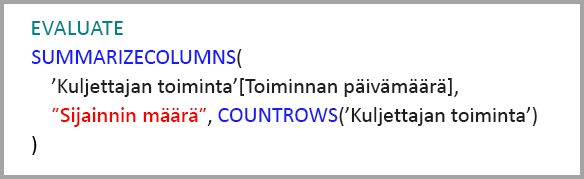

Laske taulukon rivit -koosteita kannattaa käyttää erityisesti malleissa, jotka sisältävät suodatinmääritteitä faktataulukoissa. Power BI voi lähettää kyselyjä tietojoukkoon käyttämällä COUNTROWS-funktiota tapauksissa, joissa käyttäjä ei sitä nimenomaisesti pyydä. Esimerkiksi suodatin-valintaikkuna näyttää rivien määrän kunkin arvon osalta.

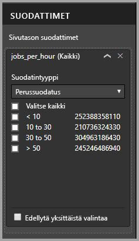

### RLS

Samat RLS-säännöt, jotka on eritelty yllä yhteyksiin perustuville koosteille liittyen siihen, voiko RLS-lauseke suodattaa koostetaulukkoa, tietotaulukkoa tai molempia, koskevat myös ryhmittelysarakkeisiin perustuvia koosteita. Esimerkissä **Kuljettajan toiminta** -taulukossa käytettyä RLS-lauseketta voidaan käyttää suodattamaan **Kuljettajan toiminnan kooste** -taulukkoa, koska kaikki koostetaulukon ryhmittelysarakkeet sisältyvät tietotaulukkoon. RLS-suodatinta **Kuljettajan toiminnan kooste** -taulukossa ei kuitenkaan voi käyttää **Kuljettajan toiminta** -taulukossa, joten sitä ei sallita.

## Koosteen käsittelyjärjestys

Koosteen käsittelyjärjestys sallii useiden koostetaulukoiden käsittelyn yhtenä alikyselynä.

Katso seuraavaa esimerkkiä. Se on [yhdistelmämalli](desktop-composite-models.md), joka sisältää useita DirectQuery-lähteitä.

* **Kuljettajan toiminnan kooste2** -tuontitaulukon rakeisuus on suurempi, koska ryhmittelyperuste-määritteitä on vähän ja niiden kardinaliteetti on pieni. Rivejä voi olla vain tuhansia, joten se mahtuu helposti välimuistiin. Näitä määritteitä käytetään tärkeässä johtajatason raporttinäkymässä, joten niihin viittaavien kyselyjen on oltava mahdollisimman nopeita.
* **Kuljettajan toiminnan kooste** -taulukko on välitason koostetaulukko DirectQuery-tilassa. Se sisältää yli miljardi riviä Azure SQL Data Warehousessa ja on optimoitu lähteessä sarakesäilöindeksejä käyttämällä.
* **Kuljettajan toiminta** -taulukko on DirectQuery, ja se sisältää yli biljoona riviä IoT-tietoja massadatajärjestelmästä. Se käyttää porautumiskyselyjä yksittäisten IoT-lukemien näyttämiseen hallituissa suodatinkonteksteissa.

> [!NOTE]
> DirectQuery-koostetaulukoita, jotka käyttävät tietotaulukossa eri tietolähdettä, tuetaan vain, jos koostetaulukko on SQL Server-, Azure SQL- tai Azure SQL Data Warehouse -lähde.

Tässä mallissa muistin käyttö on melko vähäistä, mutta malli avaa valtavan tietojoukon. Se edustaa tasapainotettua arkkitehtuuria, koska se jakaa kyselyn kuormituksen arkkitehtuurin osien välille käyttämällä niitä niiden vahvuuksien mukaan.

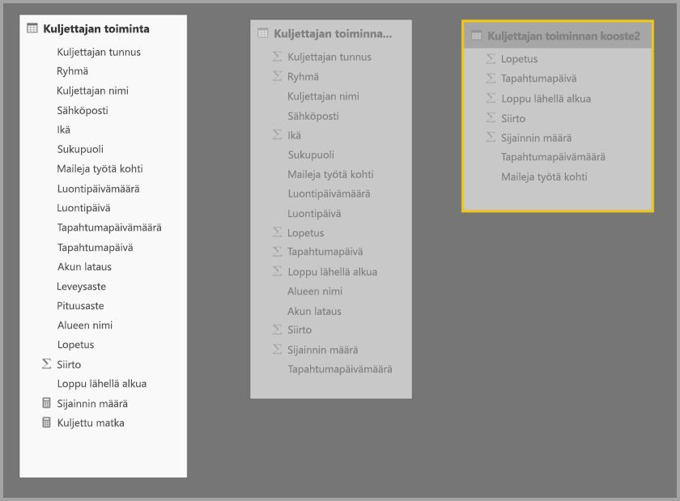

**Kuljettajan toiminnan kooste2** -taulukon **Koosteiden hallinta** -valintaikkuna näyttää, että *Käsittelyjärjestys*-kentän arvo on 10, joka on suurempi kuin **Kuljettajan toiminnan kooste** -taulukolla. Näin ollen kyselyt kohdistuvat ensin siihen koosteita käytettäessä. Alikyselyt, joihin **Kuljettajan toiminnan kooste2** -taulukko ei voi niiden rakeisuuden vuoksi vastata, kohdistuvat sen sijaan **Kuljettajan toiminnan kooste** -taulukkoon. Tietokyselyt, joihin kumpikaan koostetaulukko ei voi vastata, ohjataan **Kuljettajan toiminta** -taulukkoon.

**Tietotaulukko**-sarakkeessa määritetty sarake on **Kuljettajan toiminta** eikä **Kuljettajan toiminnan kooste**, koska ketjutettuja koosteita ei sallita (katso [vahvistuksia](#validations) koskeva osio aiemmin tässä artikkelissa).

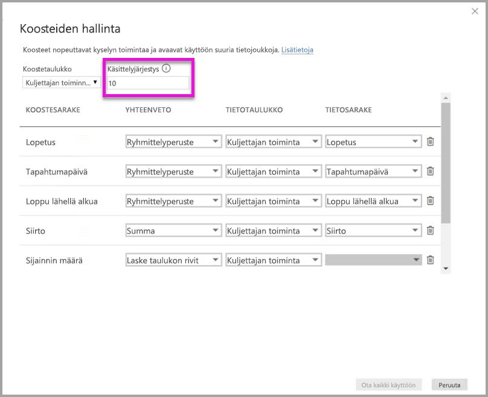

Seuraavassa taulukossa näytetään **Kuljettajan toiminnan kooste2** -taulukon koosteet.

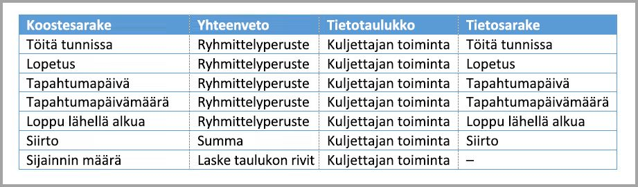

## Ryhmittelyperuste-sarakkeisiin ja suhteisiin perustuvat koosteet

Voit myös yhdistää kaksi aiemmin tässä artikkelissa kuvattua koostamistekniikkaa. Yhteyksiin perustuvat **koosteet** saattavat edellyttää, että denormalisoidut dimensiotaulukot jaetaan useisiin taulukoihin. Jos tämä on kallista tai hankalaa tietyille dimensiotaulukoille, tarvittavat määritteet voidaan replikoida koostetaulukossa tiettyjen dimensioiden ja yhteyksien osalta.

Seuraava malli replikoi *Kuukausi*-, *Vuosineljännes*-, *Puolivuosi*- ja *Vuosi*-arvot **Myyntikooste**-taulukkoon. **Myyntikooste**- ja **Päivämäärä**-taulukon välillä ei ole yhteyttä. **Asiakas**- ja **Tuotteen aliluokka** -taulukoiden välillä on yhteyksiä. **Myyntikooste**-taulukon tallennustila on tuonti.

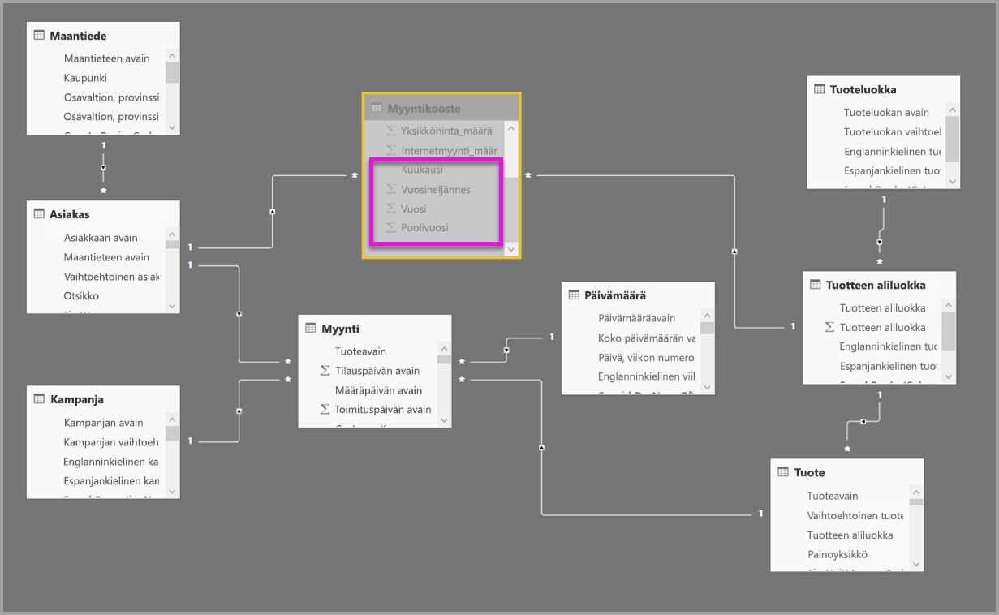

Seuraavassa taulukossa näkyvät **Myyntikooste**-taulukon **Koosteiden hallinta** -valintaikkunassa määritetyt merkinnät. Ryhmittelyperuste-merkinnät, joissa **Päivämäärä** on tietotaulukko, ovat pakollisia osumien saamiseksi koosteista Päivämäärä-määritteiden mukaan ryhmittelevillä kyselyillä. Edellisen esimerkin tapaan Asiakasavain- ja Tuotteen aliluokka-avain -ryhmien Ryhmittelyperuste-merkinnät eivät vaikuta koosteen osumiin yhteyksien käsittelyjärjestyksen vuoksi (edelleen DISTINCTCOUNT-funktiota lukuun ottamatta).

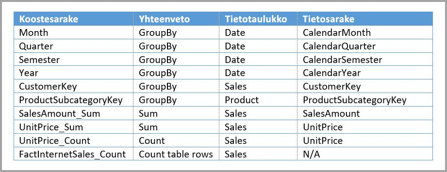

### Kyselyesimerkkejä

Seuraava kysely tuottaa osumia koosteesta, koska koostetaulukko kattaa Kalenterikuukausi-arvon ja Luokan nimi on käytettävissä yksi moneen -yhteyksien kautta. **Myyntimääränä** käytetään Summa-koostetta.

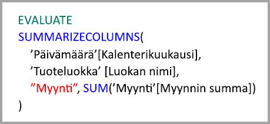

Seuraava kysely ei tuota osumaa koosteessa, koska koostetaulukko ei kata Kalenteripäivä-arvoa.

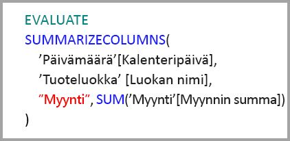

Seuraava aikatietokysely ei tuota osumaa koosteessa, koska DATESYTD-funktio luo Kalenteripäivä-arvojen taulukon, joka ei sisälly koostetaulukkoon.

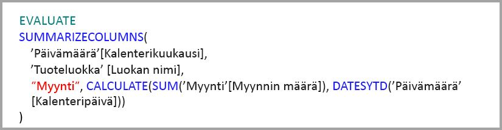

## Välimuistit tulisi pitää synkronoituna

**Koosteet**, jotka yhdistävät DirectQuery- ja tuonti- ja/tai kaksoistallennustilan, saattavat palauttaa eri tietoja, jos muistissa olevaa välimuistia ei pidetä synkronoituna lähdetietojen kanssa. Kyselyn suorittaminen ei yritä peittää tieto-ongelmia esimerkiksi suodattamalla DirectQuery-tuloksia välimuistiin tallennettujen arvojen kanssa täsmäämiseksi. Nämä ominaisuudet ovat suorituskyvyn optimointeja, ja niitä tulee käyttää vain siten, ettei liiketoiminnan tarpeisiin vastaaminen vaarannu. Omalla vastuullasi on tuntea tietovuot, joten suunnittele toiminta sen mukaan. On olemassa vakiintuneita tekniikoita tällaisten ongelmien käsittelemiseen lähteessä tarvittaessa.

## Seuraavat vaiheet

Seuraavissa artikkeleissa kerrotaan lisää yhdistelmämalleista ja kuvataan myös DirectQuery yksityiskohtaisemmin.

* [Yhdistelmämallit Power BI Desktopissa](desktop-composite-models.md)
* [Moni-moneen-yhteydet Power BI Desktopissa](desktop-many-to-many-relationships.md)
* [Tallennustilan tila Power BI Desktopissa](desktop-storage-mode.md)

DirectQuery-artikkeleita:

* [DirectQueryn käyttäminen Power BI:ssä](desktop-directquery-about.md)
* [DirectQueryn tukemat tietolähteet Power BI:ssä](desktop-directquery-data-sources.md)