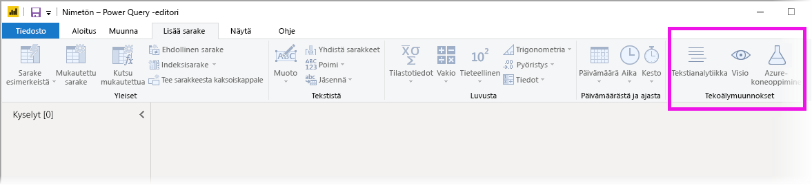
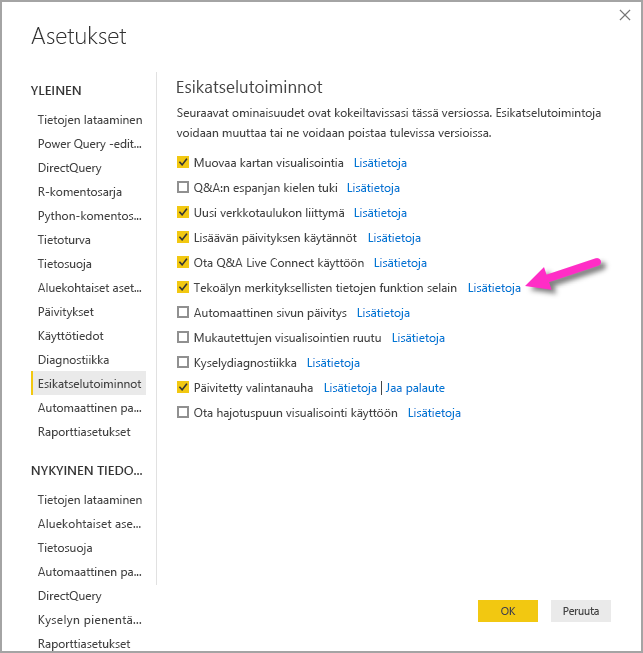
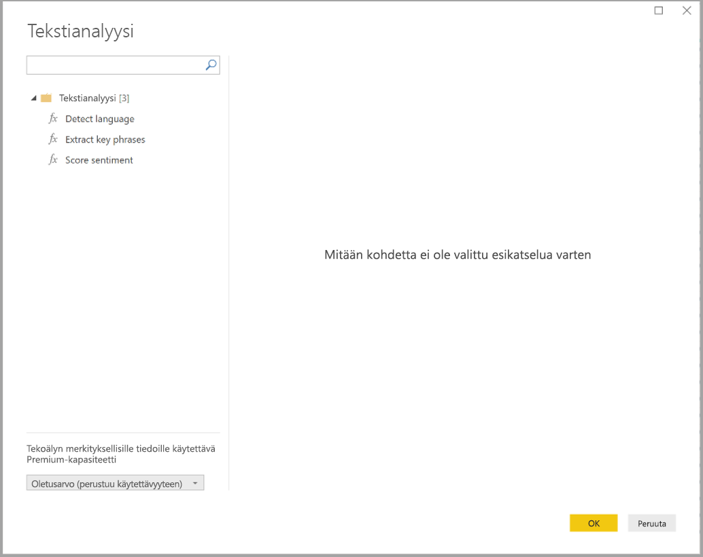
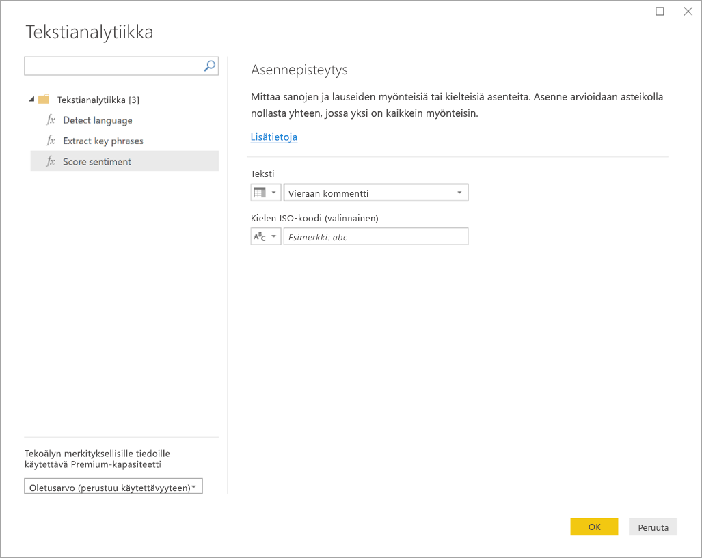
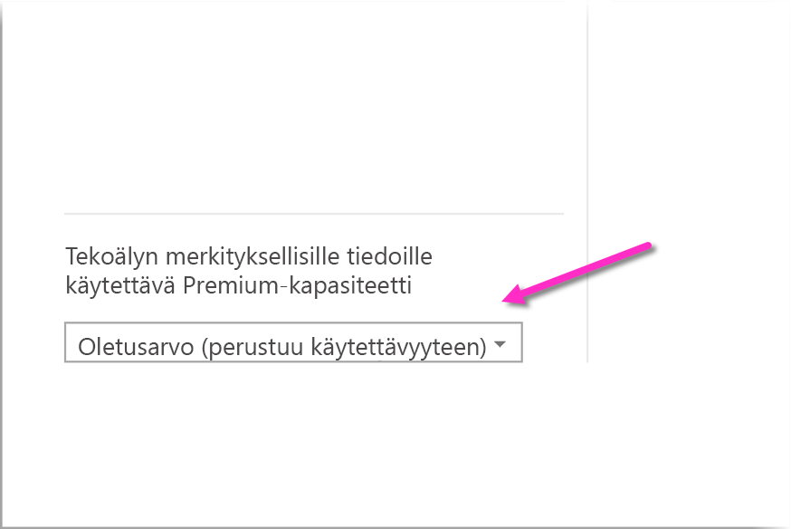
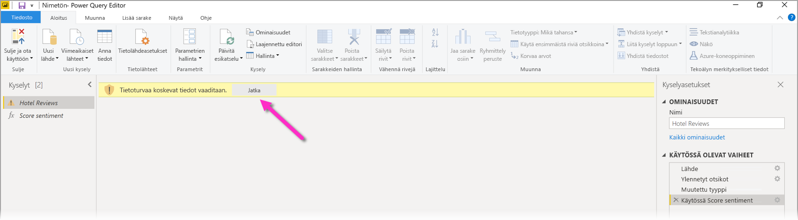
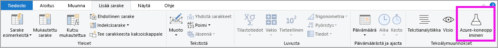
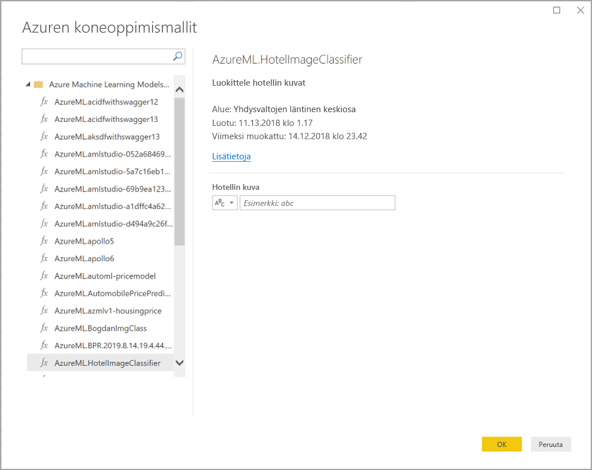

# Tekoälyn merkityksellisten tietojen käyttö Power BI Desktopissa (esiversio)

Power BI:ssä voit tekoälyn merkityksellisten tietojen avulla saada käyttöoikeuden kokoelmaan ennakkokoulutettuja koneoppimismalleja, jotka tehostavat tietojen valmistelua. Tekoälyn merkityksellisiä tietoja voi käsitellä **Power Query -editorissa**, ja niihin liittyvät toiminnot ja funktiot ovat käytettävissä valitsemalla **Aloitus**- ja **Lisää sarake** -välilehdet **Power Query -editorissa**. 

Tässä artikkelissa kuvataan Tekstianalyysi- ja Visuaalinen haku -funktiot, jotka ovat molemmat Azuren kognitiivisia palveluita. Artikkelissa on myös osio, jossa kuvataan Power BI:n mukautettuja funktioita Azuren Automaattianalyysipalveluista.

## Tekoälyn merkityksellisten tietojen ottaminen käyttöön

Power BI:n Tekoälyn merkitykselliset tiedot on esikatselutoiminto, joka täytyy erikseen ottaa käyttöön. Voit ottaa toiminnon käyttöön valitsemalla **Tiedosto > Asetukset ja vaihtoehdot > Asetukset** ja valitsemalla sitten vasemmasta sarakkeesta **Esikatselutoiminnot**. Oikeanpuoleisessa ruudussa on **Tekoälyn merkityksellisten tietojen funktioiden selain** -valinta. Ota esikatselutoiminto käyttöön valitsemalla **Tekoälyn merkityksellisten tietojen funktioiden selain** -kohdan vieressä oleva ruutu. Esikatselutoiminnon käyttöönotto edellyttää Power BI Desktopin käynnistämistä uudelleen.

## Tekstianalyysin ja Visuaalisen haun käyttäminen

Power BI:n tekstianalyysin ja visuaalisen haun avulla voit käyttää [Azuren kognitiivisten palvelujen](https://azure.microsoft.com/services/cognitive-services/) algoritmeja ja rikastaa tietojasi Power Queryssä.

Tällä hetkellä tuetaan seuraavia palveluita:

* [Asenneanalyysi](https://docs.microsoft.com/azure/cognitive-services/text-analytics/how-tos/text-analytics-how-to-sentiment-analysis)
* [Avainlauseiden poiminta](https://docs.microsoft.com/azure/cognitive-services/text-analytics/how-tos/text-analytics-how-to-keyword-extraction)
* [Kielen tunnistaminen](https://docs.microsoft.com/azure/cognitive-services/text-analytics/how-tos/text-analytics-how-to-language-detection)
* [Kuvien merkitseminen](https://docs.microsoft.com/azure/cognitive-services/computer-vision/concept-tagging-images). 

Muunnokset suoritetaan Power BI -palvelussa, eikä niihin tarvita Azuren kognitiivisten palvelujen tilausta. 

> [!IMPORTANT]
> 
> Tekstianalyysin tai Visuaalisen haun käyttäminen vaatii Power BI Premiumin.

### Tekstianalyysin ja Visuaalisen haun käyttöönotto Premium-kapasiteeteissa

Kognitiivisia palveluja tuetaan Premium-kapasiteetin solmuissa EM2, A2 tai P1 ja suuremmat. Kapasiteetissa käytettään erillistä tekoälykuormitusta kognitiivisten palveluiden suorittamiseen. Näiden ominaisuuksien julkisen esikatselun aikana (ennen kesäkuuta 2019) tämä kuormitus oli oletusarvon mukaan poistettu käytöstä. Ennen kuin käytät kognitiivisia palveluita Power BI:ssä, tekoälyn kuormitus on otettava käyttöön hallintaportaalin **kapasiteettiasetuksissa**. Voit ottaa **tekoälyn kuormituksen** käyttöön **kuormitukset**-osassa sekä määrittää muistin enimmäismäärän, jonka haluat tämän kuormituksen käyttävän. Suositeltu muistiraja on 20 %. Tämän rajan ylittäminen hidastaa kyselyä.

### Käytettävissä olevat funktiot

Tässä osassa kuvataan Power BI:n kognitiivisissa palveluissa käytettävissä olevat funktiot.

#### Tunnista kieli

Kielen tunnistusfunktio arvioi tekstisyötteen sekä palauttaa kullekin kentälle kielen nimen ja ISO-tunnuksen. Tästä funktiosta on hyötyä, jos tietosarakkeet keräävät satunnaista tekstiä, jonka kieli on tuntematon. Funktio odottaa syötteenä tekstimuotoisia tietoja.

Tekstianalyysi tunnistaa jopa 120 kieltä. Jos haluat lisätietoja, katso [tuetut kielet](https://docs.microsoft.com/azure/cognitive-services/text-analytics/text-analytics-supported-languages).

#### Poimi avainlauseet

**Avainlauseiden poimimis**funktio arvioi rakenteettoman tekstin sekä palauttaa kunkin tekstikentän osalta luettelon avainlauseita. Funktio edellyttää syötteenä tekstikenttää, ja se hyväksyy **maa-asetustiedoiksi**  valinnaisen syötteen.

Avainlauseiden poiminta toimii parhaiten, kun annat sille työstettäväksi suurehkoja tekstilohkoja. Tämä toimii toisin kuin asenneanalyysi, joka toimii paremmin pienten tekstilohkojen yhteydessä. Jotta saisit parhaat tulokset molemmista toiminnoista, harkitse syötteiden jäsentämistä uudelleen vastaavasti.

#### Asennepisteytys

**Asennepisteytys**-funktio arvioi tekstisyötteen ja palauttaa kullekin asiakirjalle asennepistemäärän, jonka arvo on väliltä 1 (positiivinen) - 0 (negatiivinen). Tämän funktion avulla voi havaita positiivisia ja negatiivisia asenteita sosiaalisessa mediassa, asiakkaiden arvosteluissa ja keskustelupalstoilla.

Tekstianalyysi käyttää koneoppimisen luokitusalgoritmia ja luo asennepistemäärän, joka on arvoltaan 0–1. Arvoa 1 lähellä olevat pistemäärät ilmaisevat myönteisen asenteen, kun taas arvoa 0 lähellä olevat pistemäärät ilmaisevat negatiivisen asenteen. Malli on harjoitettu valmiiksi kattavalla tekstimäärällä, jossa on asenneliitoksia. Tällä hetkellä ei ole mahdollista antaa omia harjoitustietoja. Malli käyttää tekstianalyysin aikana useita tekniikoita, kuten tekstin käsittelyä, sanaluokkien analyysia, sanojen sijoitusta ja sana-assosiaatiota. Lisätietoja algoritmista on artikkelissa [Tekstianalyysin esittely](https://blogs.technet.microsoft.com/machinelearning/2015/04/08/introducing-text-analytics-in-the-azure-ml-marketplace/).

Asenneanalyysi suoritetaan koko syöttökenttään, joten asennetta ei poimita tekstin mistään tietystä entiteetistä. Käytännössä pisteytystarkkuus yleensä paranee, jos asiakirjassa on suuren tekstilohkon sijasta yksi tai kaksi lausetta. Puolueettomuuden arviointivaiheessa malli määrittää, onko syötekenttä kokonaisuudessaan puolueeton vai sisältääkö se asennetta. Suurimmaksi osaksi puolueeton syötekenttä ei etene asenteen havaitsemisvaiheeseen, jolloin tuloksena on pistemäärä 0,50 eikä jatkokäsittelyä. Jos syötekenttä jatkaa putkessa, seuraava vaihe luo pistemäärän, joka on suurempi tai pienempi kuin 0,50 sen mukaan, minkä asteinen asenne syötekentässä havaittiin.

Asenneanalyysi tukee tällä hetkellä englantia, saksaa, espanjaa ja ranskaa. Muut kielet ovat esikatseluvaiheessa. Jos haluat lisätietoja, katso [tuetut kielet](https://docs.microsoft.com/azure/cognitive-services/text-analytics/text-analytics-supported-languages).

#### Merkitse kuvat

**Merkitse kuvat** -funktio palauttaa tunnisteet, jotka perustuvat yli kahteentuhanteen tunnistettavissa olevaan objektiin, elävään olentoon, maisemaan ja toimintoon. Jos tunnisteet ovat moniselitteisiä tai eivät yleisesti tunnettuja, tuloste sisältää *vihjeitä*, jotka selventävät tunnisteen merkitystä tunnetun paikan kontekstissa. Tunnisteita ei ole luokiteltu, eikä periytymishierarkioita ole. Sisältötunnisteiden kokoelma muodostaa kuvan *kuvauksen* perustan, ja tämä kuvaus näytetään ihmisten tulkittavissa olevalla kielellä, joka on muotoiltu kokonaisiksi lauseiksi.

Kun kuva on ladattu tai kuvan URL-osoite määritetty, Konenäkö-algoritmit tulostavat tunnisteita sen mukaan, mitä esineitä, elollisia olentoja ja toimintoja kuvassa tunnistettiin. Tunnisteet eivät rajoitu pääaiheeseen, kuten kuvan edustalla olevaan henkilöön, vaan ne sisältävät myös paikan (sisällä tai ulkona), huonekalut, työkalut, kasvit, eläimet, tarvikkeet, laitteet ja niin edelleen.

Tämä funktio edellyttää syötteeksi kuvan URL-osoitetta tai base-64-kenttää. Tällä hetkellä kuvan merkitseminen tukee englantia, espanjaa, japania, portugalia ja yksinkertaistettua kiinaa. Jos haluat lisätietoja, katso [tuetut kielet](https://docs.microsoft.com/rest/api/cognitiveservices/computervision/tagimage/tagimage#uri-parameters).

### Tekstianalyysi- tai Visuaalinen haku -funktioiden käynnistäminen Power Queryssä

Jos haluat rikastaa tietojasi Tekstianalyysi- tai Visuaalinen haku -funktioilla, avaa **Power Query -editori**. Tässä esimerkissä käsitellään tekstin asenteen pisteyttäminen. Samat vaiheet suorittamalla voidaan myös poimia avainlauseita, tunnistaa kieli ja lisätä tunnisteita kuviin.

Valitse **Tekstianalyysi**-painike **Aloitus**- tai **Lisää sarake** -valintanauhasta. Sinua kehotetaan kirjautumaan sisään.

Valitse kirjautumisen jälkeen ponnahdusikkunassa funktio, jota haluat käyttää, ja tietosarake, jona haluat muuntaa.

Power BI valitsee Premium-kapasiteetin, jossa funktio suoritetaan, ja lähettää tulokset takaisin Power BI Desktopiin. Valittua kapasiteettia käytetään vain Tekstianalyysi- ja Visuaalinen haku -funktioon sovelluksen ja päivitysten aikana Power BI Desktopissa. Kun raportti on julkaistu, päivitykset suoritetaan sen työtilan Premium-kapasiteetissa, johon raportti julkaistaan. Voit vaihtaa kaikkiin Kognitiivisiin palveluihin käytettyä kapasiteettia ponnahdusikkunan vasemman alakulman avattavassa valikossa.

**CultureInfo** on valinnainen syöte, joka määrittää tekstin kielen. Tämä kenttä on ISO-koodi. Voit käyttää Cultureinfo-syötteenä saraketta tai staattista kenttää. Tässä esimerkissä kieleksi on määritetty englanti (en) koko sarakkeen osalta. Jos tämä kenttä jätetään tyhjäksi, Power BI tunnistaa kielen automaattisesti ennen funktion käyttöä. Valitse seuraavaksi **Käytä**.

Kun käytät Tekoälyn merkityksellisiä tietoja ensimmäistä kertaa uuteen tietolähteeseen, saat kehotuksen määrittää tietojen yksityisyystason.

> [!NOTE]
> Tietojoukon päivitykset Power BI:ssä toimivat vain, jos tietojoukon yksityisyystasoksi on määritetty julkinen tai organisaatio.

Kun funktio on käynnistetty, tulos lisätään taulukkoon uutena sarakkeena. Muunnos lisätään myös kyselyn käytössä olevana vaiheena.

Kuvien merkitsemisen ja avainlauseiden poiminnan osalta tulokset voivat palauttaa useita arvoja. Kukin yksittäinen tulos palautetaan alkuperäisen rivin kaksoiskappaleelle.

### Raportin julkaiseminen Tekstianalyysi- tai Visuaalinen haku -funktiolla

Kun Power Queryssä muokataan tai tietojen päivityksiä tehdään Power BI Desktopissa, Tekstianalyysi ja Visuaalinen haku käyttävät Power Query -editorissa valittua Premium-kapasiteettia. Kun raportti on julkaistu Power BI:hin, se käyttää sen työtilan Premium-kapasiteettia, johon se on julkaistu.

Raportit, joihin on käytetty Tekstianalyysi- ja Visuaalinen haku -funktioita, tulee julkaista työtilaan, joka ei ole Premium-kapasiteetissa; muuten tietojoukon päivittäminen epäonnistuu.

### Vaikutuksen hallinta Premium-kapasiteetissa

Seuraavissa osioissa kuvataan, kuinka voit hallita Tekstianalyysin ja Visuaalisen haun vaikutuksia kapasiteettiin.

#### Kapasiteetin valitseminen

Raportin tekijät voivat valita, missä Premium-kapasiteetissa Tekoälyn merkitykselliset tiedot suoritetaan. Oletusarvon mukaan Power BI valitsee ensimmäisen luodun kapasiteetin, johon käyttäjällä on käyttöoikeudet.

#### Valvonta kapasiteettimittarisovelluksen avulla

Premium-kapasiteetin omistajat voivat valvoa Tekstianalyysi- ja Visuaalinen haku -funktioiden vaikutusta [Power BI Premium -kapasiteettiarvot -sovelluksella](service-admin-premium-monitor-capacity.md). Sovellus tarjoaa yksityiskohtaisia mittausarvoja tekoälykuormitusten kunnosta kapasiteettisi sisällä. Ylimmässä kaaviossa näkyy tekoälykuormitusten muistikulutus. Premium-kapasiteetin järjestelmänvalvojat voivat määrittää tekoälykuormituksen kapasiteettikohtaisen muistirajoituksen. Kun muistinkäyttö saavuttaa muistirajan, voit harkita muistirajan kasvattamista tai joidenkin työtilojen siirtämistä toiseen kapasiteettiin.

### Power Queryn ja Power Query Onlinen vertailu

Power Queryssä ja Power Query Onlinessa käytetään samoja Tekstianalyysi- ja Vision-funktioita. Ainoat erot käyttökokemuksessa ovat seuraavat:

* Power Queryssä on erilliset painikkeet Tekstianalyysille, Visuaaliselle haulle ja Azure-automaattianalyysille. Power Query Onlinessa ne on yhdistetty samaan valikkoon.
* Power Queryssä raportin tekijä voi valita Premium-kapasiteetin, jota funktioiden suorittamiseen käytetään. Tätä ei tarvitse tehdä Power Query Onlinessa, koska tietovuo on jo tietyssä kapasiteetissa.

### Tekstianalyysin huomioitavat asiat ja rajoitukset

Ota huomioon seuraavat seikat ja rajoitukset Tekstianalyysin käytön aikana:

* Lisäävää päivitystä tuetaan, mutta se voi aiheuttaa suorituskykyongelmia, jos sitä käytetään kyselyihin Tekoälyn merkityksellisten tietojen kanssa.
* Suoraa kyselyä ei tueta.

## Azuren automaattianalyysipalveluiden käyttö

Useat organisaatiot käyttävät **automaattianalyysin** malleja saadakseen parempia merkityksellisiä tietoja ja ennusteita liiketoiminnastaan. Voit visualisoida ja käynnistää merkityksellisiä tietoja näistä malleista raporteissa, koontinäytöissä ja muita analyyseissa, mikä helpottaa merkityksellisten tietojen välittämistä niille yrityskäyttäjille, jotka tarvitsevat niitä eniten. Power BI:hin voi helposti sisällyttää Azuren automaattianalyysipalveluissa isännöityjen mallien merkityksellisiä tietoja yksinkertaisilla osoita ja napsauta -liikkeillä.

Jotta tätä ominaisuutta voisi käyttää, datatieteilijän tulee vain myöntää Azuren automaattianalyysipalveluiden mallille käyttöoikeus BI-analyytikkoon Azure-portaalin kautta. Kunkin istunnon aluksi Power Query sitten löytää kaikki Azuren automaattianalyysipalveluiden mallit, joihin käyttäjällä on käyttöoikeus, ja paljastaa ne dynaamisina Power Query -funktioina. Käyttäjä voi käynnistää kyseiset funktiot käyttämällä niitä Power Query -editorin valintanauhasta tai käynnistämällä suoraan M-funktion. Lisäksi Power BI käsittelee käyttöoikeuspyynnöt automaattisesti erissä suorituskyvyn parantamiseksi, kun se käynnistää Azuren automaattianalyysipalveluiden mallin rivijoukolle.

Tätä toimintoa tuetaan Power BI Desktopille, Power BI -tietovoille sekä Power Query Onlinelle Power BI -palvelussa.

Lisätietoja tietovoista on artikkelissa [Omatoiminen tietojen valmistelu Power BI:ssä](service-dataflows-overview.md).

Lisätietoja Azuren automaattianalyysipalveluista on seuraavissa artikkeleissa:

- Yleiskatsaus: [Mitä ovat Azuren automaattianalyysipalvelut?](https://docs.microsoft.com/azure/machine-learning/service/overview-what-is-azure-ml)
- Pikaoppaita ja opetusohjelmia Azuren automaattianalyysipalveluihin: [Azuren automaattianalyysipalveluiden dokumentaatio](https://docs.microsoft.com/azure/machine-learning/)

### Käyttöoikeuksien myöntäminen Azuren automaattianalyysipalvelut -malliin

Jotta käyttäjä voisi käsitellä Azuren automaattianalyysipalveluiden mallia Power BI:stä, hänellä on oltava Azure-tilauksen **luku**-oikeudet. Lisäksi hänellä on oltava seuraavat:

- Automaattianalyysistudion (perinteinen) malleille **luku**-oikeus automaattianalyysistudion (perinteinen) verkkopalveluun
- Automaattianalyysipalveluiden malleille **luku**-oikeus automaattianalyysipalveluiden työtilaan

Tässä osiossa kuvataan, kuinka Power BI -käyttäjälle myönnetään käyttöoikeus Azuren automaattianalyysipalveluissa isännöityyn malliin, niin että käyttäjä voi käsitellä mallia Power Query -funktiona. Lisätietoja on artikkelissa [Käyttöoikeuksien hallinta RBAC:n ja Azure-portaalin avulla](https://docs.microsoft.com/azure/role-based-access-control/role-assignments-portal).

1. Kirjaudu sisään [Azure-portaaliin](https://portal.azure.com/).
2. Siirry **Tilaukset**-sivulle. Pääset **Tilaukset**-sivulle valitsemalla Azure-portaalin vasemmanpuoleisen siirtymisvalikon luettelosta **Kaikki palvelut** -vaihtoehdon.
3. Valitse tilauksesi
4. Valitse **Käyttöoikeuksien valvonta (IAM)** ja valitse sitten **Lisää**-painike.
5. Valitse rooliksi **Lukija**. Valitse Power BI -käyttäjä, jolle haluat myöntää Azuren automaattianalyysipalveluiden käyttöoikeuden.
6. Valitse **Tallenna**.
7. Toista vaiheet kolmesta kuuteen ja myönnä käyttäjälle **Lukija**-käyttöoikeus tiettyyn Automaattianalyysistudion (perinteinen) verkkopalveluun *tai* Automaattianalyysipalveluiden työtilaan, joka isännöi mallia.

### Rakenteen etsiminen Automaattianalyysipalveluiden malleille

Datatieteilijät käyttävät ensisijaisesti Pythonia kehittäessään ja jopa ottaessaan käyttöön koneoppimismalleja automaattianalyysipalveluihin. Toisin kuin automaattianalyysistudiossa (perinteinen), joka auttaa automatisoimaan skeematiedoston luonnin mallia varten, automaattianalyysipalveluiden tapauksessa datatieteilijän tulee erikseen luoda rakennetiedosto Pythonia käyttämällä.

Tämä skeematiedosto on sisällytettävä käyttöön otettuun automaattianalyysipalvelumallien verkkopalveluun. Jos haluat luoda verkkopalvelun rakenteen automaattisesti, sinun on lisättävä esimerkki syöteestä/tulosteesta käyttöönotetun mallin käynnistyskomentosarjaan. Lue dokumentaation [Mallien käyttöönotto Azuren koneoppimispalvelulla alakohta (Valinnainen) Automaattinen Swagger-skeeman luominen](https://docs.microsoft.com/azure/machine-learning/how-to-deploy-and-where#optional-define-model-web-service-schema). Linkki sisältää esimerkkikäynnistyskomentosarjan, jossa on lausekkeet skeeman luontia varten.

Tarkkaan ottaen käynnistyskomentosarjan _@input\_schema_- ja _@output\_schema_-funktiot viittaavat syöte- ja tulostemallien muotoihin _input\_sample_- ja _output\_sample_-muuttujissa ja käyttävät näitä malleja luodakseen OpenAPI (Swagger) -määrityksen verkkopalvelulle käyttöönoton aikana.

Näitä ohjeita, jotka koskevat skeeman luontia käynnistyskomentosarjaa päivittämällä, tulee soveltaa malleihin, jotka on luotu käyttämällä Azuren automaattianalyysipalvelujen SDK:ta käyttäviä automaattianalyysipalvelujen kokeita.

> [!NOTE]
> Mallit, jotka on luotu Azuren automaattianalyysipalveluiden käyttöliittymää käyttämällä, eivät tällä hetkellä tue skeemojen luomista. Tuki lisätään myöhemmissä versioissa.
> 
### Azuren automaattianalyysipalveluiden mallin käynnistäminen Power Queryssä

Voit käynnistää minkä tahansa Azuren automaattianalyysipalveluiden mallin, johon olet saanut käyttöoikeuden, suoraan Power Query -editorista. Jos haluat käyttää Azuren automaattianalyysipalveluiden malleja, valitse **Azure-automaattianalyysi**-painike Power Query -editorin **Koti**- tai **Lisää sarake** -valintanauhassa.

Kaikki Azuren automaattianalyysipalveluiden mallit, joihin sinulla on käyttöoikeus, näkyvät tässä Power Query -funktioina. Lisäksi Azuren automaattianalyysipalveluiden mallin syöteparametrit yhdistetään automaattisesti vastaavan Power Query -funktion parametreina.

Jos haluat käynnistää Azuren automaattianalyysipalveluiden mallin, voit määrittää avattavassa luettelossa minkä tahansa valitun entiteetin sarakkeista syötteeksi. Voit myös määrittää syötteenä käytettävän vakioarvon käyttämällä syötevalintaikkunan vasemmalla puolella olevaa sarakekuvaketta.

Valitse **OK**, niin voit tarkastella Azuren automaattianalyysipalveluiden mallin tulostetta entiteettitaulukon uutena sarakkeena. Näet myös mallin kutsun kyselyyn käytettynä vaiheena.

Jos malli palauttaa useita tulosteparametreja, ne ryhmitellään yhteen tulossarakkeen tietueena. Voit laajentaa sarakkeen, niin että saat yksittäiset tulosteparametrit erillisiin sarakkeisiin.

### Azuren automaattianalyysipalveluiden huomioitavat asiat ja rajoitukset

Seuraavat seikat ja rajoitukset koskevat Azuren automaattianalyysipalveluita Power BI Desktopissa.

* Mallit, jotka on luotu Azuren automaattianalyysipalvelun käyttöliittymää käyttämällä, eivät tällä hetkellä tue skeemojen luomista. Tuki on odotettavissa myöhemmissä versioissa.
* Lisäävää päivitystä tuetaan, mutta se voi aiheuttaa suorituskykyongelmia, jos sitä käytetään kyselyihin Tekoälyn merkityksellisten tietojen kanssa.
* Suoraa kyselyä ei tueta.

## Seuraavat vaiheet

Tässä artikkelissa annettiin yleiskuva siitä, miten automaattianalyysit integroidaan Power BI Desktopiin. Myös seuraavat artikkelit voivat olla kiinnostavia ja hyödyllisiä.

- [Opetusohjelma: Automaattianalyysistudion (perinteisen) mallin käynnistäminen Power BI:ssä](service-tutorial-invoke-machine-learning-model.md)
- [Opetusohjelma: Kognitiivisten palvelujen käyttö Power BI:ssä](service-tutorial-use-cognitive-services.md)
- [Kognitiiviset palvelut Power BI:ssä](service-cognitive-services.md)
- [Automaattianalyysipalveluiden integrointi Power BI:ssä](service-machine-learning-integration.md)
- [Premium-kapasiteettien valvonta sovelluksen avulla](service-admin-premium-monitor-capacity.md)
- [Premium-kapasiteettimittarisovelluksessa käytettävissä olevat AI-mittarit](https://powerbi.microsoft.com/blog/ai-metrics-now-available-in-power-bi-premium-capacity-metrics-app/)
