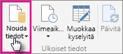
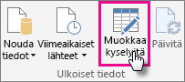
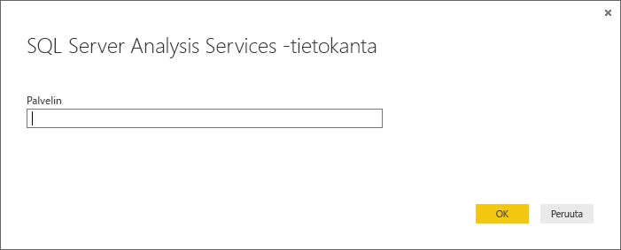

# Analysis Servicesin taulukkomuotoisten tietojen käyttäminen Power BI Desktopissa
Power BI Desktopissa on kaksi tapaa yhdistää SQL Server Analysis Servicesin taulukkomalleihin ja hakea niistä tietoja: Tutustu käyttämällä reaaliaikaista yhteyttä tai Valitse kohteet ja tuo Power BI Desktopiin.

Menetelmien kuvailu on alla.

**Tutustu käyttämällä reaaliaikaista yhteyttä** – Kun käytät reaaliaikaista yhteyttä, taulukkomallin tai perspektiivin kohteet, kuten taulukot, sarakkeet ja mittayksiköt näkyvät Power BI Desktopin Kentät-luettelossa. Voit käyttää Power BI Desktopin kehittyneitä visualisointi- ja raportointityökaluja taulukkomallin tutkimiseen uusilla, erittäin vuorovaikutteisilla tavoilla.

Kun muodostat yhteyden reaaliajassa, mallista ei tuoda tietoja Power BI Desktopiin. Aina kun olet vuorovaikutuksessa visualisoinnin kanssa, Power BI Desktop lähettää taulukkomallille kyselyn ja laskee näkemäsi tulokset. Näet aina uusimmat tiedot. Muista, että taulukkomallien suojaus on erittäin tehokas. Power BI Desktopissa näkyvät kohteet riippuvat siitä, että sinulla on oikeudet taulukkomalliin, johon olet muodostanut yhteyden.

Kun olet luonut dynaamisia raportteja Power BI Desktopissa, voit jakaa ne julkaisemalla ne Power BI -sivustossasi. Kun julkaiset Power BI Desktop -tiedoston käyttäen reaaliaikaista yhteyttä Power BI -sivustollasi olevaan taulukkomalliin, järjestelmänvalvojan on pitänyt asentaa ja määrittää paikallisen tietoyhdyskäytävän. Voit lukea lisää [paikallisesta tietoyhdyskäytävästä](service-gateway-onprem.md).

**Valitse kohteet ja tuo ne Power BI Desktopiin** – Kun muodostat yhteyden tämän asetuksen avulla, voit valita esim. taulukoita, sarakkeita ja mittayksiköitä taulukkomallista tai perspektiivistä ja ladata ne Power BI Desktop -malliin. Voit räätälöidä tiedostoa lisää Power BI Desktopin edistyneellä kyselyeditorilla. Voit käyttää Power BI Desktop mallinnusominaisuuksia malliin tietojen lisämallintamiseen. Power BI Desktopin ja taulukkomallin välillä ei säilytetä reaaliaikaista yhteyttä. Voit tutustua Power BI Desktop -mallin offline-tilassa tai julkaista sen Power BI -sivustollasi.

## Yhteyden muodostaminen taulukkomalliin
1. Napsauta Power BI Desktopin **Aloitus**-välilehdellä **Hae tiedot**.
   
   
2. Napsauta **SQL Server Analysis Services -tietokanta** ja valitse **Yhdistä**.
   
   
3. Anna palvelimen nimi ja valitse yhteystila. 
   
   
4. Tämä vaihe määräytyy yhteystilavalintasi mukaan:

* Jos olet muodostamassa reaaliaikaista yhteyttä, valitse siirtymistoiminnossa taulukkomalli tai perspektiivi.
  
  
* Jos valitset Valitse kohteet ja nouda tiedot, valitse siirtymistoiminnossa taulukkomalli tai perspektiivi. Voit halutessasi valita vain tietyt taulukot tai sarakkeet ladattavaksi. Jos haluat muokata tietojasi ennen lataamista, avaa ne kyselyeditorissa napsauttamalla Muokkaa. Kun olet valmis, valitse Lataa ja tuo tiedot Power BI Desktopiin.

  

## Usein kysyttyjä kysymyksiä
**Kysymys:** Tarvitsenko paikallisen tietoyhdyskäytävän?

**Vastaus:** Ehkä. Jos käytät Power BI Desktopia yhdistääksesi reaaliajassa taulukkomalliin, mutta et aio julkaista sitä Power BI -sivustossasi, et tarvitse yhdyskäytävää. Jos aiot julkaista taulukkomallin Power BI -sivustossasi, tietoyhdyskäytävä varmistaa turvallisen viestinnän Power BI -palvelun ja paikallisen Analysis Services -palvelimen välillä. Ota yhteys Analysis Services -palvelinten ylläpitäjään, ennen kuin asennat tietoyhteyskäytävän.

Jos valitset valitse kohteet ja nouda tiedot, tuot taulukkomallin tiedot suoraan Power BI Desktop -tiedostoon, joten yhdyskäytävä ei ole tarpeen.

**Kysymys:** Mitä eroa on reaaliaikaisen yhteyden muodostamisessa taulukkomalliin ja reaaliaikaisen yhteyden muodostamisessa Power BI Desktopista?

**Vastaus:** Kun muodostat reaaliaikaista yhteyttä Power BI -palvelun sivustollasi olevaan taulukkomallin ja organisaation paikallisen Analysis Services -tietokannan välillä, niiden välisen tietoliikenteen suojaamiseen vaaditaan paikallinen tietoyhdyskäytävä. Kun muodostat reaaliaikaista yhteyttä taulukkomalliin Power BI Desktopista, yhteyskäytävää ei tarvita, koska sekä Power BI Desktop että Analysis Services -palvelin, jolle muodostat yhteyttä, ovat organisaatiossa paikallisesti. Jos kuitenkin julkaiset Power BI Desktop -tiedoston Power BI-sivustoon, tarvitset yhdyskäytävän.

**Kysymys:** Jos luon reaaliaikaisen yhteyden, voinko muodostaa yhteyden toiseen tietolähteeseen samassa Power BI Desktop -tiedostossa?

**Vastaus**: Ei. Et voi tarkastella reaaliaikaisia tietoja ja muodostaa yhteyttä toisentyyppiseen tietolähteeseen samassa tiedostossa. Jos olet jo tuonut tietoja tai yhdistänyt toiseen tietolähteeseen Power BI Desktop -tiedostossa, sinun on luotava uusi tiedosto, jota voit tutkia reaaliajassa.

**Kysymys:** Jos luon reaaliaikaisen yhteyden, voinko muokata mallia tai kyselyä Power BI Desktopissa?

**Vastaus:** Voit luoda raporttitason mittareita Power BI Desktopissa, mutta kaikki muut kyselyn ja mallinnuksen ominaisuudet on poistettu käytöstä, kun tutustut reaaliaikaisiin tietoihin.

**Kysymys:** Onko reaaliaikainen yhteys turvallinen?

**Vastaus:** Kyllä. Analysis Services -palvelimeen muodostetaan yhteys senhetkisillä Windows-kirjautumistiedoilla. Et voi käyttää Perus- tai tallennettuja kirjautumistietoja Power BI -palvelussa etkä Power BI Desktopissa, kun tutkit reaaliajassa.

**Kysymys:** Näen siirtymistoiminnossa mallin ja perspektiivin. Mikä niiden ero on?

**Vastaus:** Perspektiivi on taulukkomallin tietty näkymä. Se voi sisältää vain valittuja taulukoita, sarakkeita tai mittayksiköitä tietoanalyysin tarpeiden mukaan. Taulukkomalli sisältää aina vähintään yhden perspektiivin, johon voi sisältyä mitä tahansa mallissa. Jos et ole varma, mitä sinun pitäisi valita, ota yhteys järjestelmänvalvojaan.

## Voit muuttaa palvelimen nimen ensiyhteyden jälkeen
Kun olet luonut Power BI Desktop -tiedoston ja tutustunut reaaliaikaiseen yhteyteen, saatat joissakin tapauksissa haluta vaihtaa yhteyden toiseen palvelimeen. Jos olet esimerkiksi luonut Power BI Desktop -tiedoston muodostaessasi yhteyden kehityspalvelimeen ja ennen Power BI -palveluun julkaisemista, haluatkin vaihtaa yhteyden tuotantopalvelimeen.

1. Valitse **Muokkaa kyselyjä** valintanauhasta.
   
   
2. Kirjoita uuden palvelimen nimi.
   
   
   
   
## Vianmääritys 
Seuraavassa on listattu kaikki tunnetut ongelmat, jotka ilmenevät yhdistettäessä SQL Server Analysis Servicesiin (SSAS) tai Azure Analysis Servicesiin. 

* **Virhe: Mallirakennetta ei voitu ladata** - Tämä virhe ilmenee yleensä, kun käyttäjä yhdistää Analysis Servicesiin, mutta hänellä ei ole käyttöoikeutta tietokantaa/malliin.

