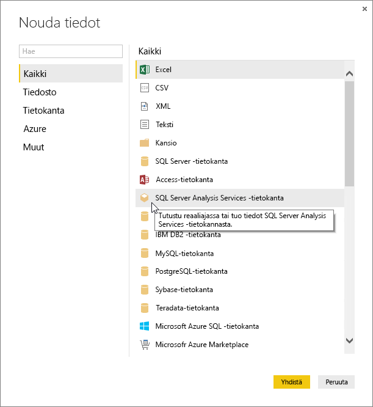
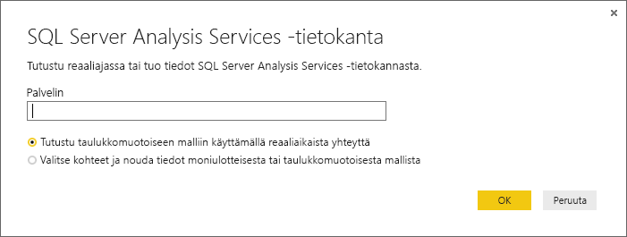
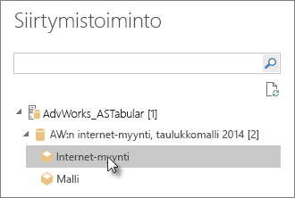
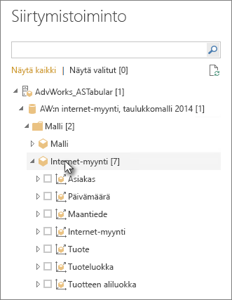

# Analysis Servicesin taulukkomuotoisiin tietoihin yhdistäminen Power BI Desktopissa
Power BI Desktopissa on kaksi tapaa muodostaa yhteys SQL Server Analysis Servicesin taulukkomalleihin ja hakea niistä tietoja: Tutustu käyttämällä reaaliaikaista yhteyttä tai valitsemalla kohteet ja tuomalla ne Power BI Desktopiin.

Menetelmien kuvailu on alla.

**Tutustuminen reaaliaikaisen yhteyden avulla**: Kun käytät reaaliaikaista yhteyttä, taulukkomallin tai perspektiivin kohteet, kuten taulukot, sarakkeet ja mittarit näkyvät Power BI Desktopin **Kentät**-luettelossa. Voit käyttää Power BI Desktopin kehittyneitä visualisointi- ja raportointityökaluja taulukkomallin tutkimiseen uusilla, erittäin vuorovaikutteisilla tavoilla.

Kun muodostat yhteyden reaaliajassa, mallista ei tuoda tietoja Power BI Desktopiin. Aina kun olet vuorovaikutuksessa visualisoinnin kanssa, Power BI Desktop lähettää taulukkomallille kyselyn ja laskee näkemäsi tulokset. Näet aina taulukkomallin uusimmat käytettävissä olevat tiedot, jotka ovat peräisin joko viimeisimmästä käsittelykerrasta tai taulukkomallissa käytettävissä olevista DirectQuery-taulukoista. 

Muista, että taulukkomallien suojaus on erittäin tehokas. Power BI Desktopissa näkyvät kohteet riippuvat siitä, että sinulla on oikeudet taulukkomalliin, johon olet muodostanut yhteyden.

Kun olet luonut dynaamisia raportteja Power BI Desktopissa, voit jakaa ne julkaisemalla ne Power BI -sivustossasi. Kun julkaiset Power BI Desktop -tiedoston käyttäen reaaliaikaista yhteyttä Power BI -sivustollasi olevaan taulukkomalliin, järjestelmänvalvojan on pitänyt asentaa ja määrittää paikallisen tietoyhdyskäytävän. Voit lukea lisää [paikallisesta tietoyhdyskäytävästä](service-gateway-onprem.md).

**Valitse kohteet ja tuo ne Power BI Desktopiin**: Kun muodostat yhteyden tämän asetuksen avulla, voit valita esim. taulukoita, sarakkeita ja mittareita taulukkomallista tai perspektiivistä ja ladata ne Power BI Desktop -malliin. Power BI Desktopin Power Query ‑editorin avulla voit määrittää haluamasi tiedot ja sen mallintamisominaisuudet tarkemmin. Koska Power BI Desktopin ja taulukkomallin välillä ei ole reaaliaikaista yhteyttä, voit tutustua Power BI Desktop ‑malliin offline-tilassa tai julkaista sen Power BI ‑sivustoon.

## Yhteyden muodostaminen taulukkomalliin
1. Valitse Power BI Desktopin **Aloitus**-välilehdeltä **Hae tiedot** > **Lisää** > **Tietokanta**.
   
1. Valitse **SQL Server Analysis Services -tietokanta** ja valitse sitten **Yhdistä**.
   
   
3. Kirjoita **SQL Server Analysis Services Database** ‑ikkunaan **palvelimen** nimi, valitse yhteystila ja valitse sitten **OK**.
   
   
4. Tämä vaihe **Siirtyminen**-ikkunassa määräytyy yhteystilavalintasi mukaan:

   - Jos olet muodostamassa reaaliaikaista yhteyttä, valitse taulukkomalli tai perspektiivi.
  
      
   - Jos valitsit kohteiden valitsemisen ja tietojen hakeminen, valitse taulukkomalli tai perspektiivi ja valitse sitten jokin tietty taulukko tai sarake, jonka haluat ladata. Jos haluat muotoilla tietoja ennen lataamista, avaa Power Query ‑editori valitsemalla **Muokkaa kyselyjä**. Kun olet valmis, tuo tiedot Power BI Desktopiin valitsemalla **Lataa**.

      

## Usein kysyttyjä kysymyksiä
**Kysymys:** Tarvitsenko paikallisen tietoyhdyskäytävän?

**Vastaus**: Riippuu tilanteesta. Jos käytät Power BI Desktopia yhdistääksesi reaaliajassa taulukkomalliin, mutta et aio julkaista sitä Power BI -sivustossasi, et tarvitse yhdyskäytävää. Jos aiot julkaista taulukkomallin Power BI -sivustossasi, tietoyhdyskäytävä varmistaa turvallisen viestinnän Power BI -palvelun ja paikallisen Analysis Services -palvelimen välillä. Ota yhteys Analysis Services -palvelinten ylläpitäjään, ennen kuin asennat tietoyhteyskäytävän.

Jos valitset kohteiden valitsemisen ja tietojen noutamisen, tuot taulukkomallin tiedot suoraan Power BI Desktop -tiedostoon, joten yhdyskäytävä ei ole tarpeen.

**Kysymys:** Mitä eroa on reaaliaikaisen yhteyden muodostamisessa taulukkomalliin Power BI -palvelusta ja reaaliaikaisen yhteyden muodostamisessa Power BI Desktopista?

**Vastaus**: Kun muodostat reaaliaikaista yhteyttä Power BI -palvelusta sivustossasi olevan taulukkomallin ja organisaation paikallisen Analysis Services -tietokannan välille, niiden välisen tietoliikenteen suojaamiseen vaaditaan paikallinen tietoyhdyskäytävä. Kun muodostat reaaliaikaista yhteyttä taulukkomalliin Power BI Desktopista, yhteyskäytävää ei tarvita, koska sekä Power BI Desktop että Analysis Services -palvelin, jolle muodostat yhteyttä, ovat organisaatiossa paikallisesti. Jos kuitenkin julkaiset Power BI Desktop -tiedoston Power BI-sivustoon, tarvitset yhdyskäytävän.

**Kysymys:** Jos luon reaaliaikaisen yhteyden, voinko muodostaa yhteyden toiseen tietolähteeseen samassa Power BI Desktop -tiedostossa?

**Vastaus**: Ei. Et voi tarkastella reaaliaikaisia tietoja ja muodostaa yhteyttä toisentyyppiseen tietolähteeseen samassa tiedostossa. Jos olet jo tuonut tietoja tai yhdistänyt toiseen tietolähteeseen Power BI Desktop -tiedostossa, sinun on luotava uusi tiedosto, jota voit tutkia reaaliajassa.

**Kysymys:** Jos luon reaaliaikaisen yhteyden, voinko muokata mallia tai kyselyä Power BI Desktopissa?

**Vastaus**: Voit luoda raporttitason mittareita Power BI Desktopissa, mutta kaikki muut kyselyn ja mallinnuksen ominaisuudet on poistettu käytöstä, kun tutustut reaaliaikaisiin tietoihin.

**Kysymys:** Onko reaaliaikainen yhteys turvallinen?

**Vastaus**: Kyllä. Analysis Services -palvelimeen muodostetaan yhteys senhetkisillä Windows-kirjautumistiedoilla. Et voi käyttää Perus- tai tallennettuja kirjautumistietoja Power BI -palvelussa etkä Power BI Desktopissa, kun tutkit reaaliajassa.

**Kysymys:** Näen siirtymistoiminnossa mallin ja perspektiivin. Mikä niiden ero on?

**Vastaus**: Perspektiivi on taulukkomallin tietty näkymä. Se voi sisältää vain valittuja taulukoita, sarakkeita tai mittareita tietoanalyysin tarpeiden mukaan. Taulukkomalli sisältää aina vähintään yhden perspektiivin, johon voi sisältyä mitä tahansa mallissa. Jos et ole varma, mikä perspektiivi sinun pitäisi valita, ota yhteys järjestelmänvalvojaan.

**Kysymys:** Onko Analysis Servicesissä ominaisuuksia, jotka muuttavat Power BI:n toimintaa?

**Vastaus**: Kyllä. Taulukkomuotoisen mallin käyttämien ominaisuuksien mukaan Power BI Desktopin käyttökokemus voi muuttua. Esimerkkejä ovat muun muassa seuraavat:
* Mittarit saattavat näkyä mallissa ryhmiteltyinä yhteen **Kentät**-ruudun luettelon yläosassa sen sijaan, että ne näkyisivät taulukoissa sarakkeiden rinnalla. Ei hätää: voit edelleen käyttää niitä tavalliseen tapaan, ne vain löytyvät helpommin näin.

* Jos taulukkomuotoisessa mallissa on määritettynä laskentaryhmiä, voit käyttää niitä vain yhdessä mallin mittareiden kanssa. Et voi käyttää niitä luomiesi implisiittisten mittareiden kanssa lisäämällä visualisointiin numerokenttiä. Mallilla voi myös olla **DiscourageImplicitMeasures**-lippu asetettuna manuaalisesti. Se vaikuttaa samalla tavalla. Lisätietoja on kohdassa [Laskentaryhmät Analysis Servicesissä](https://docs.microsoft.com/analysis-services/tabular-models/calculation-groups#benefits).

## Voit muuttaa palvelimen nimen ensiyhteyden jälkeen
Kun olet luonut Power BI Desktop -tiedoston ja tutustunut reaaliaikaiseen yhteyteen, saatat joissakin tapauksissa haluta vaihtaa yhteyden toiseen palvelimeen. Jos olet esimerkiksi luonut Power BI Desktop -tiedoston muodostaessasi yhteyden kehityspalvelimeen ja ennen Power BI -palveluun julkaisemista, haluatkin vaihtaa yhteyden tuotantopalvelimeen.

Palvelimen nimen muuttaminen:

1. Valitse **Muokkaa kyselyjä** **Aloitus**-välilehdeltä.

2. Kirjoita **SQL Server Analysis Services Database** ‑ikkunaan **palvelimen** nimi ja valitse sitten **OK**.

   
## Vianmääritys 
Seuraavassa on lueteltu kaikki tunnetut ongelmat, jotka ilmenevät yhdistettäessä SQL Server Analysis Servicesiin (SSAS) tai Azure Analysis Servicesiin: 

* **Virhe: Mallirakennetta ei voitu ladata**: Tämä virhe ilmenee yleensä, kun käyttäjä yhdistää Analysis Servicesiin ilman tietokannan/kuution käyttöoikeutta.

