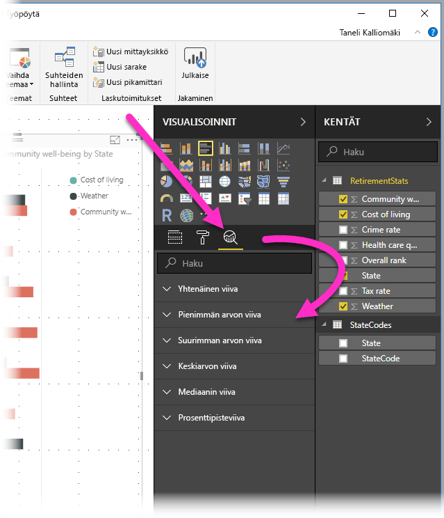
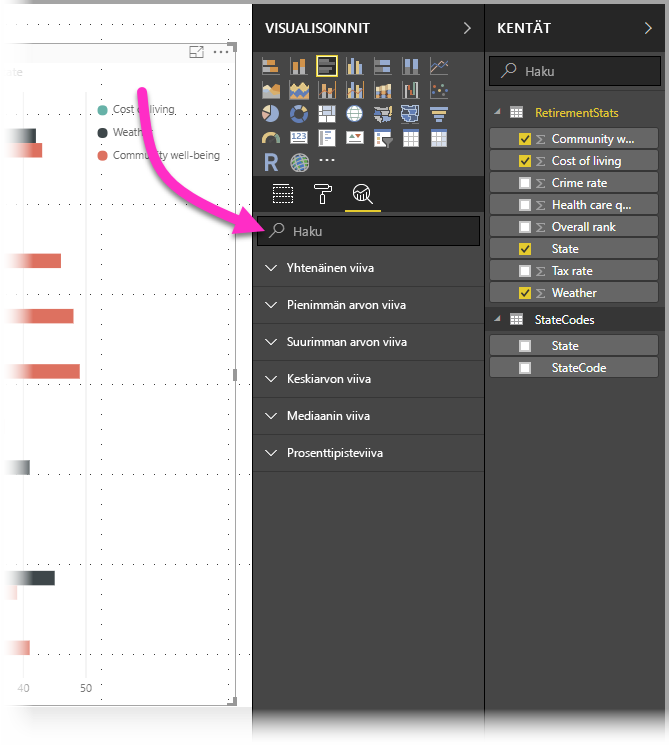
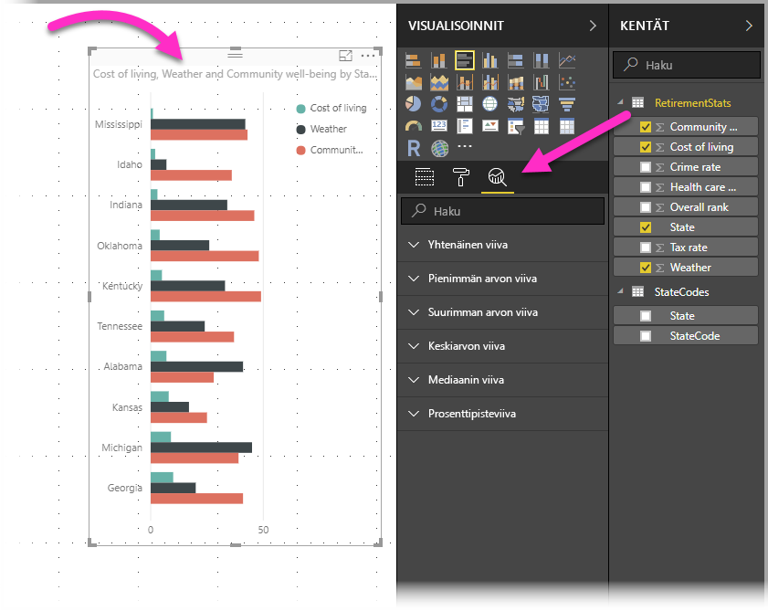
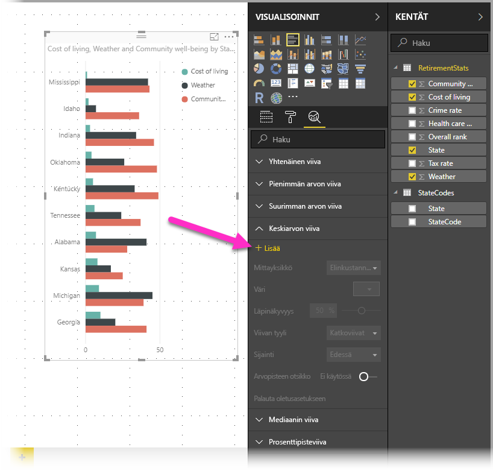
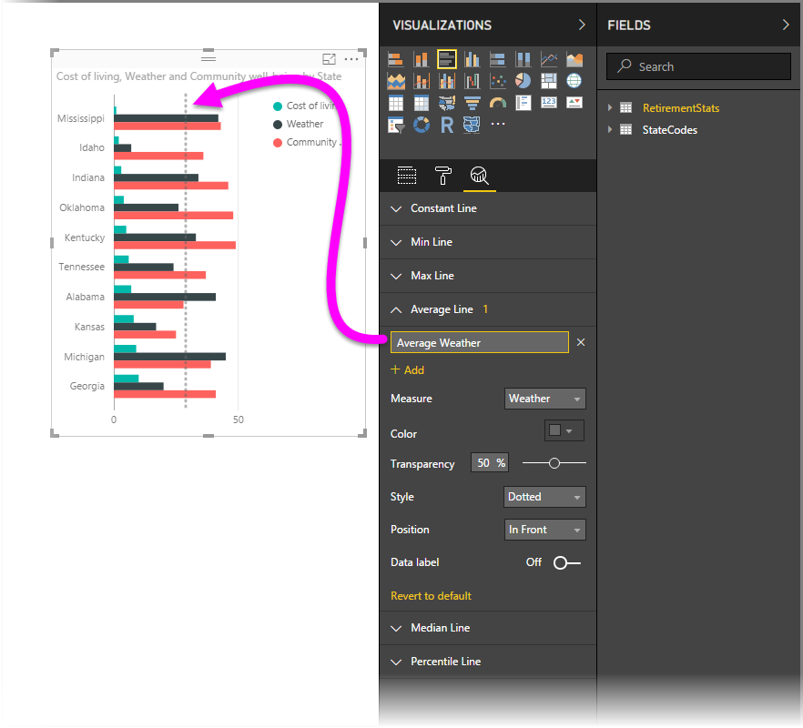
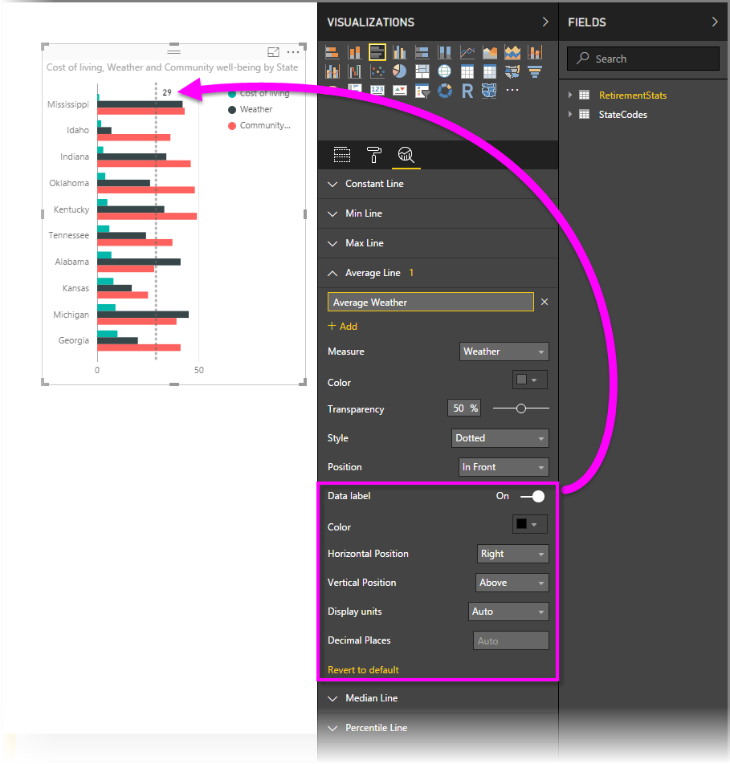
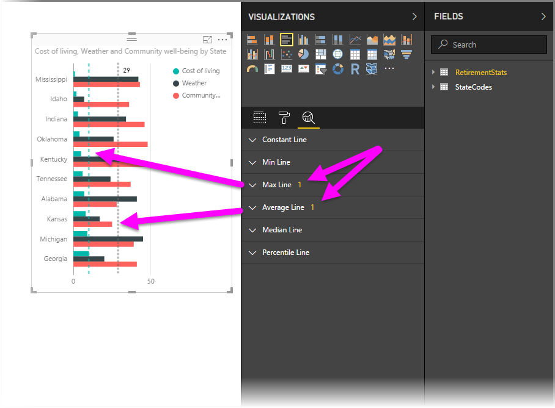
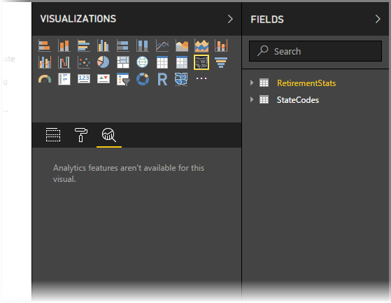
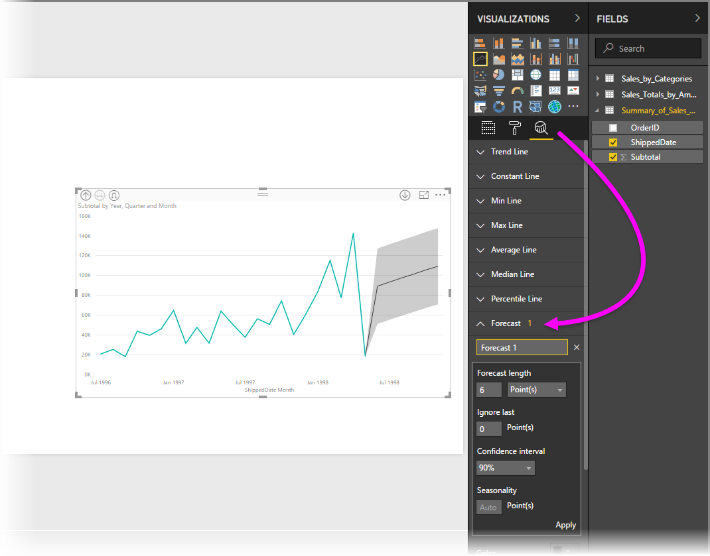

# Analytiikka-ruudun käyttäminen Power BI Desktopissa
**Power BI Desktopin** **Analytiikka**-ruudussa voit lisätä dynaamisia *viiteviivoja* visualisointeihin ja määrittää kohdistuksen tärkeille trendeille tai merkityksellisille tiedoille. **Analytiikka**-ruutu sijaitsee Power BI Desktopin **Visualisoinnit**-alueella.

> [!NOTE]
> **Analytiikka**-ruutu näkyy ainoastaan, jos valitset visualisoinnin Power BI Desktop -pohjalla.

## Haku Analytiikka-ruudussa
Helmikuun 2018 **Power BI Desktop** -julkaisusta (versio 2.55.5010.201 tai uudempi) alkaen voit tehdä hakuja **Analytiikka**-ruudussa, joka on **Visualisoinnit** -ruudun alaosio. Hakuruutu tulee näkyviin, kun **Analytiikka**-ruutu valitaan, kuten alla olevassa kuvassa on esitetty.

## Analytiikka-ruudun käyttäminen
**Analytiikka**-ruudussa voit luoda seuraavanlaisia dynaamisia viiteviivoja (kaikki viivat eivät ole käytettävissä kaikkien visualisointityyppien tapauksessa):

* X-akselin yhtenäinen viiva
* Y-akselin yhtenäinen viiva
* Pienimmän arvon viiva
* Suurimman arvon viiva
* Keskiarvon viiva
* Mediaanin viiva
* Prosenttipisteviiva

Seuraavissa osiossa esitetään, kuinka voit käyttää **Analytiikka**-ruutua ja dynaamisia viiteviivoja visualisoinneissa.

Voit tarkastella tietylle visualisoinnille käytettävissä olevia dynaamisia viiteviivoja noudattamalla seuraavia ohjeita:

1. Valitse tai luo visualisointi ja valitse sitten **Analytiikka**-kuvake **Visualisoinnit**-osiosta.
   
   
2. Valitse alanuoli luotavan viivatyypin kohdalla, jotta saat sen asetukset näkyviin. Tässä tapauksessa valitaan **Keskiarvon viiva**.
   
   
3. Luo uusi viiva valitsemalla **+ Lisää**. Voit sitten määrittää viivalle nimen kaksoisnapsauttamalla tekstiruutua ja kirjoittamalla haluamasi nimen.
   
   Viivalle on mahdollista valita monenlaisia asetuksia, kuten *väri*, *läpinäkyvyys*, *tyyli* ja *sijainti* (suhteessa visualisoinnin tietoelementteihin) sekä mahdollisen otsikon sisällyttäminen. Voit myös valita, mihin visualisoinnin **mittayksikköön** haluat viivan perustuvan, valitsemalla avattavan **Mittayksikkö**-luettelon, joka täyttyy automaattisesti visualisoinnin tietoelementeillä. Tässä esimerkkitapauksessa valitsemme mittayksikön *Sää*, annamme sille otsikon *Keskimääräinen sää* ja mukautamme muutamia muita asetuksia alla esitetyllä tavalla.
   
   
4. Jos haluat arvopisteen otsikon näkyvän, liikuta **Arvopisteen otsikko** -liukusäädintä. Tekemällä niin saat näkyviin koko joukon arvopisteen otsikon lisäasetuksia, kuten seuraavassa kuvassa esitetään.
   
   
5. Huomioi luku, joka näkyy **Keskiarvon viiva** -kohdan vieressä **Analytiikka**-ruudussa. Se osoittaa, kuinka monta dynaamista viivaa visualisoinnissa on sillä hetkellä ja minkä tyyppisiä ne ovat. Jos lisäämme **suurimman arvon viivan** *Elinkustannukset*-visualisointiin, huomaat, että **Analytiikka**-ruudussa näkyy, että tässä visualisoinnissa on nyt käytössä myös dynaaminen **Suurimman arvon viiva** -viiteviiva.
   
   

Jos valitsemassasi visualisoinnissa (Tässä tapauksessa **Kartta**-visualisoinnissa) ei voi käyttää dynaamisia viiteviivoja, näkyviin tulee seuraava viesti, kun valitset **Analytiikka**-ruudun.

Voit korostaa kaikenlaisia merkityksellisiä tietoja luomalla dynaamisia viiteviivoja **Analytiikka**-ruudun avulla.

Aiomme lisätä enemmän ominaisuuksia ja toimintoja, muun muassa lisätä niiden visualisointien määrää, joissa voidaan käyttää dynaamisia viiteviivoja. Sinun kannattaa siksi tarkistaa uudet ominaisuudet tihein välein.

## Ennusteiden käyttäminen
Voit käyttää **Ennuste**-ominaisuutta valitsemalla visualisoinnin ja laajentamalla sitten **Ennuste**-osion **Analytiikka**-ruudussa. Ennusteen muokkaamiseksi voidaan määrittää useita syötteitä, kuten *Ennusteen pituus* ja *Luottamusväli*. Seuraavassa kuvassa esitetään perusviivavisualisointi, jossa on käytetty ennustamista. Voit kuitenkin hyödyntää mielikuvitustasi ja kokeilla *ennustamis*toiminnon käyttöä eri tavoin nähdäksesi, miten se soveltuu malleihisi.

## Rajoitukset
Dynaamisten viiteviivojen käyttömahdollisuus perustuu käytössä olevan visualisoinnin tyyppiin. Seuraavassa luettelossa esitetään, mitkä dynaamiset viivat ovat tällä hetkellä käytettävissä eri visualisoinneissa:

Seuraavissa visualisoinneissa voidaan käyttää kaikkia dynaamisia viivoja:

* Aluekaavio
* Viivakaavio
* Pistekaavio
* Klusteroitu pylväskaavio
* Klusteroitu palkkikaavio

Seuraavissa visualisoinneissa voidaan käyttää vain *yhtenäistä viivaa* **Analytiikka**-ruudusta:

* Pinottu aluekaavio
* Pinottu palkkikaavio
* Pinottu pylväskaavio
* 100 % pinottu palkkikaavio
* 100 % pinottu pylväskaavio

Seuraavissa visualisoinneissa ainoa valittavissa oleva vaihtoehto on tällä hetkellä *trendiviiva*:

* Pinoamaton viiva
* Klusteroitu pylväskaavio

Lopuksi tulee huomioida, että **Analytiikka**-ruudusta valittavia dynaamisia viiteviivoja ei voida tällä hetkellä käyttää ei-karteesisissa visualisoinneissa, kuten seuraavissa:

* Matriisi
* Ympyräkaavio
* Ympyrä
* Taulukko

Prosenttipisteviiva on käytettävissä vain, kun käytetään tuotuja tietoja **Power BI Desktopissa** tai kun muodostetaan reaaliaikainen yhteys malliin palvelimessa, jossa on käytössä **Analysis Service 2016** tai uudempi, **Azure Analysis Services** -tietokantaan tai Power BI -palvelun tietojoukkoon. 

## Seuraavat vaiheet
Voit tehdä kaikenlaista Power BI Desktopilla. Saat lisätietoja sen toiminnoista seuraavista resursseista:

* [Power BI Desktopin uudet ominaisuudet](desktop-latest-update.md)
* [Power BI Desktopin lataaminen](desktop-get-the-desktop.md)
* [Power BI Desktopin käytön aloittaminen](desktop-getting-started.md)
* [Power BI Desktopin kyselyiden yleiskatsaus](desktop-query-overview.md)
* [Tietotyypit Power BI Desktopissa](desktop-data-types.md)
* [Tietojen muotoilu ja yhdistäminen Power BI Desktopissa](desktop-shape-and-combine-data.md)
* [Yleiset kyselytehtävät Power BI Desktopissa](desktop-common-query-tasks.md)    

