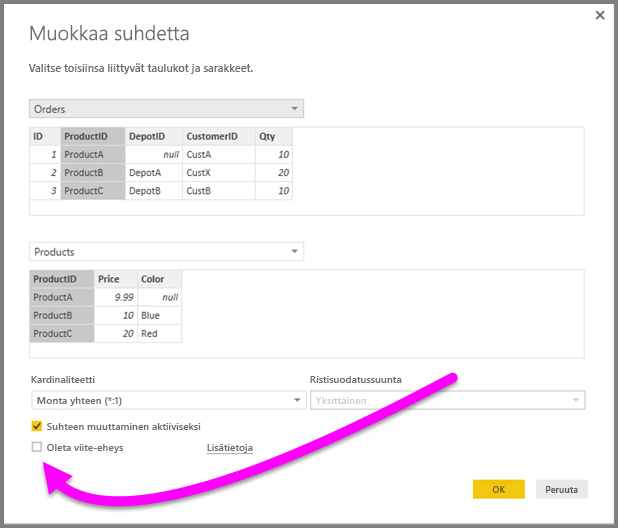
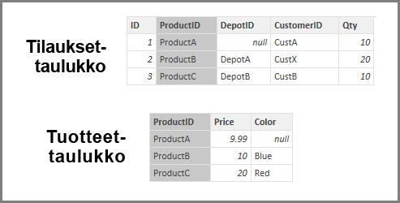
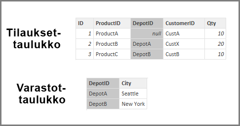
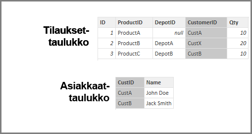

# Oleta viite-eheys -asetuksen käyttäminen Power BI Desktopissa
Muodostettaessa yhteyttä tietolähteeseen **DirectQueryn**avulla voit käyttää **Oleta viite-eheys** -valintaa tehokkaamman kyselyiden suorittamisen varmistamiseksi tietolähdettä vasten. Tämä ominaisuus sisältää joitakin vaatimuksia pohjana olevista tiedoista, ja se on käytettävissä vain, kun käytät **DirectQuerya**.

Asetus **Oleta viite-eheys** mahdollistaa kyselyt tietolähteestä käyttämään **INNER JOIN** -lausekkeita **OUTER JOIN** -lausekkeen sijasta, mikä tehostaa kyselyä.

## Oleta viite-eheys -asetuksen käyttöä koskevat vaatimukset
Tämä on lisäasetus, joka on käytettävissä vain muodostettaessa yhteys käyttämällä **DirectQuerya**. Seuraavat vaatimukset on täytettävä **Oleta viite-eheys** -asetuksen toimimiseksi oikein:

* Tiedot sarakkeesta **Lähde** suhteessa ei ole koskaan *Nolla* tai *tyhjä*
* Kullekin arvolle **Lähde**-sarakkeessa on vastaava arvo **Kohde**-sarakkeessa

Tässä kontekstissa **Lähde**-sarake on *Monta* - *yksi-moneen* suhteessa tai se on ensimmäisen taulukon sarake *yksi yhteen*suhteessa.

## Oleta viite-eheys -asetuksen käyttöä koskeva esimerkki
Seuraavassa esimerkissä näytetään, miten **Oleta viite-eheys** toimii käytettäessä tietoyhteyksissä. Esimerkissä muodostetaan yhteys tietolähteeseen, joka sisältää **Tilaukset**-taulukon, **Tuotteet**-taulukon, ja **Varastot**-taulukon.

1. Seuraavassa kuvassa, joka näyttää **Tilaukset** -taulukon ja **Tuotteet**-taulukon on huomattava, että viite-eheys on olemassa välillä **Tilaukset [Tuotetunnus]** ja **Tuotteet [Tuotetunnus]** . **[Tuotetunnus]** -sarake **Tilaukset**-taulukossa ei ole koskaan *Nolla*, ja jokainen arvo näkyy myös **Tuotteet**-taulukossa. Näin ollen **Oleta viite-eheys** on asetettava saamaan tehokkaampia kyselyjä (tämä asetus ei muuta visualisoinneissa näkyviä arvoja).
   
   
2. Seuraavassa kuvassa huomaa, että viite-eheys on olemassa välillä **Tilaukset [DepotID]** ja **Varastot [DepotID]** , koska **DepotID** on *Nolla*  joillekin *tilauksille*. Näin ollen **Oleta viite-eheys***ei* ole määritettävissä.
   
   
3. Lopuksi viite-eheys on olemassa välillä **Tilaukset [Asiakastunnus]** ja **Asiakkaat [Asiakastunnus]** seuraavissa taulukoissa; **Asiakastunnus** sisältää joitakin arvoja (tässä tapauksessa *CustX*), jotka eivät ole olemassa *Asiakkaat*-taulukossa. Näin ollen **Oleta viite-eheys***ei* ole määritettävissä.
   
   

## Oleta viite-eheys -ominaisuuden asettaminen
Tämän ominaisuuden käyttöön ottamiseksi valitaan valintaruutu kohdan **Oleta viite-eheys** vieressä seuraavassa kuvassa esitetyllä tavalla.

Kun asetus on valittuna, se varmennetaan tietoja käyttämällä sen varmistamiseksi, että siinä ei ole *Nolla*- tai ristiriitaisia rivejä. *Kuitenkin* arvojen määrän ollessa erittäin suuri varmennus ei takaa, etteikö ongelmia viite-eheyden suhteen voisi tulla.

Lisäksi varmennus tehdään suhteen muokkauksen aikana, joten se *ei* vaikuta mihinkään tietoihin myöhemmin tehtäviin muutoksiin.

## Mitä tapahtuu, jos olet määrittänyt virheellisesti Oleta viite-eheys -asetuksen?
Jos määrität **Oleta viite-eheys** ja tiedoissa on viite-eheysongelmia, tämä ei aiheuta virheitä. Se aiheuttaa kuitenkin tietojen selviä epäyhtenäisyyksiä. Esimerkiksi edellä kuvatussa **Varasto**-taulukossa seuraus olisi seuraavanlainen:

* Visualisointi, joka näyttää kokonaismäärän *Tilauksen määrä* näyttää arvoa 40
* Visualisointi, joka näyttää kokonaismäärän *Tilauksen määrä varastokaupungin mukaan* näyttää vain kokonaisarvoa *30*, koska se ei sisällä tilauksen tunnusta 1, jossa **DepotID** on *Nolla* .

## Seuraavat vaiheet
Lue lisätietoja [DirectQuerystä](desktop-use-directquery.md)

Saat lisätietoja [suhteista Power BI:ssa](desktop-create-and-manage-relationships.md)

Lisätietoja on artikkelissa [Suhdenäkymä Power BI Desktopissa](desktop-relationship-view.md).

