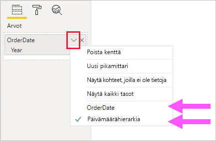
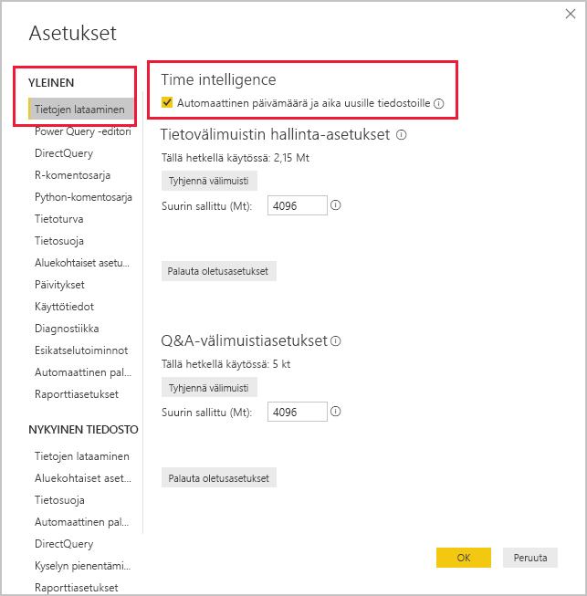

# <a name="auto-datetime-in-power-bi-desktop"></a>Automaattinen päivämäärä/aika Power BI Desktopissa

Tämä artikkeli on suunnattu tietomallintajille, jotka kehittävät tuonti- tai yhdistelmämalleja Power BI Desktopissa. Se esittelee ja kuvailee _Automaattinen päivämäärä ja aika_ -asetuksen.

Automaattinen päivämäärä ja aika on tietojen lataamisen asetus Power BI Desktopissa. Tämän vaihtoehdon tarkoituksena on tukea kätevää aikatietojen raportointia malliin ladattujen päivämääräsarakkeiden perusteella. Sen avulla raportin tekijät voivat tietomallisi avulla suodattaa, ryhmitellä ja porautua alaspäin käyttämällä kalenterin ajanjaksoja (vuodet, vuosineljännekset, kuukaudet ja päivät). Tärkeää on, että sinun ei tarvitse kehittää näitä aikatietojen ominaisuuksia eksplisiittisesti.

Kun asetus on käytössä, Power BI Desktop luo piilotetun automaattisen päivämäärä- ja aikataulukon kullekin päivämääräsarakkeelle, edellyttäen, että kaikki seuraavat ehdot toteutuvat:

- Taulukon tallennustila on Tuonti
- Sarakkeen tietotyyppi on päivämäärä tai päivämäärä/kellonaika
- Sarake ei ole mallisuhteen "monta"-puoli

## <a name="how-it-works"></a>Miten se toimii

Jokainen automaattinen päivämäärä/aika-taulukko on itse asiassa [laskettu taulukko](desktop-calculated-tables.md), joka luo tietorivejä DAX [CALENDAR](/dax/calendar-function-dax)-toimintoa käyttämällä. Jokaisessa taulukossa on myös kuusi laskettua saraketta: **Päivä**, **kuukauden numero**, **kuukausi**, **vuosineljänneksen numero**, **vuosineljännes**ja **vuosi**.

> [!NOTE]
> Power BI kääntää ja muotoilee sarakkeiden nimet ja arvot [mallin kielen](supported-languages-countries-regions.md#choose-the-language-for-the-model-in-power-bi-desktop)mukaan.

Power BI Desktop luo myös suhteen automaattisen päivämäärän ja ajan taulukon **päivämäärä**-sarakkeen ja mallin päivämääräsarakkeen välille.

Automaattisen päivämäärän ja ajan taulukko sisältää täydet kalenterivuodet, jotka kattavat kaikki mallin päivämääräsarakkeeseen tallennetut päivämääräarvot. Jos esimerkiksi päivämääräsarakkeen aikaisin arvo on 20. maaliskuuta 2016 ja uusin arvo on 23. lokakuuta 2019, taulukko sisältää 1 461 riviä. Se tarkoittaa yhtä riviä kullekin päivämäärälle neljänä kalenterivuotena 2016 – 2019. Power BI päivittää mallin, ja myös jokainen automaattisen päivämäärän ja ajan taulukko päivitetään varmistaen, että ne sisältävät päivämääriä, jotka sisältävät päivämääräsarakkeen arvot.

Jos automaattisen päivämäärän ja ajan taulukon rivit olisi mahdollista nähdä, ne näyttäisivät tältä:


> [!NOTE]
> Automaattiset päivämäärä-ja aikataulukot piilotetaan pysyvästi myös mallintajilta. Niitä ei voi nähdä **Kentät**-ruudussa tai mallinäkymäkaaviossa, eikä rivejä voi nähdä datanäkymässä. Lisäksi DAX-lausekkeet eivät voi viitata taulukkoon ja sen sarakkeeseen suoraan.

Taulukko määrittää myös hierarkian, joka tarjoaa visualisointeja porautumispolulla vuosi-, vuosineljännes-, kuukausi- ja päivä tasolla.

Jos automaattisen päivämäärän ja ajan taulukko olisi mahdollista nähdä mallinäkymäkaaviossa, se näyttäisi tältä (liittyvät sarakkeet on korostettu):

![Esimerkki siitä, miltä piilotettu automaattisen päivämäärän ja kellonajan taulukko voi näyttää. Näyttää kaksi taulukkoa: Sales- ja LocalDateTime-taulukko. Taulukot liittyvät myyntitaulukon OrderDate-sarakkeeseen ja LocalDateTime -taulukon päivämääräsarakkeeseen. LocalDateTime määrittää seitsemän saraketta: Päivämäärä, päivä, kuukauden numero, kuukausi, vuosineljännes, vuosineljänneksen numero, vuosi ja yksittäinen hierarkia. Hierarkian nimi on päivämäärähierarkia, ja se sisältää neljä tasoa: Vuosi, vuosineljännes, kuukausi ja päivä.](media/desktop-auto-date-time/auto-date-time-hidden-table-example-diagram.png)

## <a name="work-with-auto-datetime"></a>Toimii automaattisen päivämäärän ja ajan kanssa

Kun päivämääräsarakkeelle on määritetty automaattisen päivämäärän ja ajan taulukko (ja kyseinen sarake on näkyvissä), raportin tekijät eivät löydä kyseistä saraketta kenttänä **Kentät**-ruudusta. Sen sijaan he löytävät laajennettavan objektin, jolla on päivämääräsarakkeen nimi. Voit helposti tunnistaa sen, koska se on varustettu kalenterikuvakkeella. Kun raportin tekijät laajentavat kalenteriobjektia, he löytävät hierarkian, jonka nimi on **Päivämäärähierarkia**. Kun tekijä on laajentanut hierarkian, hän löytää neljä tasoa: **Vuosi**, **vuosineljännes**, **kuukausi** ja **päivä**.


Automaattisen päivämäärän/ajan luoman hierarkian avulla voit määrittää visualisoinnin täsmälleen samalla tavalla kuin tavallisia hierarkioita käytettäessä. Visualisoinnit voidaan määrittää käyttämällä koko **päivämäärähierarkiaa** hierarkiaa tai hierarkian tiettyjä tasoja.

Tavalliset hierarkiat eivät kuitenkaan tue yhtä lisättyä ominaisuutta. Kun automaattisen päivämäärän ja ajan hierarkia tai hierarkkinen taso lisätään visualisointiin, raportin tekijät voivat vaihdella hierarkian ja päivämääräsarakkeen käyttämisen välillä. Tämä lähestymistapa on järkevää joillekin visualisoinneille, kun tarvitset vain päivämääräsaraketta, et hierarkiaa ja sen tasoja. Ne aloitetaan määrittämällä visuaalisen kentän (napsauta hiiren kakkospainikkeella visualisointikenttää tai napsauta alanuolta) ja käytä sitten pikavalikon avulla päivämääräsaraketta tai päivämäärä hierarkiaa.



DAX-kielellä kirjoitetut mallilaskelmat voivat viitata _suoraan_ päivämääräsarakkeeseen tai _epäsuorasti_ piilotetun automaattisen päivämäärän ja ajan taulukon sarakkeisiin.

Power BI Desktopiin kirjoitettu kaava voi viitata päivämääräsarakkeeseen tavalliseen tapaan. Automaattiseen päivämäärä-ja aika-taulukon sarakkeisiin on kuitenkin viitattava erityisellä laajennetulla syntaksilla. Aloitat viittaamisen ensin päivämääräsarakkeeseen ja sen jälkeen pisteeseen (.). Kaavarivin automaattinen täydennys antaa sinun valita sarakkeen automaattisen päivämäärän/ajan taulukosta.

![Esimerkki DAX-mittayksikkölausekkeen kirjoittamisesta kaavariville. Kaava tähän mennessä on Date Count = COUNT (Sales [OrderDate]. Automaattinen täydennysluettelo esittää kaikki seitsemän saraketta piilotetusta automaattisen päivämäärän ja ajan taulukosta. Nämä sarakkeet ovat: Päivämäärä, päivä, kuukausi, kuukauden numero, vuosineljännes, vuosineljänneksen numero ja vuosi.](media/desktop-auto-date-time/auto-date-time-dax-auto-complete.png)

Power BI Desktopissa kelvollinen mittayksikkölauseke voi olla:

```dax
Date Count = COUNT(Sales[OrderDate].[Date])
```

> [!NOTE]
> Vaikka tämä mittayksikkölauseke on kelvollinen Power BI Desktopissa, se ei ole oikea DAX-syntaksi. Sisäisesti Power BI Desktop muuntaa lausekkeen viittaamaan (piilotettua) automaattista päivämäärä/aika-taulukon saraketta, joka on tosi.

## <a name="configure-auto-datetime-option"></a>Automaattisen päivämäärä-/aikavalinnan määrittäminen

Automaattinen päivämäärä/kellonaika voidaan määrittää _yleisesti_ tai _nykyiselle tiedostolle_. Yleinen asetus koskee uusia Power BI Desktop -tiedostoja, ja se voidaan ottaa käyttöön tai poistaa käytöstä milloin tahansa. Jos kyseessä on Power BI Desktopin uusi asennus, molempien asetusten oletusarvo on “päällä” (on).

Myös nykyinen tiedostoasetus voidaan ottaa käyttöön tai poistaa käytöstä milloin tahansa. Kun se on käytössä, automaattiset päivämäärä- ja aikataulukot luodaan. Kun tämä on poistettu käytöstä, mallista poistetaan kaikki automaattiset päivämäärä- ja aikataulukot.

> [!CAUTION]
> Ole varovainen, kun otat nykyisen tiedostovaihtoehdon pois käytöstä, koska se poistaa automaattisen päivämäärän ja ajan taulukot. Muista korjata kaikki rikkinäiset raporttisuodattimet tai visualisoinnit, jotka oli määritetty käyttämään niitä.

Valitse Power BI Desktopissa _Tiedosto > Asetukset ja vaihtoehdot > Asetukset_ ja valitse sitten joko **Yleinen**- tai **Nykyinen tiedosto** -sivu. Kummallakin sivulla vaihtoehto on **Aikatiedot**-osassa.



## <a name="next-steps"></a>Seuraavat vaiheet

Lisätietoja kyselyn automaattisesta päivämäärää/aikaa koskevista aiheista saat seuraavista lähteistä:

- [Päivämäärätaulukkojen määrittäminen ja käyttäminen Power BI Desktopissa](desktop-date-tables.md)
- Onko sinulla kysyttävää? [Voit esittää kysymyksiä Power BI -yhteisössä](https://community.powerbi.com/)
